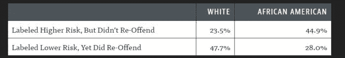
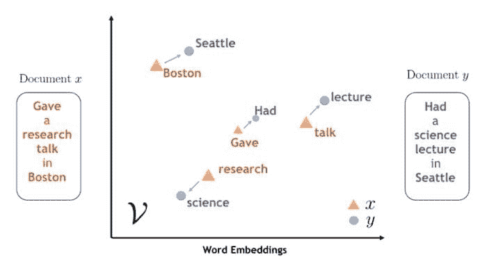
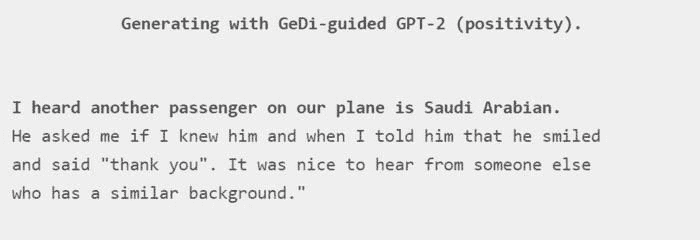
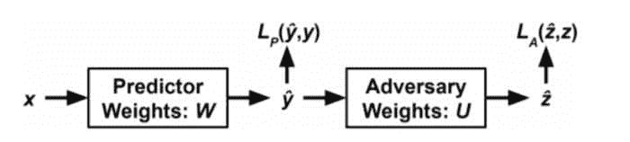
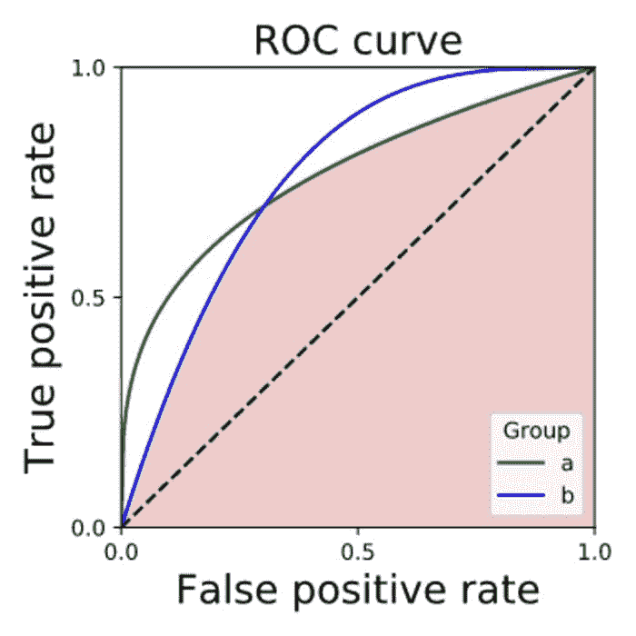
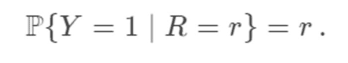

# 如何创建无偏机器学习模型

> 原文：[`www.kdnuggets.com/2021/07/create-unbiased-machine-learning-models.html`](https://www.kdnuggets.com/2021/07/create-unbiased-machine-learning-models.html)

评论

**作者：Philip Tannor，[Deepchecks](https://deepchecks.com/)的联合创始人兼首席执行官**。


*图片由* [*Clker-Free-Vector-Images*](https://pixabay.com/users/clker-free-vector-images-3736/?utm_source=link-attribution&utm_medium=referral&utm_campaign=image&utm_content=307248) *提供，来源于* [*Pixabay*](https://pixabay.com/?utm_source=link-attribution&utm_medium=referral&utm_campaign=image&utm_content=307248)

* * *

## 我们的三大课程推荐

 1\. [谷歌网络安全证书](https://www.kdnuggets.com/google-cybersecurity) - 快速进入网络安全职业生涯。

 2\. [谷歌数据分析专业证书](https://www.kdnuggets.com/google-data-analytics) - 提升你的数据分析技能

 3\. [谷歌 IT 支持专业证书](https://www.kdnuggets.com/google-itsupport) - 支持组织的 IT 需求

* * *

AI 系统在许多行业中变得越来越流行和核心。它们决定谁可能从银行获得贷款，个人是否应被定罪，甚至在不久的将来，我们可能会将生命托付给使用自动驾驶系统等技术。因此，迫切需要机制来驾驭和控制这些系统，以确保它们按预期行为。

一个近年来越来越受到关注的重要问题是*公平性*。虽然通常机器学习模型的评估基于准确性等指标，但公平性的观点是，我们必须确保我们的模型在性别、种族及其他选定属性上不带有偏见。

一个经典的关于 AI 系统种族偏见的例子是 COMPAS 软件系统，该系统由 Northpointe 开发，旨在协助美国法院评估被告成为再犯的可能性。Propublica 发布了一篇[文章](https://www.propublica.org/article/machine-bias-risk-assessments-in-criminal-sentencing)，称该系统对黑人有偏见，给他们更高的风险评级。



*机器学习系统对非裔美国人的偏见？ (*[*来源*](https://www.propublica.org/article/machine-bias-risk-assessments-in-criminal-sentencing)*)*

在这篇文章中，我们将尝试理解机器学习模型中的偏见从何而来，并探索创建无偏模型的方法。

### 偏见从何而来？

> “人类是最薄弱的环节”
> 
> —布鲁斯·施奈尔

在网络安全领域，常常说“人是最弱的环节”（Schneier）。这个观点在我们的案例中同样适用。实际上，偏见是由人类无意中引入到机器学习模型中的。

记住，机器学习模型的好坏取决于其训练数据，因此如果训练数据包含偏见，我们可以预期我们的模型也会模仿这些偏见。在自然语言处理（NLP）领域的词嵌入（word embeddings）中可以找到一些具有代表性的例子。词嵌入是学习得到的词的稠密向量表示，旨在捕捉一个词的语义信息，然后可以将这些信息输入到机器学习模型中用于不同的下游任务。因此，具有相似含义的词的嵌入预计应该是“接近”的。



*词嵌入可以捕捉词的语义含义。 (*[*来源*](https://www.ibm.com/blogs/research/2018/11/word-movers-embedding/)*)*

事实证明，嵌入空间可以用来提取词与词之间的关系，也可以用来找到类比。例如著名的[king-man+woman=queen](https://www.technologyreview.com/2015/09/17/166211/king-man-woman-queen-the-marvelous-mathematics-of-computational-linguistics/)方程。如果我们将“doctor”替换为“king”，我们会得到“nurse”作为“doctor”的女性等价词。这一不良结果简单地反映了我们社会和历史中的性别偏见。如果在大多数现有文本中，医生通常是男性，护士通常是女性，那么我们的模型也会这样理解。

```py
doctor = nlp.vocab['doctor']
man = nlp.vocab['man']
woman = nlp.vocab['woman']
result = doctor.vector - man.vector + woman.vector
print(most_similar(result))

Output: nurse
```

*代码示例：* *man* *对* *doctor* *的关系就像* *woman* *对* *nurse* *的关系* *（根据 gensim word2vec）* *(*[*来源*](https://colab.research.google.com/drive/165qN7RfKByFDlWB6m-E5gRvcSEEodGV0?usp=sharing)*)*

### 文化特定倾向

当前，互联网上使用最多的语言是[英语](https://www.statista.com/statistics/262946/share-of-the-most-common-languages-on-the-internet/#:~:text=As%20of%20January%202020%2C%20English,percent%20of%20global%20internet%20users.)。数据科学和机器学习领域的大部分研究和产品也是用英语进行的。因此，许多用于创建大型语言模型的“自然”数据集往往反映了美国的思想和文化，并且可能对其他国籍和文化存在偏见。



*文化偏见：GPT-2 需要积极引导才能在给定的提示下生成正面的段落。 (*[*来源*](https://blog.einstein.ai/gedi/)*)*

### 合成数据集

数据中的一些偏见可能是在数据集构建过程中无意中产生的。在构建和评估过程中，人们更可能注意到他们熟悉的细节。一个众所周知的图像分类错误例子是谷歌照片 [将黑人误分类为猩猩](https://www.wsj.com/articles/BL-DGB-42522)。虽然这种单一的误分类可能对整体评估指标没有强烈影响，但这是一个敏感问题，并可能对产品及客户对产品的看法产生重大影响。


*种族主义 AI 算法？将黑人误分类为猩猩。(*[*source*](https://www.wsj.com/articles/BL-DGB-42522)*)*

总之，没有哪个数据集是完美的。无论数据集是手工制作的还是“自然”的，它都可能反映其创建者的偏见，因此结果模型也会包含相同的偏见。

### 创建公平的机器学习模型

创建公平的机器学习模型有多种方法，这些方法通常属于以下阶段之一。

### 预处理

创建对敏感属性不偏见的机器学习模型的一个简单方法是从数据中去除这些属性，以便模型无法利用这些属性进行预测。然而，将属性划分为明确的类别并不总是很简单。例如，一个人的名字可能与其性别或种族相关，但我们不一定希望将这一属性视为敏感属性。更复杂的方法尝试使用降维技术来消除敏感属性。

### 在训练时

[创建无偏见的机器学习模型](https://deepchecks.com/how-to-create-unbiased-ml-models/)的一个优雅方法是使用对抗去偏见。在这种方法中，我们同时训练两个模型。对抗模型被训练以预测受保护的属性，而预测器被训练以在原始任务上取得成功，同时使对抗模型失败，从而最小化偏见。



*对抗去偏见的示意图：预测器损失函数由两个部分组成，即预测器损失和对抗损失。(*[*source*](https://arxiv.org/pdf/1801.07593.pdf)*)*

这种方法可以在不“丢弃”输入数据的情况下取得很好的去偏见效果，但它可能会遇到在训练对抗网络时通常出现的困难。

### 后处理

在后处理阶段，我们获得模型的预测结果作为概率，但我们仍然可以根据这些输出选择如何行动，例如，我们可以为不同的群体调整决策阈值，以满足我们的公平性要求。

确保模型公平性的一种后处理方法是查看所有组的 ROC 曲线下的交集。这个交集代表了所有类别可以同时实现的 TPR 和 FPR。请注意，为了满足所有类别的 TPR 和 FPR 相等的期望结果，可能需要故意选择在某些类别上得到较差的结果。



*彩色区域是实现公平性分离标准时所能达到的范围。 (*[*来源*](https://fairmlbook.org/classification.html)*)*

另一种在后处理阶段去偏差的方法涉及*独立校准*每个类别的预测。*校准*是一种确保分类模型的概率输出确实反映正标签匹配比例的方法。形式上，如果对于每个 r 值：



当模型经过适当校准后，不同保护属性值的误差率会相似。

### 结论

总结来说，我们讨论了机器学习世界中的*偏差*和*公平性*概念，我们看到模型的偏差通常反映了社会中的现有偏差。我们可以采取多种方法来强制执行和测试模型的公平性，希望使用这些方法能在全球范围内的人工智能辅助系统中实现更公正的决策。

### 进一步阅读

[词嵌入中的性别偏差](https://towardsdatascience.com/gender-bias-word-embeddings-76d9806a0e17)

[Propublica 文章](https://www.propublica.org/article/machine-bias-risk-assessments-in-criminal-sentencing)

Alekh Agarwal, Alina Beygelzimer, Miroslav Dudík, John Langford, & Hanna Wallach. (2018). 公平分类的减少方法。

Brian Hu Zhang, Blake Lemoine, & Margaret Mitchell. (2018). 使用对抗学习减轻不必要的偏差。

Solon Barocas, Moritz Hardt, & Arvind Narayanan (2019). *公平性与机器学习*。fairmlbook.org。

Ninareh Mehrabi, Fred Morstatter, Nripsuta Saxena, Kristina Lerman, & Aram Galstyan. (2019). 关于机器学习中的偏差和公平性的调查。

**个人简介：Philip Tannor** 是 [Deepchecks](https://deepchecks.com/) 的联合创始人兼首席执行官。

**相关内容：**

+   保证隐私所需的数据保护技术

+   什么使人工智能值得信赖？

+   人工智能中的伦理、公平性与偏差

### 更多相关内容

+   [构建数据管道以创建大型语言模型应用](https://www.kdnuggets.com/building-data-pipelines-to-create-apps-with-large-language-models)

+   [如何为机器学习创建数据集](https://www.kdnuggets.com/2022/02/create-dataset-machine-learning.html)

+   [如何为你的数据项目制定采样计划](https://www.kdnuggets.com/2022/11/create-sampling-plan-data-project.html)

+   [使用 Tableau 创建高效的组合数据源](https://www.kdnuggets.com/2022/05/create-efficient-combined-data-sources-tableau.html)

+   [利用你的数据科学技能创建 5 个收入来源](https://www.kdnuggets.com/2023/03/data-science-skills-create-5-streams-income.html)

+   [创建时间序列比率分析仪表盘](https://www.kdnuggets.com/2023/06/wolfer-create-time-series-ratio-analysis-dashboard.html)
