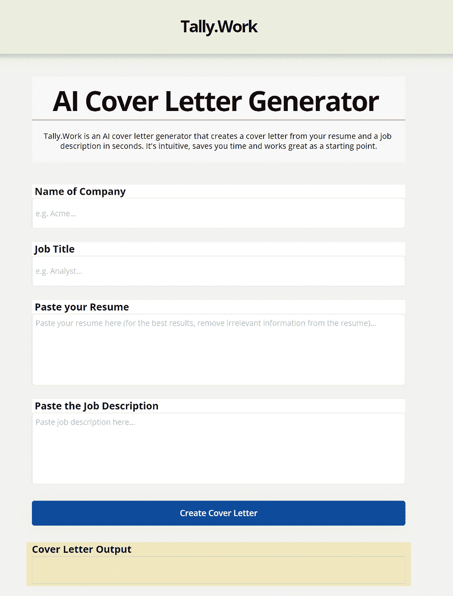

# 我在 3 天内创建了一个 AI 应用程序

> 原文：[`www.kdnuggets.com/2023/08/created-ai-app-3-days.html`](https://www.kdnuggets.com/2023/08/created-ai-app-3-days.html)

几周前，我开始玩 Chat GPT。我被惊呆了。我立即想用这个工具构建一些东西。我意识到这是一个千载难逢的黄金机会，正好在正确的时刻进入某个领域。

我为创建什么而苦思了几个星期。

* * *

## 我们的前三个课程推荐

 1\. [谷歌网络安全证书](https://www.kdnuggets.com/google-cybersecurity) - 快速进入网络安全职业生涯。

 2\. [谷歌数据分析专业证书](https://www.kdnuggets.com/google-data-analytics) - 提升你的数据分析能力

 3\. [谷歌 IT 支持专业证书](https://www.kdnuggets.com/google-itsupport) - 支持你组织的 IT 需求

* * *

我希望它能成为世界上每个人都可以使用的东西。我过去的项目（不涉及 AI）都是小范围内的利基用例，我想构建一些比这更有意义的东西。我从所有的创业经历中学到的最大教训就是，今后要构建具有巨大市场潜力的东西。我经常构建一些很酷的东西，但只有相对少数人会需要使用。

所以我在 Google 趋势上搜索了全球流行的话题。很快，幸运的是，我发现“求职信”这个关键词在那一刻非常流行。这是一个“顿悟”时刻，因为我也在求职信方面遇到了痛点。

要么我讨厌做求职信，并且为那些我非常想要的工作而辛苦地完成它们，要么我干脆跳过那些需要求职信的工作，因为我对那些工作并不太感兴趣。

因此，我决定创建一个 AI 求职信生成器。

为了使它不同于市面上现有的任何求职信生成器（这些生成器在 AI 出现之前就存在），我意识到我需要一个其他人没有的关键功能。然后我意识到，大多数求职信生成器只要求*你的*技能。如果我的求职信生成器同时要求*你的*技能和职位描述中所需的技能呢？

结果是，我开始创建一个求职信生成器，让你将简历和职位描述粘贴到不同的表单中，然后将它们混合成一封酷炫的求职信。它会利用你的求职信和职位描述的文本，根据职位描述中所需的技能和经验相对于你简历上列出的技能和经验，为你撰写一封独特的求职信。简直是魔法！

我还是个新手编码员，但我在 ChatGPT 上制作整洁的提示方面经验丰富，所以我知道我能做到。

所以，我在 Open AI playground 上进行了两天的实验，尝试不同的提示，直到找到我认为最适合用我的简历和我在线找到的职位描述生成求职信的结果。我大约尝试了 1000 个不同的提示，涵盖了许多独特的最大令牌数、温度和惩罚组合。

接下来，为了创建我的应用，我需要学习如何编码一个网站，这样它可以以更用户友好的方式完成 Open AI playground 所做的一切。最重要的是，我需要有单独的表单框来输入简历和职位描述，不像 Open AI playground 只有一个表单框。

所以，我观看了一些关于创建“广告文案”AI 生成器的 YouTube 视频（在某种程度上类似于求职信生成器），并在一夜之间学会了如何在 bubble.io 上制作我的应用。作为最后一步，我只需要将 Open AI API 连接到我新网站上的输出表单即可。

从开始到完成，创建我的应用花了三天时间。它叫 Tally.Work ([link](https://tally.work/))。快来看看吧！

最终结果还不错。有些人甚至觉得它在 [HackerNews](https://news.ycombinator.com/item?id=34621532)上很酷。现在，我在第一天就得到了成千上万的用户，我实际上花了大约 $100 在 Open AI 代币上（这是另一个问题）。

我意识到我应用程序生成的求职信确实看起来像是 AI 写的。不过没关系。AI（至少是我的提示）还没有达到那种水平。但总有一天，在不久的将来，它会达到那个水平。在那之前，我的工具可以作为求职信的初稿起点。用户可以使用我的工具来开始，然后编辑和添加内容，使求职信听起来更有人情味。

> 我还意识到 AI 将几乎完全消除诸如这些无用工作和繁琐任务。这不是很好吗？对吧？

我确实希望这个项目能够结束，因为正如我提到的，我不太喜欢求职信。如果这个项目（或类似的其他项目）成功，那么雇主将停止要求求职信，而这个应用程序将变得无用。正如我提到的，我讨厌求职信。

我希望这个项目的结果是我从中学到了很多经验，以便我可以构建一个更有趣的 AI 应用，希望它不会*失败*。

如果你想构建自己的 AI 应用，我的建议是直接开始。使用 [Open AI playground](https://openai.com/api/) ，无需编写代码，然后根据你的情况选择使用代码构建前端，或者使用像 [bubble.io](https://bubble.io/) 这样的无代码构建器。关于这些的 YouTube 视频有很多，为什么不今天就开始呢？

**[Jeff Dutton](https://www.linkedin.com/in/jeffrey-dutton/)** 是多伦多地区为员工和雇主提供法律服务的就业律师。通过查看 [个人博客](https://duttonlaw.ca/) 了解更多关于他的信息。

[原文](https://medium.com/@jeffreydutton/i-created-an-ai-cover-letter-generator-i-hate-cover-letters-98dd8b3e6cf)。经许可转载。

### 更多相关话题

+   [DataLang: 一种为数据科学家创建的新编程语言…](https://www.kdnuggets.com/2023/04/datalang-new-programming-language-data-scientists-chatgpt.html)

+   [30 天内成为就业准备好的 4 个认证](https://www.kdnuggets.com/4-certifications-to-become-job-ready-in-30-days)

+   [在 5 分钟内构建一个机器学习 Web 应用程序](https://www.kdnuggets.com/2022/03/build-machine-learning-web-app-5-minutes.html)

+   [数据科学如何改变移动应用开发？](https://www.kdnuggets.com/2023/03/data-science-transform-mobile-app-development.html)

+   [用 Python 构建命令行应用程序的 7 个简单步骤](https://www.kdnuggets.com/build-a-command-line-app-with-python-in-7-easy-steps)

+   [KDnuggets 新闻 2022 年 3 月 9 日: 在 5 分钟内构建机器学习 Web 应用程序…](https://www.kdnuggets.com/2022/n10.html)
