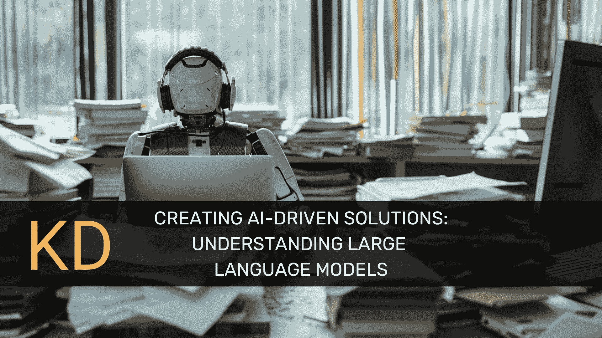
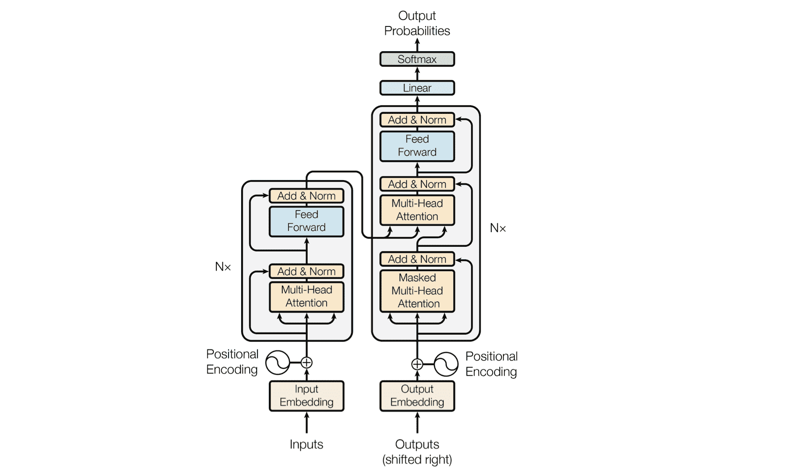
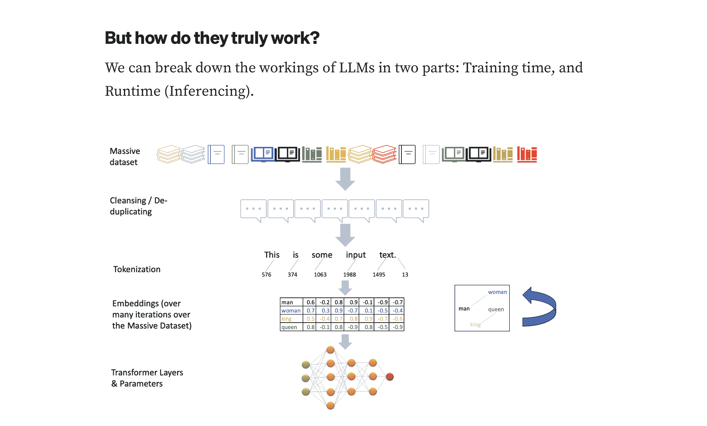
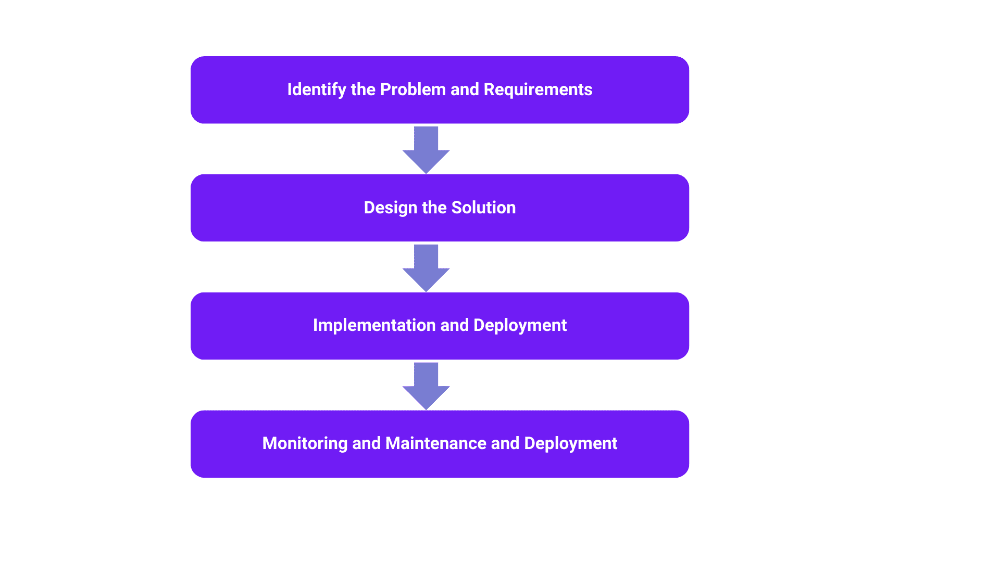

# 创建 AI 驱动的解决方案：理解大型语言模型

> 原文：[`www.kdnuggets.com/creating-ai-driven-solutions-understanding-large-language-models`](https://www.kdnuggets.com/creating-ai-driven-solutions-understanding-large-language-models)

编辑 | Midjourney & Canva 制图

大型语言模型是先进的人工智能类型，旨在理解和生成类似人类的文本。它们采用机器学习技术，特别是深度学习来构建。基本上，LLMs 是通过对来自互联网、书籍、文章和其他来源的大量文本数据进行训练，以学习人类语言的模式和结构。

* * *

## 我们的前三大课程推荐

 1\. [谷歌网络安全证书](https://www.kdnuggets.com/google-cybersecurity) - 快速进入网络安全职业生涯。

 2\. [谷歌数据分析专业证书](https://www.kdnuggets.com/google-data-analytics) - 提升你的数据分析技能

 3\. [谷歌 IT 支持专业证书](https://www.kdnuggets.com/google-itsupport) - 支持你的组织的 IT 工作

* * *

大型语言模型（LLMs）的历史始于早期的神经网络模型。然而，一个重要的里程碑是 [Vaswani et al](https://arxiv.org/pdf/1706.03762) 在 2017 年推出的 Transformer 架构，详细内容见论文“[注意力机制是你所需要的](https://arxiv.org/pdf/1706.03762)。”

Transformer - 模型架构 | 来源: [注意力机制是你所需要的](https://arxiv.org/pdf/1706.03762)

这种架构提高了语言模型的效率和性能。2018 年，[OpenAI 发布了 GPT（生成式预训练变换器）](https://openai.com/index/language-unsupervised/)，标志着高能力 LLMs 的开始。2019 年发布的 GPT-2 具有 15 亿参数，展示了前所未有的文本生成能力，并因其潜在的误用而引发了伦理问题。2020 年 6 月推出的 GPT-3，具有 1750 亿参数，进一步展示了 LLMs 的强大能力，使得从创意写作到编程辅助的各种应用成为可能。最近，[OpenAI 的 GPT-4](https://openai.com/index/gpt-4-research/)，于 2023 年发布，延续了这一趋势，提供了更强大的能力，尽管关于其规模和数据的具体细节仍然是专有的。

## LLMs 的关键组件

LLMs 是复杂的系统，具有若干关键组件，使其能够理解和生成自然语言。关键要素包括神经网络、深度学习和变换器。

### 神经网络

大语言模型建立在神经网络架构上，这些计算系统受到人脑的启发。这些网络由互联的节点（神经元）层组成。神经网络通过根据接收到的输入调整神经元之间的连接（权重）来处理和学习数据。这一调整过程称为训练。

### 深度学习

深度学习是机器学习的一个子集，使用多层神经网络，因此被称为“**深度**”。它使大语言模型能够在大数据集中学习复杂的模式和表示，从而理解细微的语言上下文并生成连贯的文本。

### 转换器

转换器架构在 Vaswani 等人于 2017 年发表的论文“[Attention Is All You Need](https://arxiv.org/pdf/1706.03762)”中首次提出，彻底改变了自然语言处理（NLP）。转换器使用注意力机制，使模型能够关注输入文本的不同部分，比以前的模型更好地理解上下文。转换器由编码器和解码器层组成。编码器处理输入文本，解码器生成输出文本。

## 大语言模型是如何工作的？

大语言模型通过利用深度学习技术和广泛的文本数据集来运作。这些模型通常采用转换器架构，如生成预训练变换器（GPT），其在处理文本输入等顺序数据方面表现出色。

这张图片展示了大语言模型（LLMs）如何进行训练以及它们如何生成回应。

在训练过程中，大语言模型通过考虑前面的上下文来预测句子中的下一个单词。这涉及对分词后的单词赋予概率分数，将其拆分为更小的字符序列，并将其转化为嵌入，表示上下文的数值。大语言模型在大量文本语料库上进行训练以确保准确性，使其能够通过零样本学习和自监督学习掌握语法、语义和概念关系。

训练完成后，大语言模型通过根据接收到的输入预测下一个单词，并从其获得的模式和知识中提取内容，自动生成文本。这导致连贯且上下文相关的语言生成，对于各种自然语言理解（NLU）和内容生成任务非常有用。

此外，提升模型性能涉及诸如提示工程、微调和基于人类反馈的强化学习（RLHF）等策略，以减轻偏见、仇恨言论以及训练过程中可能产生的事实错误回应，称为“**幻觉**”。这一方面对确保企业级大语言模型的安全和有效使用至关重要，防止组织面临潜在的法律责任和声誉损害。

## 大语言模型的应用案例

由于 LLMs 能够理解和生成类似人类的语言，因此它们在各个行业中有着广泛的应用。以下是一些常见的使用案例，以及作为案例研究的实际示例：

1.  **文本生成**：LLMs 可以生成连贯且与上下文相关的文本，这使得它们在内容创作、讲故事和对话生成等任务中非常有用。

1.  **翻译**：LLMs 能够准确地将文本从一种语言翻译成另一种语言，实现跨语言的无缝沟通。

1.  **情感分析**：LLMs 能够分析文本以确定表达的情感，帮助企业了解客户反馈、社交媒体反应和市场趋势。

1.  **聊天机器人和虚拟助手**：LLMs 可以为对话代理提供支持，使其能够以自然语言与用户互动，提供客户支持、信息检索和个性化推荐。

1.  **内容总结**：LLMs 能够将大量文本压缩成简洁的摘要，使从文档、文章和报告中提取关键信息变得更加容易。

### 案例研究：ChatGPT

OpenAI 的 GPT-3（生成式预训练变换器 3）是开发出的最重要和最强大的 LLMs 之一。它拥有 1750 亿个参数，能够执行各种自然语言处理任务。[ChatGPT](https://chatgpt.com/)是一个由 GPT-3 支持的聊天机器人示例。它可以就多个话题进行对话，从随意闲聊到更复杂的讨论。

ChatGPT 可以提供各种主题的信息，提供建议，讲笑话，甚至进行角色扮演。它通过每次互动进行学习，随着时间的推移改进其回应。

ChatGPT 已被集成到消息平台、客户支持系统和生产力工具中。它可以协助用户完成任务，回答常见问题，并提供个性化推荐。

使用 ChatGPT，企业可以自动化客户支持、简化沟通并提升用户体验。它提供了一种可扩展的解决方案，用于处理大量咨询，同时保持高水平的客户满意度。

## 开发基于 LLMs 的 AI 驱动解决方案

开发基于 LLMs 的 AI 驱动解决方案涉及多个关键步骤，从识别问题到部署解决方案。我们将这一过程简化为以下几个步骤：

这张图片展示了如何开发基于 LLMs 的 AI 驱动解决方案 | 来源：作者提供的图片。

### 确定问题和需求

明确阐述你想要解决的问题或希望 LLM 执行的任务。例如，创建一个用于客户支持的聊天机器人或一个内容生成工具。收集利益相关者和最终用户的见解，以了解他们的需求和偏好。这有助于确保 AI 驱动的解决方案有效地满足他们的需求。

### 设计解决方案

选择一个与项目要求相符的 LLM。考虑诸如模型大小、计算资源和任务特定能力等因素。通过微调参数和在相关数据集上训练，将 LLM 调整为您的特定用例。这有助于优化模型在应用中的性能。

如适用，将 LLM 与组织中的其他软件或系统集成，以确保操作和数据流畅。

### 实施和部署

使用适当的训练数据和评估指标来训练 LLM，以评估其性能。测试有助于在部署之前识别和解决任何问题或限制。确保 AI 驱动的解决方案能够扩展以处理不断增加的数据量和用户，同时保持性能水平。这可能涉及优化算法和基础设施。

建立机制以实时监控 LLM 的性能，并实施定期维护程序以解决任何问题。

### 监控和维护

持续监控已部署解决方案的性能，以确保其符合定义的成功指标。收集用户和利益相关者的反馈，以识别改进领域并迭代改进解决方案。定期更新和维护 LLM，以适应不断变化的需求、技术进步和用户反馈。

## LLM 的挑战

虽然 LLM 提供了各种应用的巨大潜力，但它们也面临着若干挑战和考虑因素。其中一些包括：

### 伦理和社会影响：

LLM 可能继承训练数据中存在的偏见，导致不公平或歧视性的结果。它们可能生成敏感或私人信息，引发关于数据隐私和安全的担忧。如果没有得到适当的训练或监控，LLM 可能会无意中传播错误信息。

### 技术挑战

理解 LLM 如何做出决策可能具有挑战性，这使得信任和调试这些模型变得困难。训练和部署 LLM 需要大量的计算资源，这限制了小型组织或个人的可访问性。扩展 LLM 以处理更大的数据集和更复杂的任务可能在技术上具有挑战性且成本高昂。

### 法律和监管合规

使用大型语言模型（LLMs）生成文本引发了关于生成内容的所有权和版权的问题。LLM 应用程序需要遵守法律和监管框架，例如欧洲的 GDPR，以确保数据使用和隐私。

### 环境影响

训练 LLM 是高度耗能的，会产生显著的碳足迹，引发环境问题。开发更节能的模型和训练方法对于减轻广泛部署 LLM 的环境影响至关重要。在 AI 开发中关注可持续性对平衡技术进步与生态责任非常重要。

### 模型鲁棒性

模型鲁棒性指的是 LLM 在各种输入和场景中的一致性和准确性。确保 LLM 即使在输入有轻微变化的情况下也能提供可靠和值得信赖的输出，是一项重大挑战。团队们通过引入检索增强生成（RAG）技术来应对这一挑战，RAG 结合了 LLM 和外部数据源，以提高性能。通过将数据整合到 LLM 中，组织可以提高模型在特定任务中的相关性和准确性，从而提供更可靠和上下文适宜的回应。

## LLM 的未来

近年来，LLM 的成就可谓非凡。它们在文本生成、翻译、情感分析和问答等任务上超越了先前的基准。这些模型已被集成到各种产品和服务中，推动了客户支持、内容创作和语言理解的进步。

展望未来，LLM 具有巨大的潜力进行进一步的进步和创新。研究人员正积极提升 LLM 的能力，以应对现有的局限性并推动可能性的边界。这包括改善模型解释性、减轻偏见、增强多语言支持以及实现更高效和可扩展的训练方法。

## 结论

总之，理解 LLM 对于解锁 AI 驱动解决方案在各个领域的全部潜力至关重要。从自然语言处理任务到聊天机器人和内容生成等高级应用，LLM 在理解和生成类似人类的语言方面展现了卓越的能力。

在构建 AI 驱动解决方案的过程中，我们需要以负责任的 AI 实践为重点，来处理 LLM 的开发和部署。这包括遵守伦理准则，确保透明度和问责制，以及积极与利益相关者互动，解决关切并促进信任。

****[Shittu Olumide](https://www.linkedin.com/in/olumide-shittu/)**** 是一位软件工程师和技术作家，热衷于利用前沿技术创作引人入胜的叙述，具有敏锐的细节观察力和简化复杂概念的天赋。你还可以在 [Twitter](https://twitter.com/Shittu_Olumide_) 上找到 Shittu。

### 更多相关内容

+   [顶级开源大型语言模型](https://www.kdnuggets.com/2022/09/john-snow-top-open-source-large-language-models.html)

+   [更多免费大型语言模型课程](https://www.kdnuggets.com/2023/06/free-courses-large-language-models.html)

+   [了解大型语言模型](https://www.kdnuggets.com/2023/03/learn-large-language-models.html)

+   [来自 John Snow Labs 的医疗保健特定大型语言模型介绍](https://www.kdnuggets.com/2023/04/john-snow-introducing-healthcare-specific-large-language-models-john-snow-labs.html)

+   [什么是大型语言模型，它们是如何工作的？](https://www.kdnuggets.com/2023/05/large-language-models-work.html)

+   [人工智能：大型语言和视觉模型](https://www.kdnuggets.com/2023/06/ai-large-language-visual-models.html)
