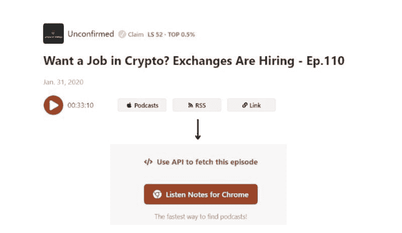
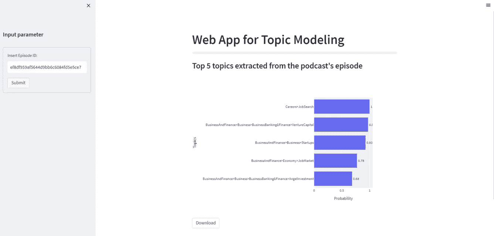
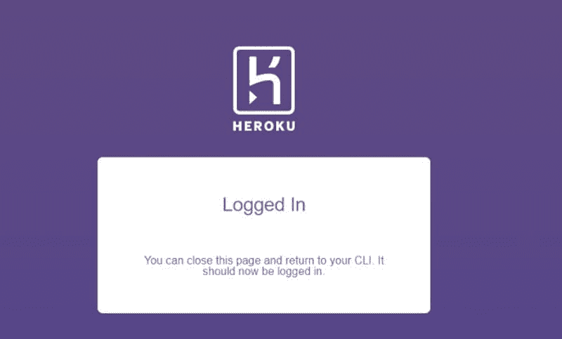

# 创建一个从音频中提取主题的 Web 应用程序

> 原文：[`www.kdnuggets.com/2023/01/creating-web-application-extract-topics-audio-python.html`](https://www.kdnuggets.com/2023/01/creating-web-application-extract-topics-audio-python.html)


图片由[israel palacio](https://unsplash.com/@othentikisra)拍摄，来自[Unsplash](https://unsplash.com/photos/Y20JJ_ddy9M)

这篇文章是[如何构建一个使用 Python 转录和总结音频的 Web 应用程序](https://towardsdatascience.com/how-to-build-a-web-app-to-transcribe-and-summarize-audio-with-python-dc719cb9e1f5?sk=96f349f866419fe55cd6a1496e740069)的续集。在之前的帖子中，我展示了如何构建一个转录和总结你喜欢的 Spotify 播客内容的应用程序。文本的总结对听众来说是有用的，可以在听之前决定这一集是否有趣。

但音频中还有其他可能提取的功能。主题。主题建模是许多自然语言处理技术之一，它使自动提取来自不同来源的主题成为可能，比如酒店评论、招聘信息和社交媒体帖子。

在这篇文章中，我们将构建一个应用程序，使用 Python 从播客集中过滤主题并分析每个提取主题的重要性，配以优美的数据可视化。最后，我们将免费将 Web 应用程序部署到 Heroku。

## 要求

+   创建一个**GitHub 仓库**，这将用于将 Web 应用程序部署到 Heroku 生产环境！

+   在你的本地电脑上克隆代码库，使用`git clone <name-repository>.git`。在我的案例中，我将使用 VS code，它是一个非常高效的 IDE，支持 Python 脚本，包含 Git 支持并集成了终端。请在终端中输入以下命令：

```py
git init
git commit -m "first commit"
git branch -M master
git remote add origin https://github.com/<username>/<name-repository>.git
git push -u origin master</name-repository></username>
```

+   在 Python 中创建虚拟环境。

# 第一部分：创建提取主题的 Web 应用程序

本教程分为两个主要部分。在第一部分中，我们创建了一个简单的 Web 应用程序来提取播客中的主题。剩下的部分则专注于应用程序的部署，这是将应用程序随时分享给世界的重要步骤。让我们开始吧！

## 1\. 从 Listen Notes 提取集的 URL



我们将要发现《Unconfirmed》的一期主题，名为“想在加密货币领域找工作？交易所正在招聘——第 110 期”。你可以在[这里](https://www.listennotes.com/podcasts/unconfirmed/want-a-job-in-crypto-p0QLnhWKHbl/)找到这一期的链接。正如你从电视和报纸上的新闻中可能了解到的，区块链行业正在迅猛发展，需要保持对该领域职位开放情况的更新。毫无疑问，他们会需要数据工程师和数据科学家来管理数据并从这些海量数据中提取价值。

Listen Notes 是一个播客搜索引擎和在线数据库，允许我们通过他们的 API 访问播客音频。我们需要定义一个函数从网页中提取节目的 URL。首先，你需要创建一个账户来检索数据，并订阅[免费计划](https://www.listennotes.com/podcast-api/pricing/)来使用 Listen Notes API。

然后，你点击你感兴趣的节目，并在页面右侧选择“使用 API 获取此节目”选项。按下后，你可以将默认的编码语言更改为 Python，并点击 requests 选项以使用该 python 包。之后，你复制代码并将其改编为一个函数。

```py
import streamlit as st
import requests
import zipfile 
import json
from time import sleep
import yaml

def retrieve_url_podcast(parameters,episode_id):
    url_episodes_endpoint = 'https://listen-api.listennotes.com/api/v2/episodes'
    headers = {
    'X-ListenAPI-Key': parameters["api_key_listennotes"],
    }
    url = f"{url_episodes_endpoint}/{episode_id}"
    response = requests.request('GET', url, headers=headers)
    print(response.json())
    data = response.json()
    audio_url = data['audio']
    return audio_url
```

它从一个单独的文件中获取凭据，**secrets.yaml**，该文件由一系列键值对组成，类似于字典：

```py
api_key:{your-api-key-assemblyai}
api_key_listennotes:{your-api-key-listennotes}
```

## 2\. 从音频中提取转录和主题

要提取主题，我们首先需要向 AssemblyAI 的转录端点发送一个 POST 请求，输入上一步中检索到的音频 URL。之后，我们可以通过向[AssemblyAI](https://www.assemblyai.com/)发送 GET 请求来获取播客的转录和主题。

```py
## send transcription request
def send_transc_request(headers, audio_url):
    transcript_endpoint = "https://api.assemblyai.com/v2/transcript"
    transcript_request = {
        "audio_url": audio_url,
        "iab_categories": True,
    }
    transcript_response = requests.post(
        transcript_endpoint, json=transcript_request, headers=headers
    )
    transcript_id = transcript_response.json()["id"]
    return transcript_id

##retrieve transcription and topics
def obtain_polling_response(headers, transcript_id):
    polling_endpoint = (
        f"https://api.assemblyai.com/v2/transcript/{transcript_id}"
    )
    polling_response = requests.get(polling_endpoint, headers=headers)
    i = 0
    while polling_response.json()["status"] != "completed":
        sleep(5)
        polling_response = requests.get(
            polling_endpoint, headers=headers
        )
    return polling_response
```

结果将被保存到两个不同的文件中：

```py
def save_files(polling_response):
    with open("transcript.txt", 'w') as f:
        f.write(polling_response.json()['text'])
        f.close()
    with open('only_topics.json', 'w') as f:
        topics = polling_response.json()['iab_categories_result']
        json.dump(topics, f, indent=4) 

def save_zip():
    list_files = ['transcript.txt','only_topics.json','barplot.html']
    with zipfile.ZipFile('final.zip', 'w') as zipF:
      for file in list_files:
         zipF.write(file, compress_type=zipfile.ZIP_DEFLATED)
      zipF.close()
```

下面是一个转录的示例：

```py
Hi everyone. Welcome to Unconfirmed, the podcast that reveals how the marketing names and crypto are reacting to the week's top headlines and gets the insights you on what they see on the horizon. I'm your host, Laura Shin. Crypto, aka Kelman Law, is a New York law firm run by some of the first lawyers to enter crypto in 2013 with expertise in litigation, dispute resolution and anti money laundering. Email them at info at kelman law. ....
```

现在，我展示从播客的某一期提取的主题的输出：

```py
{
    "status": "success",
    "results": [
        {
            "text": "Hi everyone. Welcome to Unconfirmed, the podcast that reveals how the marketing names and crypto are reacting to the week's top headlines and gets the insights you on what they see on the horizon. I'm your host, Laura Shin. Crypto, aka Kelman Law, is a New York law firm run by some of the first lawyers to enter crypto in 2013 with expertise in litigation, dispute resolution and anti money laundering. Email them at info at kelman law.",
            "labels": [
                {
                    "relevance": 0.015229620970785618,
                    "label": "PersonalFinance>PersonalInvesting"
                },
                {
                    "relevance": 0.007826927118003368,
                    "label": "BusinessAndFinance>Industries>FinancialIndustry"
                },
                {
                    "relevance": 0.007203377783298492,
                    "label": "BusinessAndFinance>Business>BusinessBanking&Finance>AngelInvestment"
                },
                {
                    "relevance": 0.006419596262276173,
                    "label": "PersonalFinance>PersonalInvesting>HedgeFunds"
                },
                {
                    "relevance": 0.0057992455549538136,
                    "label": "Hobbies&Interests>ContentProduction"
                },
                {
                    "relevance": 0.005361487623304129,
                    "label": "BusinessAndFinance>Economy>Currencies"
                },
                {
                    "relevance": 0.004509655758738518,
                    "label": "BusinessAndFinance>Industries>LegalServicesIndustry"
                },
                {
                    "relevance": 0.004465851932764053,
                    "label": "Technology&Computing>Computing>Internet>InternetForBeginners"
                },
                {
                    "relevance": 0.0021628723479807377,
                    "label": "BusinessAndFinance>Economy>Commodities"
                },
                {
                    "relevance": 0.0017050291644409299,
                    "label": "PersonalFinance>PersonalInvesting>StocksAndBonds"
                }
            ],
            "timestamp": {
                "start": 4090,
                "end": 26670
            }
        },...],
    "summary": {
        "Careers>JobSearch": 1.0,
        "BusinessAndFinance>Business>BusinessBanking&Finance>VentureCapital": 0.9733043313026428,
        "BusinessAndFinance>Business>Startups": 0.9268804788589478,
        "BusinessAndFinance>Economy>JobMarket": 0.7761372327804565,
        "BusinessAndFinance>Business>BusinessBanking&Finance>AngelInvestment": 0.6847236156463623,
        "PersonalFinance>PersonalInvesting>StocksAndBonds": 0.6514145135879517,
        "BusinessAndFinance>Business>BusinessBanking&Finance>PrivateEquity": 0.3943130075931549,
        "BusinessAndFinance>Industries>FinancialIndustry": 0.3717447817325592,
        "PersonalFinance>PersonalInvesting": 0.3703657388687134,
        "BusinessAndFinance>Industries": 0.29375147819519043,
        "BusinessAndFinance>Economy>Currencies": 0.27661699056625366,
        "BusinessAndFinance": 0.1965470314025879,
        "Hobbies&Interests>ContentProduction": 0.1607944369316101,
        "BusinessAndFinance>Economy>FinancialRegulation": 0.1570006012916565,
        "Technology&Computing": 0.13974210619926453,
        "Technology&Computing>Computing>ComputerSoftwareAndApplications>SharewareAndFreeware": 0.13566900789737701,
        "BusinessAndFinance>Industries>TechnologyIndustry": 0.13414880633354187,
        "BusinessAndFinance>Industries>InformationServicesIndustry": 0.12478621304035187,
        "BusinessAndFinance>Economy>FinancialReform": 0.12252965569496155,
        "BusinessAndFinance>Business>BusinessBanking&Finance>MergersAndAcquisitions": 0.11304120719432831
    }
}
```

我们已经获得了一个 JSON 文件，包含了 AssemblyAI 检测到的所有主题。本质上，我们将播客转录为文本，文本被拆分成不同的句子及其对应的相关性。对于每个句子，我们都有一个主题列表。在这个大字典的末尾，有一个从所有句子中提取的主题的总结。

值得注意的是，职业和求职是最相关的话题。在前五个标签中，我们还发现了商业和金融、初创企业、经济、商业和银行、风险投资以及其他类似的话题。

## 3\. 使用 Streamlit 构建 Web 应用程序



部署的应用程序链接在[这里](https://topic-web-app-heroku.herokuapp.com/)

现在，我们将前面步骤中定义的所有函数放入主块中，在其中我们使用 Streamlit 构建我们的 Web 应用程序，Streamlit 是一个免费的开源框架，可以用 Python 编写几行代码来构建应用程序：

+   应用程序的主标题是通过`st.markdown`显示的。

+   左侧面板侧边栏是使用`st.sidebar`创建的。我们需要它来插入我们播客的集数 ID。

+   按下“提交”按钮后，将出现一个条形图，显示提取出的最相关的 5 个主题。

+   如果你想下载转录、主题和数据可视化，那里有一个下载按钮。

```py
st.markdown("# **Web App for Topic Modeling**")
bar = st.progress(0)
st.sidebar.header("Input parameter")
with st.sidebar.form(key="my_form"):
    episode_id = st.text_input("Insert Episode ID:")
    # 7b23aaaaf1344501bdbe97141d5250ff
    submit_button = st.form_submit_button(label="Submit")
if submit_button:
    f = open("secrets.yaml", "rb")
    parameters = yaml.load(f, Loader=yaml.FullLoader)
    f.close()
    # step 1 - Extract episode's url from listen notes
    audio_url = retrieve_url_podcast(parameters, episode_id)
    # bar.progress(30)
    api_key = parameters["api_key"]
    headers = {
        "authorization": api_key,
        "content-type": "application/json",
    }

    # step 2 - retrieve id of transcription response from AssemblyAI
    transcript_id = send_transc_request(headers, audio_url)
    # bar.progress(70)

    # step 3 - topics
    polling_response = obtain_polling_response(headers, transcript_id)
    save_files(polling_response)
    df = create_df_topics()

    import plotly.express as px

    st.subheader("Top 5 topics extracted from the podcast's episode")
    fig = px.bar(
        df.iloc[:5, :].sort_values(
            by=["Probability"], ascending=True
        ),
        x="Probability",
        y="Topics",
        text="Probability",
    )
    fig.update_traces(
        texttemplate="%{text:.2f}", textposition="outside"
    )
    fig.write_html("barplot.html")
    st.plotly_chart(fig)

    save_zip()
    with open("final.zip", "rb") as zip_download:
        btn = st.download_button(
            label="Download",
            data=zip_download,
            file_name="final.zip",
            mime="application/zip",
        )
```

要运行 web 应用程序，你需要在终端中输入以下命令行：

```py
streamlit run topic_app.py
```

太棒了！现在应该会出现两个 URL，点击其中一个，网络应用程序就准备好了！

# 第二部分：将 Web 应用程序部署到 Heroku

一旦你完成了 web 应用程序的代码并检查其运行良好，下一步就是将其部署到互联网上的 Heroku。

你可能会想知道[Heroku](https://www.heroku.com/home)是什么。它是一个云平台，允许使用不同的编程语言开发和部署 web 应用程序。

## 1\. 创建 requirements.txt、Procfile 和 setup.sh

然后，我们创建一个**requirements.txt**文件，包含脚本请求的所有 Python 包。我们可以使用这个神奇的 Python 库[pipreqs](https://pypi.org/project/pipreqs/)自动创建它。

```py
pipreqs
```

它将神奇地生成一个*requirements.txt*文件：

```py
pandas==1.4.3
plotly==5.10.0
PyYAML==6.0
requests==2.28.1
streamlit==1.12.2
```

避免使用命令行`pip freeze > requirements`，就像[这篇文章](https://towardsdatascience.com/stop-using-pip-freeze-for-your-python-projects-9c37181730f9)建议的那样。问题在于它会返回更多的 python 包，这些包可能并不是该特定项目所需的。

除了**requirements.txt**，我们还需要 Procfile，它指定了运行 web 应用程序所需的命令。

```py
web: sh setup.sh && streamlit run topic_app.py
```

最后一个要求是有一个**setup.sh**文件，包含以下代码：

```py
mkdir -p ~/.streamlit/
echo "\
[server]\n\
port = $PORT\n\
enableCORS = false\n\
headless = true\n\
\n\
" > ~/.streamlit/config.toml
```

## 2\. 连接到 Heroku

如果你还没有在[Heroku](https://id.heroku.com/login)网站上注册，你需要创建一个免费的帐户才能使用其服务。还需要在本地 PC 上安装 Heroku。一旦完成这两个要求，我们就可以开始有趣的部分了！在终端中输入以下命令：

```py
heroku login
```

按下命令后，Heroku 的窗口会出现在你的浏览器中，你需要输入帐户的电子邮件和密码。如果成功，你应该会看到以下结果：



所以，你可以返回到 VS 代码中，在终端上输入命令来创建你的 web 应用程序：

```py
heroku create topic-web-app-heroku
```

输出：

```py
Creating ⬢ topic-web-app-heroku... done
https://topic-web-app-heroku.herokuapp.com/ | https://git.heroku.com/topic-web-app-heroku.git
```

要将应用程序部署到 Heroku，我们需要这个命令行：

```py
git push heroku master
```

它用于将代码从本地仓库的主分支推送到 heroku 远程。在使用其他命令将更改推送到你的仓库之后：

```py
git add -A
git commit -m "App over!"
git push
```

我们终于完成了！现在你应该看到你的应用程序已经成功部署！

# 最后的思考

我希望你喜欢这个小项目！创建和部署应用程序真的很有趣。第一次可能有点令人生畏，但一旦完成，你不会后悔！我还想强调，对于小型项目和低内存要求的应用程序，最好将其部署到 Heroku。其他替代方案可以是更大的云平台框架，如 AWS Lambda 和 Google Cloud。GitHub 代码在 [这里](https://github.com/eugeniaring/topic-web-app-heroku)。感谢阅读。祝你有美好的一天！

**[尤金尼亚·安内洛](https://www.linkedin.com/in/eugenia-anello/)** 目前是意大利帕多瓦大学信息工程系的研究员。她的研究项目专注于将持续学习与异常检测相结合。

[原文](https://medium.com/towards-data-science/creating-a-web-application-to-extract-topics-from-audio-with-python-21c3f541f3ca)。经许可转载。

* * *

## 我们的前三推荐课程

 1\. [谷歌网络安全证书](https://www.kdnuggets.com/google-cybersecurity) - 快速进入网络安全职业道路

 2\. [谷歌数据分析专业证书](https://www.kdnuggets.com/google-data-analytics) - 提升您的数据分析技能

 3\. [谷歌 IT 支持专业证书](https://www.kdnuggets.com/google-itsupport) - 支持您组织的 IT 工作

* * *

### 更多相关内容

+   [Bark: 终极音频生成模型](https://www.kdnuggets.com/2023/05/bark-ultimate-audio-generation-model.html)

+   [WavJourney: 进入音频故事情节生成的世界](https://www.kdnuggets.com/wavjourney-a-journey-into-the-world-of-audio-storyline-generation)

+   [回到基础第 4 周：高级主题与部署](https://www.kdnuggets.com/back-to-basics-week-4-advanced-topics-and-deployment)

+   [使用 Python 和 Google Earth 构建地理空间应用程序…](https://www.kdnuggets.com/2022/03/building-geospatial-application-python-google-earth-engine-greppo.html)

+   [使用 Python 轻松构建 AI 应用程序的 10 个步骤](https://www.kdnuggets.com/build-an-ai-application-with-python-in-10-easy-steps)

+   [RAG 与 Finetuning：哪个是提升您的 LLM 应用程序的最佳工具？](https://www.kdnuggets.com/rag-vs-finetuning-which-is-the-best-tool-to-boost-your-llm-application)
