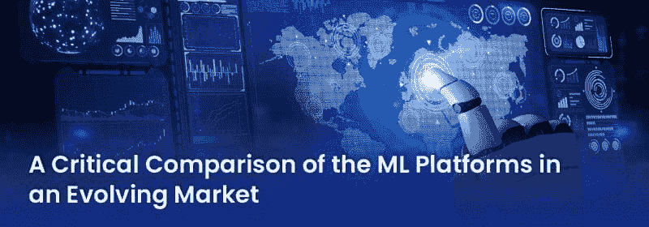

# 在不断发展的市场中对机器学习平台的关键比较

> 原文：[`www.kdnuggets.com/2021/02/critical-comparison-machine-learning-platforms-evolving-market.html`](https://www.kdnuggets.com/2021/02/critical-comparison-machine-learning-platforms-evolving-market.html)

评论

**作者：Vivek Jain，[Sigmoid](https://www.sigmoid.com/)**

### MLaaS 市场的发展

机器学习即服务（MLaaS）市场正蓬勃发展。预计到 2025 年将增长至[ 84.8 亿美元](https://www.mordorintelligence.com/industry-reports/global-machine-learning-as-a-service-mlaas-market)，年复合增长率为 43%。预计云计算的普及和更好地理解客户行为的需求将推动市场前进。鉴于公司今天可以从广泛的解决方案中选择以满足各种业务需求，MLaaS 模型在各行业中有明显倾斜。此外，物联网、自动化和人工智能驱动系统在各行业的普及将进一步放大 MLaaS 作为所有这些技术基础的需求。

### **数据卓越的三大机器学习平台**

数据科学和机器学习平台为公司提供了开发、部署和监控机器学习算法的必备工具。这些智能平台将数据与智能决策算法结合在一起，包括语音识别、图像识别、自然语言处理（NLP）等功能。

市场上有多种机器学习平台。选择合适的解决方案可能是一项艰巨的任务——需要进行深入的研究和比较，不仅仅是解决方案和核心技术能力。为了让这个任务稍微简单一些，我们在一个地方汇总了三大机器学习平台以供审阅。

**IBM Watson**

IBM Watson Studio 或 Watson Machine Learning 实质上是 IBM 云服务的融合，专注于神经网络和机器学习模型的创建、训练和部署。通过利用 Watson Machine Learning 平台，公司可以开发分析模型，同时用自己的数据训练这些模型，并将它们集成到原生应用程序中。

**微软 Azure**

微软 Azure 机器学习解决方案为公司提供了一个协作平台，以开发、测试和部署预测数据解决方案。Azure 使创建机器学习模型的过程变得简单易行。这确保了开发的模型能够在短时间内被更大范围的受众访问。此外，这个平台还使数据科学家和工程师更容易开始挖掘预测数据。这使得它成为那些经验较少或没有经验的用户的理想选择。

**谷歌云 AI**

Google Cloud AI 是多个 Google AI/ML 项目（如 Tensor Flow、Kuberflow 和 Cloud ML Engine）的融合。它包括一整套机器学习服务，如数据准备、数据调优和数据训练。数据科学家可以利用该平台部署和共享 ML 模型，并协作改进。

### 三大机器学习平台的详细比较

| **功能** | **IBM Watson** | **Microsoft Azure** | **Google Cloud AI** |
| --- | --- | --- | --- |
| **支持的框架** | TensorFlow, Spark MLlib, scikit-learn, XGBoost, PyTorch, IBM SPSS, PMML | TensorFlow, scikit-learn, Microsoft Cognitive Toolkit, Spark ML | TensorFlow, scikit-learn, XGBoost, Keras |
| **内置算法** | 支持。包括可以大规模部署的 AutoAI 和机器学习算法。 | 不支持。更灵活于开箱即用的算法。 | 通过[ 最新更新](https://cloud.google.com/ai-platform/training/docs/algorithms)支持。然而，实施仍处于测试阶段。 |
| **语音和文本处理 API** | 识别 60 多种语言，翻译 21 种语言 | 识别 120 种语言，翻译 60 多种语言 | 识别 120 多种语言，翻译 100 多种语言 |
| **用户界面** | Watson UI 主要面向专业用户。普通数据科学家和业务分析师可能会觉得用户体验繁琐。 | Azure GUI 旨在可视化工作流程中的每一步。较少经验的 ML 团队可以探索 UI 以了解主要方法和模型。 | 易于使用的图形界面可以帮助经验较少的 ML 团队训练高质量模型。 |
| **采纳难易度** | Watson ML 平台可以轻松集成到现有的复杂分析和应用开发系统中。然而，该平台确实更面向专业 ML 团队。 | 完成项目的时间和精力投入有相当大的学习曲线。特别是对于经验较少的用户。 | Google ML 引擎高度灵活，除了 TensorFlow，还支持多种流行算法。此外，作为最受欢迎的数据可视化工具之一，Data Studio 满足数据科学家和营销人员的需求。 |

| **成本** | 定价层级明确：

+   精简版：按需付费 – 免费，5 个模型 / 每月 5,000 次预测 / 50 小时训练，批量部署

+   标准：按需付费 – 每月每 1,000 次预测$0.50 / 每容量单位小时$0.50

+   专业版：每月$1,000 / 每月 2,000,000 次预测 / 1,000 小时

| 带有 10gb 工作区存储的 ML 工作室对 Microsoft 账户用户免费。标准企业级工作区可按月$9.99 或每小时$1 的价格获取。 | AI Hub 和笔记本免费。其余部分需订阅（可通过合同谈判）。定价计算器可在网站上使用，但确切数字需联系 Google。 |
| --- | --- |

### **总结**

在众多可用的 ML 平台中选择合适的一个可能是一个令人不知所措的任务。每种解决方案在算法、操作平台所需的技能以及执行的任务方面都有所不同。因此，如何选择一个能够全面满足您所有业务需求的平台，取决于您的公司通过机器学习程序打算实现的目标。诀窍在于将数据科学与您的长期业务目标正确对齐。一旦实现这一点，选择一个能够满足所有需求的平台将变得更加容易。

**个人简介：Vivek Jain** 是 [Sigmoid](http://<a href=)" rel="noopener" target="_blank">Sigmoid 的首席数据科学家，专长于实施 ML 解决方案，包括超个性化、深度神经网络、需求预测、文本分析等。

[原文](https://www.sigmoid.com/blogs/a-critical-comparison-of-the-ml-platforms-in-an-evolving-market/)。经许可转载。

**相关：**

+   2020–2022 年云计算、数据科学和 ML 趋势：巨头之争

+   2020 年数据科学与机器学习现状：3 个关键发现

+   顶级语音处理 API 比较

* * *

## 我们的前三个课程推荐

 1\. [Google 网络安全证书](https://www.kdnuggets.com/google-cybersecurity) - 快速进入网络安全职业。

 2\. [Google 数据分析专业证书](https://www.kdnuggets.com/google-data-analytics) - 提升您的数据分析技能

 3\. [Google IT 支持专业证书](https://www.kdnuggets.com/google-itsupport) - 支持组织中的 IT

* * *

### 更多相关话题

+   [学习 5 个关键数据科学技能的 5 个数据科学项目](https://www.kdnuggets.com/2022/03/5-data-science-projects-learn-5-critical-data-science-skills.html)

+   [Python 与 R 中的机器学习算法比较](https://www.kdnuggets.com/2023/06/machine-learning-algorithms-python-r.html)

+   [使用 Python 的自动化机器学习：不同方法的比较](https://www.kdnuggets.com/2023/03/automated-machine-learning-python-comparison-different-approaches.html)

+   [ChatGPT 与 Google Bard：技术差异比较](https://www.kdnuggets.com/2023/03/chatgpt-google-bard-comparison-technical-differences.html)

+   [深入探讨 GPT 模型：演变与性能比较](https://www.kdnuggets.com/2023/05/deep-dive-gpt-models.html)

+   [开源向量数据库的诚实比较](https://www.kdnuggets.com/an-honest-comparison-of-open-source-vector-databases)
