# 使用机器学习和计算机视觉检测作物疾病

> 原文：[`www.kdnuggets.com/2020/06/crop-disease-detection-computer-vision.html`](https://www.kdnuggets.com/2020/06/crop-disease-detection-computer-vision.html)

评论

**由 [Srinivas Chilukuri](https://in.linkedin.com/in/srinivascsn)，ZS 纽约 AI 卓越中心**

国际学习表示大会（ICLR）与国际农业研究咨询小组（CGIAR）联合开展了一项 [挑战赛](https://zindi.africa/competitions/iclr-workshop-challenge-1-cgiar-computer-vision-for-crop-disease/leaderboard)，全球超过 800 名数据科学家参与，通过近景图片检测作物疾病。该挑战的目标是构建一个机器学习算法，以准确分类植物是否健康、是否有茎锈病或叶锈病。

* * *

## 我们的三大课程推荐

 1\. [谷歌网络安全证书](https://www.kdnuggets.com/google-cybersecurity) - 快速进入网络安全职业道路。

 2\. [谷歌数据分析专业证书](https://www.kdnuggets.com/google-data-analytics) - 提升你的数据分析技能

 3\. [谷歌 IT 支持专业证书](https://www.kdnuggets.com/google-itsupport) - 支持你的组织的 IT 工作

* * *

小麦锈病是一种严重的植物病害，影响许多作物，减少产量，影响农民生计，并降低非洲的食品安全。该疾病在大规模监测时很难控制和根除。一个能够从任何图像中检测小麦锈病的准确图像识别模型，将使众包监测作物成为可能。

### 数据

图像数据来自多个来源。大部分数据由国际玉米和小麦改良中心 ([CIMMYT](https://www.cimmyt.org/)) 及其在埃塞俄比亚和坦桑尼亚的合作伙伴在田间收集。其余数据来自谷歌图片上的公开图像。在此挑战中，禁止使用提供的数据以外的外部数据。以下是按类别分类的数据示例，即健康小麦、叶锈病和茎锈病。

健康小麦

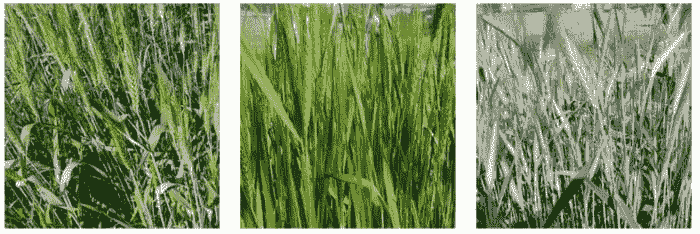

叶锈病

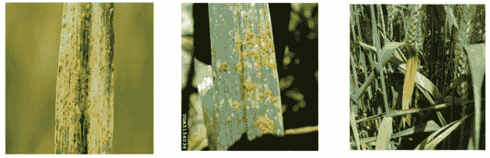

茎锈病

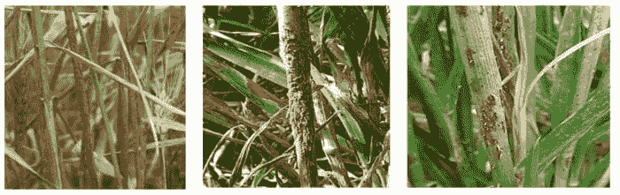

**图 1\. 不同类别的示例图像**

提供的训练 AI 模型的数据中共有 876 张图片（142 张健康，358 张叶锈病和 376 张茎锈病）。最终性能测试的数据有 610 张图片，标签未向参与者透露。

### 方法论

基于图片确定植物健康状态的最先进方法是一种称为卷积神经网络（[CNN](https://en.wikipedia.org/wiki/Convolutional_neural_network)）的深度学习方法。整体建模过程需要几个步骤来有效地准备数据，使 CNN 模型能产生良好的结果。下图 2 展示了涉及的详细步骤。

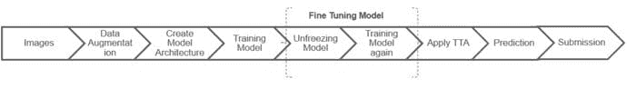

**图 2\. 模型流程**

在整个流程的各个步骤中，数据增强特别在提升模型性能方面发挥了重要作用。我们使用了多种数据增强技术 - 如下图所示。

**a. 垂直和水平翻转**

**b. 光照标准化**

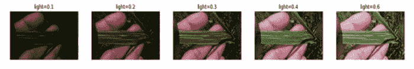

**c. 缩放和裁剪**

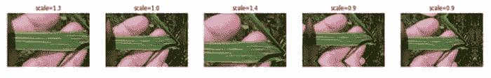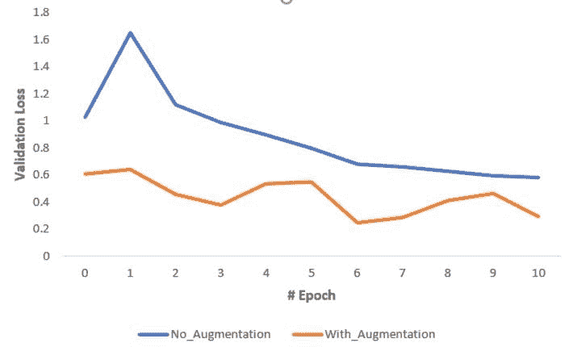

**图 3\. 数据增强示意图**

接下来的关键步骤是 CNN 模型架构设计。我们使用了[迁移学习](https://en.wikipedia.org/wiki/Transfer_learning)来基于现有的[ImageNet](http://www.image-net.org/)模型进行构建。虽然有多个预训练模型可用（例如 VGG、ResNet、InceptionV3、DenseNet、EfficientNet 等），我们选择了[DenseNet201](https://www.kaggle.com/pytorch/densenet201)因为它的复杂性较低、参数较少且计算成本更为经济。

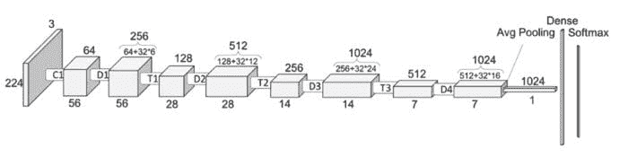

**图 4\. DenseNet201 模型架构**

我们在达到最终性能之前，反复调整模型及不同的数据增强方法。作为参考，我们在图 5 中展示了模型性能在迭代过程中的演变。

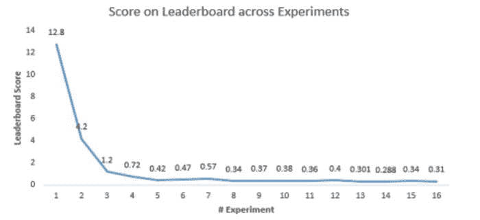

**图 5\. 模型性能随迭代变化**

### 结果

我们的最终得分是在测试数据集上获得的对数损失为 0.288，在 839 名参与者中排名第 53^(rd) [最终排行榜](https://zindi.africa/competitions/iclr-workshop-challenge-1-cgiar-computer-vision-for-crop-disease/leaderboard)。在 610 张测试图像样本中，这相当于约 580 个正确分类的实例——换句话说，模型准确率为 95%。这对于实际使用来说相当好，并且考虑到我们仅在有限的比赛数据集上进行训练，通过添加更多的数据点可以进一步提高准确率。

### 性能非常出色，但[模型学到了什么]？

**a. 模型说明**

在竞赛环境之外，如果我们期望模型在实际应用中使用，解释模型为何对给定图像进行分类是很重要的。我们探索了一些使用可解释 AI 技术（称为梯度加权类别激活图（Grad-CAM））的示例，以突出模型基于哪些图像区域作出决策。图 6 展示了一些例子。

叶锈病：原始图像（左）和 Grad-CAM 热图图像（右）

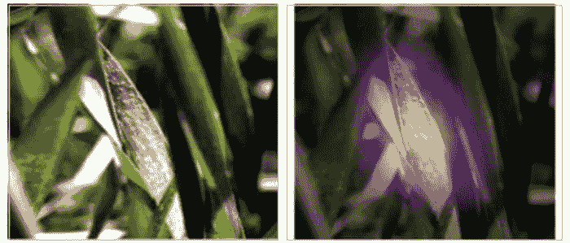

茎锈病：原始图像（左）和 Grad-CAM 热图图像（右）

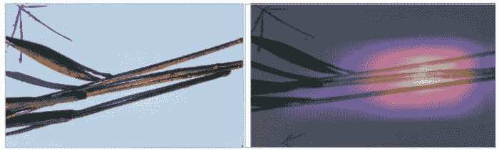

**图 6\. 使用 Grad-CAM 解释模型预测**

从解释中我们可以看到，模型能够准确分类的原因在于它抓住了叶子和茎上的锈斑部分。

**b. 通过深度梦境推断模型如何识别不同类别**

一种可视化模型学习内容的方法是将网络倒置，并让其增强输入图像，以便引发特定的输出类别。假设你想知道什么样的图像会产生“香蕉”的分类，从一个充满随机噪声的图像开始，然后逐渐调整图像，直到它被神经网络认为是香蕉。这被称为深度梦境（Deep Dream）。

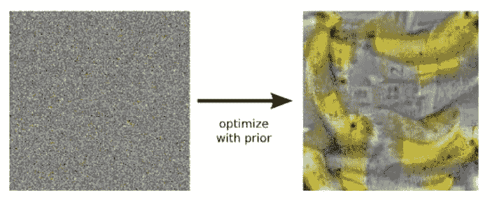

**图 7\. 让训练后的模型为香蕉类别生成图像的示例**

我们在模型上应用了深度梦境方法，并生成了相应类别的图像。下面的图像分别说明了模型通常认为某一类别图像的样子。

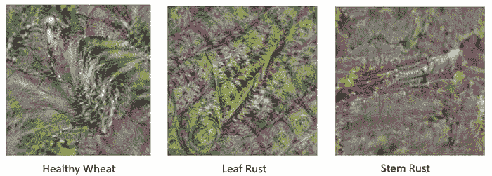

**图 8\. 基于我们模型的所有类别的深度梦境结果**

我们注意到对于不同的类别，模型发现了重要的区分模式：

+   健康小麦：主要颜色为绿色，具有叶状特征，没有锈斑相关的颜色如黄色/橙色

+   叶锈病：颜色混合，具有叶子状特征，并且叶子状特征上有锈斑相关的颜色（黄色/橙色）

+   茎锈病：具有管状模式，并且管状模式上有锈斑相关的颜色（黄色/橙色）

### 结论

在本文中，我们展示了如何将深度学习技术应用于基于近距离图像检测作物小麦锈病。除了良好的预测准确性，我们还展示了模型如何通过从类别激活图推断的解释来有效学习正确的表示。当扩展应用时，这种方法可以帮助数字监测作物健康，并可能显著提高农业生产力和产量。

ZS AI 团队在[最终排行榜](https://zindi.africa/competitions/iclr-workshop-challenge-1-cgiar-computer-vision-for-crop-disease/leaderboard)中排名前 6%，预测准确率为 95%。

**简介：[Srinivas Chilukuri](https://in.linkedin.com/in/srinivascsn)** 领导 ZS 纽约 AI 卓越中心。他拥有超过 15 年的经验，帮助各行业客户设计和实施 AI 解决方案。

**相关：**

+   使用 fast.ai 进行卫星图像分析以应对灾难恢复

+   利用 AI 识别塞伦盖蒂相机陷阱图像中的野生动物

+   农业中的机器学习：应用与技术

### 更多相关内容

+   [KDnuggets 新闻 2022 年 3 月 9 日：在 5…中构建机器学习 Web 应用程序](https://www.kdnuggets.com/2022/n10.html)

+   [你需要知道的 6 件关于数据管理的事以及为何重要…](https://www.kdnuggets.com/2022/05/6-things-need-know-data-management-matters-computer-vision.html)

+   [计算机视觉中的 TensorFlow - 轻松实现迁移学习](https://www.kdnuggets.com/2022/01/tensorflow-computer-vision-transfer-learning-made-easy.html)

+   [探索计算机视觉的世界：介绍 MLM 的最新…](https://www.kdnuggets.com/2024/01/mlm-discover-the-world-of-computer-vision-ebook)

+   [计算机视觉的 5 个应用](https://www.kdnuggets.com/2022/03/5-applications-computer-vision.html)

+   [DINOv2：Meta AI 的自监督计算机视觉模型](https://www.kdnuggets.com/2023/05/dinov2-selfsupervised-computer-vision-models-meta-ai.html)
