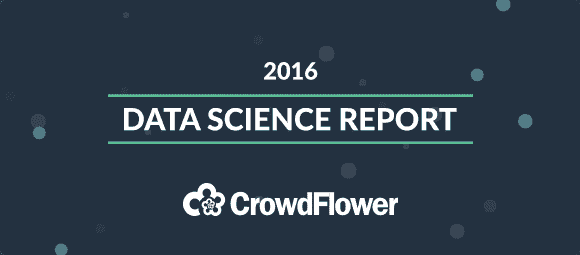

# CrowdFlower 2016 数据科学报告

> 原文：[`www.kdnuggets.com/2016/04/crowdflower-2016-data-science-repost.html`](https://www.kdnuggets.com/2016/04/crowdflower-2016-data-science-repost.html)

|  |
| --- |

| 今年早些时候，我们对来自各种组织的数据科学家进行了调查。我们想了解什么最能促使他们成功，他们面临的最大挑战是什么，以及他们如何看待未来五年内该领域的发展。我们将所有这些内容汇总在一份便捷的免费报告中，你可以在这里下载。几个关键见解：

+   83% 的数据科学家认为目前数据科学家短缺

+   60% 的人表示他们花费最多的时间在清理和整理数据上

+   尽管如此，仍有 4/5 的数据科学家对目前的工作感到非常积极

* * *

## 我们的前三个课程推荐

 1\. [Google 网络安全证书](https://www.kdnuggets.com/google-cybersecurity) - 快速进入网络安全职业道路。  2\. [Google 数据分析专业证书](https://www.kdnuggets.com/google-data-analytics) - 提升你的数据分析能力！  3\. [Google IT 支持专业证书](https://www.kdnuggets.com/google-itsupport) - 支持你的组织 IT 需求

* * *

完整报告包含更多详细信息，但我们希望让你了解一些我们认为最有趣的发现。如果你从事这个领域，请告诉我们下次应该询问什么。我们将非常感激。

|

&#124; [下载报告](http://visit.crowdflower.com/data-science-report.html) &#124;

|

|  |
| --- |

&#124;  &#124;  &#124;  &#124;

|

### 更多相关话题

+   [H1 2023 分析与数据科学支出与趋势报告](https://www.kdnuggets.com/2023/07/h1-2023-analytics-data-science-spend-trends-report.html)

+   [Burtch Works 2023 数据科学与 AI 专业人员薪资报告…](https://www.kdnuggets.com/2023/08/burtch-works-2023-data-science-ai-professionals-salary-report.html)

+   [AI 指数报告概述：人工智能趋势的测量](https://www.kdnuggets.com/2023/04/overview-ai-index-report-measuring-trends-artificial-intelligence.html)

+   [2023 AI 指数报告：我们可以期待的未来 AI 趋势](https://www.kdnuggets.com/2023/06/2023-ai-index-report-ai-trends-expect-future.html)

+   [深入未来，了解 Kaggle 的 AI 报告 2023 – 看看什么是热点](https://www.kdnuggets.com/dive-into-the-future-with-kaggle-ai-report-2023-see-what-hot)

+   [通过 ChatGPT 从 CSV 到完整分析报告的 5 个简单步骤](https://www.kdnuggets.com/from-csv-to-complete-analytical-report-with-chatgpt-in-5-simple-steps)
