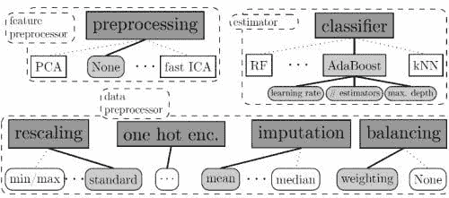

# 自动化机器学习的现状

> 原文：[`www.kdnuggets.com/2017/01/current-state-automated-machine-learning.html`](https://www.kdnuggets.com/2017/01/current-state-automated-machine-learning.html)

自动化机器学习（AutoML）在过去一年中成为了一个相当引人关注的话题。一个最近的 KDnuggets 博客竞赛专注于这个话题，产生了一些有趣的想法和项目。在这段时间里，几款 AutoML 工具也引起了显著的关注，并获得了尊重和声誉。

本文将简要说明 AutoML，论证其合理性和采纳，介绍一对当代工具，并讨论 AutoML 预计的未来和方向。

### 什么是自动化机器学习？

我们可以讨论自动化机器学习是什么，也可以讨论自动化机器学习**不是**什么。

AutoML**不是**自动化数据科学。尽管存在重叠，机器学习只是数据科学工具包中的众多工具之一，它的使用实际上并不适用于所有数据科学任务。例如，如果预测是某个数据科学任务的一部分，机器学习将是一个有用的组件；然而，机器学习可能完全不涉及描述性分析任务。

即使是预测任务，数据科学也远不仅仅是实际的预测建模。数据科学家[Sandro Saitta](https://www.linkedin.com/in/datamining)在讨论 AutoML 和自动化数据科学之间的潜在混淆时，这样说道:

> 这种误解源于对整个数据科学过程（例如，CRISP-DM）与数据准备（特征提取等）和建模（算法选择、超参数调整等）这些子任务之间的混淆，我称之为机器学习。
> 
> [...]
> 
> 当你阅读有关自动化数据科学和数据科学竞赛的新闻时，缺乏行业经验的人可能会感到困惑，认为数据科学只是建模，并且可以完全自动化。

他绝对正确，这不仅仅是语义问题。如果你需要更多关于机器学习和数据科学（以及其他相关概念）之间关系的澄清，请阅读此文。

此外，数据科学家和领先的自动化机器学习倡导者[Randy Olson](http://www.randalolson.com/)指出，有效的机器学习设计要求我们:

> 1.  始终为我们的模型调整超参数
> 1.  
> 1.  始终尝试许多不同的模型
> 1.  
> 1.  始终探索我们数据的多种特征表示

考虑到以上所有因素，如果我们将 AutoML 定义为算法选择、超参数调优、迭代建模和模型评估的任务，我们可以开始定义 AutoML 实际上 **是什么**。对此定义不会有完全一致的意见（例如，问 10 个人定义“数据科学”，然后比较你得到的 11 个答案），但这无疑会让我们起步正确。

### 我们为什么需要它？

在我们完成定义概念后，作为一个考虑 AutoML 可能带来好处的练习，让我们来看一下为什么机器学习是困难的。

*来源：[S. Zayd Enam](https://twitter.com/zaydenam)*

AI 研究员和斯坦福大学博士生 [S. Zayd Enam](https://twitter.com/zaydenam) 在一篇标题为 "[为什么机器学习‘难’？](http://ai.stanford.edu/~zayd/why-is-machine-learning-hard.html)" 的精彩博客文章中，最近写道（强调已添加）：

> [M]机器学习仍然是一个相对“困难”的问题。毫无疑问，通过研究推进机器学习算法的科学是困难的。这需要创造力、实验和毅力。**在将现有算法和模型应用于你的新应用时，机器学习仍然是一个难题。**

请注意，虽然 Enam 主要指的是机器学习研究，但他也触及了在用例中实施现有算法的问题（见强调）。

Enam 接着详细阐述了机器学习的困难，并专注于算法的性质（强调已添加）：

> 这种困难的一个方面涉及建立对于应利用什么工具来解决问题的直觉。**这需要了解可用的算法和模型以及每个算法和模型的权衡和限制。**
> 
> [...]
> 
> 难点在于机器学习是一个根本上困难的调试问题。机器学习的调试发生在两种情况下：1）你的算法不起作用或 2）你的算法效果不够好。[...] **算法第一次运行成功的情况非常少见，因此这往往是构建算法时花费最多时间的地方。**

Enam 然后从算法研究的角度详细阐述了这个框架问题。然而，他所说的再次适用于… **应用** 算法。如果一个算法不起作用，或者效果不够好，而选择和优化的过程变得迭代，这就暴露了自动化的机会，因此 **自动化** 机器学习。

我之前尝试过[捕捉](https://www.linkedin.com/pulse/case-machine-learning-business-matthew-mayo) AutoML 的本质如下：

> 如果 Sebastian Raschka 描述的那样，计算机编程是关于自动化的，而机器学习是“完全自动化自动化”，那么自动化机器学习就是“自动化自动化的自动化”。跟随我，在这里：编程通过管理重复任务来减轻我们的负担；机器学习允许计算机学习如何最佳地执行这些重复任务；自动化机器学习则允许计算机学习如何优化学习这些重复动作的结果。
> 
> 这是一个非常强大的想法；虽然我们之前不得不担心调整参数和超参数，但自动化机器学习系统可以通过多种不同的方法学习调整这些参数以获得最佳结果。

AutoML 的理由源于这个想法：如果必须构建多个机器学习模型，使用各种算法和多个不同的超参数配置，那么可以自动化这些模型的构建，也可以自动化模型性能和准确性的比较。

很简单，对吧？

### 自动化机器学习工具的比较

现在我们知道什么是 AutoML，以及我们为什么要使用它……我们如何**做**它？以下是对一对现代 Python AutoML 工具的概述和比较，这些工具采用不同的方法，试图实现更多或更少相同的目标，即自动化机器学习过程。

**Auto-sklearn**

Auto-sklearn 是“一个自动化机器学习工具包，是 scikit-learn 估算器的直接替代品。”它也恰好是[KDnuggets](http://papers.nips.cc/paper/5872-efficient-and-robust-automated-machine-learning.pdf)最近的自动化数据科学和机器学习博客竞赛的获胜者。

> auto-sklearn 使机器学习用户免于算法选择和超参数调整。它利用了贝叶斯优化、元学习和集成构建的最新优势。通过阅读这篇在[NIPS 2015](http://papers.nips.cc/paper/5872-efficient-and-robust-automated-machine-learning.pdf)上发表的论文，了解 auto-sklearn 背后的技术。

正如项目文档中的上述摘录所述，Auto-sklearn 通过[贝叶斯优化](https://en.wikipedia.org/wiki/Bayesian_optimization)来执行超参数优化，该过程通过迭代以下步骤进行：

> 1.  构建一个概率模型以捕捉超参数设置与其性能之间的关系。
> 1.  
> 1.  使用该模型通过权衡探索（在模型不确定的空间部分进行搜索）和开发（专注于预测表现良好的空间部分）来选择下一个要尝试的有用超参数设置。
> 1.  
> 1.  使用这些超参数设置运行机器学习算法。

进一步解释这一过程的内容如下：

> 这一过程可以概括为联合选择算法、预处理方法及其超参数，如下所示：分类器/回归器和预处理方法的选择是顶级的、分类的超参数，并且根据它们的设置，所选方法的超参数变得有效。然后，可以使用贝叶斯优化方法来搜索这些组合空间，这些方法可以处理这样的高维、条件空间；我们使用基于随机森林的[SMAC](http://www.cs.ubc.ca/labs/beta/Projects/SMAC/)，它已被证明在这种情况下效果最佳。

就实用性而言，由于 Auto-sklearn 是 scikit-learn 估算器的直接替代品，因此需要一个功能正常的[scikit-learn](http://scikit-learn.org/stable/)安装来利用它。Auto-sklearn 还通过共享文件系统上的数据共享[支持并行执行](https://automl.github.io/auto-sklearn/stable/manual.html#manual)，并可以利用 scikit-learn 的[模型持久性](https://automl.github.io/auto-sklearn/stable/manual.html#manual)能力。有效使用 Auto-sklearn 替代估算器只需以下 4 行代码即可获得机器学习管道，正如作者所述：

使用 Auto-sklearn 处理 MNIST 数据集的更详细示例如下：

另外值得注意的是，Auto-sklearn 赢得了[ChaLearn AutoML 挑战赛](https://competitions.codalab.org/competitions/2321)的*auto*和*tweakathon*两个类别。

您可以阅读 Auto-sklearn 开发团队在最近的 KDnuggets 自动化数据科学和机器学习博客竞赛中的获奖博客提交这里，以及与开发者的后续采访这里。Auto-sklearn 是[弗莱堡大学](http://aad.informatik.uni-freiburg.de/)进行研究的结果。

Auto-sklearn 可以在其[官方 GitHub 仓库](https://github.com/automl/auto-sklearn)找到。Auto-sklearn 的文档可以在[这里](http://automl.github.io/auto-sklearn/stable/)找到，而其 API 可以在[这里](https://automl.github.io/auto-sklearn/stable/api.html#api)找到。

**TPOT**

TPOT 被“宣传”为“您的数据科学助手”（请注意，它并不是“您的数据科学*替代品*”）。这是一个 Python 工具，它“自动创建和优化使用遗传编程的机器学习管道。” TPOT 像 Auto-sklearn 一样，与 scikit-learn 配合使用，自我描述为 scikit-learn 的包装器。

正如之前在本文中提到的，两个突出的项目采用不同的方法实现类似的目标。虽然这两个项目都是开源的，使用 Python 编写，并旨在通过 AutoML 简化机器学习过程，但与使用贝叶斯优化的 Auto-sklearn 相比，TPOT 的方法基于 [遗传编程](https://en.wikipedia.org/wiki/Genetic_programming)。

尽管方法不同，但结果是一样的：自动化的超参数选择、使用各种算法建模以及探索多种特征表示，所有这些都导致了迭代模型构建和模型评估。

TPOT 的一个真正的好处是，它会为表现最佳的模型生成可直接运行的独立 Python 代码，形式为 scikit-learn 管道。这段代码代表了所有候选模型中表现最佳的，可以修改或检查以获取额外的见解，实际上可以作为 *起点* 而非仅仅作为 *终点产品*。

一个在 MNIST 数据上运行的 TPOT 示例如下：

此次运行的结果是一个管道，实现了 98% 的测试准确率，同时该管道的 Python 代码被导出到 `tpot-mnist-pipeline.py` 文件中，如下所示：

TPOT 可以通过其 [官方 Github 仓库](https://github.com/rhiever/tpot) 获得，而其文档可以在 [这里](https://rhiever.github.io/tpot/using/) 查阅。

由 TPOT 首席开发者 Randy Olson 撰写的关于 TPOT 和 AutoML 的概述文章可以在 这里 找到。与 Randy 的后续采访可以在 这里 找到。

TPOT 是在 [宾夕法尼亚大学生物医学信息学研究所](http://upibi.org/) 开发的，资助来自 NIH 资助 R01 AI117694。

当然，这些并不是唯一的 AutoML 工具。其他包括 Hyperopt (Hyperopt-sklearn)、Auto-WEKA 和 Spearmint。我敢打赌，未来几年还会有许多其他项目问世，包括研究型和工业级的。

### 自动化机器学习的未来

AutoML 未来会去向何处？

我最近就我的 2017 年机器学习预测 表达了意见：

> [自动化机器学习] 将安静地成为一个重要的事件。也许对外界而言不如深度神经网络那样吸引眼球，但自动化机器学习将开始在 ML、AI 和数据科学中产生深远的影响，2017 年可能会成为这一点显现的一年。

在同一篇文章中，Randy Olson 还表达了他对 2017 年 AutoML 的期望。然而，Randy 还在最近的一次采访中陈述了以下内容：

> 在不久的将来，我认为自动化机器学习（AutoML）将会接管机器学习模型构建过程：一旦数据集以（相对）干净的格式存在，AutoML 系统将能够比 99%的人工更快地设计和优化机器学习管道。
> 
> [...]
> 
> 然而，我可以自信地评论，AutoML 的一个长期趋势是，AutoML 系统将会在机器学习领域成为主流……

但是，AutoML 会取代数据科学家吗？Randy 继续说道：

> 我并不认为 AutoML 的目的是取代数据科学家，就像智能代码自动补全工具并不是为了取代计算机程序员一样。对我而言，AutoML 的目的是将数据科学家从重复和耗时的任务（例如机器学习管道设计和超参数优化）中解放出来，这样他们可以更好地将时间花在更难以自动化的任务上。

很好的观点。他的观点被 Auto-sklearn 的开发者所认同：

> 所有的自动化机器学习方法都是为了支持数据科学家，而不是取代他们。这些方法可以将数据科学家从麻烦的、复杂的任务（例如超参数优化）中解放出来，这些任务机器解决得更好。但分析和得出结论仍然需要由人类专家完成——特别是了解应用领域的数据科学家将仍然非常重要。

所以这一切听起来很令人鼓舞：数据科学家不会被大规模取代，AutoML 应该会帮助他们更好地完成工作。这并不是说 AutoML 已经完美。当被问及是否有改进的空间时，Auto-sklearn 团队表示：

> 尽管有几种方法用于调整机器学习管道的超参数，但到目前为止，对发现新的管道构建块的研究还很少。Auto-sklearn 使用一组预定义的预处理器和分类器，并按固定顺序进行操作。有效的方法来提出新的管道将是有帮助的。当然，人们可以继续这种思路，尝试自动发现新算法，如几篇最近的论文中所做的，例如《通过梯度下降学习学习》。

AutoML 的未来究竟会走向何处？很难确定。但毫无疑问，它将会*有所发展*，而且可能会比预期更早。虽然自动化机器学习的概念可能并非所有数据科学家都已熟悉，但现在正是加深了解的好时机。毕竟，如果你能在大众之前开始享受 AutoML 的好处，紧跟技术潮流，你不仅可以为不确定的未来保障工作，还能学会如何利用这些技术来*现在就更好地完成工作*。我认为没有比这更好的理由来建议你今天就开始学习 AutoML 了。

**相关**：

+   自动化机器学习：与 TPOT 首席开发者 Randy Olson 的访谈

+   自动化数据科学与机器学习：与 Auto-sklearn 团队的访谈

+   比赛获胜者：使用 Auto-sklearn 赢得 AutoML 挑战赛

* * *

## 我们的三大课程推荐

 1\. [Google 网络安全证书](https://www.kdnuggets.com/google-cybersecurity) - 快速进入网络安全职业轨道

 2\. [Google 数据分析专业证书](https://www.kdnuggets.com/google-data-analytics) - 提升你的数据分析技能

 3\. [Google IT 支持专业证书](https://www.kdnuggets.com/google-itsupport) - 支持你的组织的 IT 需求

* * *

### 更多相关内容

+   [KDnuggets 新闻，11 月 2 日：数据科学的现状…](https://www.kdnuggets.com/2022/n43.html)

+   [数据科学职业的现状](https://www.kdnuggets.com/2022/10/current-state-data-science-careers.html)

+   [如何保持 Python 的前沿性](https://www.kdnuggets.com/2022/06/stay-current-python.html)

+   [使用 Streamlit 进行 DIY 自动化机器学习](https://www.kdnuggets.com/2021/11/diy-automated-machine-learning-app.html)

+   [使用 Python 的自动化机器学习：案例研究](https://www.kdnuggets.com/2023/04/automated-machine-learning-python-case-study.html)

+   [使用 Python 的自动化机器学习：不同方法的比较…](https://www.kdnuggets.com/2023/03/automated-machine-learning-python-comparison-different-approaches.html)
