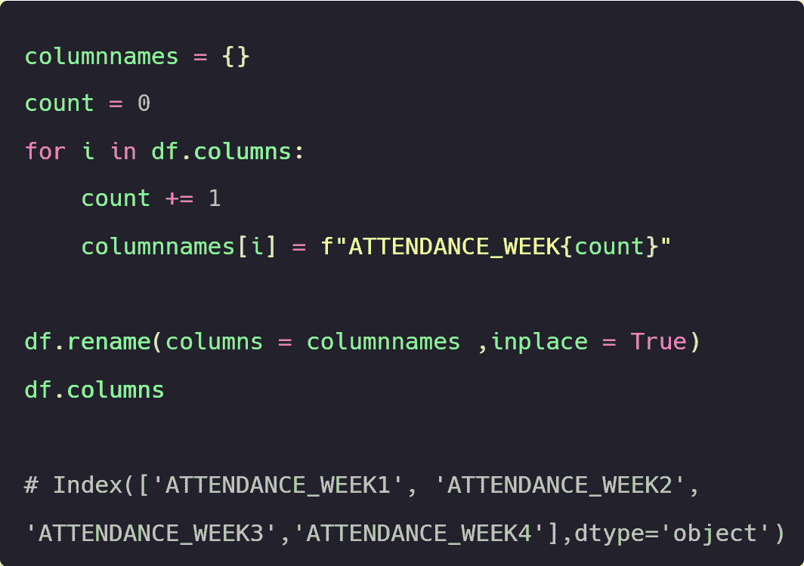
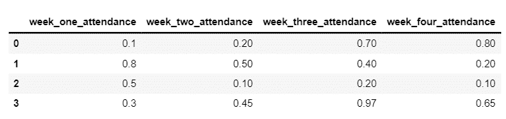
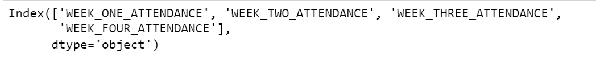
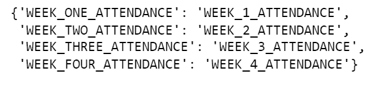
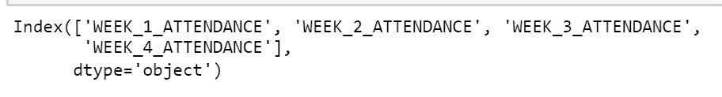
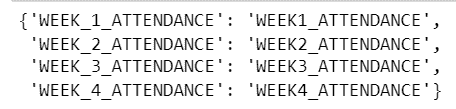
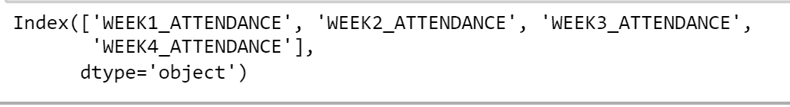
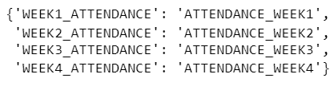
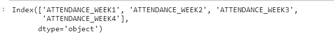

# 在 Python 中自定义数据框列名

> 原文：[`www.kdnuggets.com/2022/08/customize-data-frame-column-names-python.html`](https://www.kdnuggets.com/2022/08/customize-data-frame-column-names-python.html)



编辑图片

无论数据科学中的哪个职业，除了常规的数据清洗和模型构建外，个人还需要以易于业务理解的方式呈现结果。在本教程中，我们将探索四种场景，在这些场景中，你可以同时对所有数据框列应用不同的转换。

* * *

## 我们的前三大课程推荐

 1\. [Google 网络安全证书](https://www.kdnuggets.com/google-cybersecurity) - 快速进入网络安全职业的快车道。

 2\. [Google 数据分析专业证书](https://www.kdnuggets.com/google-data-analytics) - 提升你的数据分析技能

 3\. [Google IT 支持专业证书](https://www.kdnuggets.com/google-itsupport) - 支持你的组织的 IT

* * *

**在深入探讨这些场景之前，让我们导入 pandas 库，并创建一个名为 df 的数据框，列名如下：**

+   week_one_attendance

+   week_two_attendance

+   week_three_attendance

+   week_four_attendance

**代码：**

```py
import pandas as pd

df = pd.DataFrame (data = [[0.10,0.20,0.70,0.80],[0.80,0.50,0.40,0.20],[0.50,0.10,0.20,0.10],[0.30,0.45,0.97,0.65]],

columns = ["week_one_attendance","week_two_attendance","week_three_attendance","week_four_attendance"])

df
```

**输出：**



**让我们开始探索这些场景吧**

# 场景 1

在下面的代码中，使用了[for 循环](https://www.programiz.com/python-programming/for-loop)来迭代数据框的所有列，在每次迭代中，每列都通过[rename](https://pandas.pydata.org/docs/reference/api/pandas.DataFrame.rename.html)方法转换为大写。

**代码：**

```py
for i in df.columns:

df.rename(columns = {i:i.upper()},inplace = True)

df.columns
```

**输出：**



# 场景 2

在下面的代码中，我们将声明一个名为**columnnames**的空[字典](https://www.w3schools.com/python/python_dictionaries.asp)，然后声明另一个名为**count to 0**的**变量**。

然后我们将使用[for 循环](https://www.programiz.com/python-programming/for-loop)来迭代数据框的所有列，在每次迭代中，**count**变量将增加 1。增加后的值将被用在[fstring](https://www.geeksforgeeks.org/formatted-string-literals-f-strings-python/)中生成新的列名。每次迭代时，原始列名和新列名将作为键值对添加到字典中。

在构建包含原始列名和新列名的字典 `columnnames` 后，我们将把字典传递给 [rename](https://pandas.pydata.org/docs/reference/api/pandas.DataFrame.rename.html) 方法

**代码：**

```py
columnnames = {}

count = 0

for i in df.columns:

  count += 1

  columnnames[i] = f"WEEK_{count}_ATTENDANCE"

columnnames
```

**输出：**



**代码：**

```py
df.rename(columns = columnnames ,inplace = True)

df.columns
```

**输出：**



# 场景 3

在下面的代码中，我们将声明一个名为 **columnnames** 的空 [字典](https://www.w3schools.com/python/python_dictionaries.asp)

然后我们将使用 [for loop](https://www.programiz.com/python-programming/for-loop) 遍历数据框的所有列，每次迭代中，第一个下划线的出现将被替换为空格。每次迭代中，原始列名和新列名将作为键值对添加到字典中。

在构建包含原始列名和新列名的字典 `columnnames` 后，我们将把字典传递给 [rename](https://pandas.pydata.org/docs/reference/api/pandas.DataFrame.rename.html) 方法

**代码：**

```py
columnnames = {}

for i in df.columns:

  x = i.replace('_','',1)

  columnnames[i] = x

columnnames
```

**输出：**



**代码：**

```py
df.rename(columns = columnnames ,inplace = True)

df.columns
```

**输出：**



# 场景 4

在下面的代码中，我们将声明一个名为 **columnnames** 的空 [字典](https://www.w3schools.com/python/python_dictionaries.asp)，然后声明另一个名为 **count to 0** 的 **变量**

然后我们将使用 [for loop](https://www.programiz.com/python-programming/for-loop) 遍历数据框的所有列，每次迭代中 `count` 变量将增加 1。增量值将被用于 [fstring](https://www.geeksforgeeks.org/formatted-string-literals-f-strings-python/) 中，以生成一个新列名，其中第一个和最后一个单词的位置被交换。每次迭代中，原始列名和新列名将作为键值对添加到字典中。

在构建包含原始列名和新列名的字典后，我们将把字典传递给 [rename](https://pandas.pydata.org/docs/reference/api/pandas.DataFrame.rename.html) 方法

**代码：**

```py
columnnames = {}

count = 0

for i in df.columns:

  count += 1

  columnnames[i] = f"ATTENDANCE_WEEK{count}"

columnnames
```

**输出：**



**代码：**

```py
df.rename(columns = columnnames ,inplace = True)

df.columns
```

**输出：**



# 结论

相比于逐个手动更新每个列名，我们通过使用 `for` 循环和 Python 字符串的不同方法，能够同时更新数据框的所有列的值，从而节省了大量时间

**[Priya Sengar](https://www.linkedin.com/in/priya-sengar/)** (**Medium**, **Github**) 是来自 Old Dominion University 的数据科学家。Priya 热衷于解决数据问题并将其转化为解决方案。

### 了解更多相关话题

+   [通过《快速 Python 数据科学》提升你的 Python 技能！](https://www.kdnuggets.com/2022/06/manning-step-python-game-fast-python-data-science.html)

+   [文本分类任务的最佳架构：基准测试…](https://www.kdnuggets.com/2023/04/best-architecture-text-classification-task-benchmarking-options.html)

+   [作为数据科学家如何管理你的可重用 Python 代码](https://www.kdnuggets.com/2021/06/managing-reusable-python-code-data-scientist.html)

+   [作为数据科学家如何注释你的 Python 代码](https://www.kdnuggets.com/how-to-comment-your-python-code-as-a-data-scientist)

+   [KDnuggets™ 新闻 22:n01，1 月 5 日：跟踪和可视化的 3 个工具…](https://www.kdnuggets.com/2022/n01.html)

+   [从新手到高手：为什么你的 Python 技能在数据科学中至关重要](https://www.kdnuggets.com/novice-to-ninja-why-your-python-skills-matter-in-data-science)
