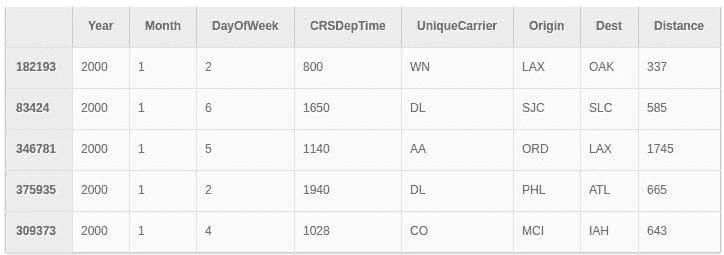

# Dask 和 Pandas 和 XGBoost：在分布式系统之间良好配合

> 原文：[`www.kdnuggets.com/2017/04/dask-pandas-xgboost-playing-nicely-distributed-systems.html`](https://www.kdnuggets.com/2017/04/dask-pandas-xgboost-playing-nicely-distributed-systems.html)

**作者：Matthew Rocklin，Continuum Analytics。**

*这项工作得到了[Continuum Analytics](http://continuum.io/)、[XDATA 计划](https://www.darpa.mil/program/XDATA)和[摩尔基金会](https://www.moore.org/)的数据驱动发现计划的支持*

> **编辑注：** 如果你想了解 Dask 的介绍，可以阅读《介绍 Dask 的并行编程：与项目首席开发者的访谈》。要了解最新发布的更多信息，请参见[Dask 0.14.1 版本](http://matthewrocklin.com/blog/work/2017/03/23/dask-0.14.1)。

### 总结

本文讨论了如何使用 Dask 分发 Pandas DataFrame，然后将它们交给分布式 XGBoost 进行训练。

更一般地说，它讨论了在相同共享内存进程中启动多个分布式系统的价值，并在它们之间顺利地交接数据。

+   [笔记本](https://gist.github.com/mrocklin/3696fe2398dc7152c66bf593a674e4d9)

+   [录屏](https://youtu.be/Cc4E-PdDSro)

+   [Github 问题](https://github.com/dmlc/xgboost/issues/2032)

### 引言

XGBoost 是一个深受喜爱的库，用于一种流行的机器学习算法类别——梯度提升树。它在商业中广泛使用，并且是 Kaggle 竞赛中最受欢迎的解决方案之一。对于更大的数据集或更快的训练，XGBoost 还配备了自己的分布式计算系统，可以扩展到集群中的多个机器上。太棒了。分布式梯度提升树需求量很大。

然而，在我们能够使用分布式 XGBoost 之前，我们需要做三件事情：

1.  准备和清理我们可能很大的数据，可能需要大量的 Pandas 数据处理

1.  设置 XGBoost 主节点和工作节点

1.  将我们的清理后的数据从一堆分布式 Pandas DataFrame 传递给集群中的 XGBoost 工作节点

这实际上非常简单。这篇博客文章提供了一个快速示例，使用 Dask.dataframe 进行分布式 Pandas 数据处理，然后使用新的[dask-xgboost](https://github.com/dask/dask-xgboost)包在 Dask 集群内设置 XGBoost 集群并进行交接。

在这个示例之后，我们将讨论一般设计及其对其他分布式系统的意义。

### 示例

我们有一个包含十个节点的集群，每个节点有八个核心（`m4.2xlarges` 在 EC2 上）

我们使用 dask.dataframe 加载 Airlines 数据集（只是一堆分布在集群中的 Pandas DataFrame），并进行一些预处理：

这从 S3 上的 CSV 数据中加载了几百个 pandas 数据框。我们随后不得不进行下采样，因为未来使用 XGBoost 的方式似乎需要大量的 RAM。我不是 XGBoost 专家，请原谅我的无知。最后我们有两个数据框：

+   `df`: 我们将从中学习航班是否延误的数据

+   `is_delayed`: 这些航班是否延误。

熟悉 Pandas 的数据科学家可能会对上述代码感到熟悉。Dask.dataframe 与 Pandas *非常* 相似，但它在集群上运行。

### 分类和独热编码

XGBoost 不愿意处理像 destination=”LAX” 这样的文本数据。相反，我们为每个已知的机场和航空公司创建新的指示器列。这将我们的数据扩展为许多布尔列。幸运的是，Dask.dataframe 有所有这些便利功能（谢谢 Pandas！）

这大大扩展了我们的数据，但使得训练变得更容易。

### 拆分和训练

很好，现在我们准备拆分我们的分布式数据框

启动一个分布式 XGBoost 实例，并在这些数据上进行训练

很好，我们能够在约一分钟内使用我们的十台机器在这些数据上训练一个 XGBoost 模型。我们得到的只是一个普通的 XGBoost Booster 对象。

我们可以在本地使用普通的 Pandas 数据

我们可以再次使用 `dask-xgboost` 来训练我们的分布式保留数据，得到另一个 Dask 系列。

### 评估

我们可以将这些预测带到本地进程，并使用普通的 Scikit-learn 操作来评估结果。

我们可能想要调整上述参数或尝试不同的数据来改进我们的解决方案。关键不是我们是否准确预测了航班延误，而是如果你是一个了解 Pandas 和 XGBoost 的数据科学家，上述的操作对你来说*相当熟悉*。在上述示例中没有太多新的材料。我们使用的工具和之前一样，只是规模更大。

### 分析

好的，现在我们已经展示了这如何工作，让我们稍微讨论一下刚刚发生了什么，以及这对分布式服务之间合作的总体意义。

### dask-xgboost 的功能

[dask-xgboost](https://github.com/dask/dask-xgboost) 项目相当小而且简单（200 TLOC）。在一个中央调度器和几个分布式工作节点的 Dask 集群中，它在运行 Dask 调度器的相同进程中启动一个 XGBoost 调度器，并在每个 Dask 工作节点中启动一个 XGBoost 工作节点。它们共享相同的物理进程和内存空间。Dask 被构建来支持这种情况，因此这相对简单。

然后，我们要求 Dask.dataframe 完全在 RAM 中生成，并询问所有组成的 Pandas 数据框所在的位置。我们告诉每个 Dask 工作节点将其拥有的所有 Pandas 数据框传递给其本地的 XGBoost 工作节点，然后就让 XGBoost 自己处理。Dask 不为 XGBoost 提供动力，它只是设置、提供数据，并让 XGBoost 在后台完成其工作。

人们常常问 Dask 提供了哪些机器学习功能，它们与 H2O 或 Spark 的 MLLib 等其他分布式机器学习库相比如何。对于梯度提升树，200 行的 dask-xgboost 包就是答案。Dask 不需要自己实现这样的算法，因为 XGBoost 已经存在，效果很好，并且为 Dask 用户提供了一个功能全面且高效的解决方案。

由于 Dask 和 XGBoost 都可以在相同的 Python 进程中运行，它们可以无成本地共享字节、互相监控等。这两个分布式系统以 NumPy 和 Pandas 在单个进程中协同工作的方式，在多个进程中共存。如果你希望轻松使用多个专门化服务，并避免大型单体框架，那么共享分布式进程与多个系统是非常有益的。

### 连接到其他分布式系统

前一段时间，我写了 [一篇类似的博客文章](http://matthewrocklin.com/blog/work/2017/02/11/dask-tensorflow)，讲述了如何以与这里相同的方式托管 TensorFlow。设置 TensorFlow 与 Dask 并排运行，向其提供数据，并让 TensorFlow 处理事情也是非常简单的。

一般来说，这种“服务其他库”的方法是 Dask 在可能的情况下的操作方式。我们之所以能够覆盖今天的功能范围，是因为我们大量依赖现有的开源生态系统。Dask.arrays 使用 Numpy 数组，Dask.dataframes 使用 Pandas，现在 Dask 对梯度提升树的答案就是使分布式 XGBoost 的使用变得非常非常简单。瞧！我们获得了一个由其他专注的开发者维护的功能全面的解决方案，整个连接过程是在一个周末完成的（详情见 [dmlc/xgboost #2032](https://github.com/dmlc/xgboost/issues/2032)）。

自从这篇文章发布以来，我们收到了一些要求，希望支持其他分布式系统，如 [Elemental](http://libelemental.org/)，以及进行通用的 MPI 计算传递。如果我们能够用相同的进程集启动这两个系统，那么所有这些都是相当可行的。当你可以在相同的进程中将 numpy 数组从一个系统的工作节点传递到另一个系统的工作节点时，许多跨系统协作的挑战都会消失。

### 致谢

感谢 [Tianqi Chen](http://homes.cs.washington.edu/~tqchen/) 和 [Olivier Grisel](http://ogrisel.com/) 在 [构建和测试](https://github.com/dmlc/xgboost/issues/2032) `dask-xgboost` 时的帮助。感谢 [Will Warner](https://github.com/electronwill) 编辑这篇文章的帮助。

**简介： [马修·罗克林](http://matthewrocklin.com/)** 是一名开源软件开发者，专注于高效计算和并行计算，主要在 Python 生态系统内。他对许多 PyData 库做出了贡献，目前正在开发 Dask，一个并行计算框架。马修在芝加哥大学获得计算机科学博士学位，专注于数值线性代数、任务调度和计算代数。马修现居纽约布鲁克林，并受雇于 [**Continuum Analytics**](https://www.continuum.io/)。

[原文](http://matthewrocklin.com/blog/work/2017/03/28/dask-xgboost)。经许可转载。

**相关：**

+   介绍 Dask 并行编程：与项目首席开发者的访谈

+   XGBoost：在 Spark 和 Flink 中实现最获胜的 Kaggle 算法

+   初学者 Pandas 推文分析指南

* * *

## 我们的三大课程推荐

 1\. [Google 网络安全证书](https://www.kdnuggets.com/google-cybersecurity) - 快速进入网络安全职业生涯。

 2\. [Google 数据分析专业证书](https://www.kdnuggets.com/google-data-analytics) - 提升你的数据分析水平

 3\. [Google IT 支持专业证书](https://www.kdnuggets.com/google-itsupport) - 支持你的组织 IT

* * *

### 更多相关内容

+   [GBM 和 XGBoost 有什么区别？](https://www.kdnuggets.com/wtf-is-the-difference-between-gbm-and-xgboost)

+   [如何加速 XGBoost 模型训练](https://www.kdnuggets.com/2021/12/speed-xgboost-model-training.html)

+   [XGBoost 的假设是什么？](https://www.kdnuggets.com/2022/08/assumptions-xgboost.html)

+   [调优 XGBoost 超参数](https://www.kdnuggets.com/2022/08/tuning-xgboost-hyperparameters.html)

+   [利用 XGBoost 进行时间序列预测](https://www.kdnuggets.com/2023/08/leveraging-xgboost-timeseries-forecasting.html)

+   [KDnuggets™ 新闻 22:n07, 2 月 16 日：如何学习机器数学…](https://www.kdnuggets.com/2022/n07.html)
