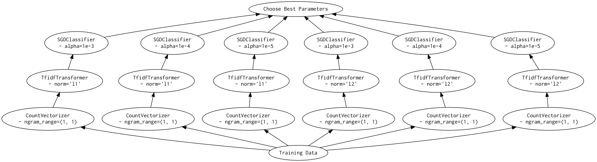
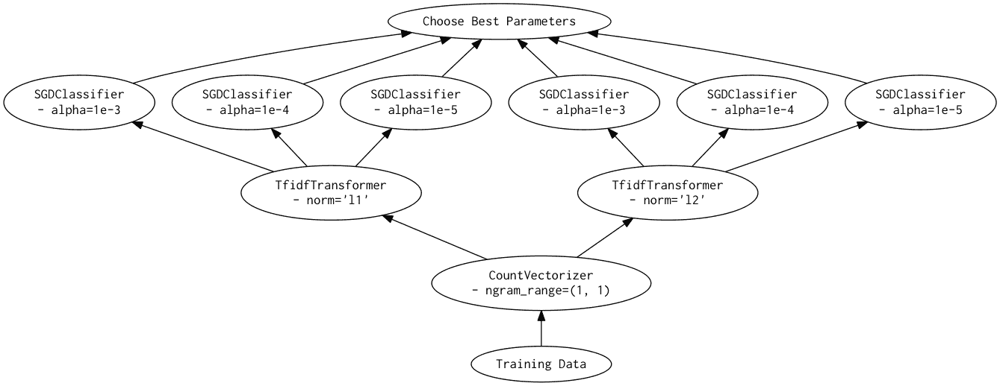
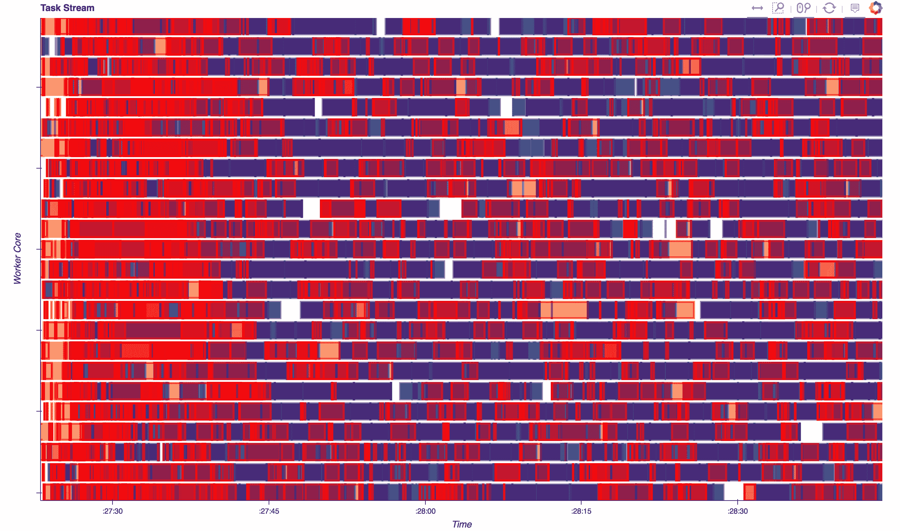

# 介绍 Dask-SearchCV：与 Scikit-Learn 的分布式超参数优化

> 原文：[`www.kdnuggets.com/2017/05/dask-searchcv-distributed-hyperparameter-optimization-scikit-learn.html`](https://www.kdnuggets.com/2017/05/dask-searchcv-distributed-hyperparameter-optimization-scikit-learn.html)

**作者：Jim Crist，Continuum Analytics。**

### 介绍

去年夏天，我花了一些时间实验结合了 [dask](http://dask.pydata.org/en/latest/) 和 [scikit-learn](http://scikit-learn.org/stable/)（在这个 [系列](http://jcrist.github.io/dask-sklearn-part-1.html) [博客](http://jcrist.github.io/dask-sklearn-part-2.html) [文章](http://jcrist.github.io/dask-sklearn-part-3.html) 中记录）。所做的工作产生的库非常初级，实际上没有什么成果。最近我重新开始了这项工作，很高兴地说，我们现在有了一个我可以满意的成果。这涉及到几个主要的变化：

+   范围的大幅缩减。之前的版本尝试实现*模型*和*数据*并行。由于不是机器学习专家，数据并行的实现方式不够严格。现在的范围缩小为仅实现超参数搜索（模型并行），这是我们可以做好的事情。

+   优化的图构建。结果发现，当人们被给予在集群中运行网格搜索的选项时，他们立即想要扩大网格大小。尽管代码变得更复杂，但我们现在可以处理极大的网格（例如，50 万候选者现在需要几秒钟构建图，而之前则需要几分钟）。*需要注意的是，对于如此大小的网格，主动搜索可能会显著表现更好*。相关问题：[#29](https://github.com/dask/dask-searchcv/issues/29)。

+   增强了与 Scikit-Learn 的兼容性。现在只有少数例外，`GridSearchCV` 和 `RandomizedSearchCV` 的实现应该可以直接替代它们的 scikit-learn 对应版本。

所有这些变化导致了名称的更改（之前是 `dask-learn`）。新库是 [`dask-searchcv`](http://dask-searchcv.readthedocs.io/)。它可以通过 conda 或 pip 安装：

在这篇文章中，我将简要概述这个库，并讨论何时你可能会选择它而不是其他选项。

### 什么是网格搜索？

许多机器学习算法有*超参数*，可以通过调整这些参数来提高最终估计器的性能。[网格搜索](https://en.wikipedia.org/wiki/Hyperparameter_optimization#Grid_search)是一种优化这些参数的方法——它通过在这些参数的一个子集的笛卡尔积（即“网格”）上进行参数扫描，然后选择最佳结果的估计器。由于这涉及在相同的数据集上拟合多个独立的估计器，因此可以很容易地进行并行处理。

### 使用文本分类的示例

我们将重现 [这个示例](http://scikit-learn.org/stable/auto_examples/model_selection/grid_search_text_feature_extraction.html)，使用来自 scikit-learn 文档的 news_groups 数据集。

### 设置

首先，我们需要加载数据：

```py
Number of samples: 857

```

接下来，我们将构建一个管道来进行特征提取和分类。它由一个 [CountVectorizer](http://scikit-learn.org/stable/modules/generated/sklearn.feature_extraction.text.CountVectorizer.html)、一个 [TfidfTransformer](http://scikit-learn.org/stable/modules/generated/sklearn.feature_extraction.text.TfidfTransformer.html) 和一个 [SGDClassifier](http://scikit-learn.org/stable/modules/generated/sklearn.linear_model.SGDClassifier.html) 组成。

所有这些都需要几个参数。我们只会对其中的一些进行网格搜索：

```py
Number of candidates: 576

```

### 使用 Scikit-Learn 拟合

在 Scikit-Learn 中，网格搜索是使用 `GridSearchCV` 类进行的，并且可以（可选）使用 [joblib](https://pythonhosted.org/joblib/index.html) 自动并行化。在这里，我们将跨 8 个进程进行并行化（即我机器上的核心数量）。

```py
CPU times: user 39.1 s, sys: 12.7 s, total: 51.8 s
Wall time: 9min 12s

```

### 使用 Dask-SearchCV 拟合

Dask-SearchCV 中的 `GridSearchCV` 实现（几乎）可以直接替代 Scikit-Learn 版本。一些不常用的参数没有实现，同时也增加了一些新的参数。其中之一是 `scheduler` 参数，用于指定要使用的 dask[scheduler](http://dask.pydata.org/en/latest/scheduler-choice.html#choosing-between-schedulers)。默认情况下，如果设置了全局调度器，则使用它；如果没有设置全局调度器，则使用线程调度器。

在这种情况下，我们将使用本地设置的分布式调度器，配置为 8 个进程，每个进程一个线程。我们选择这种设置的原因是：

+   我们使用的是 Python 字符串而不是 numpy 数组，这意味着某些任务会持有 GIL。这意味着我们至少需要使用几个进程以获得真正的并行性（这排除了线程调度器）。

+   对于大多数图，分布式调度器比多进程调度器更高效，因为它在数据移动方面更智能。由于分布式调度器在本地设置非常简单（只需创建一个 `dask.distributed.Client()`），因此当你需要多个进程时，使用它几乎没有缺点。

请注意，使用 Scikit-Learn 和 Dask-SearchCV 之间的变化相当小：

```py
<Client: scheduler='tcp://127.0.0.1:64485' processes=8 cores=8>

```

```py
CPU times: user 36.9 s, sys: 9.75 s, total: 46.7 s
Wall time: 7min 16s

```

### 为什么 dask 版本更快？

如果你查看上面的时间，你会注意到 dask 版本比 scikit-learn 版本快 `~1.3X`。这并不是因为我们优化了 `Pipeline` 的任何部分，或者 `joblib` 存在显著的开销。原因很简单，就是 dask 版本的工作量更少。

给定一个较小的网格

以及与上述相同的管道，Scikit-Learn 版本大致如下（简化版）：

作为一个有向无环图，它可能看起来像这样：



相比之下，dask 版本看起来更像是：

作为有向无环图，这可能看起来像是：



仔细观察，你会发现 Scikit-Learn 版本会多次使用相同的参数和数据拟合管道中的早期步骤。由于 Dask 比 Joblib 更具灵活性，我们能够在图中合并这些任务，并仅对任何参数/数据/估计器组合执行一次拟合步骤。对于那些早期步骤相对昂贵的管道，这在进行网格搜索时可能是一个重大优势。

### 分布式网格搜索

由于 Dask 将调度程序与图规范解耦，我们可以通过快速更改调度程序轻松地从单台机器切换到集群。我在这里设置了一个由 3 个 [m4.2xlarge](https://aws.amazon.com/ec2/pricing/on-demand/) 实例组成的工作集群（每个实例有 8 个单线程进程），以及另一个实例作为调度程序。这通过 [`dask-ec2`](https://github.com/dask/dask-ec2) 工具的一个命令很容易实现：

要切换到使用集群而不是本地运行，我们只需实例化一个新客户端，然后重新运行：

```py
<Client: scheduler='tcp://54.146.59.240:8786' processes=24 cores=24>

```

```py
CPU times: user 871 ms, sys: 23.3 ms, total: 894 ms
Wall time: 2min 43s

```

速度大约提升了 3 倍，这符合我们预期的 3 倍工作节点。通过简单地更换调度程序，我们能够将网格搜索扩展到多个工作节点，从而提高性能。

下面你可以看到这个运行的 [诊断图](http://distributed.readthedocs.io/en/latest/web.html)。这些图展示了 24 个工作节点随时间推移所执行的操作。我们可以看到我们在保持集群的工作量（蓝色）相对充足，闲置时间（白色）较少。虽然有一定的序列化（红色），但被序列化的值很小，因此这相对便宜。请注意，这个图也有点误导，因为红色框是绘制在正在运行的任务上，使其看起来比实际情况更糟。



### 使用 Joblib 的分布式网格搜索

为了对比，我们还将使用 joblib 运行 Scikit-Learn 网格搜索，后端为 [`dask.distributed`](http://distributed.readthedocs.io/en/latest/joblib.html)。这也只需改变几行代码：

```py
CPU times: user 12.1 s, sys: 3.26 s, total: 15.3 s
Wall time: 3min 32s

```

### 分析

在这篇文章中，我们对一个管道进行了 4 次不同的网格搜索：

```py
   |    Library     |   Backend    | Cores |   Time   |
   +----------------+--------------+-------+----------+
   | Scikit-Learn   |  local       |  8    | 9min 12s |
   | Dask-SearchCV  |  local       |  8    | 7min 16s |
   | Scikit-Learn   |  distributed |  24   | 3min 32s |
   | Dask-SearchCV  |  distributed |  24   | 2min 43s |

```

从这些数字来看，我们可以看到无论是 Scikit-Learn 还是 Dask-SearchCV 实现，当增加更多核心时，都会扩展。然而，Dask-SearchCV 实现两种情况都更快，因为它能够合并冗余的 `fit` 调用，并避免不必要的工作。对于这个简单的管道，这节省的时间只有一两分钟，但对于更昂贵的转换或更大的网格，节省可能会很可观。

### 什么时候有用？

+   对于单个估计器（没有 `Pipeline` 或 `FeatureUnion`），Dask-SearchCV 的速度仅比使用带有 `dask.distributed` 后端的 Scikit-Learn 快一个小常数因子。在这些情况下，使用 Dask-SearchCV 的好处将是微乎其微的。

+   如果模型包含元估计器（`Pipeline` 或 `FeatureUnion`），你可能会开始看到性能上的好处，特别是当管道中的早期步骤相对昂贵时。

+   如果你正在拟合的数据已经在集群上，那么 Dask-SearchCV 将（目前）更有效，因为它与远程数据配合得很好。你可以将 dask 数组、数据框或延迟对象传递给 `fit`，一切都能正常工作，无需将数据重新传回本地。

+   如果你的数据太大，Scikit-Learn 无法正常工作，那么这个库将不会对你有帮助。这个库仅用于以智能方式调度 Scikit-Learn 估计器在小到中等数据上的拟合。它并没有重新实现 Scikit-Learn 中的任何算法以扩展到更大的数据集。

### 未来的工作

目前我们仅镜像 Scikit-Learn 类 `GridSearchCV` 和 `RandomizedSearchCV` 来进行参数空间的被动搜索。虽然我们 [可以处理非常大的网格](https://github.com/dask/dask-searchcv/issues/29)，但在某些情况下，切换到主动搜索方法可能是最好的。可以使用 `dask.distributed` 中的异步方法构建类似的功能，我认为这会很有趣。如果你在这个领域有知识，请对 [相关问题](https://github.com/dask/dask-searchcv/issues/32)发表意见。

*这项工作得到了 [Continuum Analytics](http://continuum.io/)、[XDATA 项目](https://www.darpa.mil/program/XDATA) 和 [摩尔基金会](https://www.moore.org/) 的数据驱动发现计划的支持。同时感谢 [Matthew Rocklin](http://matthewrocklin.com/blog/) 和 [Will Warner](https://github.com/electronwill) 对这篇文章草稿的反馈。*

**简介：[Jim Crist](https://twitter.com/jiminy_crist)** 拥有明尼苏达大学机械工程的学士学位和（暂定）硕士学位。在拖延其论文的同时，他参与了科学 Python 社区。他目前是 Continuum Analytics 的软件开发人员。

[原文](http://jcrist.github.io/introducing-dask-searchcv.html)。经许可转载。

**相关：**

+   Dask 与 Pandas 和 XGBoost：在分布式系统之间良好配合

+   介绍 Dask 并行编程：与项目首席开发者的访谈

+   科学 Python 入门（以及背后的数学）– Matplotlib

* * *

## 我们的前三个课程推荐

 1\. [Google 网络安全证书](https://www.kdnuggets.com/google-cybersecurity) - 快速进入网络安全职业轨道

 2\. [Google 数据分析专业证书](https://www.kdnuggets.com/google-data-analytics) - 提升你的数据分析技能

 3\. [Google IT 支持专业证书](https://www.kdnuggets.com/google-itsupport) - 支持你的组织进行 IT 管理

* * *

### 更多相关主题

+   [超参数优化：10 个顶级 Python 库](https://www.kdnuggets.com/2023/01/hyperparameter-optimization-10-top-python-libraries.html)

+   [数据网格与其分布式数据架构](https://www.kdnuggets.com/2022/02/data-mesh-distributed-data-architecture.html)

+   [KDnuggets™ 新闻 22:n07, 2 月 16 日：如何学习机器数学…](https://www.kdnuggets.com/2022/n07.html)

+   [使用网格搜索和随机搜索进行超参数调整](https://www.kdnuggets.com/2022/10/hyperparameter-tuning-grid-search-random-search-python.html)

+   [超参数调整：GridSearchCV 和 RandomizedSearchCV 解释](https://www.kdnuggets.com/hyperparameter-tuning-gridsearchcv-and-randomizedsearchcv-explained)

+   [介绍自然语言处理测试库](https://www.kdnuggets.com/2023/04/introducing-testing-library-natural-language-processing.html)
