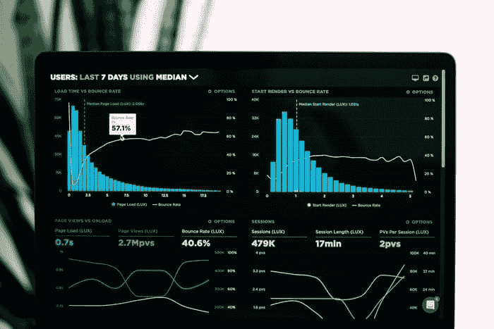
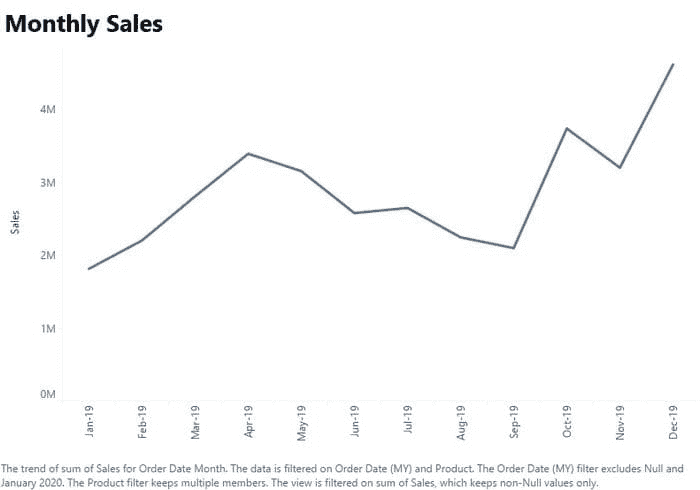
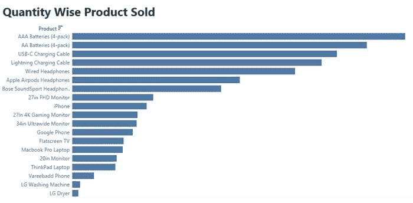
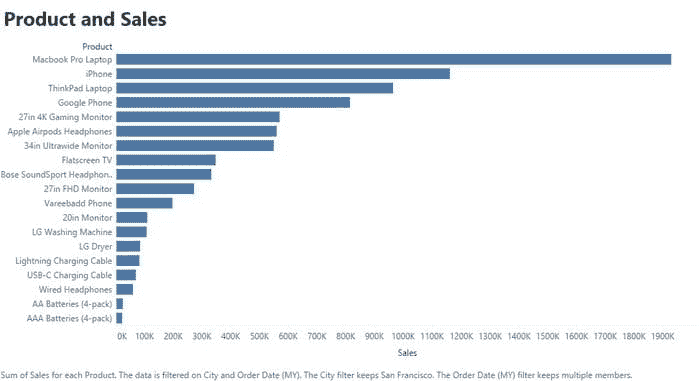
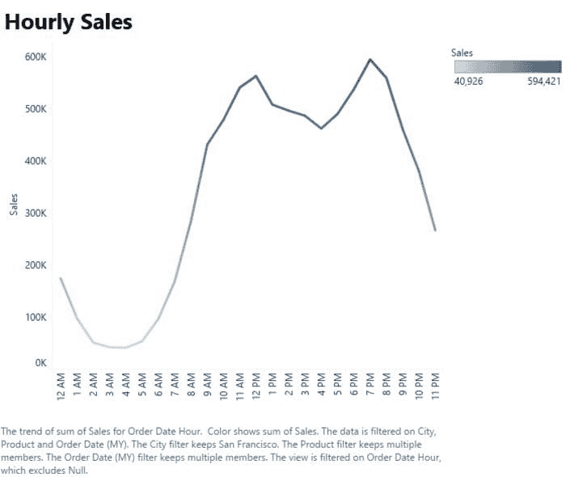
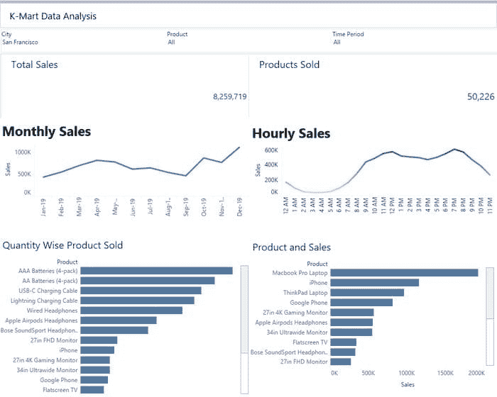

# 使用 Tableau 进行数据分析

> 原文：[`www.kdnuggets.com/2021/04/data-analysis-using-tableau.html`](https://www.kdnuggets.com/2021/04/data-analysis-using-tableau.html)

评论

**由 [Juhi Sharma](https://www.linkedin.com/in/juhi-sharma-ds/<code>)，产品分析师**

图片由 [Luke Chesser](https://unsplash.com/@lukechesser?utm_source=medium&utm_medium=referral) 拍摄，发布在 [Unsplash](https://unsplash.com/?utm_source=medium&utm_medium=referral)

### 介绍

Kmart 是美国领先的在线零售商，作为其年度销售审查会议的一部分，他们需要根据 2019 年销售数据的洞察决定 2020 年的销售策略。

数据与 2019 年每个月的销售有关，任务是生成关键洞察，以帮助 Kmart 的**销售团队**做出关键的业务决策，最终优化其销售策略。

### 数据理解

1.  数据属于 Kmart - 美国领先的在线零售商。

1.  时间段 — 2019 年 1 月 — 2019 年 12 月

1.  独特产品 — 19

1.  总订单 — 178437

1.  城市 — 9

1.  KPI — 总销售额，总产品销售量

来源-作者

### Tableau 工作表

来源：作者

2019 年销售最佳的月份是 12 月。12 月的总销售额为 $4619297。

来源：作者

2019 年销售了 31017.0 数量的 AAA 电池（4 包）。由于其是最便宜的产品，因此销售数量最多。

来源：作者

Macbook Pro 笔记本电脑的销售最高。

来源-作者

大约在晚上 7 点销售量最高。

### Tableau 仪表板

来源-作者

我们可以在仪表板上应用城市、产品和时间段的筛选器。

### 基于分析的商业建议

1.  公司应在 1 月和 9 月提供优惠和折扣，以增加 2020 年的销售额，因为这些月份在 2019 年的销售最低。

1.  Austin、Portland 和 Dallas 的销售额相比其他城市较少。公司应寻找原因以提升 2020 年的销售额。

1.  大约在中午 12 点和晚上 7 点展示广告是最合适的，以最大化客户购买产品的可能性。

1.  AAA 电池（4 包）在 2019 年的销售量最多。公司应注意 AAA 电池（4 包）的库存。

1.  公司可以根据 2019 年的洞察调整价格策略。

### 离开前

*感谢阅读！如果您想联系我，可以通过 jsc1534@gmail.com 或我的*[*LinkedIn 个人资料*](http://www.linkedin.com/in/juhi-sharma-ds)*与我联系。*

**简历： [Juhi Sharma](https://www.linkedin.com/in/juhi-sharma-ds/)** ([Medium](https://juhi95.medium.com/)) 热衷于通过数据驱动的方法解决商业问题，包括数据可视化、机器学习和深度学习。Juhi 正在攻读数据科学硕士学位，并拥有 2.2 年的分析师工作经验。

[原文](https://pub.towardsai.net/e-commerce-sales-strategy-using-tableau-ca69a7c910a)。经允许转载。

**相关：**

+   电子商务数据分析用于销售策略，使用 Python

+   Pandas Profiling: 一行魔法代码进行 EDA

+   TabPy: 结合 Python 和 Tableau

* * *

## 我们的三大课程推荐

 1\. [Google 网络安全证书](https://www.kdnuggets.com/google-cybersecurity) - 快速进入网络安全职业轨道

 2\. [Google 数据分析专业证书](https://www.kdnuggets.com/google-data-analytics) - 提升你的数据分析技能

 3\. [Google IT 支持专业证书](https://www.kdnuggets.com/google-itsupport) - 支持你的组织进行 IT 工作

* * *

### 更多相关主题

+   [使用 Tableau 创建高效的组合数据源](https://www.kdnuggets.com/2022/05/create-efficient-combined-data-sources-tableau.html)

+   [为有效的 Tableau 和 Power BI 仪表板准备数据](https://www.kdnuggets.com/2022/06/prepare-data-effective-tableau-power-bi-dashboards.html)

+   [10 个最常用的 Tableau 函数](https://www.kdnuggets.com/2022/08/10-used-tableau-functions.html)

+   [KDnuggets 新闻，8 月 3 日：10 个最常用的 Tableau 函数•是否…](https://www.kdnuggets.com/2022/n31.html)

+   [使用聚类分析对数据进行分段](https://www.kdnuggets.com/using-cluster-analysis-to-segment-your-data)

+   [SQL、Python、数据清理、数据处理和探索性数据分析的指南合集](https://www.kdnuggets.com/collection-of-guides-on-mastering-sql-python-data-cleaning-data-wrangling-and-exploratory-data-analysis)
