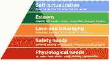

# 数据职业并**不是**一成不变的！揭示你在数据领域理想角色的技巧

> 原文：[`www.kdnuggets.com/2021/04/data-careers-not-one-size-fits-all.html`](https://www.kdnuggets.com/2021/04/data-careers-not-one-size-fits-all.html)

评论

**作者：[莉莉安·皮尔森](https://www.linkedin.com/in/lillianpierson/)，世界级数据领导者和企业家的导师，Data-Mania 首席执行官**

自从[哈佛商业评论](https://hbr.org/2012/10/data-scientist-the-sexiest-job-of-the-21st-century)在 2012 年称数据科学家为“21 世纪最性感的职业”以来，似乎每个人和他们的妈妈都在争先恐后地提升数据科学技能。

* * *

## 我们的前三名课程推荐

 1\. [谷歌网络安全证书](https://www.kdnuggets.com/google-cybersecurity) - 快速进入网络安全职业生涯。

 2\. [谷歌数据分析专业证书](https://www.kdnuggets.com/google-data-analytics) - 提升你的数据分析能力

 3\. [谷歌 IT 支持专业证书](https://www.kdnuggets.com/google-itsupport) - 支持你的组织的 IT 工作

* * *

理由很充分！数据科学家的需求不断增加，薪资远超美国国家平均水平，根据[2021 年罗伯特·哈夫技术薪资指南](https://www.roberthalf.com/salary-guide/technology)，美国数据科学家的中位数年薪为 129,000 美元。

但透过网络上的炒作，你是否**真的**应该追求数据科学家的角色？

通过指导数据专业人士，我注意到很多人进入数据科学领域时没有*彻底*研究它是否真正适合他们。他们做了大量工作以提升技能，却发现自己在数据科学职位上感到**痛苦**。

*我知道，因为我曾经是这样的人。*

我在 2012 年学习了数据科学技能，却意识到编码和构建数据解决方案**并**不能带给我我所寻找的满足感和幸福感。

到头来，数据科学的实施确实不适合我。我开始意识到，我需要做一些可以从工作中看到**真实的积极影响**的事情。

*那我做了什么呢？*

我从美国搬到泰国，创办了自己的数据业务 Data-Mania。让我告诉你，这真是**非常有趣**！

在你花费多年时间和精力追求数据科学之前，让我们先探索一些不同的选择。在数据的美妙世界中，有着无数的职业机会。

为了对最适合你的角色进行彻底分析，我们将考虑五个不同的因素：

+   当前技能

+   职业目标

+   个性

+   优先事项

+   激情

到本文结束时，你将对如何发掘你最终的数据梦想工作有一个明确的把握！

### 当前技能

首先，让我们分析一下你当前的技能。我发现大多数数据专业人士在一个主要领域都有扎实的技能。这些主要技能往往是：

+   数据分析技能

+   数据科学技能

+   数据工程

+   数据领导

**如果你倾向于分析，** 你擅长数据可视化、数据讲故事、仪表板设计——也许你在 Tableau 或 Power BI 中构建仪表板和可视化。你还能够使用 SQL 进行查询和检索数据。

**如果你倾向于数据科学，** 那么你有编程经验，并且掌握 Python 和 R。你对机器学习、预测建模、统计学和 SQL 有深刻的理解。

**如果你倾向于数据工程，** 你将具备 ETL 脚本编写和数据仓库的技能。随着你变得更加高级，你将会在分布式计算环境中工作，构建数据管道，维护数据系统，并使用 NoSQL。你还将懂得如何使用 C、C++、C#、Java、Scala 等语言进行编码，并设计利用 NoSQL 和 SQL 数据库的系统。

**如果你倾向于数据领导，** 那么你在领导项目和团队方面表现出色。你适合担任项目经理、产品经理或利益相关者管理等角色。你的超能力在于技术项目管理和数据战略领域！

### 职业目标

现在是时候思考你的大方向职业目标了。展望未来，你希望在数据职业生涯中达到什么位置？

*你是否希望成为聚光灯下的领袖，领导盈利的数据项目？*

*你是否希望在幕后编码和构建数据解决方案，但又希望有更多的自主权？*

*或者你是否希望建立自己的产品，为自己工作——而不必对任何人负责？*

因为这也是一种可能性！

### 个性

让我们聊聊个性类型。具体来说，你是内向还是外向呢？

如果你是内向型的，你会更愿意从事数据实施和编码工作。你会喜欢深入细节，而不受管理客户和团队成员的干扰。

如果你是外向型的，那么你在数据领导类型的角色中会表现得最好。你将能够运用你的沟通技巧来管理团队和项目，而不是自己亲自编写解决方案！

### 优先级

当我们谈论优先级时，我是指你职业生涯的哪个阶段。

根据你的阶段，你可能会有不同的优先级和需求。我喜欢通过 [马斯洛需求层次理论](https://www.simplypsychology.org/maslow.html) 来思考这一点。

马斯洛需求层次理论指出，所有人都有自我实现的愿望，但为了优先满足内心的满足感，我们需要首先满足最基本的需求。

来源：简单心理学 -- https://www.simplypsychology.org/maslow.html

这些需求是：

+   生理**需求**

+   安全**需求**

+   爱与归属**需求**

+   自尊**需求**

+   自我实现**需求**

重要的是按顺序照顾好这些需求。

*那么，这和你的数据职业有什么关系呢？*

好吧，在我们职业生涯的开始，刚刚从学校毕业，许多人还背负着学生贷款时，我们通常会着眼于满足最基本的需求（生理和安全）。我们的优先事项是拥有一个栖身之处，并达到一个稳定的财务状态。

但一旦我们在职业生涯中取得进展，我们的需求也会改变。我们开始渴望认可、赞誉、晋升——换句话说，就是我们的自尊需求。最终，当我们获得了金钱和赞美后，常常会发现自己在寻找更多。这是数据专业人士寻求真正满足感和更大影响力的阶段。

问问自己：你现在最渴望从数据职业中得到什么？是金钱？是自由和赞誉？还是希望产生影响？

例如，数据实施工作通常是确保健康收入的最快途径。成为数据创业者或领导者可能需要更多的前期工作，但长期的满足感可能更大！

### 激情

想一想你对数据最热衷的是什么。

我社区的大多数人被以下四个领域之一吸引：

1.  编码

1.  与业务咨询

1.  管理项目、产品和程序

1.  设想和即兴发挥。

问问自己——什么是你最喜欢的？什么给你带来最多的能量？

如果你喜欢编码，你肯定会想考虑数据实施角色。但如果你更倾向于管理项目、程序和产品或与业务咨询，那就考虑数据领导角色。如果创新更符合你的兴趣，那你可能有创业的天赋！

拥有数据技能的世界是你的舞台。没有必要仅仅因为数据科学是最受关注的技术职业之一就限制自己。通过深入了解你的个性、激情、目标和技能，你将能够找到一份不仅薪水优厚，而且从长远来看带来真正满足感的工作。

如果你喜欢了解不同的数据职业路径，你一定会喜欢我的免费 [数据超级英雄测验](https://www.data-mania.com/data-superhero-quiz/)! 你将揭示你内心的数据超级英雄类型，并获得与数据技能、个性和激情独特组合直接对接的个性化职业建议。

参加测验 [这里](https://www.data-mania.com/data-superhero-quiz/)

**简介： [莉莉安·皮尔森](https://www.linkedin.com/in/lillianpierson/)** 帮助数据专业人士转变为世界级的数据领导者和企业家。迄今为止，她已向超过 100 万名数据专业人士传授 AI 知识。自 2008 年以来，她还为包括美国海军、国家地理和沙特阿美在内的大型组织提供战略规划服务。

**相关：**

+   是什么让我花了这么长时间才找到数据科学家工作

+   数据科学简历中的 7 个必备要素

+   为何许多数据科学家辞去优秀公司中的好工作

### 更多相关内容

+   [是什么让 Python 成为初创企业的理想编程语言](https://www.kdnuggets.com/2021/12/makes-python-ideal-programming-language-startups.html)

+   [如果你想进入技术领域：成为软件开发人员](https://www.kdnuggets.com/if-you-want-to-get-in-the-tech-space-become-a-software-developer)

+   [数据科学家、数据工程师及其他数据职业解析](https://www.kdnuggets.com/2021/05/data-scientist-data-engineer-data-careers-explained.html)

+   [数据科学职业的现状](https://www.kdnuggets.com/2022/10/current-state-data-science-careers.html)

+   [KDnuggets 新闻，11 月 2 日：数据科学的现状…](https://www.kdnuggets.com/2022/n43.html)

+   [SAS 如何助力从业者职业飞跃](https://www.kdnuggets.com/2023/07/sas-help-catapult-practitioners-careers.html)
