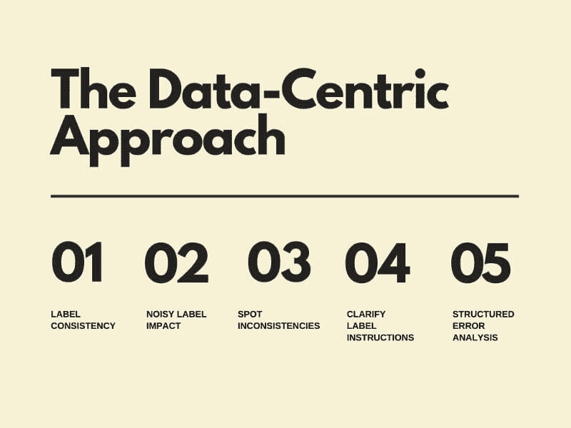

# 数据中心的人工智能：它是否真实？适合每个人吗？我们准备好了吗？

> 原文：[`www.kdnuggets.com/2022/03/data-centric-ai-real-everyone-ready.html`](https://www.kdnuggets.com/2022/03/data-centric-ai-real-everyone-ready.html)

图片来源：作者（在 Canva 上创建）

****简而言之；****

+   现代深度学习算法的兴起使世界不得不融入它的怀抱。

+   数据科学与人工智能的协同作用在行业巨头中正逐渐成为现实。

+   以数据为中心的人工智能正成为下一个重大趋势，我们应该做好准备！

* * *

## 我们的前三大课程推荐

 1\. [谷歌网络安全证书](https://www.kdnuggets.com/google-cybersecurity) - 快速进入网络安全职业生涯。

 2\. [谷歌数据分析专业证书](https://www.kdnuggets.com/google-data-analytics) - 提升你的数据分析技能

 3\. [谷歌 IT 支持专业证书](https://www.kdnuggets.com/google-itsupport) - 支持你在 IT 领域的组织

* * *

今年早些时候，日益增长的人工智能社区开始深入思考从以模型为中心的方法转向以数据为中心的人工智能开发的可能性。为了跟上围绕数据为中心的人工智能项目的动向，我们从全球行业领导者和智库中提取了有价值的信息。

# **以数据为中心的人工智能概念**

在过去的几十年里，人工智能发展的主导范式是模型或以软件为中心的方法。为了构建一个机器学习系统，你需要编写代码来实现你的算法和模型，然后利用这些代码进行数据训练，以提取有意义的洞见。在过去几十年里，我们大多数人下载了数据集，将数据集视为固定不变的，然后修改软件代码来理解数据。

尽管如此，近年来神经网络和其他算法取得了巨大的进步（得益于这种机器学习研究范式）。因此，许多应用程序的开源代码对某些人来说是一个有力的支持者，但对其他人却没有帮助。例如，[GitHub](https://github.com/ydataai/awesome-data-centric-ai)是一个很好的开源软件示例，对一些人来说非常实用，但对其他人则不然。你可能会好奇为什么会这样？嗯，系统的应用情况就在这里发挥作用！

# **以数据为中心的方法适合每个人吗？**

即使我们能够解决代码问题，考虑数据驱动的方法对你和我们所有人来说也更加有益。相反，我们应该将重点放在生成或创建正确的数据，以供学习算法使用。由著名计算机科学家和技术企业家 Andrew Ng 创办的 Landing AI，已经在计算机视觉领域的 MLOps 平台上工作了几年。Ng 是数据驱动概念的坚定信徒，也是深度学习爱好者。Ng 支持的概念在技术社区中获得了显著关注。数据科学与人工智能的协同概念正在行业巨头中实际应用。

# **数据驱动的人工智能可靠吗？**

数据驱动的人工智能的预测分析使其成为未来的*关键*！[社区](http://datacentricai.community/)的支持非常庞大，早期采用者也在不断增加。更有甚者，支持者开始鼓励他人参与并在实践中适应这一概念。

每当人工智能采用或提出新的技术方法时，通常是少数专家凭直觉进行实践。

例如，深度学习的兴起。长期以来，只有少数人以非常原始和手动的方式用 C++编写神经网络。最终，神经网络的理念变得更加广泛，许多人开始用 C++编写神经网络。大约在 2015/2016 年间，深度学习框架如 TensorFlow 和 PyTorch 被引入，使这些理念的应用变得更系统、更少出错。对于数据驱动的人工智能，已经有很多人凭直觉进行了多年实践。

对这一概念的广泛接受和支持预计将上升并主导机器学习生态系统。技术爱好者现在能够直观地工程化语音和自然语言处理数据。数据驱动的人工智能正成为下一个大事，我们应该为此做好准备！

曾经被视为徒劳无功的事情现在正成为现实！

# **世界是否准备好接受数据驱动的方法？**

现代深度学习算法的兴起迫使世界接受这种方法。对于专家来说，理解算法的复杂方式使他们更容易专注于数据。

现在，代码已经更加成熟，并预计会迅速发展。

随着概念的快速发展变得迫在眉睫，概念的实际应用变得对业务生存至关重要。我们即将享受到使用成熟工具的动手经验，使这些理念的应用变得更加可重复、顺畅和系统化。

机器学习、人工智能和人类 由[Freepik.com](https://www.freepik.com/free-photo/man-wearing-smart-glasses-touching-virtual-screen_15840781.htm#query=artificial%20intelligence&position=9&from_view=search)

# **如何为数据驱动的方法做好准备**

现在开始为数据驱动的方法做好准备是明智的！Ng 分享了五个数据驱动人工智能开发的顶级技巧，旨在帮助技术社区应对技术进步的冲击：

+   标签一致性

+   噪声标签影响

+   发现不一致之处

+   澄清标签说明

+   结构化错误分析

有时，处理数据，或者简单地说数据清理，被视为一个预处理步骤。你可能听到过类似的说法！但在数据驱动的人工智能方法下，改进数据不仅仅是你做一次的预处理步骤。这是一个真正的重复算法训练和学习的工作。

数据改进是模型开发迭代过程的核心部分。专家认为，最佳实践是在多次开发和部署后监控和维护模型。系统地持续改进数据也是部署、监控和维护的核心部分。

*但在数据驱动的人工智能方法下，改进数据不仅仅是你做一次的预处理步骤。这是一个真正的重复算法训练和学习的工作。数据改进是模型开发迭代过程的核心部分。*

训练只是机器学习模型生命周期的一小部分。获取和准备高质量数据占据了机器学习过程的 80%；而训练部分则占据剩下的 20%。但这并不意味着训练部分比后者重要性低。

在学术研究和工业应用中，机器学习的训练方面具有重要意义。调查和研究表明，标签和数据注释对于准确和创新的人工智能至关重要，以及获取补充或外部数据，甚至生成新的数据——[合成数据](https://github.com/ydataai/ydata-synthetic)。

# **我们将走向何处？**

机器学习领域的顶尖人物正将我们的注意力引向系统化数据工作的意义。在未来几年，世界将见证机器学习生态系统的范式转变。我们有一点是确定的；2010 年代专注于模型改进；而 2020 年代将专注于**数据**。

# **如何开始？**

数据驱动的人工智能正在开创未来的发展，将有限的数据集转化为从概念到生产整合人工智能的运营和商业价值。我们相信这是实际情况；我们认为现在是通过与[数据驱动的人工智能社区](https://datacentricai.community/)、[资源](https://github.com/ydataai/awesome-data-centric-ai)、行业领袖、智库和思想领袖合作，开始学习和采用这一概念的时候了。

**[戈恩萨洛·马丁斯·里贝罗](https://www.linkedin.com/in/gmartinsribeiro/)** 是一位产品构建者，对初创企业和技术充满热情。他拥有计算机科学背景，但后来在管理领域发展自己。在初创企业和大型企业中构建了产品，领导过开发团队，现在正在为数据科学制定新标准，通过帮助公司变得以数据为中心并采纳有效的 AI。

### 更多相关话题

+   [设备上的 AI 与开发者准备好软件栈](https://www.kdnuggets.com/2022/03/qualcomm-ondevice-ai-developer-ready-software-stacks.html)

+   [MLOps 思维模式：始终准备好生产](https://www.kdnuggets.com/2023/07/mlops-mindset-always-productionready.html)

+   [30 天内成为工作准备好的 4 个认证](https://www.kdnuggets.com/4-certifications-to-become-job-ready-in-30-days)

+   [实时 AI 和机器学习的特征存储](https://www.kdnuggets.com/2022/03/feature-stores-realtime-ai-machine-learning.html)

+   [现实世界中 NLP 应用的范围：一种不同的…](https://www.kdnuggets.com/2022/03/different-solution-problem-range-nlp-applications-real-world.html)

+   [实时 AI 翻译](https://www.kdnuggets.com/2022/07/realtime-translations-ai.html)
