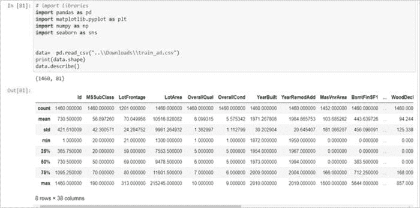
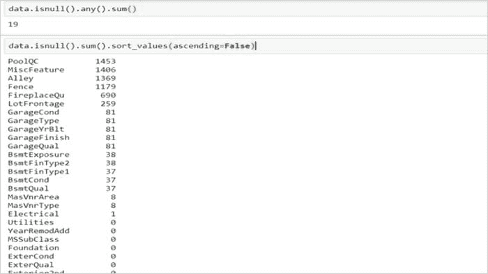
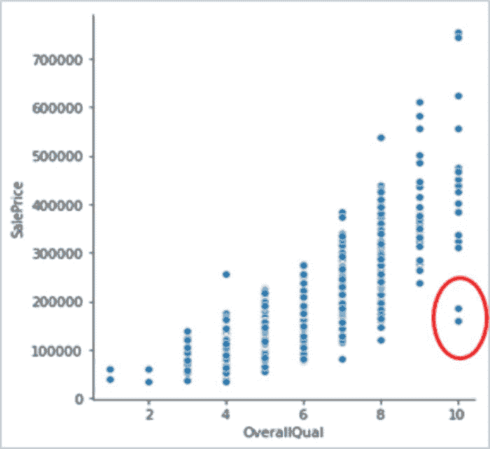
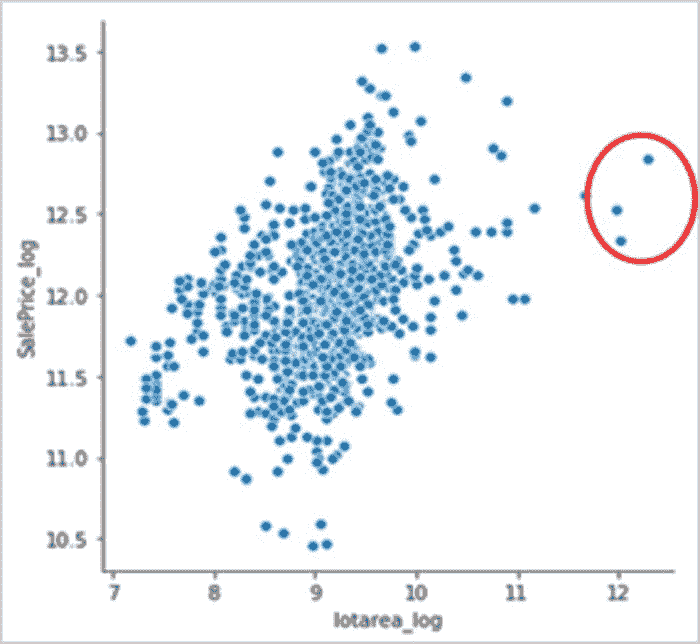
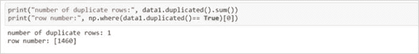
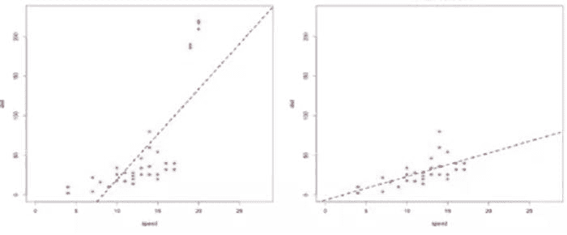

# 数据清洗：任何数据科学项目成功的秘密成分

> 原文：[`www.kdnuggets.com/2020/07/data-cleaning-secret-ingredient-success-data-science-project.html`](https://www.kdnuggets.com/2020/07/data-cleaning-secret-ingredient-success-data-science-project.html)

评论

**由[瑜吉塔·金哈](http://www.linkedin.com/in/yogita-kinha)，顾问和博主**

在之前的几篇博客中，我们看到如何使用统计方法和可视化工具总结和分析数据。但原始数据需要处理才能转换为可用的格式。数据准备是数据科学中最重要和最初步的部分。这涉及数据预处理和数据整理。

* * *

## 我们的前三大课程推荐

 1\. [Google 网络安全证书](https://www.kdnuggets.com/google-cybersecurity) - 快速进入网络安全职业生涯

 2\. [Google 数据分析专业证书](https://www.kdnuggets.com/google-data-analytics) - 提升您的数据分析技能

 3\. [Google IT 支持专业证书](https://www.kdnuggets.com/google-itsupport) - 支持您的组织在 IT 方面

* * *

原始数据来自各种来源，通常不适合分析。例如，可能会有许多购物者的条目导致重复，或者在记录客户的电子邮件地址时可能会有拼写错误，或者一些调查问题可能被调查者遗漏了。使用未经清理的数据集，无论您尝试什么类型的算法，都不会得到准确的结果。这就是为什么数据科学家会花费大量时间进行数据清洗。

### **更好的数据胜过更复杂的算法。**

尽管数据清洗的步骤和技术会因数据集的不同而有所不同，但以下步骤可以作为任何数据集类型的标准方法：

1.  识别相关数据并移除不相关数据

1.  修复不规则的基数和结构错误

1.  异常值

1.  缺失数据处理

正如在[博客](https://www.edvancer.in/descriptive-statistics-for-data-science/)中讨论的，运行基础的描述性统计测试可以初步检查数据的缺失值、特征的变异性、特征的基数。

图 1：汇总统计

图 2：检查空值  

图 3：异常值用红色突出显示

### 识别相关数据并移除不相关数据

主要有两个检查应该进行，以识别不相关数据：

**1\. 重复条目**

数据通常从多个来源收集并合并形成一个数据集。这可能导致观察值的重复。如果观察值（数量较少）重复几次可能不会有问题，但如果观察值重复过多，可能会导致错误行为。因此，最好删除重复的观察值，以获得更干净的数据集。

**2\. 无关观察值**

数据集中可能包含对特定任务没有用的观察值。例如，如果你分析的是女性的购物行为，你将不需要数据集中男性的观察值——按行处理。

同样，你的数据可能有一个员工 ID 或姓名的列，这对预测帮助不大，可以删除——按列处理。

### 修复不规则的基数和结构性错误

1.  删除具有 1 个基数的列（对于类别特征），或方差为零或非常低的列（对于连续特征）。这些特征提供的信息有限，对于构建预测模型不够有用。

1.  类别列可能由于拼写错误或不一致的大小写而具有许多类。例如，性别列可能有许多类，如 male、female、m、f、M 和 F，这些仅代表两个水平——男性和女性。这些类应映射到适当的水平，其他水平应删除。条形图可用于突出显示此类问题。

1.  确保数据以正确的数据类型表示，即数字以 int/float 存储，日期作为日期对象。

可能存在许多问题，如特征值中的空格，特征中的数据可能有混合的数据类型，例如一个数值列中可能有一些数字是数字格式，有些是字符串或对象。修复这些错误将导致数据集更加干净、易于解释和使用。

### 离群值

在之前的[博客](https://www.edvancer.in/data-visualisation-descriptive-statistics)中，我们讨论了识别离群值的方法。总结来说，如果数据点位于以下位置，可以将其视为离群值：

1.  高于**Q3 + 1.5*IQR**或低于**Q1 - 1.5*IQR**，如果数据遵循非高斯分布

1.  如果数据遵循高斯分布，则离特征均值 2 或 3 个标准差（z-score）。

1.  通过绘制箱线图、直方图或散点图（如图 3 所示）可视化单变量变量。

这些方法适用于对单变量或双变量（散点图）变量的初步分析，但对多变量数据或高维数据的价值不大。在这种情况下，应该利用先进的方法，如聚类、主成分分析（PCA）、局部离群因子（LOF）和高对比度子空间（HiCS）用于基于密度的离群值排名。

### 处理离群值的方法

**1\. 保留还是修剪**

我们不应随意丢弃任何观察数据，因为这些信息可能对理解数据中的异常行为或异常现象非常有价值，除非我们确定这些离群点可能是由于测量误差，或者这些离群点的存在影响了模型的拟合。

图 4：在有离群点的情况下（左图），回归线似乎受到顶部极端点的影响。而在没有离群点的情况下（右图），回归线在去除极端点后更好地拟合了数据。

**2. Winsorising 或修剪转换：** Winsorising 用最近的非怀疑数据替换离群点。这也被称为修剪转换，因为我们将所有高于上限和低于下限的值修剪为这些阈值，从而限制离群点的值：

其中 *fi* 是特征 *f* 的具体值，lower 和 upper 是下限和上限，由上文讨论的 IQR 方法或 z-score 给出。

推荐在怀疑模型由于离群点的存在表现不佳时应用修剪转换。评估 Winsorising 影响的更好方法是比较在应用和未应用转换的数据集上训练的不同模型的性能。

**3. 使用对离群点稳健的算法**

基于树的算法和提升方法对离群点不敏感，因为它们使用的递归二叉分割方法固有的特性。这些算法在输入特征中存在离群点时是最好的选择。

如果目标变量中存在离群点，基于树的算法表现较好，但必须小心选择损失函数。原因是，如果我们使用均方误差函数，则差异会被平方，从而会极大影响下一个树，因为提升尝试拟合（损失的梯度）。然而，有更多稳健的错误函数可以用于提升树方法，如 Huber 损失和平均绝对偏差损失。

数据清理、描述性统计和探索性数据分析是数据科学生命周期中非常重要的部分。理解数据对于获得有关人口行为的高级见解至关重要，这也帮助你决定是否需要应用哪些转换，以及哪些算法能为你的特定业务问题提供最佳结果。

我们将在下一个博客中讨论如何处理缺失值。

**参考文献：**

[`www.r-bloggers.com/outlier-detection-and-treatment-with-r/`](https://www.r-bloggers.com/outlier-detection-and-treatment-with-r/)

*最初发布于* [*https://www.edvancer.in*](https://www.edvancer.in/data-cleaning) *2019 年 6 月 26 日。*

**简介：[Yogita Kinha](http://www.linkedin.com/in/yogita-kinha)** 是一位在 R、Python、机器学习以及统计计算和图形软件环境方面拥有经验的专业人士，具有 Hadoop 生态系统的实际操作经验，并在软件测试领域有测试与报告的经验。

[原文](https://medium.com/limitedio/data-cleaning-the-secret-ingredient-to-the-success-of-any-data-science-project-e42d5e0df05a)。经授权转载。

**相关：**

+   如何处理数据集中的缺失值

+   如何准备你的数据

+   选择合适机器学习算法的简易指南

### 更多相关主题

+   [NExT-GPT 介绍：任何到任何的多模态大语言模型](https://www.kdnuggets.com/introduction-to-nextgpt-anytoany-multimodal-large-language-model)

+   [GPT-4: 一机多模，秘密揭晓](https://www.kdnuggets.com/2023/08/gpt4-8-models-one-secret.html)

+   [HuggingGPT: 解决复杂 AI 任务的秘密武器](https://www.kdnuggets.com/2023/05/hugginggpt-secret-weapon-solve-complex-ai-tasks.html)

+   [LLMOps 入门：无缝互动的秘密调料](https://www.kdnuggets.com/getting-started-with-llmops-the-secret-sauce-behind-seamless-interactions)

+   [如何在没有工作经验的情况下获得你的第一份数据科学工作](https://www.kdnuggets.com/2021/02/first-job-data-science-without-work-experience.html)

+   [在参加任何免费数据科学课程之前请阅读此文](https://www.kdnuggets.com/read-this-before-you-take-any-free-data-science-course)
