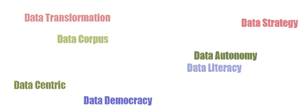

# 数据无处不在，它驱动着我们所做的一切！

> 原文：[`www.kdnuggets.com/2020/08/data-everywhere-powers-everything.html`](https://www.kdnuggets.com/2020/08/data-everywhere-powers-everything.html)

评论

**由 [Pradeep Adaviswamy](https://www.linkedin.com/in/pradeepadaviswamy/) 提供，Bahwan CyberTek 的区域分析经理**

> * * *
> 
> ## 我们的前三大课程推荐
> ## 
>  1\. [Google 网络安全证书](https://www.kdnuggets.com/google-cybersecurity) - 快速进入网络安全职业的快车道。
> 
>  2\. [Google 数据分析专业证书](https://www.kdnuggets.com/google-data-analytics) - 提升您的数据分析能力
> 
>  3\. [Google IT 支持专业证书](https://www.kdnuggets.com/google-itsupport) - 支持您的组织 IT
> 
> * * *
> 
> 大自然赋予了我们火、水、空间、空气和土地这五大元素或资源，现在我们需要将数据也加入到这个列表中。

自然也通过 DNA 处理自身的数据集，并且这些数据是有机组织的。现在我们有责任有效地利用我们拥有的数据。

我们都在大量生成数据，现在组织面临的挑战是策划和货币化这些数据，以便在市场上变得具有竞争力，实现生存，并为其产品和服务带来创新和盈利。

在本文中，我希望重点讨论公司如何启动以数据为中心的策略，以及如何在数据转型过程中取得成功。

一些组织拥有正确的“成分”（数据），他们需要提出正确的洞察以便利用这些数据；而另一些组织则拥有正确的用例，他们需要找到正确的“成分”（数据）来解决和实现这些用例。这两种方法都有效，关键在于他们的数据战略的整体成功，以实现最终的商业目标和目的。

数据货币化是新的全球经济，无论是老牌公司、大公司、小公司还是初创公司，都必须智能地捕获、存储、处理和消费数据。这必须是一个持续的反馈循环数据周期。有大量的工具和技术可以处理这个数据周期，但成功取决于组织的方向和治理。

行业研究和实地经验表明，永远不要采用“大干快上”的方法（‘大思考，小开始’），在建立企业数据项目时，始终设立临时检查点。组织不应认为拥有大数据/数据湖设置或人工智能实验室就能解决所有的数据分析需求。

如果公司采用以数据为中心的架构方法，并有一个全面的管理机构，那么将会繁荣，否则，仅仅拥有数据湖/中心是无法带领公司前进的。数据湖必须得到维护、策划和保护等，不能仅仅被视为企业数据存储解决方案，否则数据将会过时。

公司应始终致力于制定数据战略，这些数据战略应促进数据治理的民主化和企业数据素养，这可以成为整体业务绩效的催化剂，赋能用户，并带来自主性。

组织不应鼓励团队走捷径，只追求眼前的成功（如果他们的整体愿景是长期的）。我将这种处理数据的捷径过程称为***'数据乱穿马路'***。如果公司想要进行商业智能、分析或数据科学，业务单元的领导应确保数据工程师、分析师和数据科学家不采取任何不科学的捷径。他们应避免在执行任务和构建 AI 模型时出现盲点。整体成功不应仅通过概念验证（PoC）或 AI 实验室原型结果来衡量，而应通过大规模部署和对业务及最终用户的影响来衡量。

数据领导者（如首席信息官、首席数据官、首席分析官等）应始终提出正确的数据问题，参与并监督数据策划、数据准备阶段及审查，以建立一个强大的组织数据语料库。这将为分析、数据科学/AI 模型构建和部署打下基础，同时与 AI 模型治理相结合。

一旦数据语料库准备好，组织可以获得合适的工具来构建和获取洞察。在数据分析的过程中，组织可能会遇到一些困难，比如在将数据策略付诸实践时可能面临的挑战（例如，挑战可能来自架构、数据基础设施、能力、运行成本、业务用户的期望、人员等）。这些挑战必须尽早解决和克服。

公司必须把数据视为其增长的关键，以便保持竞争力、变得更加智能、创新，并为任何无法预见的市场惊喜做好准备。

希望这篇文章的内容对你有帮助，并与你的经验和想法产生共鸣？欢迎分享你的想法、反馈和评论。

**简介：[Pradeep Adaviswamy](https://www.linkedin.com/in/pradeepadaviswamy/)** 是 Bahwan CyberTek 的区域分析经理。他在解决方案设计与架构、大数据、商业智能、数据科学与分析、企业数据湖、数据管理与数据治理（DMBoK）、ETL、数据仓库、数据建模、数据可视化和人工智能等方面拥有约 17 年的经验。

[原文](https://www.linkedin.com/pulse/data-everywhere-powers-everything-we-do-6th-element-adaviswamy/)。经许可转载。

**相关：**

+   每位数据科学家需要向商业领袖学习的内容

+   向您的大数据提出的 3 个关键数据科学问题

+   数据分析中的 5 大趋势

### 更多相关话题

+   [KDnuggets 新闻，4 月 13 日：数据科学家应关注的 Python 库…](https://www.kdnuggets.com/2022/n15.html)

+   [全栈一切？数据科学、开发与技术的组织交集](https://www.kdnuggets.com/2022/08/full-stack-everything-organizational-intersections-data-science-dev-tech.html)

+   [关于数据湖屋的一切你需要知道的](https://www.kdnuggets.com/2022/09/everything-need-know-data-lakehouses.html)

+   [KDnuggets 新闻，9 月 14 日：免费数据科学 Python 课程•…](https://www.kdnuggets.com/2022/n36.html)

+   [成为 SAS 认证数据科学家所需的一切](https://www.kdnuggets.com/2023/09/sas-everything-need-become-sas-certified-data-scientist)

+   [你想知道的所有机器学习知识](https://www.kdnuggets.com/2022/09/everything-youve-ever-wanted-to-know-about-machine-learning.html)
