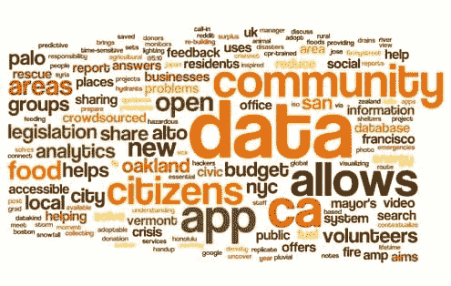
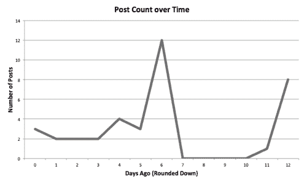

# 数据善用：以数据驱动的社会公益项目

> 原文：[`www.kdnuggets.com/2014/07/data-for-good-data-driven-projects-social-good.html`](https://www.kdnuggets.com/2014/07/data-for-good-data-driven-projects-social-good.html)

**由 Grant Marshall 撰写，2014 年 7 月**

[数据善用](http://dataforgood.co/)是一个新的非盈利组织，旨在展示那些更具利他主义的数据科学项目和资源。通过类似 Hacker News 或 Reddit 的格式，用户可以提交相关网站的链接，展示数据科学如何提供社会公益。发布到数据善用上的项目应对更广泛的受众友好，旨在向政府决策者展示数据能为他们做些什么。

图 1：数据善用项目标题的词云

网站上展示的项目种类繁多，涵盖了从 API、视频到展示城市如何利用数据平衡预算的报告等多个主题。如上所示，项目的重点是赋权“市民”或回馈“社区”。这些以社会为导向的术语主导了发布到网站上的项目标题，表明网站正致力于推广旨在提供社会公益的数据科学项目。

例如，网站首页上现在的[危机网络](http://www.dataforgood.co/posts/jyYRGoFxq42G4nh5g)是一个用于从多个来源以单一标准格式访问危机数据的 API。另一个适合发布到数据善用的例子是[这个视频](http://www.dataforgood.co/posts/eZBQuzsQSdEsW8TwJ)，展示了数据分析办公室如何利用数据科学解决纽约市非法油脂处理的问题。

图 2：数据善用过去两周的帖子数量

如上图所示（创建于 2014 年 7 月 22 日），尽管第一周的帖子数量每日不稳定（这些帖子主要来自两个独立用户），但在过去几天中，每日的帖子数量已经趋于稳定。此外，帖子现在来自各种用户，显示出该网站开始形成更为活跃的社区。这对网站来说是一个好兆头，希望这种社区参与的趋势能持续下去。

该项目恰逢数据科学提供社会公益的一个非常吉利的时机，KDD 2014 的主题是[社会公益的数据科学](http://www.kdd.org/kdd2014/program.html)，而[DataKind](http://www.datakind.org/)则致力于将数据科学家与 NGO 连接起来以实现社会公益。将数据科学应用于改善社会的兴趣似乎正在上升。

总的来说，Data for Good 正在承担展示数据对社会能做什么这一崇高使命。如果他们继续成长，并且围绕该网站形成社区，Data for Good 可能会发展成为一个宝贵的资源，用于发现数据科学社区中面向社会的科学家所需的机会和资源。

**相关内容：**

+   KDD Cup 2014 – 预测 DonorsChoose.org 上的兴奋度

+   比尔及梅琳达·盖茨基金会资助：为社会公益提供大数据

+   美国开放数据行动计划及数据集

### 更多相关主题

+   [Django 框架中的社交用户认证](https://www.kdnuggets.com/2023/01/social-user-authentication-django-framework.html)

+   [数据质量：好、坏与丑]https://www.kdnuggets.com/2022/01/data-quality-good-bad-ugly.html)

+   [良好数据科学项目文档的 5 条规则](https://www.kdnuggets.com/2022/12/5-rules-good-data-science-project-documentation.html)

+   [什么时候集成技术是一个好选择？](https://www.kdnuggets.com/2022/07/would-ensemble-techniques-good-choice.html)

+   [什么使得可视化效果好？](https://www.kdnuggets.com/2022/10/sphere-makes-visualization-good.html)

+   [你的特征重要吗？这并不意味着它们是好的](https://www.kdnuggets.com/your-features-are-important-it-doesnt-mean-they-are-good)
