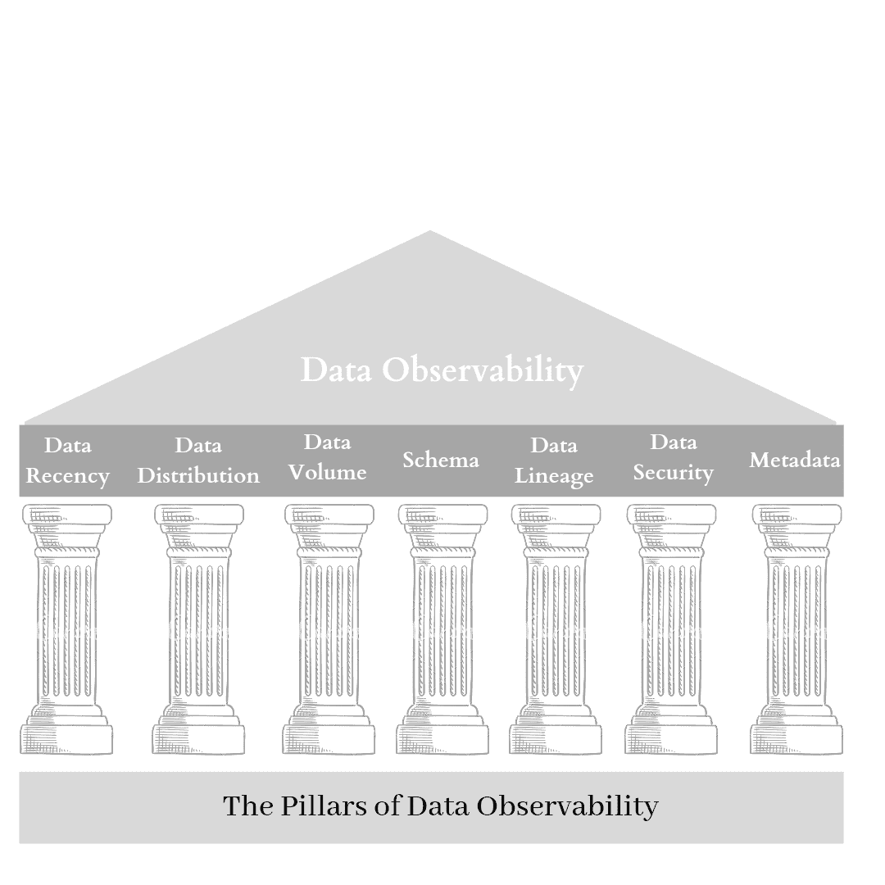
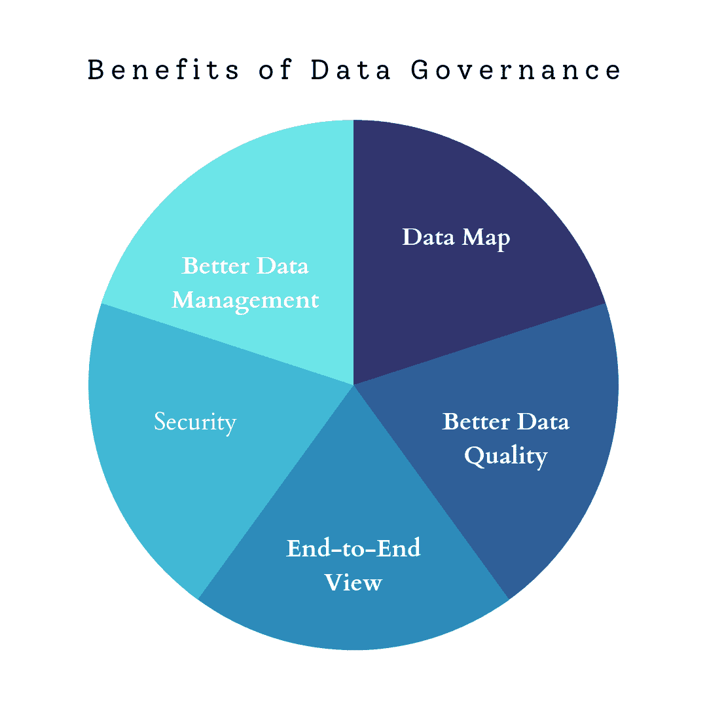

# 数据治理与可观测性，解读

> 原文：[`www.kdnuggets.com/2022/08/data-governance-observability-explained.html`](https://www.kdnuggets.com/2022/08/data-governance-observability-explained.html)

数据治理和数据可观测性在组织中越来越受到采用，因为它们构成了一个详尽却易于操作的数据管道的基础。两三年前，组织的目标是创建足够的概念验证，以赢得客户对基于 AI 产品的信任，即使是一个简单的 AI 功能也会成为区分因素。它可以轻松地在竞争中占据优势。

然而，在今天的环境中，基于 AI 的功能已成为话题，并且成为保持竞争力的必要条件。这就是为什么今天的组织关注于建立一个坚实的基础，以使数据解决方案与常规软件的生产一样无缝且高效。

* * *

## 我们的三大课程推荐

 1\. [谷歌网络安全证书](https://www.kdnuggets.com/google-cybersecurity) - 快速进入网络安全职业生涯。

 2\. [谷歌数据分析专业证书](https://www.kdnuggets.com/google-data-analytics) - 提升你的数据分析技能

 3\. [谷歌 IT 支持专业证书](https://www.kdnuggets.com/google-itsupport) - 支持你的组织 IT

* * *

因此，让我们深入了解数据可观测性和数据治理的来龙去脉，这两个是建立更强大数据基础的关键。

# 数据可观测性是什么？

**数据可观测性**是一个相对较新的术语，它解决了保持不断增长的数据可控的需求。随着创新的增长和在企业界的广泛采用，托管数据解决方案的技术栈变得更加高效。但与此同时，它们也变得更加复杂和精细，这使得它们难以维护。

组织面临的最常见问题是数据停机。**数据停机**是指数据不可靠的期间。这可能表现为数据错误、不完整数据或不同来源之间的数据差异。没有可靠的数据，就没有希望实现最先进的解决方案。

这就是数据可观测性发挥作用的地方，使数据维护变得可管理。这种新兴的需求催生了可观测性工程这一新兴领域，该领域有三个高级组件。简单来说，这些组件是数据可观测性用于聚合数据的格式：

+   **指标：** 指标是对在特定时间范围内测量的数据的累积度量。

+   **日志：** 日志是记录在不同时间点发生的事件。

+   **追踪：** 追踪是分布式环境中相关事件的记录。

## 为什么数据可观测性是必要的？

数据可观测性提供了预测数据行为和异常的额外优势，这有助于开发者提前设置资源和准备。数据可观测性的关键能力在于找出导致记录数据性能的根本原因。例如，如果欺诈检测模型的敏感度评分相对较低，数据可观测性将深入分析数据，探究***为什么***评分相对较低。

这一能力至关重要，因为与普通软件中大多数结果受代码控制不同，在机器学习软件中，大多数结果超出了解决方案的控制范围。这是因为数据是独立因素，只需一个异常事件就能使解决方案失效。一个这样的数据中断例子是疫情，它扰乱了就业率、股票趋势、投票行为等。

同样，很可能一个在某个数据组（例如，某个州的数据）上表现 consistently 的解决方案在另一个数据组上表现糟糕。

因此，了解性能背后的***为什么***在评估任何数据解决方案的输出时成为首要任务。

## 数据可观测性如何不同于数据监控？

可观测性通常被称为监控 2.0，但它是监控的一个更大的超集。可观测性更像是工程师的助手，通过考虑系统的深层状态来确定系统是否按预期工作。让我们回顾一下几个区分可观测性与监控的要点：

### 上下文

可观测性不仅仅跟踪/监控系统中的脉冲。它还考虑到那些影响系统功能的脉冲的上下文。

### 深度

监控跟踪系统的表面层脉冲以了解性能。相比之下，可观测性记录痕迹（或相关事件），建立必要的联系，并总体跟踪系统的深层内部状态。

### 行动

尽管监控的输出主要是反映系统性能或资源消耗的数字，但可观测性的输出则是行动建议。例如，监控会指出系统已经消耗了 100 GB 的内存。相比之下，可观测性会说明内存消耗是否不理想，以及是否需要开发者的干预来进行优化。

## ML 监控与 ML 可观测性

可观测性已经是 DevOps 框架的一部分很长时间了。然而，在 MLOps 社区中，对其需求也越来越明显。此外，随着数据变得更加复杂，数据管道变得更复杂且难以跟踪。因此，当我们将可观测性融入机器学习世界时，定义 ML 监控和 ML 可观测性之间的关键区别是重要的。

观察能力的核心要素在 ML 观察能力中从头到尾得到体现。ML 监控仅收集关于解决方案的高级输出或成功指标的数据，如敏感度和准确性。之后，它会根据预设的阈值发送警报。

另一方面，ML 观察能力深入探讨记录的性能背后的原因。最后，通过评估数据行为，关联验证、测试和传入数据的见解，找出根本原因。

## 数据观察的支柱

数据观察力是几个关键特性或支柱的总和，这些支柱并行运行以改善数据健康：

图 1：数据观察的支柱 | 图片由作者创建

### 数据新鲜度

如广泛所知，**任何 ML 解决方案都不及数据的好坏**。因此，确保数据的新鲜性至关重要，因为旧的和不相关的数据会对组织的资源、硬件和劳动力造成负担。数据观察力寻求提供最佳路径来更新数据表，并帮助决定更新的最佳频率。

### 数据分布

数据分布是 ML 最基本的概念之一，因此被高度认为是数据观察力的支柱之一。数据分布是了解手头的数据是否在期望范围内的一种方式。换句话说，它是检查数据采样是否正确的方式。

### 数据量

正如其名，数据量只是跟踪数据的进出交易量。因此，应跟踪数据量的突然变化，并确保所有可用数据源的正常运行。

### 架构

架构是数据存储的框架。每个数据架构都被组织中的多个团队访问，每个团队具有不同的访问级别（编辑、查看等）。因此，数据的变化是不可避免的，必须通过适当的数据版本控制设施进行跟踪。需要记录谁进行了更改、何时进行更改以及为什么进行更改。此外，同时进行的更改如果架构没有能力处理这种情况，可能会导致数据不一致。

### 数据沿袭

数据沿袭，简单来说，就是数据的故事。它叙述了数据从 A 点到 B 点的过程。这是由于传入数据源的变化、架构中数据处理的差异，还是人工更改？一个强大的数据沿袭可以回答这些问题及更多问题。跟踪数据沿袭的主要目标是准确了解在数据出现问题时需要关注的地方。由于机器学习管道因涉及多个实验而复杂，[实验跟踪](http://layer.ai) 工具和平台在理解数据在多个实验、模型和数据版本中的使用和历程时非常有用。

### 数据隐私和安全

如前所述，数据访问通常因团队和个人而异。数据安全和隐私是确保数据健康的一些主要指标。数据更新中的一个新手错误或数据落入错误之手可能会破坏整个数据谱系，并对组织造成巨大的成本。

### 元数据

元数据是关于数据的信息。作为数据监控的超集，数据可观察性不仅仅查看数据以追踪干扰的根本原因，还观察元数据以发现数据变化的趋势。 [元数据存储](http://layer.ai)确保每个关键机器学习阶段的元数据被跟踪和存储，以易于阅读和访问的方式建立可靠且可重复的机器学习管道。

数据可观察性的支柱在构建和管理公司数据骨干的基础时至关重要。

## 一种良好的数据可观察性解决方案如何帮助您的组织？

在选择数据可观察性解决方案时，必须牢记数据可观察性的支柱。一个好的解决方案可以显著改善组织的数据生态系统健康。良好的解决方案改变组织动态的一些方式包括：

### 主动避免数据问题

由于数据可观察性通过元数据和性能检查跟踪数据行为的变化，它可以提前警告机器学习工程师，以防止关键数据情况的发生，并采取主动修复措施。

### 映射的辅助

一个好的数据可观察性解决方案不需要被告知它需要监控哪些指标。事实上，借助机器学习模型，它可以帮助识别关键指标、依赖关系、变量、进出资源。 [元数据存储和实验跟踪](http://layer.ai)功能对于保持高清晰度的映射是必需的。

### 监控静态数据

监控静态数据时，不需要将数据加载进来。这可以通过节省内存、处理器和时间等资源来节省大量成本。这也使得数据解决方案在不妥协性能的情况下变得可扩展。

### 背景

数据可观察性的关键能力之一是通过追踪和建立数据与结果之间的适当联系来找到根本原因。当你拥有一个 AI 助手，它指出某一特定行的错误及其原因时，它将背景带入视图，并使数据问题的修复更加迅速。

### 安全性

安全性，作为数据可观察性的支柱之一，自然是一个关键关注点，因为它可能在数据中造成巨大干扰。因此，数据可观察性确保了最佳的安全性和合规性。

### 自动配置

数据可观察性解决方案使用 ML 模型评估数据、元数据和 ML 解决方案，以确定环境、关键指标和潜在危机（如性能下降低于特定阈值）的因素。因此，它消除了维护和处理几乎总是变化的复杂规则的需求。

### 轻松适配

一个好的数据可观察性解决方案是灵活的，并且可以轻松集成到现有的 ML 堆栈中。除非 ML 堆栈组织较差，否则团队无需进行任何更改或重写模块。这很好，因为它节省了许多资源。它还允许评估不同的解决方案，并快速找到合适的解决方案。

数据可观察性是一个广阔的领域，上述要点仅涉及常见问题。因此，让我们深入探讨数据治理，看看它如何适应创建完美的数据管道。

# 什么是数据治理？

**数据治理**是一套标准和规则，旨在维护整个数据管道中的数据质量。由于 AI 和 ML 等新兴技术在很大程度上依赖于数据这一独立变量，因此认证数据质量至关重要。

重要的是要注意，数据治理不是数据管理，而是围绕最佳执行建立策略和政策，并分配适当的角色和职责。

## 数据治理的好处

在如今数据解决方案竞争日益激烈的环境中，数据治理是必不可少的。以下好处将更好地说明为什么如此：

图 2：数据治理的好处 | 作者创建的图像

### 端到端视图

数据治理致力于实现数据的单一真实。然而，数据往往在新兴组织中跨多个团队和利益相关者共享而没有任何跟踪措施。这导致多个数据版本，产生数据不一致和不满意的最终客户。为所有团队提供 360 度视图的单一真实来源是解决上述问题的关键。

### 更好的数据质量

数据治理确保数据完整且数据来源可靠。它还负责数据的正确性。

### 数据映射

多个团队经常访问用于特定解决方案的数据用于其他目的。例如，咨询团队可能访问数据转储以解决升级问题。因此，为了防止任何混淆，需要一个所有利益相关者或用户都可以参考的一致关键。

### 更好的数据管理

数据治理通过引入最新技术和自动化来提升现有的数据管理方法，以提高效率和减少错误。

### 安全性

数据治理处理数据安全问题，并解决所有合规性要求。这导致端到端数据管道的干扰最小，因为安全问题是主要障碍，并且需要很长时间才能解决。

## 数据治理挑战

数据治理是一个相对较新的学科，因此组织在初始设置阶段面临一些常见挑战。其中一些包括：

### 缺乏业务理解

数据通常被认为完全由 IT/开发团队拥有和管理。这存在一个主要缺陷，因为 IT 团队没有端到端的业务视角，无法做出关键决策。因此，在数据收集过程中，客户提供必要数据或从其他来源收集数据时，会存在差距。

如果缺少只有全面业务团队才能识别的功能，数据将会是次优的。除非整合业务理解，否则当利益相关者传达结果时，也会存在相当大的差距。

### 无法识别痛点

数据治理的工作是解决数据管道中的问题。然而，如果参与者无法识别优先事项和痛点，数据治理标准可能会因试错循环而花费更长时间。

### 缺乏灵活性

数据管理通常需要多个审批。例如，在处理客户请求时，可能发现客户的数据会占用大量空间，超过了可用硬件限制。这会启动层级审批链。即使这是一个简单的过程，但由于时间的重大影响，效率低下。

### 预算限制

数据解决方案通常需要大量内存和高处理能力等复杂资源。不幸的是，这些资源可能对团队来说是禁区，尤其是在数据团队仍处于新兴和发展的组织中。为了弥补预算和资源的不足，需要制定次优的解决方案，影响数据生态系统的健康。

如果我们深入探讨，将会发现许多新的和不同的挑战。每个组织都有不同的特性，面临各种各样的挑战。关键是开始行动，并在问题出现时加以解决。

## 数据治理工具

在选择数据治理工具时，最好从成本效益高和快速的选项开始。因此，可靠的开源解决方案或处理重负担的云平台非常适合用于测试。这些重负担包括轻松添加新功能、简单集成、即时可用的硬件或服务器能力等。

让我们看看在缩小数据治理工具范围时应该考虑的一些要点：

+   **提升数据质量：** 数据治理工具应能在无需干预的情况下清理、优化和验证数据。

+   **无缝管理数据：** 工具应集成高效的 ETL（提取、转换、加载）过程，以便轻松追踪数据血统。

+   **记录数据：** 文档是任何过程中的最被低估的参与者，即使它为团队保留和传递了最大的价值。记录数据是必要的，以便提高可重复性、可搜索性、访问性、相关性和连接性。

+   **具有高度透明性：** 工具应提供高度透明性给任何管理或使用它的人。它应该像一个助手一样，帮助用户明确任务、沟通点和不作为的影响。

+   **审查数据：** 数据、数据趋势、访问点和数据健康状况不断变化，需要密切监控。因此，定期审查可以保持数据的最新性，避免潜在的故障。

+   **捕捉数据：** 数据治理工具应自动发现、识别和捕捉关键数据点。

+   **提供敏感洞察：** 数据治理工具应理解数据，并最终提供关键洞察，以帮助制定数据管道中的下一步行动。

总的来说，在选择数据治理工具时，易用性也应成为主要关注点之一，因为用户与工具之间的高摩擦最终会拖慢过程。

## 15 个数据治理最佳实践

尽管最佳实践是主观的并且取决于组织的现状，但这里列出了开始时的十五个常见数据治理实践：

1.  **开始行动：** 迈出第一步，从小处开始，制定增量计划。

1.  **定义目标：** 增量计划必须有明确的目标，不仅分配给数据治理的参与者，还分配给每个过程和阶段。目标当然需要现实、可达成，并且朝着正确的方向展开。

1.  **通过所有权确保问责：** 分配目标固然不够，每个数据治理参与者需要拥有过程并承诺他们的成功。认证所有权的最佳方法可能是将绩效 KPI 与过程关联起来。

1.  **强调团队成长：** 为了让团队进步，并使个体玩家在层级之间的表现相当，高层过程所有者应直接对低层过程所有者负责。这可以激发问责制、团队合作，从而提高效率。

1.  **涉及利益相关者：** 业务利益相关者的见解至关重要，以确保他们在没有模糊或困惑的情况下贡献自己的部分。因此，最好教育他们有关数据治理架构的知识。

1.  **融入业务理解：** 理解业务目标和组织的目标对于构建组织的数据骨干至关重要。例如，公司是致力于短期成功还是长期持久？公司有何合规要求？公司期望从数据解决方案中获得多少利润？这些数据必须在制定数据治理政策之前收集。

1.  **融入框架：** 数据治理必须合理地融入组织现有的框架和基础设施中。除非组织是初创公司并且能够承受流程调整，否则不推荐进行重大干扰。

1.  **优先级排序：** 在实施数据治理过程中会出现大量问题。领导层应负责确定哪些问题需要尽早解决，哪些问题可以等待。

1.  **标准化：** 在初期阶段，标准化数据流程可能是一项昂贵的过程，但从长远来看，它能大幅节省成本。标准化有助于解决多个方面的问题，包括消除数据差异、一次性数据接入、减少沟通中的来回反复、高效利用现有硬件等等。

1.  **定义指标：** 我们能得到我们所衡量的结果，这一点在数据治理中同样适用。识别出可以定义过程成功与失败的关键指标，并非常小心地选择阈值。确保这些指标与业务 KPI 和结果直接相关。这将帮助业务团队更好地理解指标。

1.  **商业提案：** 准备好一个商业提案，列出数据治理能为组织带来的优势和利益。预算谈判、上下线目标以及节省的时间应进行估算并呈现给相关部门。

1.  **无缝沟通：** 确保团队之间的无缝沟通，因为高效的沟通是推动每个过程的关键杠杆。团队间的沟通常常复杂，因为人们不确定该联系谁。确保定义过程负责人，并保持任务的高度透明，以便个人可以迅速找到联系人。

1.  **确保合规：** 遵循合规规则的预先规划策略有助于顺利推进。然而，在过程中的意外合规问题可能会很复杂，并且肯定需要大量时间处理。

1.  **引入专家：** 一个由学习者和专家组成的团队能够驱动效率。外部专家带来行业内的数据治理额外知识，而内部人员则与他们合作，提供对组织动态的全方位视角。当两种知识结合时，可以激发出卓越的视角和洞察力。

1.  **准备备用计划：** 考虑到预算请求未被批准或关键资源失效的情况。记录下应对这些情况的最快且高效的解决办法。

总的来说，重要的是要记住“一刀切”并不适用所有情况。因此，虽然了解行业最佳实践是很好的，但不建议回避实验，以找到最适合你组织和文化的做法！

# 结论

数据可靠性正成为日益关注的问题，原因在于数据量的不断增加和不可靠来源的增多。因此，作为机器学习解决方案核心的数据显示出极大的重要性。即使是最先进的解决方案，如果没有高质量的数据支持，也可能会失败。

组织在人工智能时代的头几年通过执行多个数据解决方案的概念验证后开始意识到这一点。不幸的是，结果是这些解决方案在特定数据集和特定时间内有效，但很快就会失败并变得不相关，即使重新训练也是如此。这就是为什么开发人员希望理解失败背后的原因，这可以通过主动监控和深入分析来明显实现。

因此，数据治理和数据可观测性在当今快速变化的竞争环境中变得至关重要。尽管它们是相对较新的学科，但它们与一些成熟的领域如云数据架构、虚拟框架、机器学习等交叉重叠。各行业的采纳率将很快使它们成为前沿领域。在此之前，让我们开始为即将到来的变革奠定基础吧！

## 参考资料

[`towardsdatascience.com/what-is-data-observability-40b337971e3e`](https://towardsdatascience.com/what-is-data-observability-40b337971e3e)

[`www.montecarlodata.com/beyond-monitoring-the-rise-of-observability/`](https://www.montecarlodata.com/beyond-monitoring-the-rise-of-observability/)

[`www.montecarlodata.com/automated-data-quality-testing-at-scale-with-sql-and-machine-learning-2/`](https://www.montecarlodata.com/automated-data-quality-testing-at-scale-with-sql-and-machine-learning-2/)

[`www.montecarlodata.com/the-26-things-your-data-observability-platform-must-do/`](https://www.montecarlodata.com/the-26-things-your-data-observability-platform-must-do/)

[`www.montecarlodata.com/the-new-rules-of-data-quality/`](https://www.montecarlodata.com/the-new-rules-of-data-quality/)

[`www.montecarlodata.com/data-observability-in-practice-using-sql-1/`](https://www.montecarlodata.com/data-observability-in-practice-using-sql-1/)

[`www.montecarlodata.com/demystifying-data-observability/`](https://www.montecarlodata.com/demystifying-data-observability/)

[`www.montecarlodata.com/data-observability-the-next-frontier-of-data-engineering/`](https://www.montecarlodata.com/data-observability-the-next-frontier-of-data-engineering/)

[`www.montecarlodata.com/what-is-data-observability/`](https://www.montecarlodata.com/what-is-data-observability/)

[`www.eckerson.com/articles/data-observability-a-crucial-property-in-a-dataops-world`](https://www.eckerson.com/articles/data-observability-a-crucial-property-in-a-dataops-world)

[`blog.layer.ai/experiment-tracking-in-machine-learning/`](https://blog.layer.ai/experiment-tracking-in-machine-learning/)

[`profisee.com/data-governance-what-why-how-who/`](https://profisee.com/data-governance-what-why-how-who/)

[`www.talend.com/resources/what-is-data-governance/`](https://www.talend.com/resources/what-is-data-governance/)

[`bi-survey.com/data-governance`](https://bi-survey.com/data-governance)

**[Samadrita Ghosh](https://www.linkedin.com/in/samadritaghosh/)** 是 Censius 的产品营销经理

### 更多相关内容

+   [IMPACT：数据可观测性峰会将于 11 月 8 日回归……](https://www.kdnuggets.com/2023/10/monte-carlo-impact-the-data-observability-summit-is-back)

+   [IMPACT 2022：数据可观测性峰会，将于 10 月 25-26 日举行](https://www.kdnuggets.com/2022/09/monte-carlo-impact-2022-data-observability-summit.html)

+   [数据治理能解决 AI 疲劳问题吗？](https://www.kdnuggets.com/can-data-governance-address-ai-fatigue)

+   [什么是 AI 模型治理？](https://www.kdnuggets.com/2021/12/ai-model-governance.html)

+   [混淆矩阵、精确度和召回率解释](https://www.kdnuggets.com/2022/11/confusion-matrix-precision-recall-explained.html)

+   [KDnuggets 新闻，11 月 16 日：LinkedIn 如何使用机器学习•……](https://www.kdnuggets.com/2022/n45.html)
