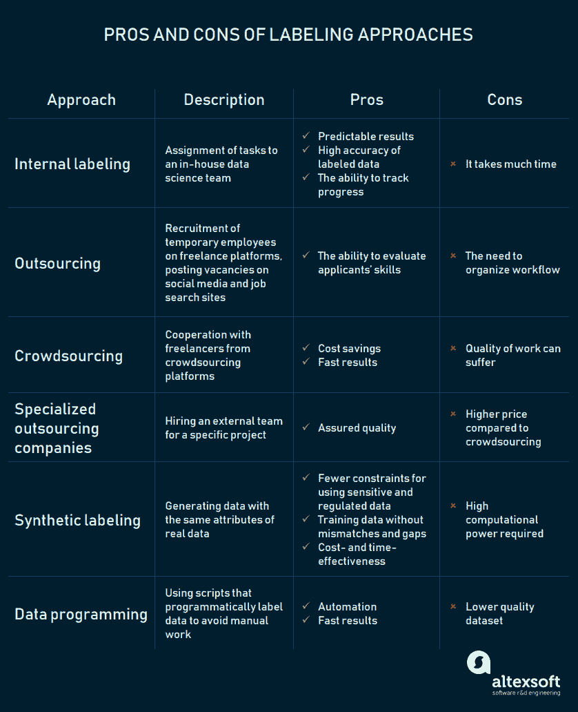
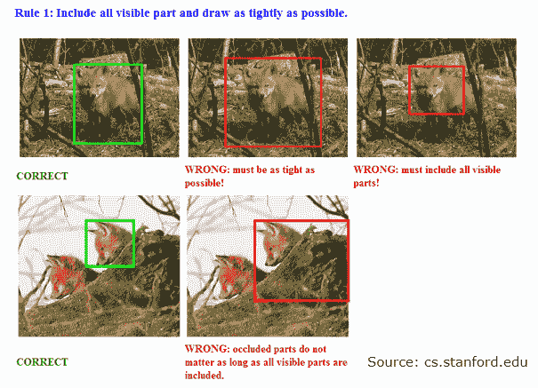

# 如何组织机器学习的数据标签化：方法和工具

> 原文：[`www.kdnuggets.com/2018/05/data-labeling-machine-learning.html`](https://www.kdnuggets.com/2018/05/data-labeling-machine-learning.html)

评论

**由 [AltexSoft](https://www.altexsoft.com/)**.

如果有数据科学名人堂，它一定会有一个专门的标签化部分。标签员的纪念碑可能是持着象征其艰巨和细致责任的大石头的阿特拉斯。ImageNet — 一个图像数据库 — 可能会有自己的纪念碑。九年来，它的贡献者手动注释了超过 1400 万张图像。仅仅想到这些就让人感到疲惫。

* * *

## 我们的前三个课程推荐

 1\. [Google 网络安全证书](https://www.kdnuggets.com/google-cybersecurity) - 快速开启网络安全职业生涯。

 2\. [Google 数据分析专业证书](https://www.kdnuggets.com/google-data-analytics) - 提升您的数据分析技能

 3\. [Google IT 支持专业证书](https://www.kdnuggets.com/google-itsupport) - 支持您的组织的 IT

* * *

虽然标签化不像发射火箭那样复杂，但它仍然是一项严肃的工作。标签化是[监督学习](https://www.altexsoft.com/blog/business/supervised-learning-use-cases-low-hanging-fruit-in-data-science-for-businesses/)数据预处理的不可或缺的阶段。这种模型训练方式使用了具有预定义目标属性（值）的历史数据。算法只能在有人进行映射的情况下找到目标属性。

标签员必须非常专注，因为每一个错误或不准确都会对数据集的质量和预测模型的整体性能产生负面影响。

如何获得高质量的标注数据集而不至于让自己变白头发？主要挑战在于决定谁负责标签化，估计需要多少时间，以及使用什么工具更好。

我们在关于[机器学习项目的一般结构](https://www.altexsoft.com/blog/datascience/machine-learning-project-structure-stages-roles-and-tools/)的文章中简要描述了标签化。在这里，我们将更详细地讨论标签化方法、技术和工具。

### 标签化方法

方法的选择取决于问题和训练数据的复杂性、数据科学团队的规模，以及公司可以分配用于实施项目的财务和时间资源。

#### 内部标签

那句老话*如果你想做得对，就自己动手做*表达了选择内部标注方法的关键原因之一。这就是为什么当你需要确保尽可能高的标注准确性并且能够跟踪过程时，将这项任务分配给你的团队。尽管内部标注比下面描述的方法要慢得多，但如果你的公司拥有足够的人力、时间和财务资源，这是最好的选择。

假设你的团队需要进行情感分析。对公司在社交媒体和技术网站讨论区的评论进行情感分析，可以让企业评估其声誉和专业水平，并与竞争对手进行比较。这也提供了研究行业趋势的机会，以定义发展战略。

你需要收集和标注至少 90,000 条评论，以建立一个表现良好的模型。假设标注单条评论可能需要工人 30 秒，他或她需要花费 750 小时或几乎 94 个 8 小时的工作班次来完成任务。换句话说，大约需要三个月。考虑到[美国数据科学家的中位小时工资](https://www.payscale.com/research/US/Job=Data_Scientist%2C_IT/Salary)为 36.27 美元，标注费用将为 27,202.5 美元。

你可以通过**自动化**数据标注来简化这个过程。这种训练方式涉及使用标注数据和未标注数据。数据集的一部分（例如 2,000 条评论）可以被标注以训练分类模型。然后，这个多类模型在剩余的未标注数据上进行训练，以找到目标值——正面、负面和中性情感。

针对金融、航天、医疗保健或能源等各个行业的项目实施通常需要专家对数据进行评估。团队会咨询领域专家关于标注原则。在某些情况下，专家会自己标注数据集。

[Altexsoft 开发了 DoIGrind 应用程序](https://www.altexsoft.com/case-studies/healthcare/altexsoft-bruxlab-employing-state-of-the-art-machine-learning-and-data-science-to-diagnose-and-fight-bruxism/)旨在为荷兰初创公司[Sleep.ai](https://sleep.ai/?v=3943d8795e03)诊断和监测磨牙症。磨牙症是在清醒或睡眠状态下的过度磨牙或咬紧下颚。该应用程序基于噪声分类算法，该算法通过包含超过 6,000 个音频样本的数据集进行训练。为了定义与磨牙声音相关的录音，客户听取了样本并将其映射到属性上。这些特定声音的识别对于属性提取是必要的。

**优势**

**可预测的良好结果和对过程的控制。** 如果你依靠你的人，你就不会买到一只瞎猫。数据科学家或其他内部专家有兴趣做得很好，因为他们将与标注数据集一起工作。你还可以检查你的团队的进展，以确保它遵循项目的时间表。

**缺点**

**这是一个缓慢的过程。** 标注质量越高，所需时间就越长。你的数据科学团队将需要额外的时间来准确标注数据，而时间通常是有限资源。

#### 众包

如果你可以通过众包平台直接开始工作，为什么还要花额外的时间来招募人员呢？

[亚马逊机械土耳其](https://www.mturk.com/) (MTurk) 是提供按需劳动力的领先平台之一。客户在此注册为请求者，创建和管理包含一个或多个 HIT（人工智能任务）的项目，在 [机械土耳其请求者网站](https://requester.mturk.com/) 上。该网站为用户提供了一个易于使用的界面来创建标注任务。MTurk 代表[声称](https://blog.mturk.com/tutorial-how-to-label-thousands-of-images-using-the-crowd-bea164ccbefc)，借助其广泛的工人社区，标注数千张图像可能只需几小时而不是几天或几周。

另一个全球在线市场，[Clickworker](https://www.clickworker.com/about-us/) 拥有超过 100 万名承包商，准备承担图像或视频标注和情感分析任务。工作流程的初始阶段与 MTurk 类似。任务处理和分配阶段有所不同。注册雇主根据预定义的规格和要求下订单，平台团队制定解决方案并将所需的工作集发布在订单平台上，工作即开始。

**优点**

**快速结果。** 众包是一种合理的选择，适用于时间紧迫且数据集庞大、基本的项目，这些项目需要使用强大的标注工具。例如，计算机视觉项目中的汽车图像分类等任务不会耗费太多时间，可以由具备普通知识的员工完成。通过将项目分解为微任务来实现速度，这样自由职业者可以同时进行这些任务。这就是 Clickworker 组织工作流程的方式。MTurk 客户应该自己将项目分解为步骤。

**经济实惠。** 在这些平台上分配标注任务不会花费你很多钱。例如，亚马逊机械土耳其允许为每个任务设置奖励，这为雇主提供了选择的自由。例如，设置每个 HIT 的奖励为$0.05，每个项目一个提交，你可以用$100 标注 2,000 张图像。考虑到 HITs 的 20%费用（包括最多九个任务），最终费用为$120，适用于一个小数据集。

**缺点**

邀请他人为你的数据进行标注可能节省时间和金钱，但众包也有其陷阱，获取低质量数据集的风险是主要问题。

**标注数据质量不一致。** 日常收入依赖于完成任务数量的人可能会为了完成更多工作而忽略任务推荐。有时，由于语言障碍或工作分配，标注中的错误也会发生。

众包平台使用质量管理措施来应对这一问题，确保工人提供尽可能最好的服务。在线市场通过技能验证测试和培训、声誉评分监控、统计数据、同行评审、审计以及事先讨论结果要求等方式做到这一点。客户还可以要求多个工人完成特定任务，并在支付之前批准任务。

作为雇主，你必须确保你的方面一切正常。平台代表建议提供明确和简单的任务说明，使用简短的问题和要点，并给出标注任务的优秀和差劲的示例。如果你的标注任务涉及绘制边界框，你可以阐明你设定的每一条规则。

*清晰展示图像标注的注意事项和禁忌*

你必须指定格式要求，并告知自由职业者是否需要使用特定的标注工具或方法。要求工人通过资格测试是提高标注准确度的另一种策略。

#### 外包给个人

加速标注的一个方法是通过多个招聘、自由职业和社交网络网站寻找自由职业者。

在[UpWork](https://www.upwork.com/)平台上注册了不同学术背景的自由职业者。你可以通过技能、位置、小时费率、工作成功率、总收入、英语水平等筛选条件发布职位或寻找专业人才。

当涉及在社交媒体上发布招聘广告时，LinkedIn 拥有 5 亿用户，是首选网站。招聘广告可以在公司页面上发布或在相关小组中宣传。分享、点赞或评论将确保更多感兴趣的用户看到你的招聘信息。

在 Facebook、Instagram 和 Twitter 上发布帖子也有助于更快找到专业人才。

**优点**

**你知道你雇佣的是谁。** 你可以通过测试检查申请人的技能，以确保他们能够正确完成工作。由于外包涉及雇佣小型或中型团队，你将有机会控制他们的工作。

**缺点**

**你需要建立工作流程。** 你需要创建一个任务模板并确保其直观。如果你有图像数据，例如，你可以使用[Supervising-UI,](https://github.com/USCDataScience/supervising-ui) 该工具提供了一个标注任务的网络接口。此服务允许在需要多个标签时创建任务。开发者建议在本地网络中使用 Supervising-UI，以确保数据的安全性。

如果你不想创建自己的任务界面，可以为外包专家提供你偏好的标注工具。我们将在工具部分详细介绍。

你还需要编写详细且清晰的说明，以便外包工作人员能够理解并正确地进行标注。此外，你还需要额外的时间来提交和检查已完成的任务。

#### 外包给公司

不需要雇佣临时员工或依赖于人群，你可以联系专门从事训练数据准备的外包公司。这些组织将自己定位为众包平台的替代选择。公司强调，他们的专业团队将提供高质量的训练数据。这样，客户的团队可以专注于更高级的任务。因此，与外包公司的合作就像是拥有一个外部团队一段时间。

外包公司，如[CloudFactory](https://www.cloudfactory.com/)、[Mighty AI](https://mty.ai/)、[LQA](https://www.lotus-qa.com/services/data-annotation/) 和[DataPure](https://www.datapure.co/)，主要为计算机视觉模型标注数据集。[CrowdFlower](https://www.crowdflower.com/) 和[CapeStart](http://www.capestart.com/) 也进行情感分析。前者不仅可以分析文本，还可以分析图像和视频文件。此外，CrowdFlower 的客户可以请求更复杂的情感分析方法。用户可以提出引导性问题，以了解人们为何以某种方式对产品或服务作出反应。

公司提供各种服务包或计划，但大多数不提供定价信息，直到收到请求。计划的价格通常取决于[服务数量](https://www.crowdflower.com/plans/#starter-modal)或工作小时数、任务复杂性或数据集的大小。

*CloudFactory 允许根据[服务价格计算](https://www.cloudfactory.com/how-it-works)工作小时数*

**优势**

**高质量的结果。** 公司宣称他们的客户将获得无误差的标注数据。

**劣势**

**这比众包更贵。** 尽管大多数公司未具体说明工作成本，但 CloudFactory 的 [定价](https://www.cloudfactory.com/how-it-works) 示例帮助我们理解，他们的服务价格略高于众包平台。例如，在众包平台上标记 90,000 条评论（每项任务价格为 $0.05）将花费 $4500。聘请一个 7 到 17 人的专业团队（不包括团队负责人）可能需要 $5,165–5200。

了解公司员工是否执行特定的标记任务。如果你的项目需要领域专家，确保公司招聘能够定义标记原则并及时纠正错误的人。

### 更多相关内容

+   [机器学习的数据标记：市场概况、方法和工具](https://www.kdnuggets.com/2021/12/data-labeling-ml-overview-and-tools.html)

+   [我如何使用 Grounding DINO 进行自动图像标记](https://www.kdnuggets.com/2023/05/automatic-image-labeling-grounding-dino.html)

+   [机器学习的最佳领域：NLP 和文档分析中的纯方法](https://www.kdnuggets.com/2022/05/machine-learning-sweet-spot-pure-approaches-nlp-document-analysis.html)

+   [使用 Python 的自动化机器学习：不同方法的比较…](https://www.kdnuggets.com/2023/03/automated-machine-learning-python-comparison-different-approaches.html)

+   [使用 Python 的 Pathlib 组织、搜索和备份文件](https://www.kdnuggets.com/organize-search-and-back-up-files-with-pythons-pathlib)

+   [数据分析：分析数据的四种方法及其如何…](https://www.kdnuggets.com/2023/04/data-analytics-four-approaches-analyzing-data-effectively.html)
