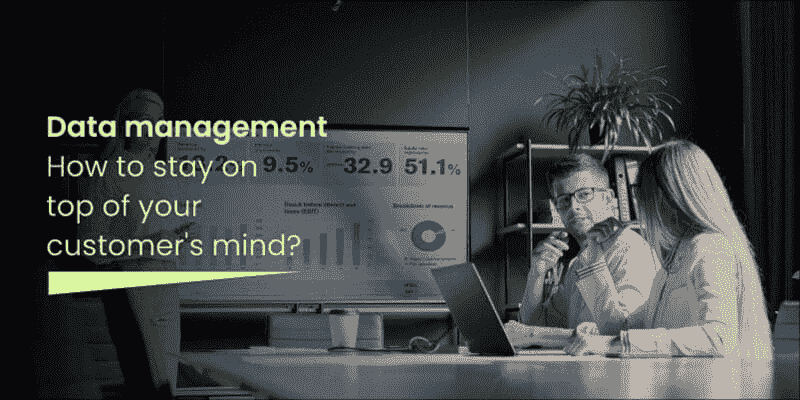
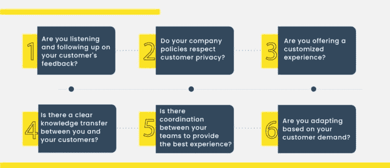
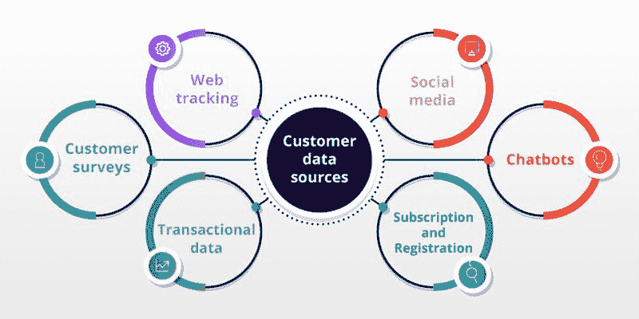

# 数据管理：如何保持在客户心中的领先地位？

> 原文：[`www.kdnuggets.com/2022/04/data-management-stay-top-customer-mind.html`](https://www.kdnuggets.com/2022/04/data-management-stay-top-customer-mind.html)

如果你拥有或计划创业，你可能已经多次收到诸如“有效管理数据”和“更多关注客户”的建议。然而，如果你认为围绕数据管理和客户关系的炒作过多，那么是时候了解数据管理和客户满意度之间的关系，以及你如何利用这些知识帮助你的业务成功了。

* * *

## 我们的前三大课程推荐

 1\. [谷歌网络安全证书](https://www.kdnuggets.com/google-cybersecurity) - 快速进入网络安全职业生涯。

 2\. [谷歌数据分析专业证书](https://www.kdnuggets.com/google-data-analytics) - 提升你的数据分析能力

 3\. [谷歌 IT 支持专业证书](https://www.kdnuggets.com/google-itsupport) - 支持你的组织进行 IT 工作

* * *

无论是通过市场营销活动还是客户服务电话，赢得客户的心都是必要的。然而，打动客户并不容易！在这个数字化商业世界中，产生了大量的客户数据。你必须了解客户的每一个细节，包括他们的兴趣和痛点，以便即时分析并向他们提供相关解决方案。

为了实现这一点，你组织中的每一个团队都必须有效地合作。通过实施以客户为中心的商业战略和有效的数据管理解决方案，你可以在业务中取得成功。

# 为什么你需要以客户为中心的方法？

在今天的数字商业世界中，客户有很多选择来比较和购买产品。要成为客户的首选，你必须首先了解他们，知道他们对你的产品或服务有什么期望，并迅速解决他们的问题。如果客户认为你不听取他们的需求，即使你拥有卓越的品牌价值，他们也会瞬间切换品牌。

根据 [德勤](https://www2.deloitte.com/content/dam/Deloitte/de/Documents/WM%20Digitalisierung.pdf) 的研究，采取以客户为中心的方法的组织比那些不专注于客户的公司要有 60%的回报率。因此，什么是以客户为中心的战略？它就是将客户放在首位，了解他们的需求，并提供最佳解决方案。虽然采用以客户为中心的文化具有挑战性，但绝对值得付出努力。

如果你有一个以客户为中心的商业文化，问问自己这些问题，以查看你是否在正确的轨道上。

# 数据管理在以客户为中心的战略中的作用？

你可能会想，如果以客户为中心能够增加利润和声誉，为什么公司不去实施它。简短的答案是，大多数企业尝试以客户为中心但未能实现。然而，挑战在于几乎所有的客户数据来自多个接触点，并且在部门之间缺乏一致性和治理。

根据 [哈佛商业评论](https://hbr.org/2017/09/only-3-of-companies-data-meets-basic-quality-standards) 的一篇文章，组织中的数据中仅有 3%是高质量数据。差的数据和过时的数据不过是一些数字。为了有效地提供以客户为中心的体验，组织应当从收集相关客户数据开始，接着丰富、标准化，并使其能够立即提供给组织中的所有人。

在组织中手动完成所有这些工作需要时间和金钱，同时也容易出错。通过自动化的 [数据管理解决方案](https://www.xtract.io/solutions/data-management?) 

通过 [utm_source=data_management_blog_Mar22&utm_medium=web&utm_campaign=blog](https://example.org)，你可以在专注于提升客户生命周期价值和减少流失的同时，强化你的端到端客户数据管理。

# 数据管理解决方案如何有利于以客户为中心的战略

数据管理已经从简单的数据收集发展到分析和存储数据，以便于跟踪和访问。以下是数据管理解决方案的一些功能。

## 跟踪和访问你的数据

客户数据是跨多个部门收集并存储在不同的数据库中的。实现以客户为中心的文化的第一步是了解你提取的客户数据，数据存储的位置，信息属于哪个类别，谁收集了数据等等。如果你打算手动完成这些工作，你将陷入困境！

自动识别和分类带有元数据标签的数据可以让你快速确定谁、何时、何地、关于数据的内容以及客户数据的关联。当你的经理要求你检索关于客户的多个数据集时，你不必担心接下来的艰巨任务。借助正确的解决方案，你可以在几分钟内获得数据。实施有效的元数据管理解决方案不再是一个选择，而是一个必须的条件，以节省今天数字商业世界中的时间和人工劳动力。

## 检查并丰富数据质量

以下步骤确保数据是干净且最新的。数据质量和丰富性确保信息干净、去重、无错误且经过增强。"数据质量"这个词已经成为一个流行词。每个人都在谈论数据质量，每个人都希望实现 100%的数据质量。数据质量对于实现和维持以客户为中心的目标是否必要？是的，它至关重要！

正确的客户方法始于准确的数据。凭借精确的客户数据，你可以快速识别市场趋势、客户模式，并将正确的信息发送给正确的人，从而减少不必要的营销活动费用并提高客户终生价值。根据[哈佛商业评论](https://hbr.org/2014/10/the-value-of-keeping-the-right-customers)，将客户保留率提高 5%可以将利润提高 25%至 95%。一个由 AI 驱动的数据质量解决方案可以实时自动化数据分析、清理和丰富的过程，使你能够获得数据驱动的洞察，并有效地提高客户保留率。

## 无缝集成和存储数据

一旦你拥有了干净且丰富的数据，下一步是确保组织内的每个人、各个部门通过多种渠道访问这些数据。定义、管理和整合所有可用的客户数据对于创建黄金记录或关于客户的单一真实版本至关重要。数据集成解决方案是收集客户数据、将其转换为标准格式并存储在数据仓库或数据湖等集中位置的最佳选择。

数据集成为你提供了客户数据的完整视图。例如，如果销售部门清楚地了解所有关于客户的数据，他们将能够迅速做出明智的产品推荐。一个稳固的数据集成解决方案允许你随时无缝集成所有数据，为你提供统一的客户数据视图。

## 探索数据管理解决方案以实现以客户为中心的目标

在组织中创建以客户为中心的战略是困难的，但它是值得的。了解你的客户并快速响应他们的需求对于保留他们并最大化你的市场价值至关重要。

如果你在寻找和管理客户数据以实现以客户为中心的目标方面遇到困难，是时候开始使用数据管理解决方案了。智能且强大的数据管理解决方案如[Xtract.io](https://www.xtract.io/?utm_source=data_management_blog_Mar22&utm_medium=web&utm_campaign=blog)、[Informatica](https://www.informatica.com/)、[Talend](https://www.talend.com/)等将通过几次点击处理所有客户数据，保护你的隐私，并帮助你获得创新的业务洞察。

> 请在评论区分享你的想法，以便我们开始一些有趣的讨论！

**[Abinaya Sundarraj](https://www.linkedin.com/in/abinaya-sundarraj/)** 在数据解决方案公司 Xtract.io 担任市场营销顾问。她是一位热衷于阅读的人，喜欢撰写有关数据在各个行业中作用的文章。她相信宇宙为那些真正渴望的人提供一切。

### 更多相关主题

+   [选择下一个数据科学工作前需牢记的 5 件事](https://www.kdnuggets.com/2022/01/5-things-keep-mind-selecting-next-job.html)

+   [如何紧跟 AI 世界的最新动态](https://www.kdnuggets.com/2022/03/stay-top-going-ai-world.html)

+   [6 个令人惊叹的 ChatGPT 扩展，适用于任何地方](https://www.kdnuggets.com/2023/04/6-chatgpt-mindblowing-extensions-anywhere.html)

+   [5 个项目创意，让数据科学家保持最新](https://www.kdnuggets.com/2022/07/5-project-ideas-stay-uptodate-data-scientist.html)

+   [如何保持 Python 的最新状态](https://www.kdnuggets.com/2022/06/stay-current-python.html)

+   [适用于项目的前 5 大数据管理工具](https://www.kdnuggets.com/top-5-data-management-tools-for-your-projects)
