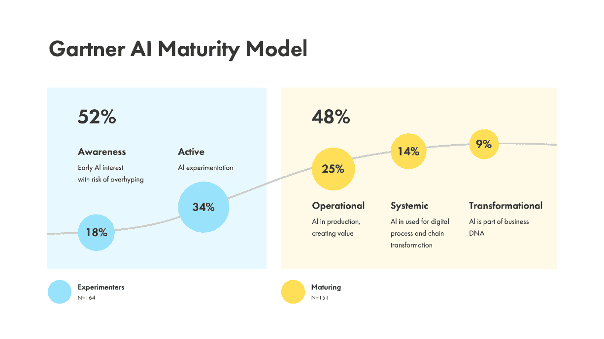

# 数据成熟度：AI 驱动创新的基石

> 原文：[`www.kdnuggets.com/data-maturity-the-cornerstone-of-ai-enabled-innovation`](https://www.kdnuggets.com/data-maturity-the-cornerstone-of-ai-enabled-innovation)

图片来源于 [Google DeepMind](https://www.pexels.com/photo/an-artist-s-illustration-of-artificial-intelligence-ai-this-image-represents-how-ai-powered-tools-can-support-us-and-save-time-it-was-created-by-martina-stiftinger-as-part-of-the-visua-18069238/)

在追求创新和确保竞争优势的过程中，企业正逐渐利用人工智能（AI）的力量作为一种变革性工具。人工智能承诺简化操作、提升决策过程，并揭示数据中隐藏的模式，这促使它在各行业迅速应用，尤其是在零售、制造和分销领域。

* * *

## 我们的前三大课程推荐

 1\. [谷歌网络安全证书](https://www.kdnuggets.com/google-cybersecurity) - 快速进入网络安全职业生涯。

 2\. [谷歌数据分析专业证书](https://www.kdnuggets.com/google-data-analytics) - 提升你的数据分析能力

 3\. [谷歌 IT 支持专业证书](https://www.kdnuggets.com/google-itsupport) - 支持你的组织的 IT 需求

* * *

然而，尽管有令人信服的可能性，实现人工智能的最大收益依赖于扎实的数据成熟度基础。不幸的是，许多企业由于各种因素面临实现这种成熟度的挑战。这些挑战通常包括：

+   数据孤岛现象

+   数据质量差

+   对数据资产和技能的透明度有限

+   组织惯性在重新建立技术作为业务数据需求的推动者与提供者之间的平衡

在这篇文章中，我将重点介绍克服这些挑战的建议策略，以建立一个强大的数据基础，进而扩展差异化的人工智能能力。

# 当前人工智能的状态及行业领袖如何引领前进

零售、制造和分销领域的领导者利用 AI 的强大功能取得了显著成果，从优化供应链到预测客户行为。生成式 AI 正在获得主流关注。最近的《财富》/德勤首席执行官调查发现，首席执行官们对生成式 AI 的潜力表现出广泛兴趣。在最近的一项调查中，[79%的首席执行官对技术提升运营效率的潜力表示乐观](https://www2.deloitte.com/us/en/pages/consulting/articles/ceo-guide-to-generative-ai-enterprises.html)，超过一半的首席执行官预期会出现新的增长途径。一部分人透露正在评估和实验生成式 AI，强调了积极利用尖端技术的主动态度。

在 AI 成熟度最高的行业领导者中，他们展示了差异化的能力来推动销售和优化运营。例如，亚马逊的 AI 推荐引擎根据客户的历史购买和浏览记录建议产品，这在推动销售方面发挥了重要作用。同样，沃尔玛成功地使用 AI 算法进行库存管理和需求预测，这意味着这家零售巨头正在利用 AI 确保产品在客户需要时随时可用。

然而，根据 Gartner 的 AI 成熟度模型，[52%的中大型美国组织仍在实验 AI](https://www.gartner.com/en/newsroom/press-releases/2023-07-27-gartner-survey-finds-55-of-organizations-that-have-deployed-ai-take-an-ai-first-strategy-with-new-use-cases)。

根据最近对 300 多位首席数据官的 AWS 调查，首席数据官在采纳 AI 和支持数字化转型方面扮演着至关重要的角色，并负责组织内的数据战略和治理，他们认为数据质量是充分发挥 AI 能力的最大障碍之一。

让我们深入探讨影响 AI 采纳的数据成熟度挑战以及如何克服这些挑战。

# 数据成熟度：AI 可扩展性的缺失环节

尽管 AI 的潜力不可否认，但许多企业由于数据相关的障碍而在扩展 AI 应用时遇到困难。随着组织开展雄心勃勃的 AI 计划，它们常常遇到阻碍及时实施和广泛采纳的重要障碍。组织必须优先考虑数据成熟度，以应对这些挑战，并充分实现 AI 的潜力。

数据成熟度指的是组织有效管理、治理和利用其数据资产的能力。它涵盖数据质量、治理、集成和分析能力。缺乏数据成熟度可能导致阻碍 AI 采纳和扩展的若干挑战，例如：

+   **数据孤岛和碎片化：** 分散在不同系统和格式中的数据会造成数据孤岛，可能阻碍公司范围内的整体利用。

+   **数据质量问题：** 不准确、不完整或不一致的数据可能导致缺陷的人工智能模型和不可靠的见解。

+   **数据治理缺口：** 如果没有适当的数据治理实践，企业可能会面临与数据安全、隐私和合规性相关的问题。

+   **有限的数据分析能力：** 无法从数据中提取有意义的见解可能会阻碍人工智能的开发和应用。

这些挑战凸显了数据成熟度在实现人工智能扩展性方面的关键作用。为了克服这些困难，企业必须采用全面的数据管理和治理方法。

# 解决关键挑战的规范性策略

DataArt 为企业提供了全面的战略和解决方案，以提升数据成熟度。我们推动合作伙伴走向一个数据民主化、灵活且目标驱动的软件生态系统，克服阻碍人工智能采纳的障碍。通过培养数据拥有、赋能和创新的文化，企业可以更好地利用人工智能的变革潜力，推动可扩展的、人工智能驱动的应用场景，将自己置于由数据驱动的卓越和持续增长所定义的未来前沿。

# 数据网格与数据产品的融合

数据网格和数据产品策略的出现预示着全球经济中的一种变革性范式转变。数据网格是一种新型架构方法，主张去中心化的数据拥有和管理，在单一企业中推动基于领域的数据架构。这一策略旨在通过将数据拥有权分配给领域特定团队，从而缓解集中数据湖或数据仓库的瓶颈。通过这种数据分发工作，数据网格使团队能够策划、拥有和发展他们的数据产品，促进灵活性和扩展性，同时保持数据治理和质量。

图 1：数据网格框架，通过业务领域驱动的数据产品实现快速价值实现。

同时，数据产品战略进一步巩固了人工智能扩展性的基础。该战略倡导将数据视为产品进行概念化、创建和管理，以满足组织内部特定用户的需求。每个数据产品都封装了有价值的见解、准备好的数据集或分析工具，旨在供各类利益相关者使用。这种方法培养了数据拥有的文化，赋予团队创新、协作的能力，并从精心策划的数据产品中提取可操作的见解，加速人工智能的采用。

例如，客户细分分析数据产品可以进一步用于创建流失数据产品，两者都可以用于营销目的，为客户生成超个性化的内容。如果没有数据产品或数据产品市场，团队将不得不从头开始构建这些分析能力。相反，每个新的用例可以重用和重新利用现有的数据产品，从而缩短开发时间，并产生更一致的输出。

# 数据民主化与有效的数据治理

随着各行各业的公司寻求更有效的数据管理方式，必须仔细考虑几个因素。数据民主化涉及使数据对数据科学家、商业分析师、领域专家、管理层和高管等利益相关者可访问和易于理解。此外，公司必须确保数据不仅可以随时获取、易于阅读，而且还要安全、合规，并具备透明的标准和控制措施。实施正确的安全性和合规性措施将帮助企业保护数据的完整性、隐私和合规性。

这种演变标志着组织如何利用数据的根本变化。历史上，IT 部门负责建立公司数据相关模块，如数据仓库和分析数据产品。通过实施 AI 驱动的数据民主化方法，IT 可以成为技术促进者，而不仅仅是控制数据访问和提供服务的角色。通过部署 AI 驱动的系统，IT 可以将资源集中在赋能用户独立浏览和获取公司数据的洞察上。这一过渡需要 IT 角色的根本转变，从守门人变成促进协作和创新的合作伙伴。

数据策划在确保组织内数据资产的质量、相关性和可用性方面发挥着关键作用。然而，由于数据来源的数量和多样性、功能孤岛以及人工努力的挑战，维护数据策划通常很困难。这是 AI 可以改善的领域之一。 AI 驱动的工具和算法可以自动化数据处理任务，从而实现更快的数据策划、数据清理和标准化，减少人工工作。 AI 算法可以识别数据中的模式并进行信息的上下文化，从而促进更准确的数据策划和分类。

通过采纳和实施这些策略，企业可以建立一个强大的数据成熟度基础，使其能够有效利用 AI 的力量，并在业务中扩展 AI 驱动的用例。此外，DataArt 可以帮助公司建立或改善连接技术、人员和流程的核心基础能力，如：

+   **打破数据孤岛：** 将来自不同来源的数据整合到一个集中存储库中，确保数据的一致性和可访问性。

+   **建立数据治理：** 实施一个定义数据所有权、访问控制、数据质量标准和数据使用政策的框架。

+   **提升数据质量：** 实施数据质量检查、清理过程和丰富技术，以提高数据的准确性和完整性。

+   **培养数据素养：** 对员工进行数据管理原则、数据分析技术和数据驱动决策的培训，以提升组织的数据利用能力。

+   **投资于数据基础设施：** 升级数据基础设施以处理日益增长的数据量、速度和种类，确保高效的数据存储、处理和分析。

+   **拥抱 DataOps：** 实施 DataOps 实践以自动化数据管理过程，实现快速数据交付和持续改进。

+   **利用基于云的数据解决方案：** 使用基于云的数据平台以在数据管理中获得可扩展性、灵活性和成本效益。

+   **持续监控和改进：** 监控数据质量、治理合规性和使用模式，以识别并解决新出现的挑战。

# 结论

数据成熟度不仅仅是技术要求；它是寻求释放 AI 变革潜力的企业的战略性必要条件。通过应对与数据成熟度相关的关键挑战，企业可以为由数据驱动的洞察和 AI 驱动的创新塑造未来铺平道路。

[Oleg Royz](https://www.linkedin.com/in/olegroyz/) 是 DataArt 的零售与分销副总裁。

### 更多相关主题

+   [数据成熟度金字塔：从报告到主动…](https://www.kdnuggets.com/the-data-maturity-pyramid-from-reporting-to-a-proactive-intelligent-data-platform)

+   [学习数据科学和商业分析以推动创新和增长](https://www.kdnuggets.com/2023/08/learn-data-science-business-analytics-drive-innovation-growth.html)

+   [AI + 无代码：重新定义开发者创新的病毒组合](https://www.kdnuggets.com/ai-no-code-the-viral-combo-redefining-developer-innovation)

+   [微软工程师的 AI 创新与领导力指南](https://www.kdnuggets.com/a-microsoft-engineer-guide-to-ai-innovation-and-leadership)

+   [数据科学职位标题导航：数据分析师与数据科学家…](https://www.kdnuggets.com/navigating-data-science-job-titles-data-analyst-vs-data-scientist-vs-data-engineer)

+   [数据工程师与数据科学家的高保真合成数据](https://www.kdnuggets.com/2022/tonic-high-fidelity-synthetic-data-engineers-scientists-alike.html)
