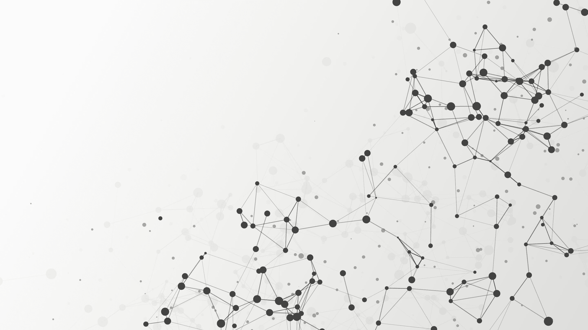

# 数据网格架构：重新定义数据管理

> 原文：[`www.kdnuggets.com/2022/05/data-mesh-architecture-reimagining-data-management.html`](https://www.kdnuggets.com/2022/05/data-mesh-architecture-reimagining-data-management.html)

[由 GarryKillian 创建的连接点矢量 - www.freepik.com](https://www.freepik.com/vectors/connect-dot)

# 介绍

* * *

## 我们的三大课程推荐

 1\. [谷歌网络安全证书](https://www.kdnuggets.com/google-cybersecurity) - 快速进入网络安全职业道路。

 2\. [谷歌数据分析专业证书](https://www.kdnuggets.com/google-data-analytics) - 提升你的数据分析技能

 3\. [谷歌 IT 支持专业证书](https://www.kdnuggets.com/google-itsupport) - 支持你组织的 IT 工作

* * *

数据被视为推动业务创新的驱动力。因此，企业不断探索数据的潜力，以使业务流程更直观，并为客户提供超个性化的体验。随着驱动型企业在当今数字世界中取得成功，对数据分析市场的投资[预计到 2023 年将达到 1030 亿美元](https://techjury.net/blog/big-data-statistics/#gref)。随着企业急于从数据中获取更有价值和可操作的洞察，数据量和数据来源的增加也在快速增长和扩展。继续将来自不同来源的数据整合到一个集中位置（即数据湖或数据仓库）的数据管理策略变得越来越复杂，因为集中在数据仓库或数据湖中的数据需要由专业团队进行分析。

[数据网格是一种新的](https://www.k2view.com/what-is-data-mesh) 去中心化数据策略，将所有权归于每个业务领域，例如销售或客户支持。

数据网格的目标是建立来自不同领域的数据之间的一致性。这些领域被自主处理，以消除跨职能团队面临的数据可用性和访问性挑战。

# 数据网格将解决的问题

数据网格解决了传统大数据管理方法中显著存在的以下问题：

## 支持可扩展性

市场专家指出，传统的数据管理方法，包括数据仓库或数据 [湖泊模型（data lake models）](https://towardsdatascience.com/sorry-data-lakes-are-not-legacy-625bc70b4090) 扩展性差。随着数据量的增加，数据管理的复杂性也随之增加。在传统的数据湖架构中，来自不同来源的数据使得数据消费者难以解读。消费者必须回到数据生产者那里尝试理解数据。随着多个平台的集成增加，以及数据缺乏结构和所有权，时间的推移使得数据湖架构面临重大障碍。

数据网格架构倡导每个团队负责创建、处理和存储数据。这有助于其他领域避免单一中央企业级 [数据仓库或数据湖](https://www.k2view.com/blog/data-as-a-product/) 的瓶颈。集中数据的解耦使企业级扩展成为可能，当团队以速度和规模满足自身的数据需求时，迅速带来跨领域的创新。

## 数据质量的提升

集中式的数据管道使得团队对不断增长的数据量的质量控制减少，但数据网格架构允许每个团队使用自己的仓库和湖泊，创建和管理他们的领域数据，从而团队有更多的激励和所有权来确保数据产品的质量，确保在进一步分发前达到高标准。这种架构在企业内部带来了更多的问责制和团队间的协作。

## 更加关注组织变革

集中的整体数据储备还提供了一种跨多个技术和平台访问数据的架构，但它更多地集中于技术，而数据网格则专注于组织变革。数据网格生态系统将知识注入领域团队，鼓励领域团队在其专业领域内提供最佳业务价值。这种生态系统打破了一个常见的误解，即需要集中数据才能使其有用。由于数据来自不同来源的集中，数据的含义有时会被修改。数据网格可以解决这个问题，因为领域 [团队将数据视为产品](https://www.k2view.com/blog/data-as-a-product/) 并处理自己的数据管道。他们还能够提供数据产品，并集中提供。

**让我们看一下企业在采纳数据网格架构之前需要考虑的几个关键因素**

## 尺寸和业务需求

随着数据量和类型的增长，数据团队会感到不堪重负，企业从数据投资中获得的价值也会越来越少。因此，数据网格架构非常适合数据流来自多个来源、且这些来源各异且可变的大型企业。业务举措应与领域团队紧密对齐，以从领域特定的数据中获取有价值的见解。这种对齐有助于领域团队创造能够带来实际业务价值的高质量成果。

## 数据管理与所需专业知识

各领域处理数据的策略还需要企业范围内的协调和治理。现代工具可以帮助企业入门数据管理策略，但工具的选择仍需要专家的全面监督。

像 Cuelogic、Data Product Platform、IBM 等平台提供实施数据网格架构的服务。这些平台像传统的数据管理架构一样，整合来自所有来源的数据，将其制作成任意数量的数据产品，并创建数据网格。数据管理平台提供在任意数量领域间安全分发数据，并在任何层级提供数据质量控制、隐私和访问权限。

此类平台还对引导企业过渡到处理数据的新方式非常有用，并帮助它们避免在底层系统中发现的数据复杂性。

# 结论

数据网格架构为现有的数据管理架构带来了范式转变。它能够处理多样化和庞大的数据量，相比其他数据架构，它是一种更好的方法。数据网格中的领域特定结构有助于从不断增长的数据块中生成有价值的见解。团队对数据的拥有权转化为更大的数据实验和创新空间。Netflix 采用了数据网格架构，以整合和管理来自数百个不同数据存储的数据。参见这个[YouTube 视频](https://www.youtube.com/watch?v=TO_IiN06jJ4)来了解 Netflix 数据网格。这种创建一个由领域团队组成的网络的新方式，能够帮助这些团队拥有自己的数据并将其视为产品，从而从数据操作中获得更多价值。

**[Yash Mehta](https://www.linkedin.com/in/yash-mehta-esthan/)** 是一位物联网和大数据爱好者，他在 IDG、IEEE、Entrepreneur 等出版物上贡献了许多文章。他共同开发了像 [Getlua](https://getlua.com/) 这样的平台，允许用户轻松地 [合并多个文件](https://getlua.com/merge-pdf)。他还创立了一个研究平台，从专家那里生成可操作的见解。

### 更多相关话题

+   [KDnuggets 新闻，5 月 18 日：5 个免费机器学习托管平台…](https://www.kdnuggets.com/2022/n20.html)

+   [数据网格与其分布式数据架构](https://www.kdnuggets.com/2022/02/data-mesh-distributed-data-architecture.html)

+   [KDnuggets™ 新闻 22:n07，2 月 16 日：如何为机器学习学习数学…](https://www.kdnuggets.com/2022/n07.html)

+   [探索数据网格：数据架构的范式转变](https://www.kdnuggets.com/exploring-data-mesh-a-paradigm-shift-in-data-architecture)

+   [如何使用 Apache Kafka 构建可扩展的数据架构](https://www.kdnuggets.com/2023/04/build-scalable-data-architecture-apache-kafka.html)

+   [文本分类任务的最佳架构：基准测试…](https://www.kdnuggets.com/2023/04/best-architecture-text-classification-task-benchmarking-options.html)
