# 数据可观测性：使用 SQL 构建数据质量监视器

> 原文：[`www.kdnuggets.com/2021/02/data-observability-building-data-quality-monitors-using-sql.html`](https://www.kdnuggets.com/2021/02/data-observability-building-data-quality-monitors-using-sql.html)

评论

**由 [Ryan Kearns](https://www.linkedin.com/in/ryanothnielkearns/)，斯坦福大学 和 [Barr Moses](https://www.linkedin.com/in/barrmoses/)，Monte Carlo 首席执行官兼联合创始人**


图片由 [faaiq ackmerd](https://www.pexels.com/@faaiq-ackmerd-383634) 提供，来源于 [Pexels](http://www.pexels.com/)。

* * *

## 我们的前三个课程推荐

 1\. [Google 网络安全证书](https://www.kdnuggets.com/google-cybersecurity) - 快速进入网络安全职业轨道。

 2\. [Google 数据分析专业证书](https://www.kdnuggets.com/google-data-analytics) - 提升你的数据分析技能

 3\. [Google IT 支持专业证书](https://www.kdnuggets.com/google-itsupport) - 支持你所在的组织的 IT

* * *

*在本系列文章中，我们将详细介绍如何从零开始创建自己的数据可观测性监视器，映射到*[*数据健康的五大支柱*](https://towardsdatascience.com/introducing-the-five-pillars-of-data-observability-e73734b263d5)*。本系列的第一部分改编自 Barr Moses 和 Ryan Kearns 的 O'Reilly 培训，*[*《管理数据停机时间：将可观测性应用于数据管道》*](https://www.oreilly.com/live-training/courses/managing-data-downtime/0636920508717/)*，这是行业首个数据可观测性课程。相关练习可在*[*这里*](https://github.com/monte-carlo-data/data-downtime-challenge)*找到，本文所示的改编代码可在*[*这里*](https://github.com/monte-carlo-data/data-observability-in-practice)*获取。*

从空值和重复行，到建模错误和模式变化，数据可能因多种原因而损坏。[数据测试](https://towardsdatascience.com/why-testing-your-data-is-insufficient-6914275a9762) 通常是对抗不良数据的第一道防线，但如果数据在其生命周期中发生故障会发生什么？

我们将这种现象称为数据停机时间，指的是数据缺失、错误或其他不准确的时间段。[数据停机时间](https://towardsdatascience.com/the-rise-of-data-downtime-841650cedfd5) 促使我们提出以下问题：

+   数据是否是最新的？

+   数据是否完整？

+   字段是否在预期范围内？

+   空值率是高于还是低于预期？

+   模式是否发生了变化？

为了在数据出现故障时触发警报并防止数据停机，数据团队可以借鉴我们软件工程领域朋友的成熟策略：[**监控和可观测性**](https://observability.workshop.aws/en/anomalydetection.html)。

我们将[**数据可观测性**](https://towardsdatascience.com/what-is-data-observability-40b337971e3e)定义为组织回答这些问题和评估其数据生态系统健康状况的能力。数据健康的关键变量反映了数据可观测性的五大支柱：

+   **新鲜度**：我的数据是否是最新的？是否存在数据未更新的时间间隔？

+   **分布**：我的数据在字段级别的健康状况如何？我的数据是否在预期范围内？

+   **数据量**：我的数据采集是否达到预期的阈值？

+   **模式**：我的数据管理系统的正式结构是否发生了变化？

+   **数据源追溯**：如果我的某些数据出现故障， upstream 和 downstream 受到什么影响？我的数据源之间是如何相互依赖的？

> 讨论数据可观测性是一个方面，但完全的处理应当揭开帷幕——**数据可观测性在实际中是什么样的，底层代码是怎样的？**

完全回答这个问题很困难，因为细节将取决于数据仓库、数据湖、BI 工具、首选语言和框架等选择。即便如此，使用像 SQLite 和 Jupyter 这样的轻量级工具来解决这些问题可能会很有用。

在这篇文章中，我们将通过一个数据生态系统的示例，创建自己的数据质量监测器，并探索数据可观测性在实际中的表现。

让我们来看看。

### 实践中的数据可观测性

*本教程基于我们 O'Reilly 课程的*[*练习 1*](https://github.com/monte-carlo-data/data-downtime-challenge/blob/master/exercise_text/ex1.md)*。您可以使用 Jupyter Notebook 和 SQL 自行尝试这些练习。我们将在未来的文章中更详细地讨论，包括练习*[*2*](https://github.com/monte-carlo-data/data-downtime-challenge/blob/master/exercise_text/ex2.md)*、*[*3*](https://github.com/monte-carlo-data/data-downtime-challenge/blob/master/exercise_text/ex3.md)*和*[*4*](https://github.com/monte-carlo-data/data-downtime-challenge/blob/master/exercise_text/ex4.md)*。

我们的示例数据生态系统使用了有关适居系外行星的 [mock astronomical data](https://github.com/monte-carlo-data/data-observability-in-practice/blob/main/EXOPLANETS.db)。为了本练习的目的，我使用 Python 生成了数据集，将异常情况建模为我在生产环境中遇到的实际事件。该数据集完全免费使用，且如果您感兴趣的话，您可以在 [utils folder](https://github.com/monte-carlo-data/data-downtime-challenge/tree/master/data/utils) 中找到生成数据的代码。

我使用的是**SQLite 3.32.3**，这应该使数据库能够通过命令提示符或 SQL 文件进行最小设置即可访问。这些概念扩展到任何查询语言，且[这些实现](https://github.com/monte-carlo-data/data-observability-in-practice/tree/main/queries)可以轻松扩展到 MySQL、Snowflake 及其他数据库环境。

```py
$ sqlite3 EXOPLANETS.db
sqlite> PRAGMA TABLE_INFO(EXOPLANETS);
0 | _id            | TEXT | 0 | | 0
1 | distance       | REAL | 0 | | 0
2 | g              | REAL | 0 | | 0
3 | orbital_period | REAL | 0 | | 0
4 | avg_temp       | REAL | 0 | | 0
5 | date_added     | TEXT | 0 | | 0
```

`EXOPLANETS` 数据库条目包含以下信息：

0.`_id`: 一个与行星对应的 UUID。

1. `distance`: 与地球的距离，以光年为单位。

2. `g`: 表面重力，作为 *g*，即重力常数的倍数。

3. `orbital_period`: 单次轨道周期的长度，以天为单位。

4. `avg_temp`: 平均表面温度，以开尔文度为单位。

5. `date_added`: 我们的系统发现该行星并自动将其添加到数据库的日期。

请注意，由于数据缺失或错误，某些行星的 `distance`、`g`、`orbital_period` 和 `avg_temp` 可能为 `NULL`。

```py
sqlite> SELECT * FROM EXOPLANETS LIMIT 5;
```

请注意，此练习是追溯性的——我们在查看历史数据。在生产数据环境中，数据可观测性是实时的，并且应用于数据生命周期的每个阶段，因此实现方式会与这里的略有不同。

由于本练习的目的，我们将构建用于新鲜度和分布的数据可观测性算法，但在未来的文章中，我们将讨论其余的五大支柱——以及更多内容。

### 新鲜度

我们监控的数据可观测性的第一个支柱是新鲜度，它可以为我们提供关键数据资产最后一次更新的强有力指标。如果一个定期每小时更新的报告突然看起来非常陈旧，这种异常类型应能强烈指示我们某些地方出现了问题。

首先，请注意 `DATE_ADDED` 列。SQL 不存储关于单个记录添加时间的元数据。因此，为了在这种追溯性设置中可视化新鲜度，我们需要自己跟踪这些信息。

按 `DATE_ADDED` 列分组可以让我们了解 `EXOPLANETS` 的每日更新情况。例如，我们可以查询每天添加的新 ID 数量：

您可以通过在 [the repository](https://github.com/monte-carlo-data/data-observability-in-practice)中运行 `$ sqlite3 EXOPLANETS.db < queries/freshness/rows-added.sql` 来自己执行此操作。我们会得到以下数据：

基于我们数据集的图示表示，`EXOPLANETS` 每天大约更新 100 条新条目，尽管有些天没有数据输入。

记住，对于新鲜度，我们要问的问题是“我的数据是否是最新的？”——因此，了解表更新中的这些间隙对于理解数据的可靠性至关重要。

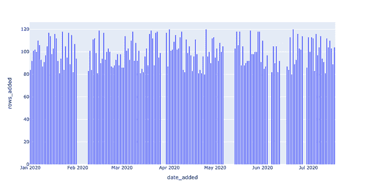

新鲜度异常！

这个查询通过引入 `DAYS_SINCE_LAST_UPDATE` 的度量来实现新鲜度的操作化。（注意：由于本教程使用的是 SQLite3，MySQL、Snowflake 和其他环境中的 SQL 语法可能会有所不同。）

结果表显示“在日期 *X*，`EXOPLANETS` 中最近的数据是 *Y* 天前。”这是一种从表中的 `DATE_ADDED` 列中未显式提供的信息——但应用数据可观察性工具可以帮助我们揭示它。

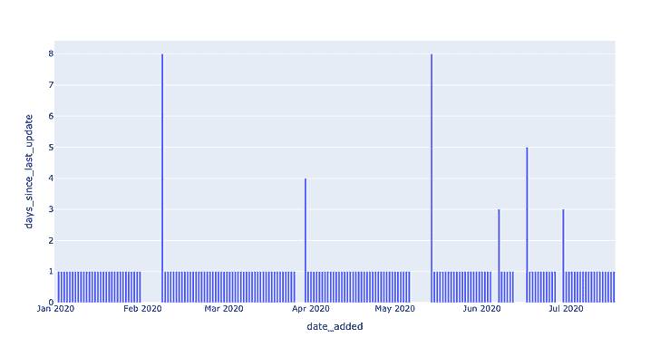

现在，我们已经拥有检测新鲜度异常所需的数据。剩下的就是为 Y 设置一个 **阈值** **参数** —— *多少天是太久*？参数将查询转变为检测器，因为它决定了什么算作异常（即：值得警报）什么不算。（关于设置阈值参数的更多信息将在后续文章中介绍！）

新鲜度异常！

返回给我们的数据代表了发生新鲜度事件的日期。

在 2020–05–14，表中最近的数据已经是 8 天前的了！这样的故障可能表示我们的数据管道出现了问题，如果我们将这些数据用于重要用途（如果我们在生产环境中使用这些数据，几乎可以肯定是这样），了解这些情况是很重要的。

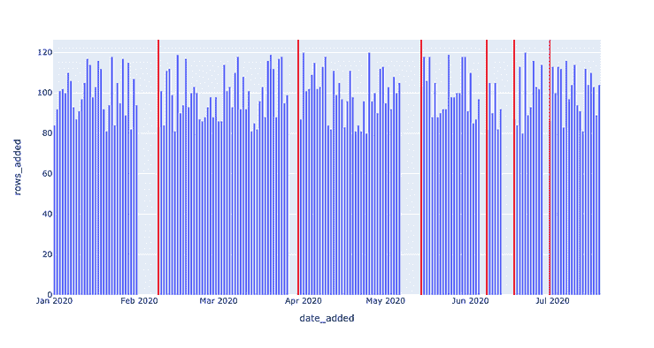

特别注意查询的最后一行：`DAYS_SINCE_LAST_UPDATE > 1;`。

在这里，1 是一个 [**模型参数**](https://en.wikipedia.org/wiki/Parameter)— 这个数字没有“正确”之说，虽然更改它会影响我们认为的事件日期。数字越小，我们捕捉到的真正异常越多（高 [召回率](https://en.wikipedia.org/wiki/Precision_and_recall)），但这些“异常”可能并不反映实际的故障。数字越大，我们捕捉到的异常越可能反映真实的异常（高 [精确度](https://en.wikipedia.org/wiki/Precision_and_recall)），但可能会错过一些。

对于这个示例，我们可以将 1 改为 7，从而只捕捉到 2020–02–08 和 2020–05–14 的两个最严重的故障。任何选择都会反映特定的使用案例和目标，这是一种重要的平衡，在将数据可观察性应用于生产环境时会反复出现。

下面，我们利用相同的新鲜度检测器，但使用`DAYS_SINCE_LAST_UPDATE > 3;`作为阈值。现在两个较小的停机未被检测到。

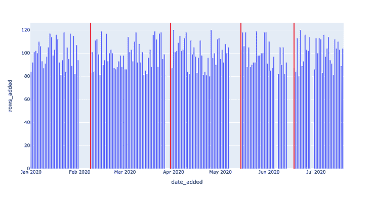

注意这两个未检测到的停机——这些必须少于 3 天的间隔。

现在我们可视化相同的新鲜度检测器，但`DAYS_SINCE_LAST_UPDATE > 7;`作为阈值。除了两个最大的停机外，其余都未被检测到。

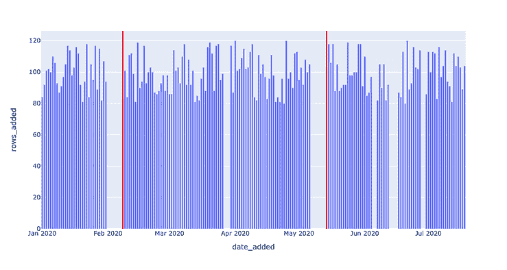

[就像行星一样](https://www.nasa.gov/vision/earth/livingthings/microbes_goldilocks.html)，最佳模型参数位于“金发姑娘区”或在被认为过低和过高的值之间的“甜蜜点”。这些数据可观测性概念（以及更多！）将在以后的文章中讨论。

### 分布

接下来，我们要评估数据的字段级分布健康。分布告诉我们数据的所有期望值，以及每个值的出现频率。一个最简单的问题是，“我的数据有多少`NULL`”？在许多情况下，某种程度的不完整数据是可以接受的——但如果 10%的空值率变成了 90%，我们需要了解。

这个查询返回了大量数据！发生了什么事？

一般公式`CAST(SUM(CASE WHEN SOME_METRIC IS NULL THEN 1 ELSE 0 END) AS FLOAT) / COUNT(*)`，按`DATE_ADDED`列分组，显示了`SOME_METRIC`在`EXOPLANETS`每日数据批次中的`NULL`值率。通过查看原始输出很难获得感觉，但可视化可以帮助揭示这一异常：

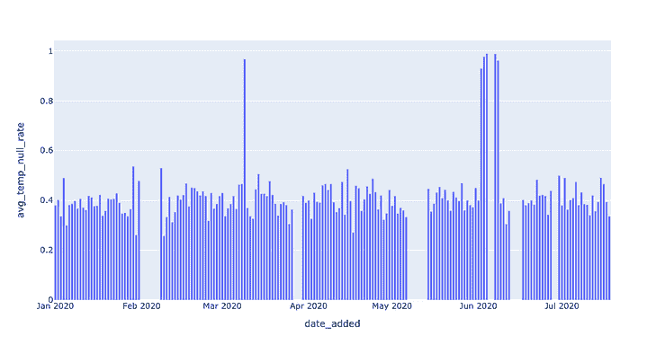

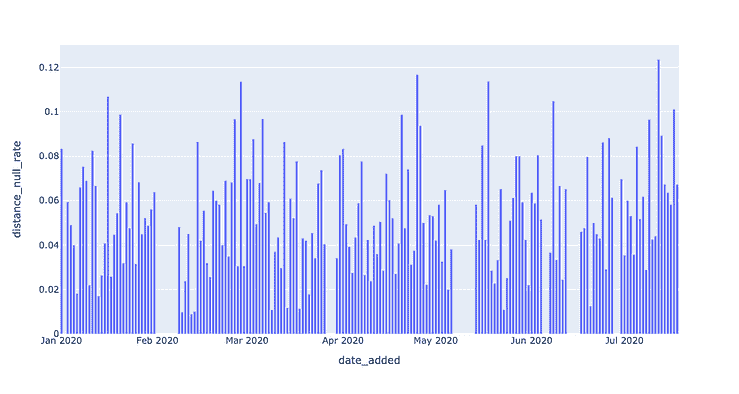

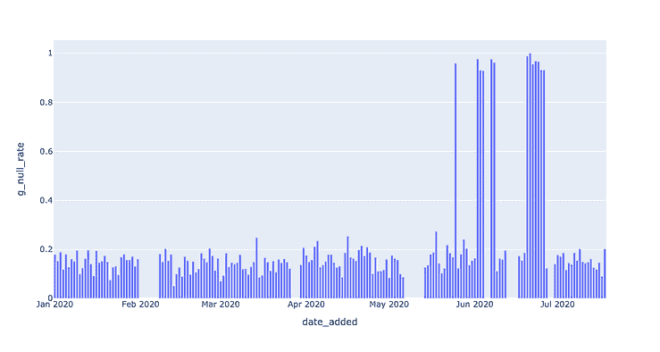

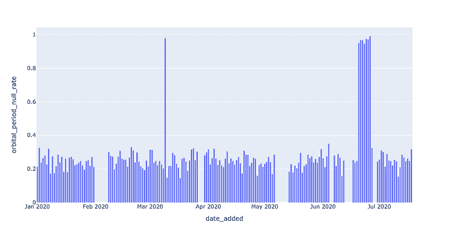

这些可视化清楚地表明，有一些空值率“峰值”事件我们应该检测。现在我们专注于最后一个指标`AVG_TEMP`。我们可以通过一个[简单阈值](https://datacadamia.com/data_mining/threshold)最基本地检测空值峰值：

我们的第一个分布异常。

就检测算法而言，这种方法有点粗糙。有时，我们的数据模式简单到可以用这样的阈值解决。然而，在其他情况下，数据可能会很嘈杂或有其他复杂情况，如[季节性](https://en.wikipedia.org/wiki/Seasonality)，这就需要我们改变方法。


例如，检测 2020-06-02、2020-06-03 和 2020-06-04 似乎是多余的。我们可以过滤掉在其他警报之后立即出现的日期：

注意这两个查询中的关键参数是`0.9`。我们实际上是在说：“任何高于 90%的空值率都是一个问题，我需要知道。”

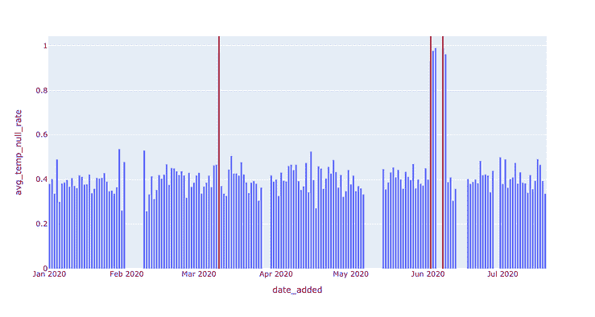

在这种情况下，我们可以（也应该）通过使用更智能的参数来应用[滚动平均](https://en.wikipedia.org/wiki/Moving_average)的概念，变得更加聪明。

一点澄清：注意在第 28 行，我们使用了`AVG_TEMP_NULL_RATE — TWO_WEEK_ROLLING_AVG`进行过滤。在其他情况下，我们可能需要对这个误差量取`ABS()`，但在这里则不需要——原因是`NULL`率的“激增”如果表示相对于之前的平均值的增加，那会更加令人担忧。监控`NULL`频率突然下降可能不太值得，而检测`NULL`率增加的价值则很明显。

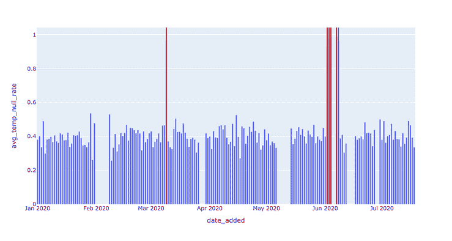

当然，还有越来越复杂的异常检测指标，如[**Z-score**](https://en.wikipedia.org/wiki/Standard_score)和[**自回归建模**](https://en.wikipedia.org/wiki/Autoregressive_model)，这些超出了本教程的范围。本教程仅提供了 SQL 中的基础框架，以进行字段健康监控；我希望它能给你自己数据上的一些启发！

### 接下来是什么呢？

本简短教程旨在展示“数据可观测性”并不像名字所暗示的那样神秘，通过全面了解数据健康，你可以在管道的每个阶段确保高数据信任度和可靠性。

实际上，数据可观测性的核心原则可以通过普通的 SQL“检测器”实现，只要保留一些关键的信息，如记录时间戳和历史表元数据。还值得注意的是，关键的机器学习驱动的参数调优对于随着生产环境增长的端到端数据可观测性系统是强制性的。

> 请继续关注本系列未来的文章，这些文章将重点关注分布和模式中的异常监控、数据可观测性中的血缘关系和元数据的作用，以及如何大规模监控这些支柱以实现更可靠的数据。

直到那时——祝你数据无停机！

***有兴趣了解如何大规模应用数据可观测性吗？请联系***[***Ryan***](https://www.linkedin.com/in/ryan-kearns-203686a9)***、***[***Barr***](https://www.linkedin.com/in/barrmoses/)***及其余的***[***Monte Carlo 团队***](https://www.montecarlodata.com/)***。***

**[Ryan Kearns](https://www.linkedin.com/in/ryanothnielkearns/)**是斯坦福大学的一名即将升入大四的学生，主修计算机科学和哲学。他目前是 Monte Carlo 的机器学习工程实习生。

**[Barr Moses](https://www.linkedin.com/in/barrmoses/)**是 Monte Carlo 的首席执行官兼联合创始人。此前，她曾担任 Gainsight 的运营副总裁。

[原文](https://towardsdatascience.com/data-observability-in-practice-using-sql-755dc6421f59)。经许可转载。

**相关：**

+   SQL 中的数据清理和整理

+   实用统计推理的 10 个原则

+   数据科学与商业智能的区别，详解

### 更多相关话题

+   [数据质量维度：用 Great Expectations 确保您的数据质量](https://www.kdnuggets.com/2023/03/data-quality-dimensions-assuring-data-quality-great-expectations.html)

+   [数据治理与可观测性，详解](https://www.kdnuggets.com/2022/08/data-governance-observability-explained.html)

+   [IMPACT 2022：数据可观测性峰会，10 月 25-26 日](https://www.kdnuggets.com/2022/09/monte-carlo-impact-2022-data-observability-summit.html)

+   [IMPACT：数据可观测性峰会将于 11 月 8 日回归](https://www.kdnuggets.com/2023/10/monte-carlo-impact-the-data-observability-summit-is-back)

+   [使用 Eurybia 检测数据漂移以确保生产 ML 模型质量](https://www.kdnuggets.com/2022/07/detecting-data-drift-ensuring-production-ml-model-quality-eurybia.html)

+   [免费 4 周数据科学课程：AI 质量管理](https://www.kdnuggets.com/2022/02/truera-free-4-week-data-science-course-ai-quality-management.html)
