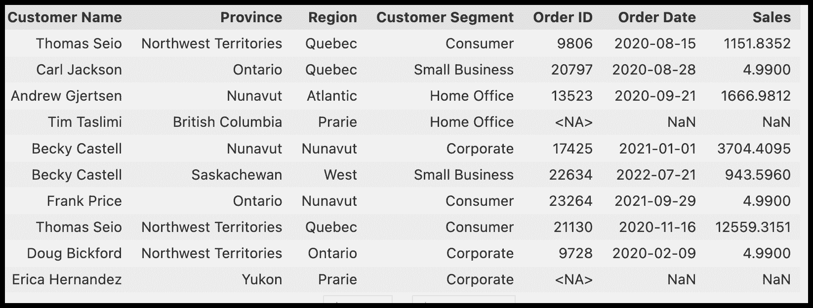

# 数据质量维度：用伟大的期望确保您的数据质量

> 原文：[`www.kdnuggets.com/2023/03/data-quality-dimensions-assuring-data-quality-great-expectations.html`](https://www.kdnuggets.com/2023/03/data-quality-dimensions-assuring-data-quality-great-expectations.html)


图片由[Mikael Blomkvist](https://www.pexels.com/photo/a-group-of-people-with-graphs-and-pie-charts-on-table-6476258/)提供

数据质量在任何数据管理过程中都发挥着关键作用。组织依赖数据来指导决策和推动各种业务效率。然而，如果数据充满了不准确、错误或不一致之处，它可能会弊大于利。

* * *

## 我们的前三大课程推荐

 1\. [Google 网络安全证书](https://www.kdnuggets.com/google-cybersecurity) - 快速进入网络安全职业生涯。

 2\. [Google 数据分析专业证书](https://www.kdnuggets.com/google-data-analytics) - 提升你的数据分析技能

 3\. [Google IT 支持专业证书](https://www.kdnuggets.com/google-itsupport) - 支持你的组织进行 IT

* * *

根据[2020 年 Gartner 调查](https://www.gartner.com/en/documents/3986583)，数据质量差的平均成本为每年 1280 万美元。正如最新的[数据质量状态](https://greatexpectations.io/static/abb8fc238738a68f75b0207b21131298/State_of_Data_Quality_Report-MQ.pdf)报告所示，生产延迟（产品发布延迟）是数据质量差的一个明显症状。高质量、无错误的数据能提高从中得出的见解的可靠性和可信度。

为了提高数据质量，你需要一个测量框架。数据质量维度可以帮助你实现这个目标。维度使你能够衡量覆盖范围并识别需要进行数据质量测试的组件。

这篇文章介绍了数据质量的六个维度：完整性、一致性、完整性、及时性、唯一性和有效性。通过解决这些维度，你可以全面了解数据的质量，并识别需要改进的领域。这就是伟大的期望（GX）发挥作用的地方。

# 伟大的期望

伟大的期望（GX）是一个基于 Python 的开源工具，用于管理数据质量。它为数据团队提供了对数据进行分析、测试和创建报告的能力。该工具具有用户友好的命令行界面（CLI），使设置新测试和定制现有报告变得简单。

伟大期望可以与各种提取、转换和加载 (ETL) 工具如 Airflow 和数据库集成。有关集成的详细列表和官方文档可以在伟大期望的[网站](https://greatexpectations.io/integrations)上找到。

GX 在其[仓库](https://greatexpectations.io/expectations/)中拥有许多期望。本文演示了如何使用单个期望来实现 GX 的数据质量维度。

# 数据

在开始实现之前，我们需要更多了解我们将使用的数据，以演示维度如何工作。

假设我需要创建一个数据集市分析，以找出销售部门在过去三年中每个区域的订单数量。

我们有一些订单的原始数据：

|  | **订单 ID** | **订单日期** | **销售额** | **客户名称** |
| --- | --- | --- | --- | --- |
|  | 5955 | 2021-05-27 | 314.6217 | 安·钟 |
|  | 21870 | 2022-08-28 | 996.9088 | 道格·比克福德 |
|  | 3 | 2019-03-04 | 6025.7924 | 贝斯·佩奇 |
|  | 19162 | 2021-04-11 | 403.5025 | 卡洛斯·索尔特罗 |
|  | 12008 | 2022-11-29 | 4863.0199 | 弗雷德·沃瑟曼 |
|  | 18630 | 201-09-16 | 4.9900 | 内奥拉·施奈德 |
|  | 18378 | 2022-01-03 | 1566.3223 | 道格·比克福德 |
|  | 15149 | 2020-03-12 | 1212.7117 | 米歇尔·隆斯代尔 |
|  | 9829 | 2022-06-27 | 695.7497 | 尤金·巴查斯 |
|  | 5188 | 2020-08-15 | 16426.6293 | 道格·比克福德 |

还有一些客户的原始数据：

| **客户名称** | **省份** | **区域** | **客户细分** |
| --- | --- | --- | --- |
| 安德鲁·艾伦 | 萨斯喀彻温省 | 努纳武特 | 消费者 |
| 特鲁迪·布朗 | 新斯科舍省 | 努纳武特 | 企业 |
| 迪奥尼斯·劳埃德 | 努纳武特 | 西部 | 企业 |
| 辛西娅·阿恩特森 | 西北地区 | 大西洋 | 企业 |
| 布鲁克·吉林厄姆 | 安大略省 | 安大略省 | 小型企业 |
| 亚历杭德罗·萨维利 | 新斯科舍省 | 努纳武特 | 消费者 |
| 哈罗德·帕夫兰 | 纽芬兰 | 大草原 | 企业 |
| 彼得·富勒 | 曼尼托巴省 | 魁北克省 | 消费者 |
| 伊昂尼亚·麦克格拉斯 | 魁北克省 | 魁北克省 | 家庭办公室 |
| 弗雷德·沃瑟曼 | 安大略省 | 大西洋 | 消费者 |

为了进行数据集市分析，我将使用基于客户名称（customer_regional_sales）的表：



# 在《伟大期望》中实现数据质量检查

为了本文的目的，使用了以下方法：

+   将数据保存在 3 个 CSV 文件中

+   使用 Pandas 读取 CSV

+   使用 Great Expectations 的 `from_pandas` 方法来转换 Pandas dataframe。

```py
import great_expectations as gx
import pandas as pd
df = pd.read_csv('./data/customer_regional_sales.csv',dtype={'Order ID': 'Int32'})
df_ge = gx.from_pandas(df)
```

这是对每个维度期望的一个良好示范。

伟大期望通过期望来评估数据。期望是以声明方式表达的陈述，可以被计算机评估，同时也对人类解释有意义。GX 具有 309 个期望，你还可以实现自定义期望。所有期望可以在[这里](https://greatexpectations.io/expectations)找到。

## 完整性

完整性是数据质量的一个维度，衡量数据集中是否存在所有预期的数据。换句话说，完整性指的是数据集中是否存在所有必需的数据点或值，如果没有，缺少了多少。还需要检查该列是否存在。

GreatExpectations 有一个特定的 Expectation 用于检查完整性：

`expect_column_values_to_not_be_null` —— 期望列值不为空。

为了使值被视为例外，它们必须明确为空或缺失。例如，PostgreSQL 中的 NULL 或 Pandas 中的 np.NaN。仅仅有一个空字符串还不足以被视为 null，除非它已经被转换为 null 类型。

它可以应用于我们的用例：

```py
df_ge.expect_column_values_to_not_be_null(
   column = 'Customer Name',
   meta = {
     "dimension": "Completeness"
   }
) 
```

## 唯一性

唯一性是数据质量的一个维度，指的是数据集中每条记录代表一个唯一且不同的实体或事件的程度。它衡量数据是否没有重复或冗余记录，以及每条记录是否代表一个唯一且不同的实体。

`expect_column_values_to_be_unique` —— 期望每个列值都是唯一的。

```py
df_ge.expect_column_values_to_be_unique(
   column = 'Order ID',
   meta = {
     "dimension": 'Uniqueness'
   }
) 
```

接下来的维度需要更多的业务背景。

## 永久性

永久性是数据质量的一个维度，衡量数据随时间的相关性和准确性。它指的是数据是否是最新的。例如，我的要求是数据集应该包含过去四年的记录。如果数据集中有较旧的记录，我应该收到错误提示。

为了测试永久性，我使用 Expectation: `expect_column_values_to_be_between`

这将有效，因为我可以解析日期并进行比较。

```py
import datetime

# Get the current date I use the start of the current year.
now = datetime.datetime(2023, 1, 1)
# Define the column to validate and the expected minimum date
min_date = now - datetime.timedelta(days=365*4)
# Create the expectation
df_ge.expect_column_values_to_be_between(
  "Order Date"
   min_value = min_date,
   parse_strings_as_datetimes=True,
   meta = {
     "dimension": 'Timelessness'
   }
)
```

## Validity

Validity 是一个数据质量的维度，衡量数据是否准确并符合预期的格式或结构。由于无效数据可能会干扰 AI 算法对数据集的训练，因此组织应建立一套系统的业务规则来评估数据有效性。

例如，在美国，出生日期通常包括一个月份、一个日期和一个年份，而社会保障号码由十位数字组成。美国的电话号码以三位数的区号开始。因此，确定出生日期的具体格式可能更具挑战性。

在我的数据集中，日期列“Order Date”的格式是 YYYY-MM-DD，因此我应该检查该列中的所有值。

GX 有一个针对日期的 Expectation —— `expect_column_values_to_be_valid_date`。这个 Expectation 基于 dateutil 的“parse”方法。

如果你需要检查字符串的长度，那么你应该使用 Expectation —— `expect_column_value_lengths_to_equal`

使用正则表达式来处理我的日期格式是一种通用做法：

```py
df_ge.expect_column_values_to_match_regex(
 column = 'Order Date',
 regex = '\d{4}-(0[1-9]|1[0-2])-(0[1-9]|[12][0-9]|3[01])',
 meta = {
   "dimension": "Validity"
 }
) 
```

我的愿景是，大多数 GX 仓库中的 Expectations 应该能够检查 Validity 维度。

## 一致性

一致性是数据质量的一个维度，指的是数据在数据集中的一致性和准确性。它衡量数据是否在逻辑上连贯，并符合预期的值、范围和规则。为了评估一致性，我通常将数据值与已知标准或值进行比较，并检查是否有差异或偏差。此外，我还使用统计方法来识别和纠正数据中的不一致。

作为我的数据集的一个示例，我创建了一个规则，即“Sales”列（表示每个订单的利润）不能为负。此外，我知道最大和为 25,000。

Great Expectations 提供了适用于此情况的 Expectation——expect_column_values_to_be_between。

```py
df_ge.expect_column_values_to_be_between(
   column = 'Sales',
   min_value = 0,
   max_value = 25000,
   meta = {
   "dimension": 'Consistency'
   }
) 
```

你也可以使用带有统计检查的 expectations：

[expect_column_mean_to_be_between](https://greatexpectations.io/expectations/expect_column_mean_to_be_between?filterType=Backend%20support&gotoPage=1&showFilters=false&viewType=Summary)

[expect_column_stdev_to_be_between](https://greatexpectations.io/expectations/expect_column_stdev_to_be_between?filterType=Backend%20support&gotoPage=1&showFilters=false&viewType=Summary)

## 完整性

完整性确保数据的正确性和有效性，特别是当它被用于多个地方时。这包括检查数据在不同数据集之间的连接时是否准确和一致，并确保数据遵循业务设定的规则。

我有两个数据源和一个与这两个数据集相关的数据集。这意味着我必须检查在进行转换时数据是否丢失。对我来说，最重要的参数是订单 ID。我想确保所有订单都被放置在 customer_regional_sales 中。

Great Expectations 提供了几种解决方案：

1.  使用 Expectation——expect_column_values_to_be_in_set。它期望每个列值都在给定的集合中。在这种情况下，我需要比较“orders”数据集中的订单 ID 与 customer_regional_sales 中的订单 ID。

    ```py
    df_expectations = pd.read_csv('./data/orders.csv',
                                   usecols=['Order ID'],
                                   squeeze = True
                                 )
    df_ge.expect_column_values_to_be_in_set(
       "Order ID",
       value_set = df_expectations.tolist(),
       meta = {
         "dimension": 'Integrity'
       }
    ) 
    ```

    如果列 customer_regional_sales.order_id 与 orders.order_id 不相等，这个 Expectation 将会失败。

1.  使用之前的 Expectation，但带有评估参数。你可以在官方[文档](https://docs.greatexpectations.io/docs/guides/expectations/advanced/how_to_dynamically_load_evaluation_parameters_from_a_database/)中了解更多关于如何完成这项工作的内容。

1.  使用 UserConfigurableProfiler 比较两个表。查看如何在官方文档[这里](https://docs.greatexpectations.io/docs/guides/expectations/advanced/how_to_compare_two_tables_with_the_user_configurable_profiler)中进行此操作。

1.  最后，如果你想检查 Change Data Capture 的完整性，你需要使用 [Data Quality Gate](https://github.com/provectus/data-quality-gate)。DQG 允许你通过一键在 AWS 上部署带有 GX 的数据质量解决方案。请阅读我们关于此解决方案的案例研究，详见 [AWS 技术博客](https://aws.amazon.com/ru/blogs/apn/how-provectus-built-a-high-load-data-quality-pipeline-on-aws-for-lane-health/)。

# 结论

本文演示了如何使用 Great Expectations 库在数据中实现数据质量维度。通过使用 Expectations 验证数据，你可以确保数据符合多种数据质量维度的要求，包括完整性、有效性、一致性、唯一性等。虽然我已经覆盖了一些示例，但还有许多其他 Expectations 可供你使用，以满足你的具体业务需求。

通过改进数据质量方法，你可以避免代价高昂的错误，提高数据及其衍生洞察的准确性和可靠性。

如果你有任何问题或建议，请随时在下方留言或直接通过 [LinkedIn](https://www.linkedin.com/in/chumagin/) 联系我。感谢阅读！

**[Aleksei Chumagin](https://www.linkedin.com/in/chumagin/)** 是一位出色的 QA 专家，现担任 Provectus 的 QA 主管。Aleksei 在测试、编程和团队建设方面拥有丰富的经验。他在数据质量方面的专业知识使他成为 Provectus 团队的宝贵资产。Aleksei 是 Great Expectations 社区的积极贡献者。

### 了解更多相关信息

+   [用 Great Expectations 解决数据质量问题](https://www.kdnuggets.com/2023/01/overcome-data-quality-issues-great-expectations.html)

+   [数据科学职业：7 个期望与现实](https://www.kdnuggets.com/2022/06/data-science-career-7-expectations-reality.html)

+   [数据科学：现实与期望](https://www.kdnuggets.com/2022/03/data-science-reality-expectations.html)

+   [成为出色数据科学家所需的 5 项关键技能](https://www.kdnuggets.com/2021/12/5-key-skills-needed-become-great-data-scientist.html)

+   [讲述一个精彩的数据故事：可视化决策树](https://www.kdnuggets.com/2021/02/telling-great-data-story-visualization-decision-tree.html)

+   [KDnuggets™ 新闻 22:n09, 3 月 2 日: 讲述一个精彩的数据故事：A…](https://www.kdnuggets.com/2022/n09.html)
