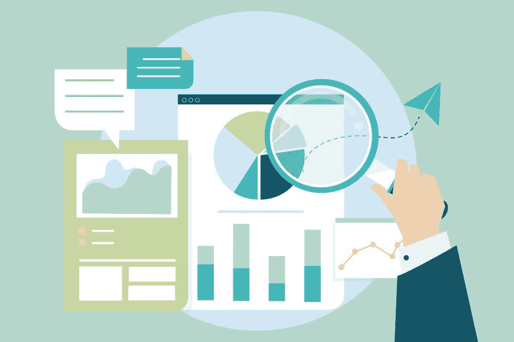

# 数据质量：优质的、劣质的与糟糕的

> 原文：[`www.kdnuggets.com/2022/01/data-quality-good-bad-ugly.html`](https://www.kdnuggets.com/2022/01/data-quality-good-bad-ugly.html)

[背景矢量由 rawpixel.com 创建 - www.freepik.com](https://www.freepik.com/vectors/background)

仅仅用创可贴解决方案并不能解决问题的根源。创建数据可视化以使数据看起来更好，或对不干净的数据应用决策树，只是浪费时间。你可以创建世界上所有的模型，但如果你呈现的结果中一个个出现错误，那毫无用处。如果你的发现被视为圣经，公司基于这些发现做出重要决策，我们都不想处于那种不舒服的境地。

* * *

## 我们的前三大课程推荐

 1\. [谷歌网络安全证书](https://www.kdnuggets.com/google-cybersecurity) - 快速进入网络安全职业生涯。

 2\. [谷歌数据分析专业证书](https://www.kdnuggets.com/google-data-analytics) - 提升你的数据分析能力

 3\. [谷歌 IT 支持专业证书](https://www.kdnuggets.com/google-itsupport) - 支持你的组织的 IT 需求

* * *

错误或不干净的数据会导致错误的结论。理解和清理数据所花费的时间对结果的结果和质量至关重要。数据质量总是比复杂的华丽算法更胜一筹。

## 那么什么是数据质量？

数据质量是衡量数据集是否适合其特定用途及其可信程度的标准。它由准确性、完整性、一致性、有效性和时效性等特征组成。让我们简要地进一步解析这些特征。

1.  **准确性**：这指数据与现实世界情境的匹配程度，使其可以使用。

1.  **完整性**：一个数据集如果存在太多缺口或空白，将无法通过正确的分析来回答特定问题。

1.  **一致性**：存储在一个位置的数据应当与存储在另一个位置的数据一致且不冲突。

1.  **有效性**：这指数据的收集方式，定义业务规则和规范。它应当格式正确并在正确的范围内。

1.  **时效性**：随时可用且易于访问的数据比随着时间推移变得不那么有用和准确的数据更有利于公司。

## 什么保证了数据质量？

可以使用特定的数据质量工具来改善和估算数据质量。例如：

1.  **数据剖析**：这涉及到检查数据源，了解其结构及其潜在用途。

1.  **数据标准化**：这是将数据转换为统一格式的过程，使分析师能够利用这些数据。

1.  **监控**：对数据质量进行频繁检查至关重要。有特定工具可以检测和修正数据。

1.  **历史数据和实时数据**：已经清理过的数据允许分析师将相同的数据质量框架应用于其他数据领域和应用程序。

实时数据质量在医疗保健领域的一个例子是确保患者数据的准确性和有效性。这对于文档记录、支付、风险管理和保护患者数据等方面至关重要。

## 数据质量的正面影响

1.  **决策**：数据质量越高，公司和用户在基于输出结果做出重要决策时的信任度就越高。这反过来降低了公司做出错误决策的风险。

1.  **生产力**：没有人愿意花费数小时修复数据错误。如果在初始步骤采取了正确措施，就可以让员工专注于下一步和其他责任。

1.  **目标**：高质量的数据可以确保公司当前和未来目标的准确性，例如，市场营销团队更好地了解什么有效、什么无效。

1.  **合规**：许多行业使用特定的指南来保持数据的隐私和安全，以防止任何泄露或潜在攻击。在金融领域，数据质量的缺乏可能会导致数百万美元的罚款或洗钱问题。

## 数据质量差的负面影响

1.  **输给竞争对手**：如果你的竞争对手拥有比你更好的数据，提供给他们更多的见解可能导致错失机会，并对公司造成潜在的损害。不要让你的竞争对手超越你！

1.  **收入**：基于不正确的数据做出的决策可能导致收入损失。例如，基于错误的 demographic 数据做出的政治决策可能会引发社会和财务问题。

1.  **声誉**：每个人都希望提升和维护他们的声誉，尤其是当涉及到金钱时。基于糟糕数据做出的决策可能对公司造成严重损害，甚至可能失去投资者或公司本身。人们往往更容易记住坏的事情。

## 结论

在查看数据时，问自己这些问题：

**1\. 数据是如何收集的？**

数据来源很重要。例如，这些数据是通过政府普查收集的，还是由某人手动创建并上传到 Kaggle 上的。收集来自上班路上不太感兴趣的人的数据，与发送调查问卷的网页链接让他们在自己时间里填写的方式是不同的。

**2\. 数据代表了什么？**

数据是否能很好地代表你或公司所寻找的内容？使用基于巴黎的数据对法国的统计人口数据做出具体声明是不准确的。

**3\. 数据清理过程是怎样的？**

有不同的方法来清理数据，选择一个特定的数据集或数据类型唯一的方法是很重要的。

**4\. 你在做什么来维护数据质量？**

投资于合适的人才和基础设施，以维持和持续改善数据质量在技术领域中至关重要。

总是比直接面对一个可以避免的问题并花费时间和精力找解决方案要好。我总是说，做一次彻底，以后就不需要不断回头了。

**[尼莎·阿雅](https://www.linkedin.com/in/nisha-arya-ahmed/)**是一名数据科学家和自由职业技术写作者。她特别感兴趣于提供数据科学职业建议或教程，以及围绕数据科学的理论知识。她还希望探索人工智能在延长人类寿命方面的不同方式。作为一个热衷学习的人，她寻求拓宽技术知识和写作技能，同时帮助指导他人。

### 主题更多内容

+   [数据质量维度：用伟大的期望确保数据质量](https://www.kdnuggets.com/2023/03/data-quality-dimensions-assuring-data-quality-great-expectations.html)

+   [揭示糟糕的科学](https://www.kdnuggets.com/2022/01/demystifying-bad-science.html)

+   [10 个最常见的数据质量问题及其解决方法](https://www.kdnuggets.com/2022/11/10-common-data-quality-issues-fix.html)

+   [元数据如何改善安全性、质量和透明度](https://www.kdnuggets.com/2022/04/metadata-improves-security-quality-transparency.html)

+   [使用 Eurybia 检测数据漂移以确保生产 ML 模型质量](https://www.kdnuggets.com/2022/07/detecting-data-drift-ensuring-production-ml-model-quality-eurybia.html)

+   [免费 4 周数据科学课程：人工智能质量管理](https://www.kdnuggets.com/2022/02/truera-free-4-week-data-science-course-ai-quality-management.html)
