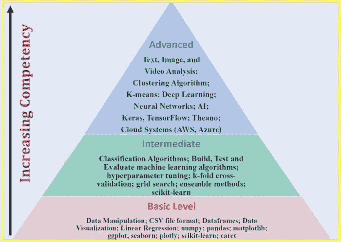
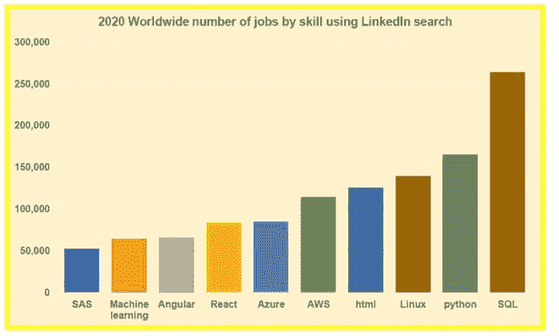
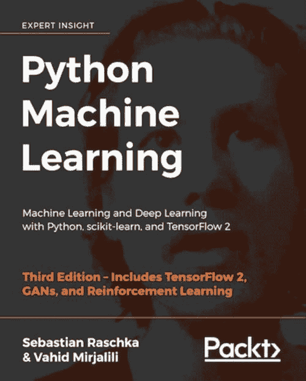

# 数据科学适合我吗？14 个自我审查问题值得考虑

> 原文：[`www.kdnuggets.com/2020/11/data-science-14-self-examination-questions.html`](https://www.kdnuggets.com/2020/11/data-science-14-self-examination-questions.html)

comments

* * *

## 我们的前三大课程推荐

 1\. [Google 网络安全证书](https://www.kdnuggets.com/google-cybersecurity) - 加速进入网络安全职业生涯。

 2\. [Google 数据分析专业证书](https://www.kdnuggets.com/google-data-analytics) - 提升你的数据分析技能

 3\. [Google IT 支持专业证书](https://www.kdnuggets.com/google-itsupport) - 支持你的组织的 IT

* * *

*图片来源：Unsplash.*

数据现在被认为是增长最快、价值数十亿的行业之一。因此，企业和组织正在尽可能利用他们已经拥有的数据，并确定他们还需要捕获和存储哪些数据。此外，对于数据科学家的需求仍然巨大，他们需要解读数据并揭示混乱商业问题的隐藏解决方案。一个 [最近的研究](https://medium.com/towards-artificial-intelligence/top-10-tech-skills-in-2020-worldwide-ecef27c8d8ad) 使用 LinkedIn 工作搜索工具显示，2020 年的大多数顶级技术职位都需要数据科学技能。

在数据科学充满激动人心的机会的背景下，自我教育是获得所需技能和经验的绝佳方式，这样可以在这个竞争激烈的领域中脱颖而出，并为你的雇主提供竞争优势。在投入数据科学领域之前，重要的是要审视以下问题，以评估数据科学是否真的适合你。

### 1\. 什么是数据科学？

数据科学是一个涵盖多个子领域的广泛领域，如数据准备和探索、数据表示和转换、数据可视化和展示、预测分析、机器学习、深度学习、人工智能等。可以考虑数据科学能力的三个级别（*基于一本优秀的机器学习教材《Python 机器学习》第三版的主题定义的 3 个级别*），即：**一级**（基础水平）；**二级**（中级水平）；和**三级**（高级水平）。能力从一级到三级逐渐增加，如下图**图 1**所示。

***图 1**. 数据科学能力的三个级别。图片由 Benjamin O. Tayo 提供*

### 2\. 数据科学家做什么？

数据科学家利用数据来提取有意义的结论，并驱动机构或组织的决策。 他们的工作包括数据收集、数据转化、数据可视化和分析、构建预测模型，以及根据数据发现提供实施建议。 数据科学家在不同的领域工作，如医疗、政府、工业、能源、学术界、技术、娱乐等。 一些招聘数据科学家的顶级公司包括亚马逊、谷歌、微软、脸书、LinkedIn、Twitter、Netflix、IBM 等。

### 3\. 数据科学家的就业前景如何？

数据科学家的就业前景非常积极。 [IBM 预测](https://www.forbes.com/sites/louiscolumbus/2017/05/13/ibm-predicts-demand-for-data-scientists-will-soar-28-by-2020/#7e46c7607e3b) 数据科学家的需求将在 2020 年增长 28%。 一项[近期研究](https://medium.com/towards-artificial-intelligence/top-10-tech-skills-in-2020-worldwide-ecef27c8d8ad)使用 LinkedIn 的职位搜索工具显示，2020 年大多数顶尖科技职位都需要数据科学、商业分析、机器学习和云计算技能（见**图 2**）。

***图 2**. 使用 LinkedIn 的职位搜索工具显示的全球技能类别职位数量。图片由 Benjamin O. Tayo 提供。*

### 4\. 数据科学家的收入是多少？

你作为数据科学家的收入取决于你工作的组织或公司、你的教育背景、工作经验年限以及你的具体职位。数据科学家的收入范围从$50,000 到$250,000， 中位数薪资约为$120,000。此[文章](https://towardsdatascience.com/how-much-do-data-scientists-make-cbd7ec2b458)讨论了更多关于数据科学家的薪资信息。

### 5\. 我如何为数据科学职业做准备？

大多数数据科学或商业分析项目要求以下条件：

1.  a) 高水平的定量能力

1.  b) 解决问题的思维方式

1.  c) 编程能力

1.  d) 有效沟通的能力

1.  e) 团队合作能力

因此，为了准备数据科学职业，你可以从攻读一个定量学科的学士学位开始，例如**科学**、**技术**、**工程**、**数学**、**商业**或**经济学**。

### 6\. 我应该重点关注哪些编程语言？

如果你对学习数据科学基础感兴趣，你需要从某处开始。不要被[数据科学家职位广告中提到的荒谬编程语言清单](https://towardsdatascience.com/ridiculous-requirements-from-data-scientist-job-ads-d84fa716af73)所压倒。虽然学习尽可能多的数据科学工具很重要，但建议一开始只学一两种编程语言。一旦你建立了坚实的数据科学基础，你可以挑战自己学习不同的编程语言或不同的平台和生产力工具来提升你的技能。根据这篇[文章](https://towardsdatascience.com/python-and-r-unequivocal-champions-of-data-science-31ab4d1fa45e)，Python 和 R 仍然是数据科学中使用的两大编程语言。我建议从 Python 开始，因为越来越多的学术培训项目和行业将其作为数据科学的默认语言。

### 7\. 成为数据科学家需要多长时间？

如果你在分析学科如**物理学**、**数学**、**工程学**、**计算机科学**、**经济学**或**统计学**有坚实的基础，你基本上可以自学数据科学的基础知识。你可以从像 edX、Coursera 或 DataCamp 这样的免费在线课程开始。**一级**能力（见**图 1**）可以在 6 到 12 个月内达到。**二级**能力可以在 7 到 18 个月内达到。**三级**能力可以在 18 到 48 个月内达到。获得某一水平的能力所需的时间取决于你的背景以及你愿意投入的数据科学学习时间。通常，有分析学科背景的人，如物理学、数学、科学、工程学、会计或计算机科学的背景，所需的时间较少，而背景与数据科学不相符的人则需要更多时间。

### 8\. 我是否有足够的耐心，即使在项目遇到瓶颈时也能继续工作？

数据科学项目可能非常漫长且要求高。从问题框定到模型建立和应用，这一过程可能需要几周甚至几个月，具体取决于问题的规模。作为一名数据科学家，遇到项目瓶颈是不可避免的。耐心、韧性和*毅力*是成功的数据科学职业生涯中必不可少的关键品质。

### 9\. 我是否具备能够从模型中得出有意义结论的商业头脑，以便为我的组织做出重要的数据驱动决策？

数据科学是一个非常实用的领域。记住，你可能在处理数据和构建优秀的机器学习算法方面非常出色，但作为数据科学家，现实世界的应用才是最终的关键。每个预测模型必须在现实情况下产生有意义和可解释的结果。一个预测模型必须经过现实验证才能被认为是有意义和有用的。你作为数据科学家的角色是从数据中提取有意义的洞察，以用于数据驱动的决策，这些决策可以提高公司的效率、改善业务运作方式或帮助增加利润。

### 10\. 我有良好的沟通技能吗？

数据科学家需要能够与团队成员或组织中的业务管理员沟通他们的想法。良好的沟通技能在这里扮演关键角色，能够将非常技术性的知识传达给对数据科学技术概念了解甚少的人。良好的沟通技能将帮助营造与数据分析师、数据工程师、现场工程师等其他团队成员的团结与合作氛围。

### 11\. 我是终身学习者吗？

数据科学是一个不断发展的领域，因此要准备好接受和学习新技术。保持与领域发展联系的一种方式是与其他数据科学家建立网络。一些促进网络建设的平台有 LinkedIn、GitHub 以及 medium（[Towards Data Science](https://towardsdatascience.com/)和[Towards AI](https://towardsai.net/)出版物）。这些平台对获取有关该领域最新发展的信息非常有用。

### 12\. 我是团队合作者吗？

作为数据科学家，你将与数据分析师、工程师、管理员组成团队，因此需要良好的沟通技能。你还需要成为一个好的倾听者，特别是在早期项目开发阶段，你需要依赖工程师或其他人员来设计和构建一个好的数据科学项目。成为一个优秀的团队合作者将帮助你在商业环境中蓬勃发展，并保持与团队其他成员以及组织的管理员或董事的良好关系。

### 13\. 我道德吗？

数据科学中必须考虑伦理和隐私。你需要了解项目的含义。对自己要诚实。避免操控数据或使用方法故意产生结果偏差。在所有阶段，包括数据收集和分析、模型构建、分析、测试和应用中，都要保持伦理。避免为了误导或操控受众而伪造结果。在解释数据科学项目的发现时，要保持伦理。

### 14\. 学习数据科学的一些资源有哪些？

如果条件允许，你可以追求数据科学或商业分析的硕士学位。如果你无法负担硕士学位课程，你可以选择自学数据科学。一般来说，如果你在物理学、数学、经济学、工程学或计算机科学等分析学科中有扎实的背景，并且对探索数据科学领域感兴趣，最好的方式是从大规模开放在线课程（MOOCs）开始。然后在建立了坚实的基础之后，你可以寻求其他方式来提升自己的知识和技能，比如学习教材、参与项目以及与其他数据科学爱好者建立网络。

以下是推荐的 MOOCs 和教材，可以帮助你掌握数据科学的基础。

**推荐的 MOOCs：**

[数据科学专业证书（HarvardX，通过 edX）](https://www.edx.org/professional-certificate/harvardx-data-science)

[分析：必要工具与方法（乔治亚理工 X，通过 edX）](https://www.edx.org/micromasters/analytics-essential-tools-methods)

[应用数据科学与 Python 专业（密歇根大学，通过 Coursera）](https://www.coursera.org/specializations/data-science-python)

**推荐的书籍：**

从教材中学习可以提供比在线课程更精炼和深入的知识。这本书提供了数据科学和机器学习的绝佳入门，包含代码：《Python 机器学习》，作者为 Sebastian Raschka。[`github.com/rasbt/python-machine-learning-book-3rd-edition`](https://github.com/rasbt/python-machine-learning-book-3rd-edition)

作者以非常易于理解的方式解释了机器学习的基本概念。此外，书中包含代码，因此你可以实际使用这些代码进行练习和构建自己的模型。我个人发现这本书在我的数据科学之旅中非常有用。我会推荐这本书给任何数据科学爱好者。你所需要的只是基础的线性代数和编程技能，就能理解这本书。

还有很多其他优秀的数据科学教材，例如 Wes McKinney 的《[Python for Data Analysis](https://sushilapalwe.files.wordpress.com/2018/04/python-for-data-analytics-book.pdf)》、Kuhn 和 Johnson 的《[Applied Predictive Modeling](https://vuquangnguyen2016.files.wordpress.com/2018/03/applied-predictive-modeling-max-kuhn-kjell-johnson_1518.pdf)》以及 Ian H. Witten、Eibe Frank 和 Mark A. Hall 的《[Data Mining: Practical Machine Learning Tools and Techniques](https://www.wi.hs-wismar.de/~cleve/vorl/projects/dm/ss13/HierarClustern/Literatur/WittenFrank-DM-3rd.pdf)》。

### 总结

总结一下，我们讨论了 14 个数据科学 aspirants 常见的重要问题。尽管不同个体的入门路径可能不同，但本文提供的答案可以为那些考虑数据科学领域的人提供一些指导。

**相关：**

+   [如何在没有学位的情况下进入数据科学领域](https://www.kdnuggets.com/2020/11/data-science-without-degree.html)

+   [如何成为 10 倍数据科学家](https://www.kdnuggets.com/2020/10/10x-data-scientist.html)

+   [数据科学家还是机器学习工程师？哪个职业选择更好？](https://www.kdnuggets.com/2020/11/greatlearning-data-scientist-machine-learning-engineer.html)

### 更多相关主题

+   [停止学习数据科学来寻找目的，并通过寻找目的来……](https://www.kdnuggets.com/2021/12/stop-learning-data-science-find-purpose.html)

+   [学习数据科学统计学的最佳资源](https://www.kdnuggets.com/2021/12/springboard-top-resources-learn-data-science-statistics.html)

+   [成功数据科学家的 5 个特征](https://www.kdnuggets.com/2021/12/5-characteristics-successful-data-scientist.html)

+   [每个数据科学家都应该了解的三个 R 库（即使你使用 Python）](https://www.kdnuggets.com/2021/12/three-r-libraries-every-data-scientist-know-even-python.html)

+   [一个 90 亿美元的 AI 失败案例分析](https://www.kdnuggets.com/2021/12/9b-ai-failure-examined.html)

+   [是什么让 Python 成为初创公司的理想编程语言](https://www.kdnuggets.com/2021/12/makes-python-ideal-programming-language-startups.html)
