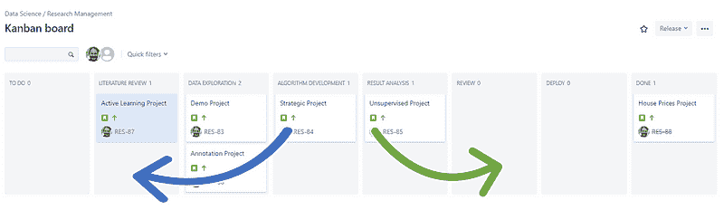
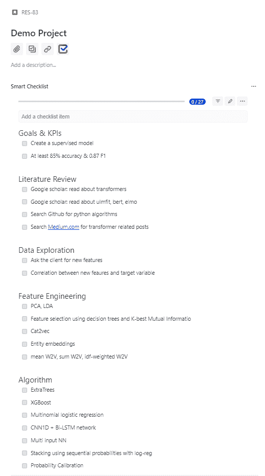
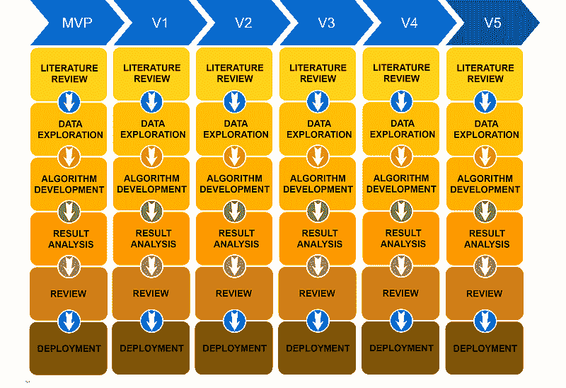

# 数据科学？敏捷？周期？我在高科技行业中管理数据科学项目的方法。

> 原文：[`www.kdnuggets.com/2019/02/data-science-agile-cycles-method-managing-projects-hi-tech-industry.html`](https://www.kdnuggets.com/2019/02/data-science-agile-cycles-method-managing-projects-hi-tech-industry.html)

 评论

**由 [Ori Cohen](https://www.linkedin.com/in/cohenori/)，[Zencity.io](https://zencity.io/) 的数据科学负责人**

奥地利阿尔卑斯山

* * *

## 我们的三大课程推荐

 1\. [Google 网络安全证书](https://www.kdnuggets.com/google-cybersecurity) - 快速进入网络安全职业。

 2\. [Google 数据分析专业证书](https://www.kdnuggets.com/google-data-analytics) - 提升你的数据分析技能

 3\. [Google IT 支持专业证书](https://www.kdnuggets.com/google-itsupport) - 支持你的组织的 IT 需求

* * *

敏捷软件开发已经在高科技行业中占据了主导地位。无论是以 Scrum、Kanban 还是 Scrumban 的形式实施，这些方法都是为了灵活应对，允许通过短周期的工作进行快速变化。虽然这些实施方法非常适合开发，但在某些方面与研究存在冲突，因此为了在研究中保持敏捷，我们需要调整敏捷的核心价值观，并将其与研究方法论对接，即创建一个利用敏捷价值观和思想但面向研究的工作实现。以下是我开发的一种方法，基于我个人管理数据科学研究团队的经验，并在多个项目中进行了测试。在接下来的章节中，我将从时间的角度审视不同类型的研究，比较开发和研究工作流程的方法，并最终提出我的工作方法论。

### **研究类型**

我们通常会遇到三种类型的研究：

1.  长期的，涉及学术界和像 IBM 或 FACEBOOK 这样的公司，即推动科学或技术进步的研究。

1.  中期，即将在不久的将来对公司有贡献的战略项目。

1.  短期项目，即公司产品的功能、客户项目、内部项目，如可重用的 API 或 POC。

短期或中期项目，在我看来，适用于任何与学术或公司相关的项目，这些项目旨在创建新算法或实现新功能，但受到行业限制，如时间、资源或资金。相比之下，长期研究通常是最令人畏惧的（尽管也有例外）。例如，在许多面试中，作为一名博士毕业生，我被问及是否可以在一个快节奏的初创公司中工作，并在短期内交付结果。

### **开发和研究之间的主要区别**

让我们比较一下这两个领域的开发工作流程。

***编程***：在软件开发中，你将代码组织成函数、类（即面向对象编程），并可能使用设计模式等。你尝试设计一个清晰、可重用且易于维护的通用架构。在研究中，这个过程可以比作一个原型阶段，我们需要大量的灵活性，这使我们能够尽快尝试许多想法。对我和其他人来说，这归结为使用“Notebooks”——一个互动的 Python 环境，它通过将某些代码块分隔开来实现比传统 IDE 更快的**原型**设计，并保持持久的内存。我们不需要在没有必要时重新加载巨大的变量或重新计算算法，可以继续从上一个阶段工作。编程笔记本可以比作使用一个大的‘main’，分成多个单元格，每个单元格充当一个函数。传统编程 IDE 也不支持持久内存，试想在调试某个算法时读取一个巨大的数据集。

***调试***：调试过程有成熟的工具，你可以轻松地逐行跟踪，进入函数和类。在传统 IDE 中，你被迫重新加载数据集，每次重新启动调试过程时浪费宝贵的时间，而在笔记本中，数据集是持久的，整个过程中都保存在内存中（只要内核没有重置）。在笔记本中，调试过程包括使用 print()，因此，调试阶段确实相当简单。最终，当算法完成时，我们使用传统的软件开发工具，如 PyCharm，结合面向对象编程、设计模式进行重构，最后编写输入输出测试。

***时间和进度管理***：在常见的敏捷实施中，每个项目被分解为许多小的可交付任务，并且这些任务被给予一个短期估计。交付物被分组到周期中。这些小任务由团队成员拉取，直到完成，尽量在周期结束前完成所有任务。周期每 X 周重置一次。一般而言，研究任务较长，并且它们并不总是与短周期方法很好地匹配。例如，当我们启动一个模型时，可能需要几周才能获得理想的准确率。然而，这并不意味着在那些周内我们看不到其他方式的可测量结果，即特征与目标变量之间的相关性等。

既然我们已经讨论了软件开发和研究之间的一些主要区别，让我们来谈谈我的敏捷研究管理方法，并看看我如何尝试解决这些问题。

### **我的研究管理方法论**

在研究中，我们考虑产品需求，分配特性，思考可能的算法解决方案，定义目标和关键绩效指标。事实是，我们没有一条清晰的路径通向那个目标，换句话说，我们不知道完成任务的确切路线。算法开发不仅仅是生产，它更多的是关于理解问题、评估选项、验证等。在实践中，我们根据直觉和经验测试许多不同的假设和想法，有些可能会有帮助，其他则可能不会。

我们首先为项目确定一个合理的截止日期，无论是两周、一个月还是更长时间，基本上是根据你的经验或估算认为所需的时间。不同项目之间的截止日期并不一致，因此难以放在严格的周期中。重要的是要记住，这些截止日期可能会变化，项目可能会比预期延长或提前结束。

我将每个项目分解为六个基本阶段（图 1.），这使我能够根据上下文对子任务进行分组。可以在图 1 中看到的这六个基本阶段列在下方，作为一个 Jira 面板。

图 1：应用研究或数据科学项目的六个阶段

### **项目阶段：**

1\. 文献综述

2\. 数据探索

3\. 算法开发

4\. 结果分析

5\. 评审

6\. 部署

使用阶段方法，项目可以在各个阶段之间来回迭代，直到完成（图 2 中的蓝色和绿色箭头）。例如，我们完成了算法的编写，在‘结果分析’阶段我们发现需要回到‘数据探索’阶段并修改一个核心特征工程思路，项目将回到‘数据探索’并再次经历算法和结果分析阶段。

图 2：应用研究或数据科学项目的六个阶段覆盖在 Jira 看板上。展示了一个项目可以在不同阶段之间移动，无论是向前还是向后。

在每个阶段，我创建尽可能多的想法、假设或任务，即交付物。例如，在“文献综述”阶段，你可能有几个任务，比如在 Google Scholar 上查找论文、搜索 Github.com 或尝试在 Medium.com 上找到相关帖子。在“数据探索”阶段，你可能会探索特征工程、选择或今天所有可用的嵌入方法，从 word2vec、phrase2vec、sent2vec 到 Elmo、Bert 等。在“算法”阶段，我们可以测试几个经典的机器学习算法，尝试一些神经网络想法（CNN、LSTM、BI-GRU、多输入网络）、堆叠算法、集成方法等。在“结果分析”阶段，我们可以探索许多指标，如准确性、F1，检查模型的正确性等。在“审查”阶段，一名团队成员会审查我们的算法。最后，在“部署阶段”，我们将笔记本转换为清晰的基于类的 API，向 DevOps 团队暴露 init()、train()、predict()、upload_model() 和 download_model()，[创建单元测试](https://towardsdatascience.com/unit-testing-and-logging-for-data-science-d7fb8fd5d217)并以 Pip 包结束（我们使用的是 circleCI 和 Gemfury）。

我不对每个交付物分配估计，因为这增加了计划开销，安装了一个我想避免的僵化工作计划，并扰乱了研究过程中的创造力，即，我们不希望工作计划来管理我们，我们希望管理工作计划。我希望我的团队探索在创造性过程中出现和想到的不同解决方案，而不是坚持一个基本上只是愿望清单的预定计划。换句话说，过程中的数据、结果和洞察力会产生许多杰出的想法，从而使我的团队能够解决新颖的业务问题。

最终，我们探索许多可能引导我们实现目标的想法，但在每个阶段完成所有任务并不是强制性的，换句话说，如果我们对当前阶段感到满意，我们可以在没有完成所有其他任务的情况下进入下一阶段。另一方面，如果你对当前计划不满意，可以更改它、跳过或回退。

作为一个小团队的经理，我不希望承担子任务管理的额外负担。为了管理这些子任务，我使用了 JIRA 的 ‘[smart-checklist 插件](https://marketplace.atlassian.com/apps/1216451/smart-checklist-for-jira-enterprise)’，如图 3 所示。任务列表包含在每个项目框中，适当的任务可以在 UI 中标记为‘完成’或‘进行中’，显然，你只在项目框所在的阶段处理子任务。随着团队的成长，你可能会有专人负责维护每个子任务的详细信息，并可能需要使用 JIRA 内置的子任务管理功能，这会增加子任务管理的负担。我个人认为，我们的大多数子任务不需要全面跟踪，面板视图应尽可能干净和分组。

图 3：一个示例项目，其中每个主要阶段都有任务。

### **研究日常**

项目管理不仅仅依赖于管理委员会，每日会议也是项目管理的重要方面。我的团队每天有一个小时的会议，通常在早上，类似于开发，我们尝试头脑风暴、同步，讨论昨天的工作，讨论遇到的问题，并谈论下一步。由于我们讨论的时间相对较长，我发现坐着开会更为合适，相比于站立式会议，即在沙发上讨论细节要更有益。这让我们能够分享想法，进行创意讨论，并不断改进，而无需等待周期结束后的反馈。

### **研究工作流程：**

以下是我的研究工作流程方法的概述。

1.  用符合项目期望、目标和 KPI 的合理项目截止日期替代周期方法论。

1.  认识到一个项目在其生命周期中存在多个阶段。

1.  认识到一个项目可以暂时返回到之前的阶段以尝试额外的想法。

1.  将每个项目拆分为阶段性成果。

1.  为每个阶段分配一个软截止日期。

1.  认识到你的成果清单不需要整体完成，成果可以在项目过程中添加，这会影响截止日期。

1.  在每个阶段，选择首先完成的最佳成果，当满意后，转到下一个研究阶段。

1.  洗净、冲洗、重复。

### **版本开发**

让我们简要讨论一下算法开发版本。我通常会努力实现项目目标和 KPI，但一个“足够好”的算法总比没有算法要好。因此，建议创建一个最小可行产品（MVP），完成过程，将其投入生产，然后决定下一版本的未来目标，这些目标可能来自产品部门、结果分析阶段或未完成的工作计划，如图 4 所示。

图 4：一个流程图，表示在利用研究阶段方法学工作流时的版本开发。

希望你能调整或使用这里提到的一些想法来管理数据科学研究项目。请记住，为了使这种方法有效，你的公司必须理解研究是一个不确定的过程，有些结果无法保证，但通过正确的项目管理方法，过程可以成功控制，以实现我们的目标。最后，如果你对从产品设计到模型完成和维护的项目工作流程感兴趣，Shay Palachy 写了一篇精彩的 [文章](https://towardsdatascience.com/data-science-project-flow-for-startups-282a93d4508d)。

我想感谢（按字母顺序排列）**阿龙·尼瑟**、**盖·内舍尔**、**伊多·伊夫里**、**科比·希克里**、**摩西·哈达德**、**内塔内尔·大卫维茨**、**塞缪尔·杰弗罗金**、**西蒙·雷斯曼**，感谢他们对敏捷方法论的宝贵见解、批评、校对和评论。

**个人简介： [Ori Cohen](https://www.linkedin.com/in/cohenori/)** 拥有计算机科学博士学位，专注于机器学习。他领导着 [Zencity.io](https://zencity.io/) 的数据科学团队，努力积极影响市民生活。

[原文](https://towardsdatascience.com/data-science-agile-cycles-my-method-for-managing-data-science-projects-in-the-hi-tech-industry-b289e8a72818)。经许可转载。

**相关内容：**

+   初创公司数据科学项目流程

+   从敏捷数据科学团队中获得实际世界的结果

+   通过深度学习加速敏捷过程

### 更多相关话题

+   [在 Pandas Dataframes 中使用 apply() 方法](https://www.kdnuggets.com/2022/07/apply-method-pandas-dataframes.html)

+   [__getitem__ 的介绍：Python 中的魔法方法](https://www.kdnuggets.com/2023/03/introduction-getitem-magic-method-python.html)

+   [掌握数据科学项目管理的 7 个步骤](https://www.kdnuggets.com/2023/07/7-steps-mastering-data-science-project-management-agile.html)

+   [管理深度学习数据集的新方法](https://www.kdnuggets.com/2022/03/new-way-managing-deep-learning-datasets.html)

+   [管理数据科学项目的 4 个步骤](https://www.kdnuggets.com/2022/05/4-steps-managing-data-science-project.html)

+   [在生产环境中通过 MLOps 管理模型漂移](https://www.kdnuggets.com/2023/05/managing-model-drift-production-mlops.html)
