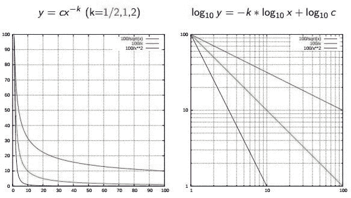
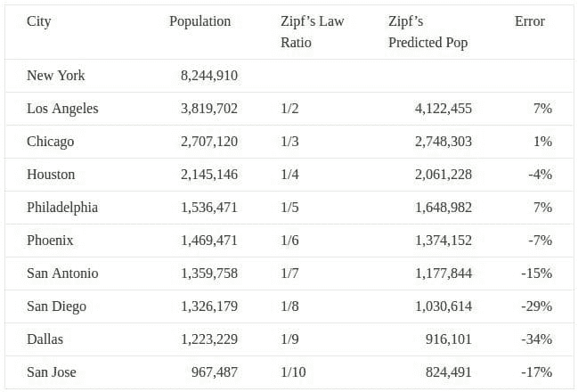
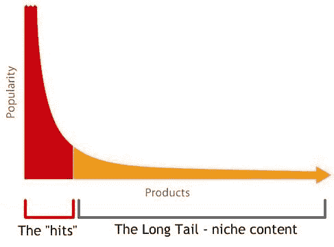

# 数据科学基础：权力法则和分布

> 原文：[`www.kdnuggets.com/2016/12/data-science-basics-power-laws-distributions.html`](https://www.kdnuggets.com/2016/12/data-science-basics-power-laws-distributions.html)

权力法则是一种强大的工具类别，可以帮助我们更好地理解周围的世界。

权力法则，也被称为尺度定律，本质上意味着某些现象的少数出现是频繁的或非常常见的，而相同现象的大多数出现则是不频繁的或非常罕见的；这些相对频率之间的确切关系在权力法则分布中有所不同。一些权力法则能够描述的广泛自然和人为现象包括收入差距、某种语言的词频、城市规模、网站规模、地震震级、书籍销售排名和姓氏受欢迎程度。

* * *

## 我们的前三大课程推荐

 1\. [谷歌网络安全证书](https://www.kdnuggets.com/google-cybersecurity) - 快速进入网络安全职业道路

 2\. [谷歌数据分析专业证书](https://www.kdnuggets.com/google-data-analytics) - 提升你的数据分析能力

 3\. [谷歌 IT 支持专业证书](https://www.kdnuggets.com/google-itsupport) - 支持你的组织进行 IT 工作

* * *

全知的维基百科更正式地 [定义](https://en.wikipedia.org/wiki/Power_law) 权力法则如下：

> [A] 权力法则是一种功能关系，其中一个量的相对变化导致另一个量的相对变化成比例，与这些量的初始大小无关：一个量作为另一个量的幂变化。

将这个概念与钟形曲线进行对比，例如 [正态分布](https://en.wikipedia.org/wiki/Normal_distribution)，后者在描述或近似 [许多现象](https://en.wikipedia.org/wiki/Normal_distribution#Occurrence_and_applications) 时是准确的。

一些非常简单的权力法则示例包括：

+   增加 *x* 的值 1，然后（并且总是）增加 *y* 的值 3

+   正方形的面积（边长翻倍，面积增加四倍）

+   英语中的词频 ([齐夫定律](https://en.wikipedia.org/wiki/Zipf's_law)；见下文)

本文将概述一些更受欢迎的权力法则，并举例说明它们所描述的内容，希望能引起新数据科学从业者的注意。为什么？因为我们调查、审查、接近和欣赏数据的方式越多，我们理解、分享和最终帮助他人理解数据的机会就越大。

**[齐夫定律](https://en.wikipedia.org/wiki/Zipf's_law)**

齐夫法则以语言学家[乔治·金斯利·齐夫](https://en.wikipedia.org/wiki/George_Kingsley_Zipf)命名，最初旨在描述文档集合中的单词频率之间的关系。它确实做得非常出色。如果一个文档集合中的单词按频率排序，*y* 用于描述第 *x* 个单词出现的次数，齐夫的观察可以简洁地表达为 *y = cx^(-1/2)*（项频率与项排名成反比）。

有趣的是，齐夫法则实际上还描述或近似了很多现象，超出了单词频率的范围。著名的例子包括不同国家城市的人口排名以及美国州的人口排名。

*来源：[www.dangreller.com/thats-just-not-normal-power-laws](http://www.dangreller.com/thats-just-not-normal-power-laws/)*

你可以从误差率看出它并不完美，但仍是一个合理的近似。

**[帕累托原则（即 80/20 法则）](https://en.wikipedia.org/wiki/Pareto_principle)**

帕累托原则，以经济学家[维尔弗雷多·帕累托](https://en.wikipedia.org/wiki/Vilfredo_Pareto)命名，表明可以近似认为某些特定现象的 80%效果是由 20%现象原因造成的。与这一原则相关的实际幂律是[帕累托分布](https://en.wikipedia.org/wiki/Pareto_distribution)，该分布描述了硬盘驱动器错误率、人类定居点规模、陨石大小和石油储量发现等现象。

帕累托最初用这一原则著名地描述了[财富分配](https://en.wikipedia.org/wiki/Distribution_of_wealth)，暗示社会财富的大多数（80%）由少数（20%）成员控制。具体数字可能会有所变化，但这一原则今天在经济学中仍被广泛应用和严格研究。

**[洛特卡法则](https://en.wikipedia.org/wiki/Lotka%27s_law)**

洛特卡法则，以数学家[阿尔弗雷德·洛特卡](https://en.wikipedia.org/wiki/Alfred_J._Lotka)命名，描述了特定学术领域中作者的出版频率。该法则指出，在特定时间段内，进行 *x* 次学术贡献的作者数量是仅进行一次贡献的作者数量的一个分数；观察值为 *1 / x^a*，其中 *a* 非常接近 2（但在学科领域中有所不同）。因此，我们可以近似地认为，1/4 的作者发表 2 篇论文的数量是发表 1 篇论文的数量的 1/4，发表 3 篇论文的数量为 1/9，发表 4 篇论文的数量为 1/16，依此类推。

上述知名定律没有涉及以下现象，这些现象也由幂律及其自定义指数近似描述，我鼓励你去探寻：

+   产品销售

+   网络图节点度数

+   网站大小

*来源：[www.technollama.co.uk/whatever-happened-to-the-long-tail](http://www.technollama.co.uk/whatever-happened-to-the-long-tail)*

[**长尾理论**](https://en.wikipedia.org/wiki/Long_tail)，由克里斯·安德森在 2004 年《连线》杂志文章中推广，并在同名[书籍](https://www.amazon.com/Long-Tail-Future-Business-Selling-ebook/dp/B000JMKSE2)中进一步阐述，是特定类型的幂律现象的体现。如果你读到这里仍然无法理解幂律如何在数据科学中实际应用（甚至更广泛的领域），我建议你深入探讨这一概念，虽然它并不像“发现”和推广所暗示的那样具有革命性，但确实有助于构建和应用对话。

存在许多幂律现象。此外，世界上还有各种现象之间的关系。调查和理解尽可能多的关系对于数据科学家理解他们研究的数据以及将其表达为他人能理解的形式非常有洞察力。然而，需警惕其反面；并非所有关系都可以用这种方式来近似，强行将数据强加于人为的描述中可能会产生误导。幂律（以及一般的描述性关系）应被视为你手中的另一种潜在工具。

**相关**：

+   数据科学基础：从数据中挖掘哪些类型的模式？

+   数据科学基础：集成学习者简介

+   数据科学基础：数据挖掘与统计学

### 更多相关话题

+   [通过直方图探索数据分布](https://www.kdnuggets.com/2023/05/exploring-data-distributions-histograms.html)

+   [事物并非总是正常的：一些“其他”分布](https://www.kdnuggets.com/2023/01/things-arent-always-normal-distributions.html)

+   [探索 GPT-4 的力量和局限性](https://www.kdnuggets.com/2023/07/exploring-power-limitations-gpt4.html)

+   [解锁人工智能的力量 - KDnuggets 与机器学习大师的特别发布](https://www.kdnuggets.com/2023/07/mlm-unlock-power-ai-special-release-kdnuggets-machine-learning-mastery.html)

+   [解锁健康经济学和结果研究中的数字力量](https://www.kdnuggets.com/2023/07/unlocking-power-numbers-health-economics-outcomes-research.html)

+   [掌握数据分析的力量：数据分析的四种方法](https://www.kdnuggets.com/2023/03/master-power-data-analytics-four-approaches-analyzing-data.html)
