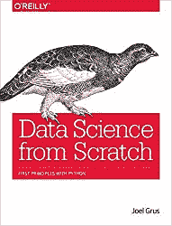
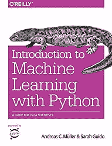
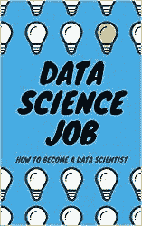
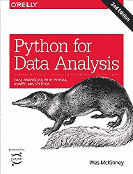
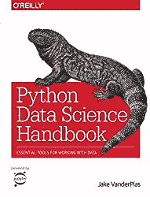
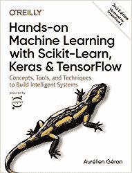
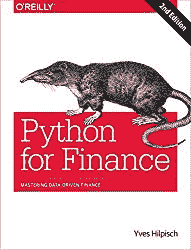
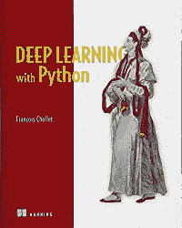
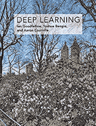
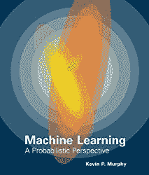

# 2021 年你应该开始阅读的数据科学书籍

> 原文：[`www.kdnuggets.com/2021/04/data-science-books-start-reading-2021.html`](https://www.kdnuggets.com/2021/04/data-science-books-start-reading-2021.html)

评论

**作者 [Przemek Chojecki](https://pchojecki.medium.com/)，Contentyze CEO**

数据科学无疑是目前最热门的职业选择之一。许多公司（其中许多公司拥有数据科学部门）正在招聘数据科学家。成为数据科学家是一个重大成就。如果你已经是统计学家并希望提升自己，这也是一个磨练专业技能的绝佳机会。

* * *

## 我们的前三课程推荐

 1\. [谷歌网络安全证书](https://www.kdnuggets.com/google-cybersecurity) - 快速开启网络安全职业生涯。

 2\. [谷歌数据分析专业证书](https://www.kdnuggets.com/google-data-analytics) - 提升你的数据分析技能

 3\. [谷歌 IT 支持专业证书](https://www.kdnuggets.com/google-itsupport) - 支持你的组织的 IT 需求

* * *

本文讨论了适用于任何水平的数据科学热门书籍。

2021 年你应该开始阅读的数据科学书籍

### 初学者数据科学水平

如果你刚刚开始探索数据科学，可以查看以下这些书籍：

从零开始的数据科学书籍

在 [《从零开始的数据科学》](https://www.amazon.com/gp/product/149190142X/ref=as_li_tl?ie=UTF8&camp=1789&creative=9325&creativeASIN=149190142X&linkCode=as2&tag=petacrunch-20&linkId=edf06af7b6694a8bc86289c37f4378e4) 这本书中，数据科学的概念是以易于理解的方式呈现给陌生的学习者的。你甚至不需要了解 Python 就可以开始。我强烈推荐你从这本书开始。

《Python 机器学习简介》

如果你愿意从初学者水平学习机器学习，并渴望了解更多内容，那么这本名为《[Python 机器学习简介](https://www.amazon.com/gp/product/1449369413/ref=as_li_tl?ie=UTF8&camp=1789&creative=9325&creativeASIN=1449369413&linkCode=as2&tag=petacrunch-20&linkId=8669cacfe298d25c2832d9062642dd44)》的书是一个绝佳选择。请记住，你不需要已经掌握 Python。

数据科学职位

然后，为了成为一名合格的数据科学家，你可以看看我写的书《[数据科学职位：如何成为数据科学家](https://amzn.to/3aQVTjs)》，这本书提供了一个全面的逐步指南。

通过我在多个组织担任项目经理、数据科学分析师或首席技术官的经验，我能够看到招聘数据科学家和发展数据科学团队的过程。本书将告知你：

+   成为数据科学家首份工作的必备条件，

+   你应学习的技能，

+   你在面试中应展示的内容，

以及更多内容。

### 中级数据科学水平

如果你读过一两本数据科学书籍，并且自己做过一些数据科学任务，现在你习惯于处理数据，这里有一些书籍可以深化你对数据科学的理解。

《Python 数据分析》

[《Python 数据分析》](https://www.amazon.com/gp/product/1491957662/ref=as_li_tl?ie=UTF8&camp=1789&creative=9325&creativeASIN=1491957662&linkCode=as2&tag=petacrunch-20&linkId=7664d523f4c3d5195b201dc219efdd15) 建议使用 NumPy 和 pandas。此外，《Python 数据分析》是一个知识渊博的数据科学家可能会欣赏的绝妙资源。它也对 Python 语言的功能进行了适当的介绍。

Python 数据科学手册

[《Python 数据科学手册》](https://www.amazon.com/gp/product/1491912057/ref=as_li_tl?ie=UTF8&camp=1789&creative=9325&creativeASIN=1491912057&linkCode=as2&tag=petacrunch-20&linkId=3882a97fd104467b624bad3e5ff5431b) 是所有标准 Python 库的完美指南。强烈推荐 Pandas 库、Scikit-Learn 库和 NumPy 数学库。

这本详尽的工作手册将为数据科学家和数据挖掘人员提供处理数据的有效方法。数据科学家会喜欢其中的多种插图、对每个过程背后算法的简明解释，以及附属网站上的工具。这无疑是目前唯一详尽且最新的 Python 科学计算资源。

你将学习如何使用以下内容：

+   **Jupyter 和 iPython** 是可以用来进行数据处理的 Python 框架。

+   **Numpy:** 需要构建一个密集且有效的数据数组，用于 Python 中的数据处理。

+   **Pandas** 结合了强大的向量和 DataFrame，以便在 Python 中分析和检索带标签/列的数据。

+   **Matplotlib** 是一个 Python 绘图库，提供了多种功能用于绘图和数据可视化。

+   **Scikit-learn:** 是一个流行的 Python 机器学习库，提供了复杂的机器学习算法和高效的实现。

《Python 机器学习》书籍

[Python 机器学习](https://www.amazon.com/gp/product/1789955750/ref=as_li_tl?ie=UTF8&camp=1789&creative=9325&creativeASIN=1789955750&linkCode=as2&tag=petacrunch-20&linkId=cc65892b0564ce32cee20536fb70b29c) 介于中级和高级机器学习阶段之间。它适合所有该领域的专家以及其他人。它从机器学习和深度学习的温和介绍开始，然后转向更高级的方法。一本了不起的书！

[动手实践机器学习：Scikit-Learn 和 TensorFlow](https://amzn.to/3d3tpE7) (第 2 版)

[动手实践机器学习：Scikit-Learn 和 TensorFlow](https://amzn.to/3d3tpE7) (第 2 版) 是一本宝贵的资源，能够获得更多成果！这本书讨论了所有基础知识（分类过程、降维），甚至涉及神经网络和深度学习。

Python for Finance 书籍

如果你对金融和数据科学感兴趣，[Python for Finance](https://www.amazon.com/gp/product/1492024333/ref=as_li_tl?ie=UTF8&camp=1789&creative=9325&creativeASIN=1492024333&linkCode=as2&tag=petacrunch-20&linkId=f763a23bdaf3d4d920df947f1380c32c) 是必读书籍。这本书强调了利用数据科学方法来评估资本市场，并且提供了几个出色的示例来证明这一点。它是一个极其现实的产品，通常适合那些不经常从事金融工作的人。

### 专家级数据科学水平

对于那些在数据科学方面有一定经验的人来说，阅读大量的科学研究文章比阅读书籍更为合适。这是因为这种方法更为现实，并且可以将深度学习融入到你的程序中，以超越传统统计学。

深度学习与 Python

[深度学习与 Python](https://www.amazon.com/gp/product/1617294438/ref=as_li_tl?ie=UTF8&camp=1789&creative=9325&creativeASIN=1617294438&linkCode=as2&tag=petacrunch-20&linkId=fa7304c5324df649a4ba536bd74927d2) 这本书的作者是 Keras 库的开发者之一，Keras 是 Python 最著名的机器学习库之一。这本书以实用的方法开始，因为你可以立即学习几种有用的技巧。它通常非常实际，因为你可以在阅读后立即应用于活动中。这是深度学习的终极必读书籍。

深度学习

[深度学习](https://www.amazon.com/gp/product/0262035618/ref=as_li_tl?ie=UTF8&camp=1789&creative=9325&creativeASIN=0262035618&linkCode=as2&tag=petacrunch-20&linkId=00701393c949f16bfd3a89d9c3240b35) 是一本关于深度学习算法的绝佳参考书。它包含了有限的编码量，并且对如何解决机器学习问题有很好的见解。该书被该领域的专家频繁引用。

[机器学习：概率视角](https://www.amazon.com/gp/product/0262018020/ref=as_li_tl?ie=UTF8&camp=1789&creative=9325&creativeASIN=0262018020&linkCode=as2&tag=petacrunch-20&linkId=a52c63d00ba9f01f29e1db95d6b4c171)

如果你对数学感兴趣，那么你一定会喜欢 [机器学习：概率视角](https://www.amazon.com/gp/product/0262018020/ref=as_li_tl?ie=UTF8&camp=1789&creative=9325&creativeASIN=0262018020&linkCode=as2&tag=petacrunch-20&linkId=a52c63d00ba9f01f29e1db95d6b4c171)。它是对机器学习过程背后数学的真正深入探索。

不，我不建议一口气读完。我的建议是享受一杯咖啡，坐下来，慢慢阅读。

### 如何在 2021 年成为数据科学家？

就这些了。希望这些书籍能帮助你成为更优秀的数据科学家！

如果你在寻找第一份入门级数据科学工作却不知道从哪里开始，请报名参加我的 [数据科学工作课程](https://datasciencerush.thinkific.com/courses/data-science-job)。一旦你进入课程，我可以在我们的学习小组中直接回答你的问题，帮助你成为初级数据科学家。

如果你喜欢这篇文章，请查看我关于成为数据科学家的其他帖子：

+   [成为数据科学家的完整指南](https://towardsdatascience.com/complete-guide-to-become-a-data-scientist-1e08bc54688d)

+   [成为数据科学家的实用指南](https://towardsdatascience.com/practical-guide-to-become-a-data-scientist-2483a5f83770)

+   [数据科学书籍和课程推荐](https://datasciencerush.com/)

[**加入我的技术新闻通讯**]

数据科学，人工智能，机器学习](https://creative-producer-9423.ck.page/c3b56f080d)

**简介：[Przemek Chojecki](https://pchojecki.medium.com/)** 是 Contentyze 的 CEO，文本编辑器 2.0，数学博士，福布斯 30 位 30 岁以下杰出人物。

[原文](https://medium.com/data-science-rush/data-science-books-you-should-start-reading-in-2021-73b40a76aad9)。经许可转载。

**相关：**

+   2021 年 15 本免费的数据科学、机器学习与统计学电子书

+   另外 10 本免费必读机器学习与数据科学书籍

+   数据科学与机器学习：免费电子书

### 更多相关内容

+   [2021 年最佳 ETL 工具](https://www.kdnuggets.com/2021/12/mozart-best-etl-tools-2021.html)

+   [每个初学者数据科学家应掌握的 6 种预测模型](https://www.kdnuggets.com/2021/12/6-predictive-models-every-beginner-data-scientist-master.html)

+   [成为伟大数据科学家所需的 5 项关键技能](https://www.kdnuggets.com/2021/12/5-key-skills-needed-become-great-data-scientist.html)

+   [每个数据科学家都应该知道的三个 R 库（即使你使用 Python）](https://www.kdnuggets.com/2021/12/three-r-libraries-every-data-scientist-know-even-python.html)

+   [停止学习数据科学以寻找目标，并找到目标去…](https://www.kdnuggets.com/2021/12/stop-learning-data-science-find-purpose.html)

+   [数据科学学习统计学的顶尖资源](https://www.kdnuggets.com/2021/12/springboard-top-resources-learn-data-science-statistics.html)
