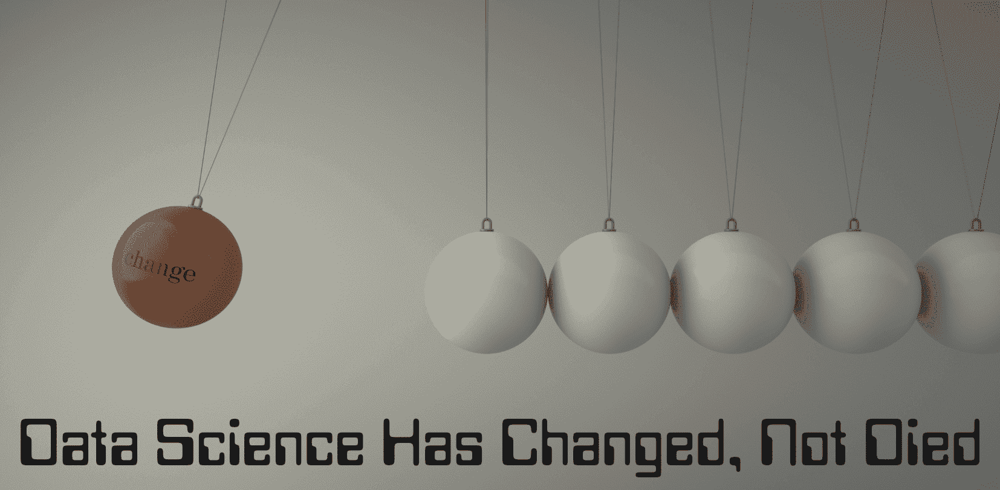

# 数据科学已经改变，而非消亡！

> 原文：[`www.kdnuggets.com/2023/08/data-science-changed-died.html`](https://www.kdnuggets.com/2023/08/data-science-changed-died.html)

作者提供的图像

随着技术的不断发展和人工智能在我们日常生活中的应用，许多人担心工作岗位的流失。甚至有人说数据科学在消亡。许多人表示，机器学习正在取代数据科学，并称数据科学是一个饱和的领域。随着 ChatGPT 等工具的广泛使用以及它们在编码任务等方面的应用，我们在质疑数据科学是否在消亡。

* * *

## 我们的前三个课程推荐

 1\. [Google 网络安全证书](https://www.kdnuggets.com/google-cybersecurity) - 快速入门网络安全职业生涯。

 2\. [Google 数据分析专业证书](https://www.kdnuggets.com/google-data-analytics) - 提升你的数据分析技能

 3\. [Google IT 支持专业证书](https://www.kdnuggets.com/google-itsupport) - 支持你组织的 IT 工作

* * *

> 但真的是这样吗？真的在消亡吗？

当然不是。我们获得的数据越来越多，这些数据产生了推动决策的宝贵洞察。这些洞察无法由计算机生成，我们需要它们来进行数据科学。可以建立机器学习模型，并利用数据发现有价值的洞察，但关键因素是对数据的需求以及如何处理数据。

而要理解如何处理数据，你需要人类。你需要数据科学家！但是什么发生了变化？

# 数据科学的变化

由于生成式 AI 的发展以及每个人都想进入科技行业的热潮，数据科学中的各种元素正在发生变化。让我们回顾一下数据科学中的一些变化。

## 技能

诸如探索性数据分析这样的任务曾经提供了重要的洞察，现在发生了巨大的变化。它通常需要数据科学家和数据分析师的帮助。然而，现在有了像 ChatGPT 这样的工具以及快速的数据科学课程——每个人都相信自己能编码，并且在 Python 中技术熟练。

然而，这并不是真的。如果你具备正确的技能组合，并且在如 Python 等编程语言中非常熟练，你将会脱颖而出。组织仍会寻找高素质的数据科学家来完成任务，而不是 ChatGPT 的回答或那些只参加过快速数据科学课程的人。

作为一名数据科学家，你的工作将是适应当前的市场。不断学习和提升技能是你保持竞争力并被真正重视的方式。

这包括不断学习不同的软件架构、库、框架、编程语言等。

## 构建完整应用程序

许多人正在使用 ChatGPT 来帮助他们完成编码任务。但需要理解的是，ChatGPT 可以帮助你构建完整应用程序的模块，但无法将这些模块整合起来构建整个基础。

组织将需要一个了解所有不同模块及其如何组合的人。他们能够将所有模块拼凑在一起，因为他们了解每个模块的作用，并将它们结合起来构建基础。

这并不意味着 ChatGPT 没有帮助——它确实有。许多程序员利用 ChatGPT 来帮助他们处理代码块，这加快了他们的代码编写过程。同时，它也通过学习新知识帮助提高程序员的技能，使他们在编码中更加熟练。

所以，作为一名数据科学家，你需要掌握更多的知识，甚至是所有的知识。你需要了解数据科学的每一个元素，以及如何构建一个完整的应用程序。

## 角色的融合

数据科学中的角色会有很多，但需要注意的是，许多角色将会融合。你以前可能是数据分析的首选人选，但现在你需要成为一个全能型人才，并在整体数据科学中成为专家。例如，你将运用你的分析技能来构建应用程序。

原因在于越来越多的组织在考虑工作角色的效率，以及他们实际需要多少人。例如，我应该雇用一个擅长创建和展示数据可视化的人，还是找到一个能够做所有事情的数据科学家？从商业角度来看，你知道公司会选择谁。

我能给你的最好建议就是在你擅长的领域做到**非常出色**。做到你能做到的最好，以免感到被挤出。

## 职业市场

数据科学的就业市场已经发生了变化。多年来，许多人试图通过快速培训营和一些 Jupyter Notebook 项目进入技术行业。不幸的是，这在当前市场中已经不再有效。具备熟练的技能组合、丰富的经验以及对数据科学的高级理解是至关重要的。

理解机器学习架构和高级数据分析是你需要完善的领域！你需要脱颖而出！

# 总结

我希望这篇博客能帮助你理解数据科学世界的变化，以及如果你想进入或在该领域发展——你需要做什么！与其感到被挤出，你只需要了解下一步需要做什么，以保持竞争力！

**[Nisha Arya](https://www.linkedin.com/in/nisha-arya-ahmed/)** 是一位数据科学家、自由技术作家和 KDnuggets 的社区经理。她特别关注提供数据科学职业建议或教程以及数据科学相关理论知识。她还希望探索人工智能如何对人类寿命产生好处。作为一个热衷的学习者，她致力于扩展自己的技术知识和写作技能，同时帮助引导他人。

### 相关阅读

+   [8 篇创新的 BERT 知识蒸馏论文改变了…](https://www.kdnuggets.com/2022/09/eight-innovative-bert-knowledge-distillation-papers-changed-nlp-landscape.html)

+   [每个数据科学家都犯过的错误](https://www.kdnuggets.com/2022/09/mistake-every-data-scientist-made-least.html)

+   [Meta 的新数据分析师专业认证已经发布！](https://www.kdnuggets.com/metas-new-data-analyst-professional-certification-has-dropped)

+   [AI 在算法交易中的采用对金融行业的影响](https://www.kdnuggets.com/2022/04/adoption-ai-algorithmic-trading-affected-finance-industry.html)

+   [HuggingFace 推出了免费的深度强化学习课程](https://www.kdnuggets.com/2022/05/huggingface-launched-free-deep-reinforcement-learning-course.html)

+   [机器学习为何未能为我的业务带来价值？](https://www.kdnuggets.com/2021/12/machine-learning-produce-value-business.html)
