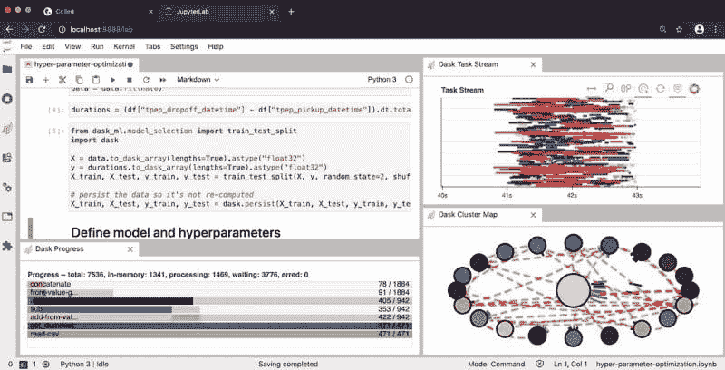

# 在云端使用 Dask 进行数据科学

> 原文：[`www.kdnuggets.com/2020/10/data-science-cloud-dask.html`](https://www.kdnuggets.com/2020/10/data-science-cloud-dask.html)

评论

**由 [Hugo Bowne-Anderson](https://hugobowne.github.io/)，[Coiled](https://coiled.io/) 数据科学推广负责人和市场营销副总裁**

在数据科学和机器学习中，扩展大数据分析的能力变得越来越重要，并且增长迅速。幸运的是，像 Dask 和 [Coiled](https://coiled.io/) 这样的工具使得人们可以轻松而迅速地做到这一点。

* * *

## 我们的前 3 个课程推荐

 1\. [Google Cybersecurity Certificate](https://www.kdnuggets.com/google-cybersecurity) - 快速进入网络安全职业生涯。

 2\. [Google Data Analytics Professional Certificate](https://www.kdnuggets.com/google-data-analytics) - 提升你的数据分析水平

 3\. [Google IT Support Professional Certificate](https://www.kdnuggets.com/google-itsupport) - 支持你的组织 IT

* * *

Dask 是在 PyData 生态系统和 Python 中扩展分析的热门解决方案。这是因为 Dask 设计用于并行化任何 PyData 库，因此可以无缝地与 PyData 工具配合使用。

*扩展* 分析以利用单个工作站的所有核心是开始处理大数据集时的第一步。

接下来，为了利用云上的集群（如 Azure、Google Cloud Platform、AWS 等），你可能需要 *扩展* 计算。

继续阅读，我们将：

+   使用 pandas 展示数据科学工作流中的常见模式，

+   利用 Dask 扩展工作流，利用单个工作站的核心，并且

+   演示如何将我们的工作流扩展到云端，使用 [Coiled Cloud](https://cloud.coiled.io/)。

所有代码 [在这里查看 github](https://github.com/coiled/data-science-at-scale/blob/master/01b-data-analysis-at-scale-extended.ipynb)。

注意：在开始之前，考虑一下是否真的需要扩展你的计算。在开始之前考虑让 pandas 代码更高效。通过绘制学习曲线来衡量更多数据是否会提升模型表现。

### PANDAS 和 ETL：数据科学中的常见模式

首先，我们将使用 pandas 在内存数据集上介绍一个常见的数据科学模式。这是 NYC 出租车数据集的 700 MB 子集，总体约为 10 GB。

我们希望看到扩展的光芒四射，因此我们选择了一个相对乏味的工作流。现在我们读取数据，处理数据，创建特征，并将其保存为 Parquet（不可读但比 CSV 高效得多）。

```py
# Import pandas and read in beginning of 1st file
import pandas as pd
df = pd.read_csv("data_taxi/yellow_tripdata_2019-01.csv")

# Alter data types for efficiency
df = df.astype({
    "VendorID": "uint8",
    "passenger_count": "uint8",
    "RatecodeID": "uint8",
    "store_and_fwd_flag": "category",
    "PULocationID": "uint16",
    "DOLocationID": "uint16",    
})

# Create new feature in dataset: tip_ratio
df["tip_ratio"] = df.tip_amount / df.total_amount

# Write to parquet
df.to_parquet("data_taxi/yellow_tripdata_2019-01.parq")
```

这在我的笔记本电脑上大约花了 1 分钟，这是我们可以容忍的分析等待时间（也许）。

现在我们想对整个数据集执行相同的分析。

### DASK: 扩展你的数据科学

数据集的 10GB 大小超过了我的笔记本电脑的 RAM，因此我们不能将其存储在内存中。

相反，我们可以编写一个 for 循环：

```py
for filename in glob("~/data_taxi/yellow_tripdata_2019-*.csv"):
	df = pd.read_csv(filename)
	...
	df.to_parquet(...)
```

然而，我的笔记本电脑上的多个核心通过这种方法没有得到充分利用，这也不是一种优雅的解决方案。这里就需要 Dask 来实现单机并行处理。

导入 Dask 的几个方面，我们将启动一个本地集群并启动一个 Dask 客户端：

```py
from dask.distributed import LocalCluster, Client
cluster = LocalCluster(n_workers=4)
client = Client(cluster)
client
```

然后我们导入 Dask DataFrame，懒惰地读取数据，并执行 ETL 管道，就像之前用 pandas 做的那样。

```py
import dask.dataframe as dd

df = dd.read_csv(
	"data_taxi/yellow_tripdata_2019-*.csv",
	dtype={'RatecodeID': 'float64',
   	'VendorID': 'float64',
   	'passenger_count': 'float64',
   	'payment_type': 'float64'}
)

# Alter data types for efficiency
df = df.astype({
	"VendorID": "UInt8",
	"passenger_count": "UInt8",
	"RatecodeID": "UInt8",
	"store_and_fwd_flag": "category",
	"PULocationID": "UInt16",
	"DOLocationID": "UInt16",    
})

# Create new feature in dataset: tip_ratio
df["tip_ratio"] = df.tip_amount / df.total_amount
# Write to Parquet
df.to_parquet("data_taxi/yellow_tripdata_2019.parq")
```

在我的笔记本电脑上大约需要 5 分钟，我们可以称其为可接受的（我想）。但是，如果我们想做一些稍微复杂的事情（这是我们常做的！），这段时间将迅速增加。

如果我可以访问云上的集群，现在就是利用它的时候！

但首先，让我们反思一下我们刚刚解决了什么：

+   我们使用了一个 Dask DataFrame——一个大型虚拟数据框，按索引划分为多个 Pandas DataFrame

+   我们正在使用一个本地集群，包含：

    +   一个 *调度器*（负责组织和分配工作/任务给工作者），以及，

    +   *工作者*，用于计算这些任务

+   我们已经启动了一个 Dask 客户端，它是“集群用户的用户界面入口”。

总之——客户端存在于你编写 Python 代码的地方，客户端与调度器进行通信，传递任务。



### COILED: 扩展你的数据科学

现在我们所期待的时刻到了——是时候跃入云端了。如果你可以访问云资源（如 AWS）并知道如何配置 Docker 和 Kubernetes 容器，你可以在云中启动一个 Dask 集群。然而，这将是耗时的。

进入一个方便的替代方案：Coiled，我们将在这里使用它。为此，我登录了 [Coiled Cloud](http://beta.coiled.io/)（目前 Beta 是免费的计算！），安装了 coiled，并进行了身份验证。请随意跟随并自己操作。

```py
pip install coiled --upgrade
coiled login   # redirects you to authenticate with github or google
```

然后我们进行必要的导入，启动一个集群（大约需要一分钟），并实例化我们的客户端：

```py
import coiled
from dask.distributed import LocalCluster, Client
cluster = coiled.Cluster(n_workers=10)
client = Client(cluster)
```

接下来我们导入我们的数据（这次来自 s3），并执行我们的分析：

```py
import dask.dataframe as dd

# Read data into a Dask DataFrame
df = dd.read_csv(
	"s3://nyc-tlc/trip data/yellow_tripdata_2019-*.csv",
	dtype={
    	'RatecodeID': 'float64',
   	'VendorID': 'float64',
   	'passenger_count': 'float64',
   	'payment_type': 'float64'
	},
	storage_options={"anon":True}
)

# Alter data types for efficiency
df = df.astype({
	"VendorID": "UInt8",
	"passenger_count": "UInt8",
	"RatecodeID": "UInt8",
	"store_and_fwd_flag": "category",
	"PULocationID": "UInt16",
	"DOLocationID": "UInt16",    
})

# Create new feature in dataset: tip_ratio
df["tip_ratio"] = df.tip_amount / df.total_amount

# Write to Parquet
df.to_parquet("s3://hugo-coiled-tutorial/nyctaxi-2019.parq")
```

在 Coiled Cloud 上这花了多久？*30 秒。* 即使对于这个相对简单的分析，这也比我的笔记本电脑上所需的时间少了一个数量级。

很容易看出在单一工作流中进行这组分析的强大之处。我们不需要切换上下文或环境。而且，当我们完成后，可以简单地从 Coiled 切换回本地工作站的 Dask 或 pandas。云计算在需要时非常棒，但在不需要时可能会带来负担。我们刚刚经历了一个负担要少得多的体验。

### 你需要更快的数据科学吗？

你现在可以免费开始使用 Coiled 集群。Coiled 还处理安全、conda/docker 环境和团队管理，因此你可以专注于数据科学和工作。立即开始使用 [Coiled Cloud](http://beta.coiled.io/)。

**简介： [Hugo Bowne-Anderson](https://hugobowne.github.io/)** Hugo Bowne-Anderson 是**[Coiled](https://coiled.io/)**的首席数据科学传播官和市场营销副总裁（[**@CoiledHQ,**](https://twitter.com/CoiledHQ) **[LinkedIn](https://www.linkedin.com/company/coiled-computing)**）。他在数据科学家、教育者、传播者、内容营销员和数据战略顾问方面具有丰富经验，涉及工业界和基础研究。他还在耶鲁大学和冷泉港实验室等机构、SciPy、PyCon 和 ODSC 等会议以及 Data Carpentry 等组织中教授数据科学。他致力于传播数据技能、数据科学工具的使用以及开源软件，无论是个人还是企业。

**相关：**

+   Dask 中的机器学习

+   为什么以及如何在大数据中使用 Dask

+   Dask 中的 K-means 聚类：猫咪图片的图像滤镜

### 更多相关话题

+   [云和数据迁移到 AWS 云的 11 个最佳实践](https://www.kdnuggets.com/2023/04/11-best-practices-cloud-data-migration-aws-cloud.html)

+   [来自 Anaconda 的新动态！数据科学培训和云托管笔记本](https://www.kdnuggets.com/2022/11/anaconda-new-anaconda-data-science-training-cloud-hosted-notebooks.html)

+   [如何利用云计算高效扩展数据科学项目](https://www.kdnuggets.com/2023/05/efficiently-scale-data-science-projects-cloud-computing.html)

+   [云计算如何增强数据科学工作流程](https://www.kdnuggets.com/2023/08/cloud-computing-enhances-data-science-workflows.html)

+   [数据科学的云计算简介](https://www.kdnuggets.com/introduction-to-cloud-computing-for-data-science)

+   [数据科学的前 7 个免费云笔记本](https://www.kdnuggets.com/top-7-free-cloud-notebooks-for-data-science)
