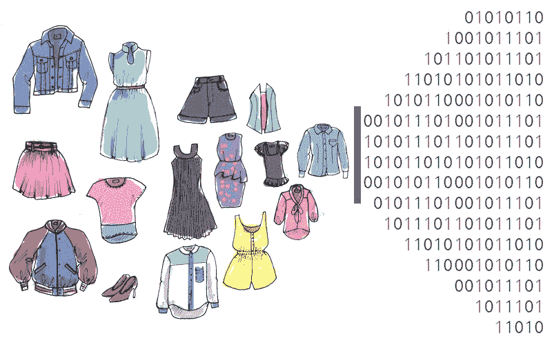
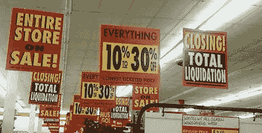
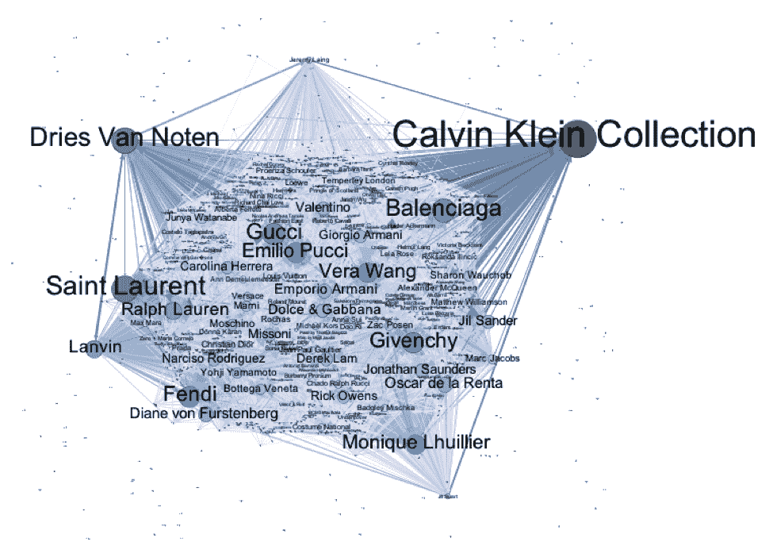
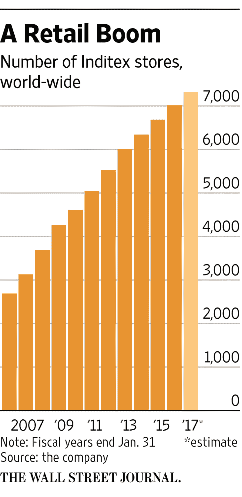
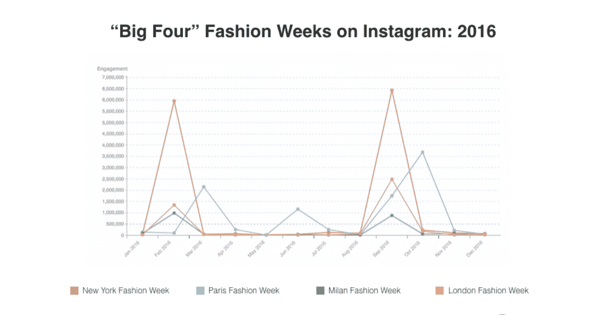
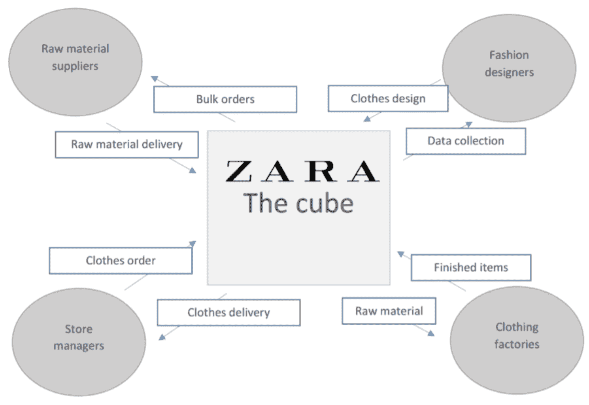
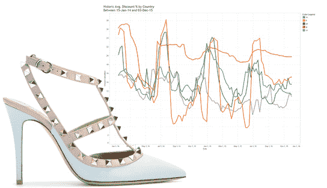
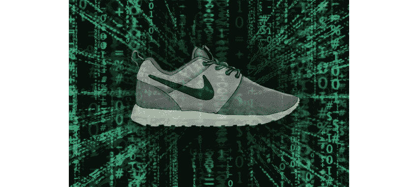
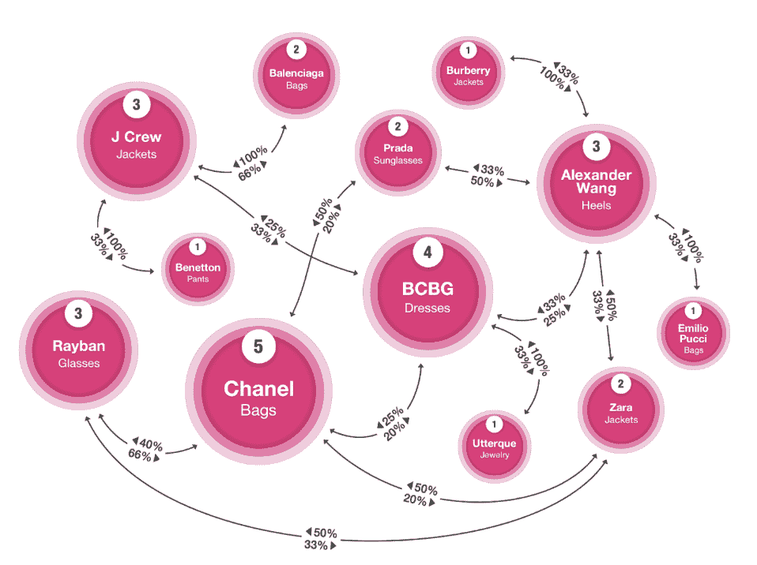
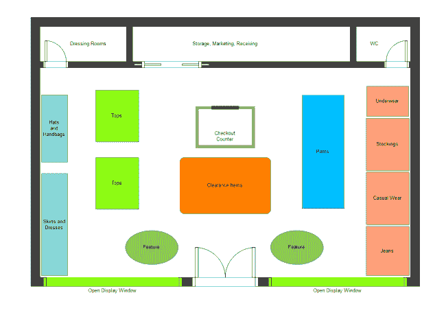

# 时尚中的数据科学

> 原文：[`www.kdnuggets.com/2018/03/data-science-fashion.html`](https://www.kdnuggets.com/2018/03/data-science-fashion.html)

 评论

**作者 [Preet Gandhi](https://www.linkedin.com/in/preetgandhi/)，纽约大学数据科学中心**

* * *

## 我们的前三大课程推荐

 1\. [谷歌网络安全证书](https://www.kdnuggets.com/google-cybersecurity) - 快速进入网络安全职业生涯。

 2\. [谷歌数据分析专业证书](https://www.kdnuggets.com/google-data-analytics) - 提升你的数据分析能力

 3\. [谷歌 IT 支持专业证书](https://www.kdnuggets.com/google-itsupport) - 支持你的组织的 IT

* * *

**背景**

你小时候常去的多少家商店现在已经不复存在了？还记得 Sears、Zellers、American Apparel、Wet Seal、The Limited 等吗？许多其他知名零售商如 Aeropostale、Bebe、A&F、Guess、J.C Penney、Payless、Rue2 等也在全国范围内关闭了数百家门店，以应对销售下滑。福布斯估计，在 2017 年最后一个季度，21 家零售商关闭了 3,591 家门店。它们无法与电商部门竞争，因为越来越多的消费者选择在家舒适地在线购物，而不是亲自去零售店。零售商被迫利用数据来升级其基础设施和服务，以为客户提供更好的体验。许多 Macy’s、Coach、Kate Spade、Nordstrom 等公司的招聘信息显示了零售和时尚巨头在面对竞争时的严重性和迫切性。

**介绍**

时尚行业是一个竞争激烈且动态变化的市场。趋势和风格瞬息万变。一季的系列或趋势需要来自最具创意的头脑的数千个工时，而最终的成功取决于时尚专家、博客作者和名人的简单“热”或“冷”判断。数据科学可以在历史数据上进行应用，以预测哪些趋势会变得“火爆”，从而潜在地节省大量时间和金钱。例如，利用以往销售数据训练良好的模型，可以帮助我们预测 Kanye West 的新 Yeezy 第 6 季系列是否会成功。数据科学家可以使用预测算法、视觉搜索、从照片中捕捉结构化数据、自然语言处理等概念。

**数据来源**

时尚和零售行业的数据非常丰富。来自零售商和百货商店关于顾客消费习惯的大量历史数据是传统来源。随着社交媒体的出现，帖子互动、Instagram 趋势、Twitter 标签、最受欢迎的时尚博主的穿衣风格、名人时尚风格、流行名人的“点赞/反应”等，提供了丰富的见解数据。在发布系列之前测试反应的一种新技术是将照片发布在社交媒体（Facebook、Twitter、Instagram、Pinterest）上，并研究评论，以便在推出之前对系列进行修改。这里使用情感分析来获取公众意见的见解。这些网站的公开 API 是开放和易于使用的。数据可以通过这些 API 实时抓取并转换为可用的形式。在线数据源是原始的和未审查的，反映了公众意见。如果正确利用，这些数据具有很大的潜力。你在网上找到的大多数数据都是非结构化的：文本、图像、音频和 YouTube 视频。非结构化数据在原始形式下可能具有挑战性，需要清理和转换。

一个有趣的数据来源是顾客在商店内的 wifi 信号。跟踪顾客的行为模式，以查看他们停留的时间、顺序访问的区域、回访的频率以及在每个区域停留的时间。这种数据可以用于安排商店内的系列，并将经常一起购买的商品放置在一起。

**例如：Zara**

Zara 是时尚界最受欢迎和成功的商店之一。他们采用了“快时尚”的概念，即从设计一个系列到将其运送到商店的整个过程最多需要三周。这个品牌的成功归功于这一动态概念，其中零售商研究顾客的选择和偏好，以创建迎合他们口味的系列。他们创造顾客渴望的产品，而不是销售他们设计的产品。顾客自己可能不知道他们具体在寻找什么，但 Zara 的聪明商业分析师和数据科学家利用数据来创建一个系列，使顾客会自动喜欢，因为这正是他们的“口味”。此外，Zara 在全球范围内都有商店，顾客的不同人口统计特征意味着像尺寸、体型、颜色偏好和数量等简单因素会有很大差异。生产适量的正确产品有助于减少浪费。

**关键问题领域**

*1\. 颜色选项*

通过大数据，我们可以找到顾客偏好的颜色，以策划畅销系列。特定风格的颜色范围、颜色组合等可以从销售数据和在线零售数据中挖掘出来。许多时候，顾客会购买一件衣服的某种颜色，然后换成另一种颜色。退换货的数据可以用来生产更多的受欢迎颜色的商品。

*2\. 男装还是女装？*

每个设计师的目标受众或性别不同，以增加他们的知名度或销售量。设计师需要决定每个系列中的商品数量及所需的多样性。他们有一套固定的资源，如预算和展示空间，并需要数据支持的指导方针来决定每个类别分配多少。这在许多商店如 Forever21、H&M 等很常见，通常看到女性商品占据两三层空间，而男性商品仅占一层。这些零售商知道要为特定客户类别提供更多选项以增加销售。这些见解来源于历史销售数据。

*3\. 将时装秀风格转变为零售商品*

很多在时装秀上展示的风格在现实生活中并不“适穿”。时装秀上的趋势往往被夸张，过于奢华，不适合零售。服装需要经过修改才能在商店中销售。训练算法以建议哪些特征如颜色、面料、剪裁、长度、组合等需要更改，可以确保产品在上架时销售良好。此外，每个国家/地区的口味不同。因此，每个产品必须根据当地偏好进行调整。

*4\. 服装价格*

对于每件服装，设计师需要了解顾客愿意为其支付的价格，考虑到质量、风格、受欢迎程度和品牌价值。大数据应被用于平均之前的销售数据，以生成建议价格。竞争品牌的数据也可以用于设定价格，使其既不太高，又能带来良好的收入。

*5\. 揭示新的产品类别*

品牌需要寻找市场上成功的新产品以及那些盈利潜力不大的产品。设计师需要考虑制作独特新产品是否会被顾客接受或拒绝。例如，创意鲜艳的印花可能适合瑜伽裤，但可能被认为对运动鞋过于花哨。大数据可以用于决定进入哪个类别以及是否继续销售某个特定的旧产品。

*6\. 店铺安排*

顾客在购物时会表现出特定的行为，这些行为可以被研究以便将商品安排在一种增加大多数商品销售机会的方式中。关联数据挖掘可以帮助我们决定将产品如何分组，以便顾客可能会挑选到大多数商品。你可能已经注意到，在许多服装店中，配饰通常被放置在我们站在结账区域附近的位置，这会促使顾客购买这些配饰。Wi-Fi 数据可以用来跟踪顾客在商店中的移动，从而以最佳方式安排库存。

**结论**

毋庸置疑，我们可以说数据驱动的决策将在竞争激烈的时尚世界中为你提供优势。在创建任何产品之前，需要参考数据以查看其经济可行性和前景。选择性地使用你的数据来创建和转换你未来的顾客肯定会购买的产品线，将有助于零售商在电子商务的浪潮中生存下来。有些人可能会说，AI 可能会使创意变得单调，因为它只是创造顾客想要的东西。但这就是为什么结果应该仅用来补充人类的创造性洞察，而不是完全替代它。不过，在正确的时间以正确的价格创造正确的产品也无伤大雅。

**简历： [Preet Gandhi](https://www.linkedin.com/in/preetgandhi/)** 是纽约大学数据科学中心的硕士生。她对大数据和数据科学充满热情。可以通过 pg1690@nyu.edu 联系她。

**相关：**

+   机器学习和机器人技术正在转变的 4 个行业

+   酒店行业的大数据分析

+   应用数据科学：解决预测性维护业务问题 第二部分

### 更多相关话题

+   [停止学习数据科学来寻找目标，并通过寻找目标来…](https://www.kdnuggets.com/2021/12/stop-learning-data-science-find-purpose.html)

+   [学习数据科学统计的顶级资源](https://www.kdnuggets.com/2021/12/springboard-top-resources-learn-data-science-statistics.html)

+   [成功数据科学家的 5 个特征](https://www.kdnuggets.com/2021/12/5-characteristics-successful-data-scientist.html)

+   [每个数据科学家都应该知道的三个 R 库（即使你使用 Python）](https://www.kdnuggets.com/2021/12/three-r-libraries-every-data-scientist-know-even-python.html)

+   [一个 90 亿美元的 AI 失败案例分析](https://www.kdnuggets.com/2021/12/9b-ai-failure-examined.html)

+   [为什么 Python 是初创公司理想的编程语言](https://www.kdnuggets.com/2021/12/makes-python-ideal-programming-language-startups.html)
