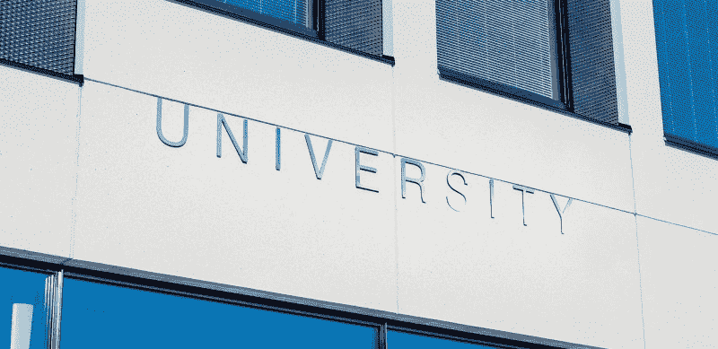

# 数据科学如何改善高等教育

> 原文：[`www.kdnuggets.com/2018/11/data-science-improving-higher-education.html`](https://www.kdnuggets.com/2018/11/data-science-improving-higher-education.html)

 评论

大数据为高等教育提供了巨大的机会。越来越多的高校以及政府正在使用数据科学来改进教育机构在招聘、学生互动和预算等方面的方式。

* * *

## 我们的前三大课程推荐

 1\. [Google 网络安全证书](https://www.kdnuggets.com/google-cybersecurity) - 加入网络安全领域的快速通道。

 2\. [Google 数据分析专业证书](https://www.kdnuggets.com/google-data-analytics) - 提升您的数据分析技能

 3\. [Google IT 支持专业证书](https://www.kdnuggets.com/google-itsupport) - 支持您的组织的 IT 工作

* * *

以下是数据科学正在改善高等教育的六种方式。

### **1\. 提高毕业率**

几乎所有大学的主要目标之一是提高毕业率。有很多策略可以实现这一目标，数据可以帮助学校确定哪种策略最适合它们。

分析关于辍学学生与完成学业学生的数据，可以帮助学校识别出最有可能离开的学生特征。它还可以使学校为这些学生提供资源，以减少他们辍学的风险。

费城的天普大学一直在使用数据来提高其毕业率。它发现那些收入适中并获得部分佩尔助学金的学生最有可能辍学，即使与那些获得全额佩尔助学金的最低收入学生相比也是如此。它还发现，拥有四年高中外语学习经历的学生较不容易辍学。

使用这些数据，天普大学向处于风险中的学生提供了经济援助，并启动了帮助改善学生校园归属感的举措。该校的四年毕业率已从 20%上升到 44%，六年毕业率从 59%上升到 70%。

### **2\. 改进招聘策略**

数据还可以帮助学校吸引学生报名并入学。学校越来越多地使用数据来决定针对哪些潜在学生，从而制定他们的宣传活动和个性化的营销内容。

为了寻找潜在学生，许多学校会分析当前年份的学生特征，然后针对具有相似特质的高中生。学校还可以分析哪些学生毕业并取得了最成功的成绩，以确定哪些类型的人可能最适合该大学。

例如，[圣路易斯大学意识到需要扩大其地理覆盖范围](https://www.theatlantic.com/education/archive/2017/04/how-colleges-find-their-students/522516/)，这是基于其学生通常来自的地区高中毕业生数量预计将下降。它使用了高中生在注册 SAT 或 ACT 时填写的大学偏好问卷中的信息。

它寻找那些适合该大学的学生，并表明他们愿意为上学而旅行。

### **3. 优化支出**

当学校追踪支出并努力计算各种投资的回报时，它们会生成大量的数据点，用于优化支出。通过结合来自多个学校的数据，国家教学成本与生产力研究，也称为德拉华成本研究，帮助学校发现更有价值的见解。

[大约 700 所大学和学院参与](https://ire.udel.edu/descriptive-summary/)德拉华成本研究，该研究使学校能够将其提供一个小时的教学成本与其他机构的成本进行比较。它还提供了其他方面的数据，如教学负担以及常规教员进行的教学量。

德拉华成本研究项目允许参与的机构定义其同伴群体，以获取最符合其目标的比较。以这种清晰定义的方式访问个性化数据，[使信息更具实用性](https://www.watermarkinsights.com/blog/strategies-for-assessment-professionals-for-effective-data-sharing/)和可操作性。教育机构可以利用这些数据优化成本，提高与其他大学的竞争力。

### **4. 提升校园安全**

在校园内增加摄像头可能有助于威慑潜在的犯罪分子并提高校园安全，但手动分析视频录像也非常耗时。然而，将数据分析系统整合到安全系统中可以大大简化这一过程，并以其他方式提高安全性。

启用分析功能的安全系统，[例如塔尔萨大学的系统](https://edtechmagazine.com/higher/article/2017/10/analytics-makes-fast-work-video-surveillance-searches)，可以定义搜索条件，比如嫌疑人穿的衣物。系统会自动开始提取匹配这些条件的数据。安全团队还可以设置高风险情况的警报，以便他们知道在什么时间监控哪些摄像头。

例如，如果一辆车在夜间驶入停车场，保安团队会收到警报，告诉他们检查哪个监视器。然后，如果他们发现任何可疑的情况，他们可以更快地派出团队。

### **5\. 缩小公平差距**

数据科学还可以帮助学术机构改善面临独特挑战的群体的成果，包括少数族裔、低收入和第一代学生。在过去几年中，[乔治亚州立大学在这方面已成为领军者](https://hechingerreport.org/at-georgia-state-black-students-find-comfort-and-academic-success/)，这部分归功于其对数据的使用。现在，从乔治亚州立大学毕业的黑人学生的学士学位数量超过了美国其他非营利学校。

学校成功的秘诀在于一个以数据为基础的辅导系统。该程序使用算法来监控学生的表现。如果系统检测到学生的工作开始出现问题，他们的辅导员将会主动联系他们提供帮助。学校还为那些发现自己难以支付学费的学生提供小额资助。

### **6\. 提高学生参与度**

与学校和校园更有互动的学生更有可能按时毕业，并且可能会有更好的大学经历和对大学的认知。跟踪参与度指标可以帮助学校联系那些没有参与的学生。

例如，诺丁汉特伦特大学跟踪进入建筑物的卡片刷卡记录、图书馆使用情况、虚拟学习环境使用情况和电子作业提交。学校发现，[基于这些指标参与度低的学生中有四分之三](http://www.qs.com/3-universities-that-are-using-big-data/) 未能从第一年顺利过渡到第二年。

根据这些发现，学校开发了一个程序，辅导员会联系那些两周内没有参与的学生。这有助于在低参与度对学生产生更严重影响之前，将他们引导到正确的方向上。

从改善学生成果到帮助学校变得更具竞争力，数据科学在高等教育中的作用日益增长。利用数据改善教育的趋势不会在短时间内放缓。

**简介: [凯拉·马修斯](http://productivitybytes.com/subscribe-to-productivity-bytes/)** 在《The Week》、《The Data Center Journal》和《VentureBeat》等出版物上讨论技术和大数据，并且已有五年以上的写作经验。要阅读凯拉的更多文章，[**订阅她的博客 Productivity Bytes**](http://productivitybytes.com/subscribe-to-productivity-bytes/)。

**相关:**

+   你是否应该无偿提供你的数据技能？

+   在两年内提高你的数据科学技能的 8 种方法

+   [你在 R 中应该知道的 7 种简单数据可视化](https://www.kdnuggets.com/2018/06/7-simple-data-visualizations-should-know-r.html)

### 更多相关内容

+   [超越准确性：使用 NLP 测试库评估和改进模型](https://www.kdnuggets.com/2023/04/john-snow-beyond-accuracy-nlp-test-library.html)

+   [提高 SQL 查询性能的 5 个技巧](https://www.kdnuggets.com/5-tips-for-improving-sql-query-performance)

+   [2023 年人工智能对 STEM 教育的影响的 5 种方式](https://www.kdnuggets.com/2023/04/5-ways-ai-impacting-stem-education-2023.html)

+   [人工智能教育差距及如何弥补](https://www.kdnuggets.com/2022/11/ai-education-gap-close.html)

+   [教育中的 ChatGPT：朋友还是敌人？](https://www.kdnuggets.com/2023/05/chatgpt-education-friend-foe.html)

+   [停止学习数据科学以寻找目的，而是为了…寻找目的](https://www.kdnuggets.com/2021/12/stop-learning-data-science-find-purpose.html)
