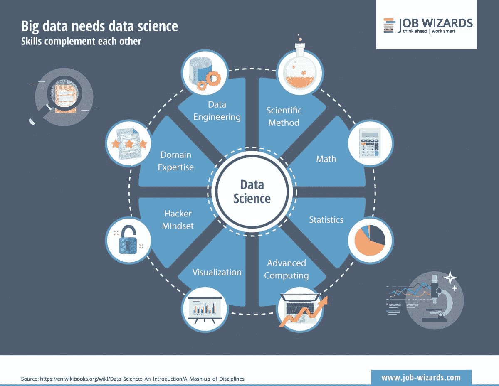
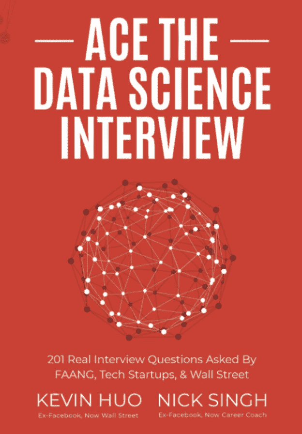

# 数据科学面试指南 - 第一部分：结构

> 原文：[`www.kdnuggets.com/2022/04/data-science-interview-guide-part-1-structure.html`](https://www.kdnuggets.com/2022/04/data-science-interview-guide-part-1-structure.html)

来源：[WikiBooks](https://en.wikibooks.org/wiki/Data_Science:_An_Introduction)

数据科学是一个广泛的领域，包括各种各样的领域。主要方面包括数学、计算机科学和领域专长。

根据 [IGotAnOffer](https://igotanoffer.com/blogs/tech/data-science-interview-prep) 的说法，数据科学家面试中通常会问的问题可以分为五类。这是通过分析来自领先科技公司的 300 多个数据科学面试问题得出的。

* * *

## 我们的三大课程推荐

 1\. [谷歌网络安全证书](https://www.kdnuggets.com/google-cybersecurity) - 快速入门网络安全职业。

 2\. [谷歌数据分析专业证书](https://www.kdnuggets.com/google-data-analytics) - 提升你的数据分析技能

 3\. [谷歌 IT 支持专业证书](https://www.kdnuggets.com/google-itsupport) - 支持你所在组织的 IT

* * *

这五类问题包括：

1.  **编程 (38%)** - 这将测试你的问题解决能力以及你如何使用算法、SQL 等来操作数据。

1.  **统计学 (21%)** - 这将测试你对统计学整体的理解，以及你如何在解决问题的任务中应用统计学。

1.  **机器学习 (17%)** - 这将测试你理解机器学习理论的能力，如何构建模型，如何将其应用于特定问题/任务，并且如何改进它。

1.  **与业务相关 (12%)** - 这将测试你对技术知识的理解，以及这些知识如何用于推动业务和确定正确的决策。

1.  **行为面试 (13%)** - 这将测试你的特征，并确定你是否适合公司。

# 编程

数据科学面试的编程部分占最高比例，达 38%。面试的三分之一以上将基于编程，这是正常的，因为你正在面试数据科学职位。

编程问题旨在分析和评估候选人在计算机科学及其基础知识方面的能力。它可以涵盖以下主题：

+   数据结构：数组、字典、栈/队列、字符串、树/二叉树等。

+   算法：二分查找、递归、排序等。

+   SQL：约束条件、主键/外键、联接等。

示例问题包括：

+   如何反转一个整数？

+   编写一个程序，使用你选择的编程语言打印从 1 到 50 的数字。

+   SQL 中的不同连接是什么？

# 统计学

统计学是数据科学的重要组成部分。统计学帮助数据科学家分析大型复杂数据集。它在机器学习中被广泛应用于改进模型。

理解流行的统计术语及其在数据科学任务中的应用将帮助你在数据科学领域取得成功。它可以涵盖以下话题：

+   概率分布

+   假设检验

+   建模

这些话题将围绕概率和统计展开。示例问题包括：

+   描述 A/B 测试

+   P 值通俗来说是什么？

+   t 检验是什么？

# 机器学习

随着机器学习模型在日常生活中的应用，它成为了数据科学的重要方面，我们如何不断改进以便在商业等领域实施。

数据科学家以解决问题和创建模型著称，因此在数据科学面试中，面试官将测试你构建模型的能力、整体工作流程及如何改进。

这可以涵盖以下话题：

+   人工智能

+   模型构建、验证和解释

+   算法的类型

+   机器学习的使用案例

示例问题包括：

+   监督学习和无监督学习之间有什么区别？

+   列出 5 种监督学习算法

+   包装和提升之间有什么区别？

+   如何减少模型的过拟合？

# 商业相关

数据如此有价值的原因在于它可以让人们更深入理解数据，并帮助做出重要决策。

将技术知识应用于商业案例场景将帮助面试官了解你如何利用技能改善和发展公司。

这可以涵盖以下话题：

+   产品的性能和局限性

+   商业的短期和长期目标

示例问题包括：

+   影响产品 X 销售下降的变量是什么？

+   变量 J 会在接下来的 6 个月内提升产品 X 的性能吗？

+   你会建议我们做什么来提高准确性？

+   根据指标的输出，我们应该做出什么决策？

# 行为

尽管大多数技术职位需要强硬技能，但软技能同样重要。你的软技能将决定你是否适合这个角色。

在行为阶段，利用简历中的元素阐述自己将使你更成功。

例如，一些公司可能更倾向于一个高度独立且几乎不需要互动的候选人。面试官会浏览你的简历，并询问你在之前公司中的工作经历以及你的工作方式。你将理解他们需要一个独立的员工，并可以挖掘你过去的独立经验。

示例问题包括：

+   你为什么选择成为数据科学家？

+   你认为你能为公司带来什么？

+   你最成功的项目是什么？为什么？

+   你最不成功的项目是什么？为什么？你会如何改进它？

+   你如何处理多任务？

我们已经讨论了数据科学面试的 5 个类别，下一步是为面试做准备。

[掌握数据科学面试](https://amzn.to/37JpVZz)是我推荐的第一本数据科学面试书籍。它由前 Facebook 员工[Kevin Huo](https://medium.com/@decomposing_data)和[Nick Singh](https://www.nicksingh.com/)编写。

本书包括 201 个真实的数据科学面试问题，这些问题曾被 Facebook、Google、Amazon、Netflix 等公司提问。书中包含详细的逐步解决方案，以帮助你更好地理解。

主题包括概率、统计学、机器学习、SQL 与数据库设计、编码（Python）、产品分析和 A/B 测试。

**[Nisha Arya](https://www.linkedin.com/in/nisha-arya-ahmed/)**是一位数据科学家和自由技术写作人。她特别关注提供数据科学职业建议或教程以及数据科学理论知识。她还希望探索人工智能如何/可以如何有利于人类生命的长寿。她是一位热衷学习的人，寻求扩展她的技术知识和写作技能，同时帮助指导他人。

### 更多相关话题

+   [如何构建数据科学项目：逐步指南](https://www.kdnuggets.com/2022/05/structure-data-science-project-stepbystep-guide.html)

+   [KDnuggets 新闻，5 月 11 日：面向专业人士的 SQL 笔记；如何…](https://www.kdnuggets.com/2022/n19.html)

+   [数据科学面试指南 - 第二部分：面试资源](https://www.kdnuggets.com/2022/04/data-science-interview-guide-part-2-interview-resources.html)

+   [Interview Kickstart 数据科学面试课程——有什么不同…](https://www.kdnuggets.com/2022/10/interview-kickstart-data-science-interview-course-makes-different.html)

+   [KDnuggets 新闻，4 月 6 日：8 个免费的 MIT 课程学习数据科学…](https://www.kdnuggets.com/2022/n14.html)

+   [数据科学备忘单完整收藏 - 第一部分](https://www.kdnuggets.com/2022/02/complete-collection-data-science-cheat-sheets-part-1.html)
