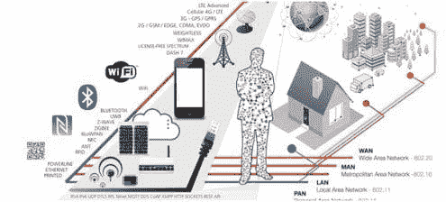

# 物联网（IoT）的数据科学：与传统数据科学的十个区别

> 原文：[`www.kdnuggets.com/2016/09/data-science-iot-10-differences.html`](https://www.kdnuggets.com/2016/09/data-science-iot-10-differences.html)

 评论

### 介绍

在过去的二十年中，超过六十亿个设备已经联网。所有这些连接的“事物”（统称为 - 物联网）每天生成超过 2.5 万亿字节的数据。相当于每天填满 57.5 亿台 32 GB 的 iPad（来源：Gartner）。这些数据必然会在未来几年内显著影响许多商业流程。因此，物联网分析（物联网的数据科学）的概念预计将推动物联网的商业模式。根据[《福布斯》](http://www.forbes.com/sites/louiscolumbus/2016/09/21/strong-analytics-skills-3x-more-likely-to-lead-to-success-with-internet-of-things-iot/#ec0c512b01e9)，强大的分析技能更有可能在物联网中取得 3 倍的成功。我们在[物联网的数据科学课程](http://www.opengardensblog.futuretext.com/archives/2016/06/data-science-for-internet-of-things-course-aug-sep-2016-now-in-its-fourth-batch.html)中涵盖了许多这些理念。

* * *

## 我们的前三个课程推荐

 1\. [谷歌网络安全证书](https://www.kdnuggets.com/google-cybersecurity) - 快速通道进入网络安全职业。

 2\. [谷歌数据分析专业证书](https://www.kdnuggets.com/google-data-analytics) - 提升你的数据分析能力

 3\. [谷歌 IT 支持专业证书](https://www.kdnuggets.com/google-itsupport) - 支持你的组织的 IT 需求

* * *

物联网的数据科学有相似之处，但也有一些显著的差异。这里是物联网的数据科学与传统数据科学的 10 个区别。

图片来源：[Postscapes](http://www.postscapes.com/internet-of-things-technologies/)。

1.  硬件和无线层的工作

1.  边缘处理

1.  物联网垂直领域使用的具体分析模型

1.  物联网的深度学习

1.  物联网的预处理

1.  传感器融合在物联网中的作用

1.  实时处理与物联网

1.  物联网的隐私、保险和区块链

1.  人工智能：机器间互相教导（云机器人）

1.  企业的物联网和人工智能层

### 1) 硬件和无线层的工作

这可能听起来很明显，但很容易被低估。物联网涉及处理各种设备以及各种无线技术。这是一个快速变化的生态系统，有新技术如 [LoRa、LTE-M、Sigfox](http://www.nickhunn.com/lora-vs-lte-m-vs-sigfox/) 等。5G 的部署将带来重大变化，因为我们将拥有局部和广域连接。每个垂直领域（我们跟踪智能家居、零售、医疗保健、智慧城市、能源、交通、制造业和可穿戴设备）也有一套特定的物联网设备和无线技术。例如，对于可穿戴设备，你会看到使用蓝牙 4.0，但对于工业物联网，你可能会看到保证服务质量的蜂窝技术，如 [GE 与 Verizon 的 Predix 联盟](http://rethink-iot.com/2014/10/17/ge-opens-1bn-predix-iot-platform-adds-verizon-m2m-connectivity/)。

### 2) 边缘处理

在传统的数据科学中，大数据通常存储在云端。但物联网并非如此！许多供应商如思科和英特尔称之为边缘计算。我在之前的文章中详细介绍了边缘分析和物联网的影响：物联网边缘分析的演变。

### 3) 在物联网垂直领域使用的具体分析模型

物联网需要强调不同的模型，这些模型也取决于物联网垂直领域。在传统的数据科学中，我们使用各种算法 (数据科学家使用的顶级算法)。对于物联网，时间序列模型通常被使用。这意味着：ARIMA、Holt Winters、移动平均。不同之处在于数据量的大小，但也包括这些模型的更复杂的实时实现，例如 (pdf) : [ARIIMA: 减少能耗的机器学习架构的实际物联网实现](http://morelab.deusto.es/media/publications/2014/booksection/ariima-a-real-iot-implementation-of-a-machine-learning-architecture-for-reducing-energy-consumption.pdf)。不同的物联网垂直领域使用的模型也有所不同。例如在制造业：预测性维护、异常检测、预测和缺失事件插值是常见的。在电信领域，传统模型如客户流失模型、交叉销售、增销模型、客户生命周期价值等可能会将物联网作为输入。

### 4) 物联网的深度学习

如果将相机视为传感器，深度学习算法如 CNN 在安全应用中有许多应用，例如来自 [hertasecurity](http://www.hertasecurity.com/en/)。强化学习也在物联网中有应用，我在 Brandon Rohrer 的文章中讨论了 强化学习与物联网。

### 5) 物联网的预处理

物联网数据集需要不同形式的预处理。Sibanjan Das 和我在 深度学习 - 物联网与 H2O 中提到过。

> *深度学习算法在物联网分析中发挥着重要作用。来自机器的数据是稀疏的和/或具有时间性。即使我们信任来自特定设备的数据，设备在不同条件下的行为也可能不同。因此，捕捉算法的数据预处理/训练阶段的所有场景是困难的。持续监测传感器数据也是繁琐且昂贵的。深度学习算法可以帮助减轻这些风险。深度学习算法可以自主学习，使开发者能够专注于更好的事物，而无需担心训练它们。*

### 6）传感器融合在物联网中的作用

传感器融合涉及将来自不同传感器和来源的数据结合起来，使得结果信息的不确定性比单独使用这些来源时要小。（摘自维基百科）。在这种情况下，“不确定性减少”可以意味着更准确、更完整、更可靠，或指基于综合信息得出的新视角。传感器融合一直在[Aerospace](http://digitalcommons.calpoly.edu/cgi/viewcontent.cgi?article=1114&context=aerosp)等应用中发挥关键作用：

> *在航空航天应用中，加速度计和陀螺仪通常被耦合到一个惯性测量单元（IMU）中，该单元根据多个传感器输入测量方向，称为自由度（DOF）。由于严格的精度和漂移公差以及高可靠性，航天器和飞机的惯性导航系统（INS）可能花费数千美元。*

但我们越来越多地看到[自驾车和无人机中的传感器融合](https://devblogs.nvidia.com/parallelforall/jetpack-doubles-jetson-tx1-deep-learning-inference/)，在这些情况下，来自多个传感器的输入可以结合起来推断关于事件的更多信息。

### 7）实时处理和物联网

物联网涉及快速和大数据。因此，实时应用自然与物联网形成协同效应。许多物联网应用如车队管理、智能电网、推特流处理等具有基于快速和大数据流的独特分析需求。这些包括：

+   **实时标记：** 随着来自各种来源的非结构化数据流动，提取信号的唯一方法是对数据进行分类。这可能涉及与[动态模式概念](http://www.devinline.com/2015/11/different-level-of-schema-adherence.html)的工作。

+   **实时聚合：** 每当你在滑动时间窗口内聚合和计算数据时，你就是在进行实时聚合：找到过去 5 秒钟的用户行为日志模式，并将其与过去 5 年的数据进行比较，以检测偏差。

+   **实时时间关联：** 例如：基于位置和时间识别新兴事件，从大规模流媒体社交媒体数据中进行实时事件关联（以上摘自[logtrust](https://www.logtrust.com/en/)）。

### 8）物联网的隐私、保险和区块链

我曾经在欧盟参加过一次会议，其中提出了“芯片的沉默”这一概念。这个引人注目的标题源于电影《沉默的羔羊》。这个想法是：当你进入一个新环境时，你有权知道所有监控你的传感器，并且可以有选择地开关它们。这可能听起来很极端，但确实反映了今天隐私讨论中占主导地位的布尔（开或关）思维。然而，未来关于物联网的隐私讨论可能会更加细致入微，尤其是当隐私、保险和区块链一起考虑时。

根据[AT Kearney](https://www.atkearney.co.uk/documents/10192/5320720/Internet+of+Things+-+Opportunity+for+Insurers.pdf/4654e400-958a-40d5-bb65-1cc7ae64bc72)，保险公司已经将物联网视为一个重要的机会。像伦敦劳合社这样的组织也在寻求通过引入新技术来应对大规模系统性风险，这些技术由[城市区域传感器例如无人机](http://www.lloyds.com/news-and-insight/risk-insight/library/technology/drones-take-flight)推动。将区块链引入物联网创造了其他可能性——例如，[IBM 表示](http://www.coindesk.com/ibm-reveals-proof-concept-blockchain-powered-internet-things/)：

> *将区块链概念应用于[物联网]提供了迷人的可能性。从产品完成最终组装的那一刻起，它可以由制造商注册到一个代表其生命周期开始的通用区块链中。销售后，代理商或最终客户可以将其注册到一个区域区块链（社区、城市或州）中。*

### 9) 人工智能：机器相互学习（云机器人）

我们之前提到过深度学习和物联网的可能性，我们说深度学习算法在物联网分析中扮演重要角色，因为机器数据稀疏且/或具有时间性元素。设备在不同条件下的行为可能不同。因此，捕捉所有场景以用于数据预处理/训练阶段的算法是困难的。深度学习算法可以通过让算法自我学习来帮助缓解这些风险。***这一机器自我学习的概念可以扩展到机器教其他机器。*** 这个想法并不那么离谱。

以世界上最大的工业机器人制造商 Fanuc 为例。[Fanuc 机器人通过观察和强化学习在一夜之间自我学习执行任务](https://www.technologyreview.com/s/601045/this-factory-robot-learns-a-new-job-overnight/)。Fanuc 的机器人使用强化学习进行自我训练。大约八小时后，它的准确率达到 90％或以上，这几乎与专家编程相同。如果多个机器人同时工作并共享所学内容，这一过程可以加速。这种分布式学习的形式被称为[云机器人](https://en.wikipedia.org/wiki/Cloud_robotics)。

### 10) 企业的物联网和人工智能层

我们可以在企业内部更广泛地扩展“机器教其他机器”的想法。企业正在获得一个“人工智能层”。企业中的任何实体都可以训练其他“同伴”实体。这可能是建筑物向其他建筑物学习，或者飞机、油井甚至打印机！培训可以是动态的和持续的（例如，一个建筑物了解能源消耗并“教导”下一个建筑物）。物联网是企业物联网系统的数据关键来源。目前，这种方法的最佳例子是 Salesforce.com 和 Einstein。强化学习是推动企业物联网和人工智能层的关键技术。

> “到 2016 年底，全球收入最高的 100 家企业软件公司中，将有超过 80 家将认知技术整合到他们的产品中。”（来源：Deloitte）

远离[人工智能寒冬](https://en.wikipedia.org/wiki/AI_winter)，我们似乎突然进入了人工智能的春天。在这个人工智能春天中，物联网突然有了明确的商业模式。

### 结论

从上述讨论中，我们看到数据科学在物联网中的许多相似之处，但也有显著的差异。存在明显的差异（例如在硬件和无线网络的使用上）。但对我来说，最令人兴奋的发展是物联网推动了如无人机、自动驾驶汽车、企业人工智能、云机器人等令人兴奋的新兴领域。我们在[物联网数据科学课程](http://www.opengardensblog.futuretext.com/archives/2016/06/data-science-for-internet-of-things-course-aug-sep-2016-now-in-its-fourth-batch.html)中涵盖了许多这些想法。

这一批次中只剩下最后几个名额。

### 更多相关主题

+   [建立一个稳固的数据团队](https://www.kdnuggets.com/2021/12/build-solid-data-team.html)

+   [使用管道编写干净的 Python 代码](https://www.kdnuggets.com/2021/12/write-clean-python-code-pipes.html)

+   [成为一名出色数据科学家所需的 5 项关键技能](https://www.kdnuggets.com/2021/12/5-key-skills-needed-become-great-data-scientist.html)

+   [每个初学者数据科学家应掌握的 6 种预测模型](https://www.kdnuggets.com/2021/12/6-predictive-models-every-beginner-data-scientist-master.html)

+   [2021 年最佳 ETL 工具](https://www.kdnuggets.com/2021/12/mozart-best-etl-tools-2021.html)

+   [传统人工智能与生成型人工智能](https://www.kdnuggets.com/traditional-ai-vs-generative-ai)
