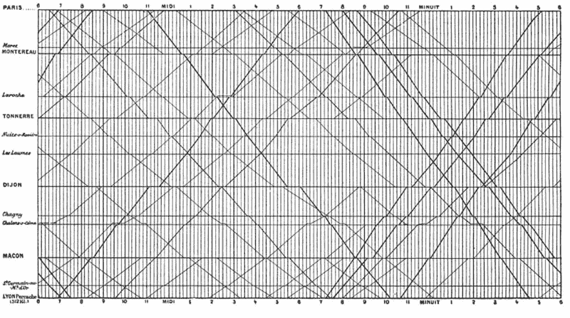

# 数据科学最后一公里

> 原文：[`www.kdnuggets.com/2014/06/data-science-last-mile.html`](https://www.kdnuggets.com/2014/06/data-science-last-mile.html)

作者：Joel Horwitz（Alpine Data Labs），2014 年 6 月。

数据科学通常被称为开发者、统计学家和业务分析师的结合体。用更随意的术语来描述，它更恰当地被称为黑客技术、领域知识和高级数学。Drew Conway 在他的[博客](http://drewconway.com/zia/2013/3/26/the-data-science-venn-diagram)文章中很好地描述了这些能力。近期的关注点主要集中在建立分析沙箱的早期阶段，以提取数据、格式化、分析并最终创造洞察（见下图 1）。

许多先进的分析供应商专注于这一工作流程，这与过去 30 年商业智能的历史背景有关。例如，新进入这个领域的 Trifacta 最近[宣布了一轮 2500 万美元的融资](http://techcrunch.com/2014/05/29/trifacta-raises-25-million-for-its-data-transformation-software/)，它将预测分析应用于数据，以帮助改进特征创建步骤。这是一个非常值得关注的领域，因为约 80%的工作都花费在去除数据偏差、寻找真正重要的变量（信号/噪声比）和识别最适合数据的模型（线性回归、决策树、朴素贝叶斯等）上。不幸的是，大多数创建的洞察往往无法超越我所称的“数据科学最后一公里”。

 *图 1\. 简单的数据科学工作流程*。

什么是数据科学最后一公里？这是将发现的洞察转化为高度可用格式或集成到特定应用中的最终工作。这一最后一公里有很多例子，以下是我认为的最佳例子。

**示例 1\. 报告、仪表盘和演示文稿**

多亏了商业智能社区，我们现在习惯于期望在仪表盘格式中查看我们的洞察，其中图表和图形相互叠加。像 Tableau 和 Platfora 这样的新型可视化分析工具通过使得将看似不相关的指标进行对比变得更加简单，进一步丰富了图形的混合。不要误解我的意思，仪表盘永远会有其存在的价值。

> 一般而言，指标的报告频率应仅限于能够采取行动的频率。

在英特尔，我们每天早上 7 点举行站立会议，回顾关键指标，并帮助团队确定每日优先事项。对于更复杂的分析，例如引入新流程或生产工具，我们会根据项目安排单独的会议。在这里，*可视化*格式定义得非常明确，甚至有一个称为 SPC（统计过程控制）的行业标准。每个业务都有用于报告指标的标准图表，此外，还有一个明确的方法来绘制数据。

我最喜欢的有关数据展示最佳设计实践的书籍之一是爱德华·塔夫特（Edward Tufte）所著。我以前的老板和导师推荐了这本书 [《定量信息的视觉展示》](https://www.amazon.com/gp/product/0961392142/)，它改变了我的生活。我最喜欢的视觉之一是书中如何展示法国的火车时刻表。

*1880 年代的法国火车时刻表，来自 [Marlena Compton 博客](http://marlenacompton.com/?p=103)*。

演示文稿、报告和仪表盘是数据“消亡”的地方。定期审查这些图表并将建议应用于业务、产品或运营在季度甚至年度基础上是很常见的做法。

**示例 2\. 模型**

数据科学输出被组织吸收的另一种方式是作为模型的输入。根据我的经验，这主要是通过 Excel 来完成的。我感到非常惊讶的是，居然没有更多其他应用程序来简化这个过程？也许是因为这些知识被锁在高度专业化的分析师脑海中？无论原因是什么，这似乎是一个主要的破坏领域，有很大的需求来标准化这个过程，并打破孤岛。我最喜欢的一句名言来自一位前同事。我们在一个漫长的周末分析新产品战略业务模型时，他说：“当他们告诉我我将处理模型时，这绝不是我想象中的样子。” 无论你是在运营、财务、销售、市场营销、产品、客户关系还是人力资源领域，准确建模你的业务意味着你很可能能够预测其成功。

**示例 3\. 应用**

最后，可能也是我最喜欢的例子是那些围绕我们周围的数据科学构建的产品，而我们甚至没有意识到。其中一个我能想到的最古老的例子是天气预报。我们得到的是 7 天的天气预报，形式是阳光、云朵、雨滴，以及由冗长的解释性舞者管理的绿屏，而不是报告雨的原始概率数据、气压、风速、温度以及许多其他影响预测的因素。

另一个例子是信用评级的衍生指数（FICO）、股票市场指数、Google 的页面排名，或者购买意愿值，或其他一些用于显著效果的单一值。这些指数并不会全盘报告，尽管如果你尝试，可以找到它们。（例如，访问 [pagerank.chromefans.org/](http://pagerank.chromefans.org/) 查看任何网站的 Google 页面排名）。相反，它们被打包成像搜索、产品推荐等多种产品化格式，弥合习惯与原始数据之间的差距。对我来说，这是我最关注的领域，因为这是推动数据融入我们决策过程的最后一英里工作。

大数据如何适应这种情景？大数据旨在通过更多的数据提高准确性。众所周知，最好的算法会因数据输入量的增加而失效。然而，对大型数据集进行复杂的统计和分析并不是一件简单的事。过去几年里，很多初创公司围绕这一点建立了框架，但需要相当多的编码技能。只有少数公司提供了更易于接触的大数据数据科学应用方法。

一个已经建立了可视化且高度健壮的规模分析方式的公司是 [Alpine Data Labs](http://start.alpinenow.com/)。它拥有大量的本地统计模型，你可以将这些模型混合搭配，快速生成与顶级算法相媲美的复杂算法，所需时间仅为几分钟，而非几个月。很难想象几年前我们还在每季度手动调整算法。亲自查看 [`start.alpinenow.com`](http://start.alpinenow.com)，了解我们取得了多大的进展。

总结来说，我认为我们需要将重点转回数据科学的应用，以免感到失望。我个人已经在考虑如何以数据为核心价值构建新产品，而不是作为后续决定的附加部分。关于这个主题还有很多内容要写，期待听到你的想法。

随时通过 Twitter @JSHorwitz 联系我

**相关帖子：**

+   Trifacta – 通过自动化和机器学习解决数据整理问题

+   将牌堆排成：大数据中的下一个机会波

+   大数据策略：数据化

+   为即将到来的数据洪流准备行业：PAW-制造业 2014

### 更多相关主题

+   [过去 12 个月必读的 NLP 论文](https://www.kdnuggets.com/2023/03/must-read-nlp-papers-last-12-months.html)

+   [最后机会: Stefan Krawcyzk 的《掌握 MLOps》直播班](https://www.kdnuggets.com/2022/08/sphere-last-call-stefan-krawcyzk-mastering-mlops.html)

+   [停止学习数据科学以找到目标，并通过找到目标来…](https://www.kdnuggets.com/2021/12/stop-learning-data-science-find-purpose.html)

+   [数据科学最低要求: 开始前需要知道的 10 项必备技能…](https://www.kdnuggets.com/2020/10/data-science-minimum-10-essential-skills.html)

+   [KDnuggets™ 新闻 22:n06, 2 月 9 日: 数据科学编程…](https://www.kdnuggets.com/2022/n06.html)

+   [数据科学定义幽默: 一系列古怪的引用…](https://www.kdnuggets.com/2022/02/data-science-definition-humor.html)
