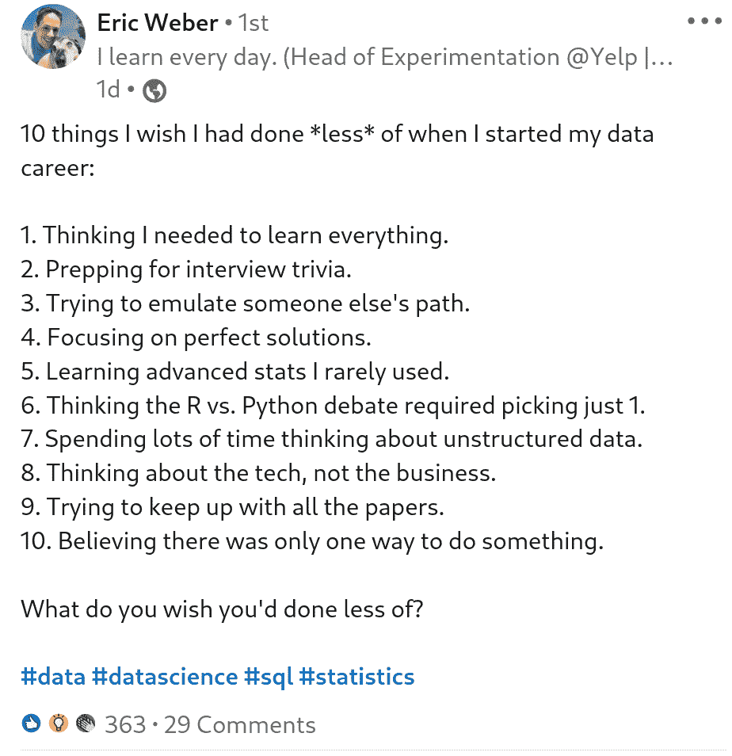
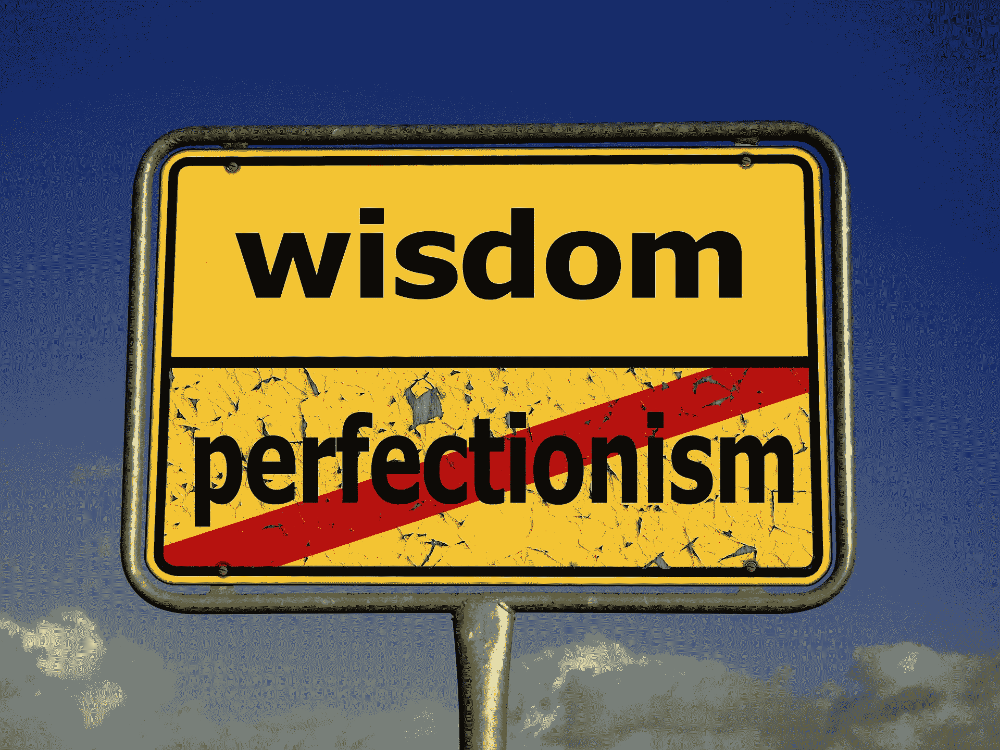
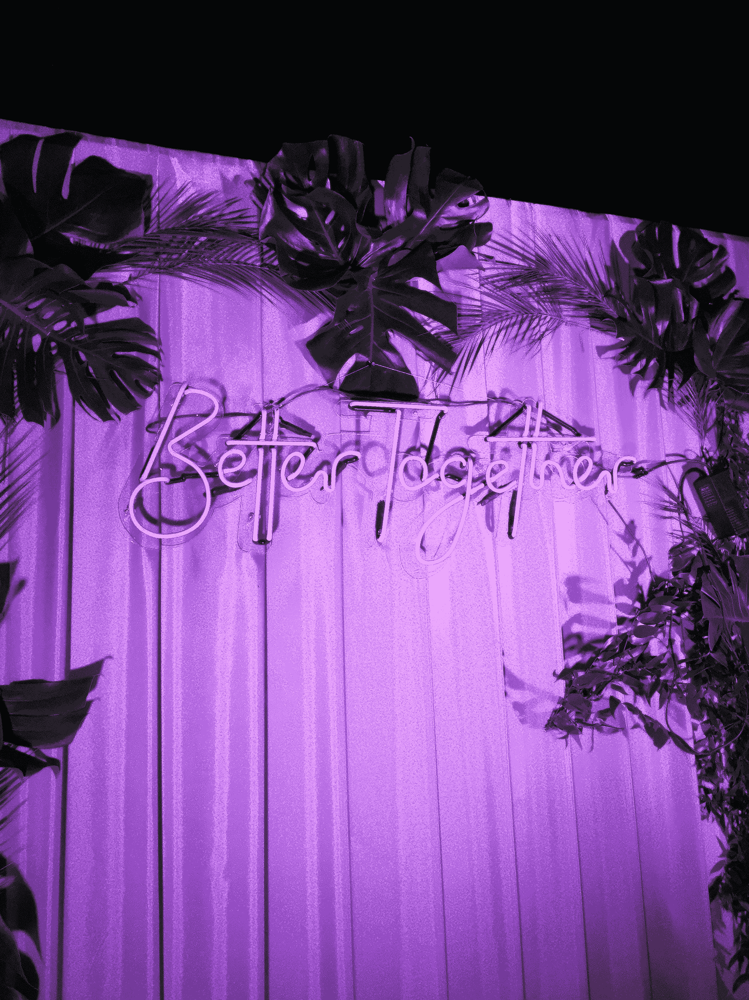

# 我目前的数据科学学习历程

> 原文：[`www.kdnuggets.com/2021/01/data-science-learning-journey.html`](https://www.kdnuggets.com/2021/01/data-science-learning-journey.html)

评论

**[Arnuld on Data](https://www.linkedin.com/in/arnuld-on-data/)，自由职业数据科学家**

**埃里克·韦伯**（没错，就是那个看起来很帅、带着可爱狗狗的家伙）最近在**LinkedIn**上写了一篇关于他希望在开始数据科学职业生涯时**少做**的 10 件事的文章。这篇文章是我对这 10 点的经历。首先，你应该去[阅读他的文章](https://www.linkedin.com/posts/eric-weber-060397b7_data-datascience-sql-activity-6733372212704788480-zPGO/)。下面是截图：

[原始帖子](https://www.linkedin.com/posts/eric-weber-060397b7_data-datascience-sql-activity-6733372212704788480-zPGO/) 在 LinkedIn，由[埃里克·韦伯](https://www.linkedin.com/in/eric-weber-060397b7/)发布

首先，这将不是一篇“内容”帖子。

已经有很多相关文章和博客帖子了，可以查看它们。在这里，我们将讨论你希望成为数据科学家并被行业关注时的重点和方向。

### 1) 以为我需要学习所有东西

是的，这个问题确实花费了你很多时间和精力。这个障碍是你应该立即解决的。我在开始时挣扎过，但几个月后，它就消退了。我将这个突破归功于我每天阅读的习惯。

我继续阅读 LinkedIn 上的帖子（特别是埃里克·韦伯本人发的帖子）。此外，我每天花一到两个小时，甚至更多，阅读 Towards Data Science、Medium、KDnuggets 以及不同数据科学家和机器学习工程师的个人博客。这教会了我数据科学在工业工作中的重要性：**你用自己的技能为组织创造了多少价值**。***你通过构建你感兴趣的东西或解决一个问题来定义价值***。你通过回答这个问题来选择学习的内容，这将帮助你了解该学什么，不该学什么。

我花了几个月才意识到这一点（我猜是 6 个月）。随着我们逐步进行这些点，我会将这些月份加在一起，看看我们本可以节省多少时间。

图片由[安德鲁·马丁](https://pixabay.com/users/aitoff-388338/?utm_source=link-attribution&utm_medium=referral&utm_campaign=image&utm_content=2899982)提供，来源于[Pixabay](https://pixabay.com/?utm_source=link-attribution&utm_medium=referral&utm_campaign=image&utm_content=2899982)

### 2) 准备面试小知识。

是的，这又是一个困难，主要因为几个原因：

+   关于数据科学家的定义，没有一个公认的标准。只有对他的工作职责有一个模糊的了解，以及这些职责与数据分析师或机器学习工程师的职责有什么不同。

+   然后是令人困惑的职位描述。由于没有一致的数据科学家定义，你会看到要求你精通一切的描述：机器学习、软件工程、Python、R、多年统计学、微积分、线性代数、Big-O，等等。看着这些职位描述，你会觉得自己需要 50 岁以上才能申请这些工作。

不要被这些描述所困扰。不要过于在意职位描述。大多数情况下，“面试问答”是数据科学新颖性与人才招聘、数据科学和软件工程团队之间沟通不畅的结合体。与其感到不知所措，不如专注于如何突破它。

破解这个问题的一种方法是看现实。如果你认识任何现实生活中的数据科学家、数据分析师和机器学习工程师（在现实世界中），与他们谈谈他们的工作将是一个很好的主意。如果你不认识任何人，你可以随时查看博客和文章。

我在这个领域没有认识的专业人士。所以我通过阅读博客和文章来学习。我发现公司面试了很多“知道”东西的人，但真正“构建”东西的人却很少。所以专注于构建东西，而不仅仅是学习和教育（例如，部署和生产是两个主要方面）。我花了 5-6 个月才意识到这一点。

目前已经过去了 6 + 6 = 12 个月。

### 3) 试图模仿别人的道路

啊，这是我最喜欢的 :-) 因为这是我浪费最多时间的地方。

+   Tetiana Ivanova [在 6 个月内找到了工作](https://youtu.be/rIofV14c0tc)。

+   [Kelly Peng](https://medium.com/u/f4a64ff38660?source=post_page-----caac1b9325c4--------------------------------) 在辞去数据分析师职位后，**在一年内**找到了[a job in one year](https://towardsdatascience.com/how-to-land-a-data-scientist-job-at-your-dream-company-my-journey-to-airbnb-f6a1e99892e8)。

+   [Natassha Selvaraj](https://medium.com/u/6a2ef1b1f09d?source=post_page-----caac1b9325c4--------------------------------) 找到了工作，而且她还在[大学学习](https://towardsdatascience.com/my-journey-as-a-data-scientist-f59eafc6fe2d)。

+   [Mikko Koskinen](https://www.linkedin.com/in/mikko-koskinen-258842108/) 甚至没有[计划成为](https://www.reaktor.com/blog/a-letter-from-your-future-colleague-mikko/)数据科学家。

+   [Thomas Hepner](https://medium.com/u/73bbc7d140c7?source=post_page-----caac1b9325c4--------------------------------) 在[其他领域感到迷茫](https://medium.com/@hepner.thomas/my-journey-to-self-taught-data-scientist-ef014a44c704)，而一年后他成为了行业中的数据科学家。

图片由 [**Edward Jenner**](https://www.pexels.com/@edward-jenner?utm_content=attributionCopyText&utm_medium=referral&utm_source=pexels) 提供，来自 [**Pexels**](https://www.pexels.com/photo/art-space-blue-pattern-4252162/?utm_content=attributionCopyText&utm_medium=referral&utm_source=pexels)。

看看 [我的个人资料](https://www.linkedin.com/in/arnuld-on-data/)，我在软件开发（C 语言）方面有 4.5 年的经验，并且现在做了 8 个月的数据科学，但仍然无法回答这个问题：

> 你最喜欢的机器学习算法是什么，为什么？

是的，我同意我的情况看起来像 [Big-O](https://en.wikipedia.org/wiki/Big_O_notation)的最坏情况：O(n^n)。

我阅读了数以百计和千计（不，我不是夸张）的博文和文章，了解那些获得数据科学职位并改变行业的人。我追踪并模仿了他们的数据科学旅程，从他们的思维模式到课程选择，甚至是某些书籍中某些章节的选择，像一个完美的 [碳拷贝](https://en.wikipedia.org/wiki/Carbon_copy)。而我仍然未能回答上面的问题，因为我甚至不知道为什么我会喜欢某个机器学习算法而不是另一个。毕竟，我只是盲目地消化所有模型，以“变得像他们”之名。

两天前我放弃了，决定跟随我认为我应该做的事。（令人惊讶的是，我今天遇到了 Eric 的帖子。就像宇宙在试图告诉我我走在正确的道路上，这条道路属于我）

**我认为我们每个人都必须个性化我们的旅程。我们的环境、才能、经验、态度、工作伦理、背景和学习能力，都各不相同且独特。这就是为什么也许追随别人路径永远不会有效。**

所以我决定实验并开辟自己的道路成为数据科学家。这并不是说我会停止阅读其他人的经历，我仍会阅读，但我不会盲目地跟随和试图复制到我的生活中，而是将它们作为指南针，作为指导机制。这花了我 8 个月。虽然晚了总比不做好。

6 + 6 + 8 = 20 个月。

图片由 [Gerd Altmann](https://pixabay.com/users/geralt-9301/) 提供，来自 [Pixabay](https://pixabay.com/)。

### 4) 关注完美的解决方案。

我的计算机编程经验解决了这个问题。我在行业中花了半个十年编写代码为雇主创造收入，这已经教会我**“完成”比“完美”更重要**。找到别人遇到的问题并构建解决方案实际上是唯一重要的事情。单纯的学习和教育并不重要。

6 + 6 + 8 + 0 = 20 个月

### 5) 学习我很少使用的高级统计。

回到 2018 年，我花了很多时间学习数据科学的数学和统计。我花了 4 个月时间学习：

+   Khan Academy 上的代数 I 和 II。

+   来自 [Arizona State University at edX](https://www.edx.org/course/college-algebra-and-problem-solving) 的大学级代数与问题解决。

+   MIT 大图景微积分来自 [YouTube](https://www.youtube.com/playlist?list=PLA61F034AC6BB546D)

+   [Calculus Made Easy](https://en.wikipedia.org/wiki/Calculus_Made_Easy) 由 Silvanus P. Thompson 编写。从 [Project Gutenberg](https://www.gutenberg.org/ebooks/33283) 免费获取。

+   MIT [Calculus 1A: Differentiation](https://www.edx.org/course/calculus-1a-differentiation-mitx-18-01-1x-0) 微积分 1A：微分。

+   来自 [Calculus-1 at Khan Academy](https://www.khanacademy.org/math/calculus-1) 的极限与积分微积分。

+   阅读不同的统计学书籍 *以获得统计思维方式*

真是个错误 :-( 。从我今天所知道的来看，我只需要这个：

1.  统计学基础。不是统计学本身，而是机器学习和数据分析所需的特定主题。

1.  贝叶斯定理基础

1.  线性代数基础（仅涉及一些小内容，如矩阵乘法和转置等）

1.  大 O 符号基础（查看 [Interview Cake’s Explanation](https://www.interviewcake.com/article/java/big-o-notation-time-and-space-complexity)）

是的，没有什么花哨的，只有基础知识。所有花哨的东西可以在你找到工作后再做。在此之前，你可以使用 Python 或 R 库。与其像在学校或大学一样试图学习数学公式，不如尝试学习如何使用 Python 中的库调用，例如使用 Scipy 计算 t 检验，并学习理解它所需的数学：

[**3.1. Statistics in Python - Scipy lecture notes**](https://scipy-lectures.org/packages/statistics/index.html#student-s-t-test-the-simplest-statistical-test)

简单的线性回归。给定两个观测数据集，x 和 y，我们想要检验 y 是线性的假设...

好吧，花了 8 到 10 个月：

6 + 6 + 8 + 0 + 10 = 30 个月

由 [**Vlad Dediu**](https://www.pexels.com/@vlad-dediu-161185?utm_content=attributionCopyText&utm_medium=referral&utm_source=pexels) 拍摄，来自 [**Pexels**](https://www.pexels.com/photo/men-fighting-in-the-ring-2581662/?utm_content=attributionCopyText&utm_medium=referral&utm_source=pexels)

### 6) 认为 R 与 Python 的辩论需要只选择一个。

我在这方面挣扎了：

1.  从 [R for Data Science](https://r4ds.had.co.nz/) 由 [Hadley Wickham](https://medium.com/u/2f166aac6770?source=post_page-----caac1b9325c4--------------------------------) 开始。读了几章，然后放弃了，因为我读到 Python 在工业界越来越受欢迎。

1.  我从 Python 开始，尝试了几本书，然后回到了 R，因为 ggplot 比 matplotlib 看起来更好。

1.  然后我回到了 Python，因为它更有软件工程的感觉。

1.  回到 R 语言，因为 tidyverse 作为一个包在数据分析和可视化方面比 Python 的工具显得更成熟。

当我从一家向我寻求 R 相关工作的公司获得一个家庭作业任务时，这个问题解决了。在使用 R 和 Python 完成家庭作业后，我再也不想碰 R 了。根据我的经验，Python 更适合软件工程实践，而软件工程实践在编写实际工业数据科学代码时确实是必要的。这与进行软件开发几乎一样。从那时起我完全转向 Python。个人而言，如果我需要使用其他语言，我会选择[Julia](https://julialang.org/)。大约花了 4 到 6 个月的时间。

6 + 6 + 8 + 0 + 10 + 4 = 34 个月

### 7) 花大量时间思考非结构化数据

我在“数学错误”之后犯了这个错误。我花了几个月时间考虑 SQL 和 NoSQL。我们看待事物时，从自己的视角出发，认为这就是它的意义。例如，我们都知道这是数据时代，每天生成数以百万计的兆字节数据。大部分是非结构化的。我猜我应该学习 NoSQL。但几乎所有的职位描述都只提到 SQL。然后我开始考虑学习 SQL。

由[Mika Baumeister](https://unsplash.com/@mbaumi?utm_source=unsplash&utm_medium=referral&utm_content=creditCopyText)拍摄，来源于[Unsplash](https://unsplash.com/s/photos/big-data?utm_source=unsplash&utm_medium=referral&utm_content=creditCopyText)

我既没有学会 SQL，也没有学会 NoSQL。这就是对一件事犹豫不决如何浪费几个月的时间。

我开始转变视角，不再从自己的方式解读，而是研究那些找到数据科学工作的人及他们学了什么。他们都列出了 SQL 作为技能。所以我转向了 SQL。一个好的起点是[SQLBolt](https://sqlbolt.com/)。

我不会考虑任何时间浪费，因为即使我没有学到任何东西，我也用那些时间去学习其他东西。所以，到目前为止的方程式是：

6 + 6 + 8 + 0 + 10 + 4 + 0 = 34 个月

### 8) 思考技术，而不是业务

这是一个需要严肃心态转变的领域，我也需要这样的变化。我的计算机编程背景使我成为一个 100%技术型的人，真的不知道如何做一个超越团队工作的成员。贡献团队是我的社交和沟通技能的终点。

我起初并不知道这一点，但多亏了我的阅读习惯，我发现了许多数据科学的特点，这些特点使其与其他技术职位存在差异。我克服这一点的一种方式是与我认识或遇到的人谈论大数据。通过向我的朋友和其他人解释数据科学、机器学习概念。但由于我的自由职业工作和数据科学学习需要我花很多时间在电脑前，我没有太多机会使用这种方法。

图片由[Lorenzo Cafaro](https://pixabay.com/users/3844328-3844328/?utm_source=link-attribution&utm_medium=referral&utm_campaign=image&utm_content=1863880)提供，来自[Pixabay](https://pixabay.com/?utm_source=link-attribution&utm_medium=referral&utm_campaign=image&utm_content=1863880)。

数据科学不仅仅是编程，数据科学不仅仅是网页开发，它不仅仅是关于分析数据和构建模型。这只是故事的一半。数据科学的另一半是能够与不太懂技术的人进行沟通。业务利益相关者、管理层决策者和客户是你将要面对的三种不同类型的非技术人员。因此，如果我们把它看作是“另一个技术工作”，那么与人合作将是一个大问题。有一本关于沟通数据洞察的优秀书籍，标题为“[*Storytelling With Data*](https://www.storytellingwithdata.com/books)*”，作者是[Cole Nussbaumer Knaflic](https://medium.com/u/a7bd5fd34d07)。这本书几乎是必读的。

还有另一个方面。**业务问题**。你构建的模型、你做的比较以及你取得的准确度，它如何对业务有所帮助？你看，如果一个数据科学家不能为业务带来一些利润、好处或附加价值，那么他的工作是没有意义的。如果你像我一样来自技术背景，这很难掌握并变得擅长。技术心态在这种情况下所做的，就是让你的思维仅仅集中在构建模型和分析数据上，因为这就是我们的工作。***我们没有业务背景***。

我没有很好的解决方案，因为我没有任何个人经验。*所以请带着怀疑的态度参考我的建议。也要自己搜索*。我只能阅读博客、帖子和文章来理解该做什么。我也不认识任何产品经理（我见过一两个 IT 服务经理，但我不确定这是否算作）。我遇到的唯一方法是双重的：

1.  阅读案例研究、产品案例研究。这就是产品经理的工作。所以如果你认识任何产品经理（甚至是项目经理），你应该和他们谈谈他们的产品/项目如何为公司带来了价值。

1.  阅读像《Cracking the PM Interview》这样的书籍，由[盖尔·拉克曼·麦克道维尔](https://medium.com/u/e21bc4f4525e?source=post_page-----caac1b9325c4--------------------------------)和[杰基·巴瓦罗](https://www.linkedin.com/in/jackiebavaro/)。

不理解这一点会让你在技术技能上花费大量时间，如果你是程序员或软件开发人员的话。浪费了 6 个月：

6 + 6 + 8 + 0 + 10 + 4 + 0 + 6 = 40 个月

### 9) 尝试跟上所有论文

你需要避免的另一个陷阱。我在这方面卡住了一段时间。我想自己实现一两篇论文，但现在我总是首先关注“构建一些东西”。**学习你开始构建某物所需的最少知识**。

是的，所有那些论文看起来确实非常令人印象深刻，也很美丽。论文大多关于学术。你要在行业中找到工作。学术和行业不完全匹配，只有两个可能的例外：

1.  你在寻找一个行业内的研究职位。在这种情况下，你的作品集将仅限于 10%到 20%的雇主。

1.  你想为四大公司工作，即 Facebook、Amazon、Google 和 Microsoft。

除了上述内容，我看不到偏离我目标的任何意义，即**在一家优秀的一级或二级公司找到数据科学家的职位**。不要误解我的意思，我喜欢做研究。事实上，在大学时，我曾想攻读[**微内核研究**](https://en.wikipedia.org/wiki/L4_microkernel_family)的博士学位。研究工作需要耗费大量的时间和精力。我认为更好的生活方式是找到职业上的平衡：**在个人兴趣和市场/行业需求之间的平衡**。避免偏向任一方面。

照片由[**Furkan**](https://www.pexels.com/@furkan-3354986?utm_content=attributionCopyText&utm_medium=referral&utm_source=pexels)提供，来源于[**Pexels**](https://www.pexels.com/photo/purple-neon-illuminating-signboard-with-monstera-leaves-5018182/?utm_content=attributionCopyText&utm_medium=referral&utm_source=pexels)

与其跟进所有的论文，更好的平衡学习的方法是：

1.  学习[**使用 Pandas 进行数据清洗的基础知识**](https://pandas.pydata.org/docs/)（Kaggle 数据集已经为你完成了 90%的工作。在现实生活中，你需要做所有的清洗工作。学会抓取一些数据并清理它）

1.  学习机器学习建模的基础知识，以及为什么选择某个模型而不是另一个。不同的模型适合不同领域的问题，例如医疗保健与金融。

1.  学习如何将模型部署到生产环境中（当你使用[Streamlit](https://www.streamlit.io/)、[Heroku](https://en.wikipedia.org/wiki/Heroku)和[Voila](https://voila-gallery.org/)时，你会对实际工作的感觉有所了解。我已经实现了熊检测模型，[使用 Voila 这里](https://towardsdatascience.com/10-days-with-deep-learning-for-coders-759b34b9336b)）。

6 + 6 + 8 + 0 + 10 + 4 + 0 + 6 + 10 = 50 个月

### 10) 认为做事只有一种方法

这是一个大问题。我觉得我一生都在与这个问题挣扎。有些人天生就具备这种能力，而有些人则没有。我倾向于认为，也许聪明的人不会有这个问题（我遇到或读过的聪明人，他们没有）。像我这样的人花了一生的时间去克服它。这是一种囚禁，相信我。生活在“只有一种做事方法”的思维模式中是非常令人沮丧的。如果你看看现实生活中的故事，创意没有任何限制。

由[**Timo Volz**](https://www.pexels.com/@timo-volz-837240?utm_content=attributionCopyText&utm_medium=referral&utm_source=pexels)拍摄的照片，来自[**Pexels**](https://www.pexels.com/photo/aerial-photo-of-cars-on-road-3769292/?utm_content=attributionCopyText&utm_medium=referral&utm_source=pexels)

这更多的是一种个人发展障碍，而不是技术障碍，因为无论你从事哪个领域，这个问题都会出现，它与技术完全无关。我仍在努力解决这个问题。我迄今为止找到的解决方案是，当我无法解决问题时，我会离开计算机，去散步（如果是傍晚）或阅读一本完全无关的书（如果不是傍晚，例如一些非小说类的书籍），或者骑摩托车，完全忘记这个问题。然后我会在稍后回来，尝试从不同的文章或博客帖子中学习相同的内容，同时不参考我卡住的原始点。只是从其他人那里获得对相同问题的新视角。

我无法给这个问题设定时间限制。我为此困扰了一辈子：

6 + 6 + 8 + 0 + 10 + 4 + 0 + 6 + 10 + 生活 = 50 + 生活

所以，我浪费了将近 50 个月？

其实不是。

当谈到我浪费时间的地方时，这些点彼此重叠。实际上是 12 个月。2019 年 12 月到 2020 年 11 月。开始的几个月，我甚至不知道自己需要做什么。直到 2020 年 3 月事情才开始有意义。我认为如果事情对我更清晰，我本可以节省 4 到 6 个月，但这只是一个粗略的估计，一些非常聪明的人告诉我：解决障碍需要的时间就是需要的时间。让我重申一下：

**我们每个人都有个人的数据科学旅程。我们的环境、才能、经验、态度、工作伦理、背景和学习能力都是不同和独特的。这就是为什么追随别人的路径可能从来不起作用的原因。这就是为什么你需要不断推动自己学习你所能学到的东西，保持对行业动态的了解，并不断纠正你的路径（就像智能手机上的地图应用不断纠正我们并指引方向一样）**

### 额外内容 — 你的心理状态

在我理解逻辑回归比线性回归更适合什么类型的问题之前，我一直在尝试学习神经网络。在机器学习变得有意义之前，我就在做深度学习。在我看来，这主要是因为：

1.  关于人工智能和深度学习的媒体炒作

1.  我专注于打造一些伟大而真正令人印象深刻的东西

1.  认为每个人都在做这个，如果我想找到一份工作，就需要做得比他们更好。毕竟，市场竞争如此激烈。

1.  专注于大四

1.  我对医疗保健数据很感兴趣，[《实用深度学习教程》](https://www.amazon.com/Deep-Learning-Coders-fastai-PyTorch/dp/1492045527)中有关于医学影像诊断的章节。你可以在[这里查看一个例子](https://docs.fast.ai/tutorial.medical_imaging.html)。

深度学习和人工智能在媒体上随处可见。我们往往认为我们需要比其他人更优秀，而其他人已经在撰写带有华丽公式和大量代码的高数学博客。你不信？那就看看[这个](https://medium.com/search?q=gradient%20descent%20in%20Python)吧。当这样的人已经掌握了深度学习和数据科学时，谁会来找我们呢？

是的，它如此普遍，以至于有了专门的名称。它叫做“[冒名顶替综合症](https://duckduckgo.com/?q=Impostor+syndrome&t=newext&atb=v247-4&ia=web)”。去读一读吧。我曾以为只有*我一个人受苦*。但后来我意识到这非常普遍。是的，市场竞争激烈，由于[当前疫情](https://en.wikipedia.org/wiki/COVID-19_pandemic)，许多人失去了工作。我在 LinkedIn 上看到过几位数据科学家和机器学习工程师失业的帖子。我甚至看到他们字面上恳求“点赞和分享”以寻找工作。这真的很令人心碎。每个人都值得过上好生活。

图片由[**Engin Akyurt**](https://www.pexels.com/@enginakyurt?utm_content=attributionCopyText&utm_medium=referral&utm_source=pexels)提供，来自[**Pexels**](https://www.pexels.com/photo/green-leafed-plant-on-sand-1438404/?utm_content=attributionCopyText&utm_medium=referral&utm_source=pexels)。

从积极的一面来看，这场疫情扰乱了世界，它让许多企业停滞不前，而有些企业的客户数量却激增（比如播客和视频会议服务）。在如此破坏性的时期，我们需要更加坚韧地应对痛苦和困境，并找到增强我们决心的方法。我相信我们出生在某一年并不是偶然，这也是我们处于这场疫情中的原因。我认为我们应该从中学习，我们应该从这些时光中[创造出更美好的生活](https://www.kdnuggets.com/2020/04/learning-crisis-data-science.html)。祝你在数据科学学习的旅程中好运，希望我们能继续互相学习，使自己变得更好。

**简历：[Arnuld](https://www.linkedin.com/in/arnuld-on-data/)** 是一名具有 5 年 C、C++、Linux 和 UNIX 经验的工业软件开发人员。在转向数据科学并担任数据科学内容编写者超过一年后，Arnuld 目前作为自由职业数据科学家工作。

[原文](https://medium.com/swlh/my-data-science-learning-journey-so-far-caac1b9325c4)。经许可转载。

**相关：**

+   我在 Coursera 上的数据科学在线学习之旅

+   2021 年免费学习数据科学的途径

+   从软件工程师到机器学习工程师的旅程

### 更多相关话题

+   [成为优秀数据科学家所需的 5 项关键技能](https://www.kdnuggets.com/2021/12/5-key-skills-needed-become-great-data-scientist.html)

+   [每位初学者数据科学家应掌握的 6 种预测模型](https://www.kdnuggets.com/2021/12/6-predictive-models-every-beginner-data-scientist-master.html)

+   [2021 年最佳 ETL 工具](https://www.kdnuggets.com/2021/12/mozart-best-etl-tools-2021.html)

+   [停止学习数据科学以寻找目标，并通过找到目标……](https://www.kdnuggets.com/2021/12/stop-learning-data-science-find-purpose.html)

+   [学习数据科学统计的顶级资源](https://www.kdnuggets.com/2021/12/springboard-top-resources-learn-data-science-statistics.html)

+   [构建一个坚实的数据团队](https://www.kdnuggets.com/2021/12/build-solid-data-team.html)
