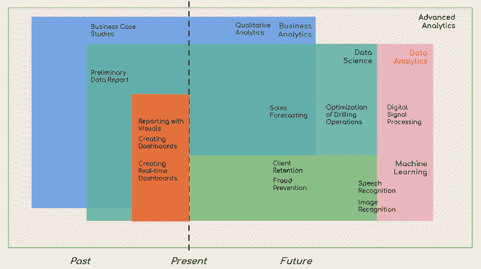
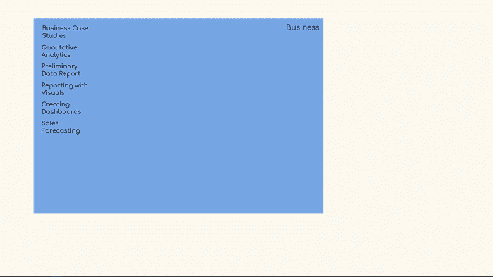
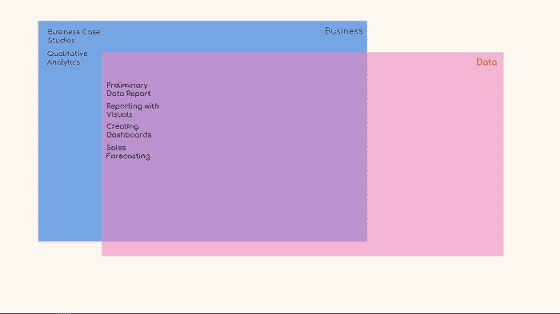
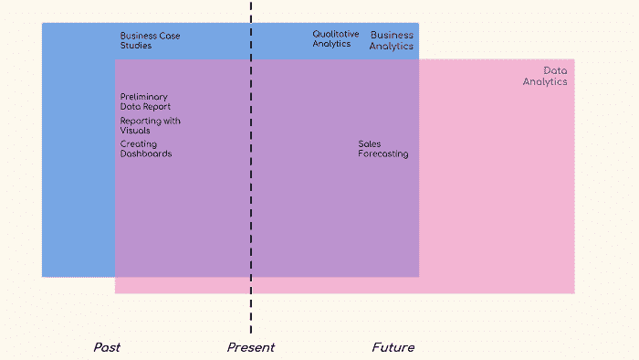
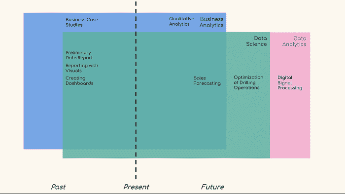
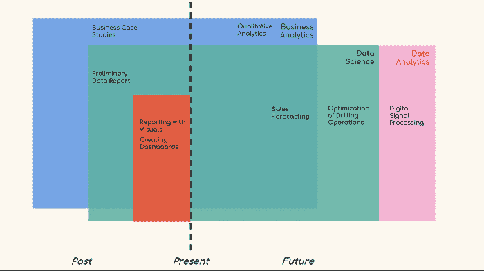
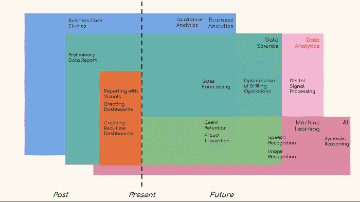
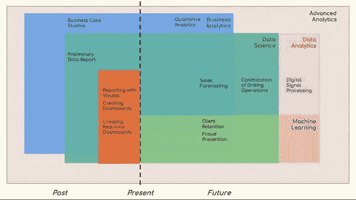

# 数据科学与机器学习与数据分析与商业分析

> 原文：[`www.kdnuggets.com/2018/05/data-science-machine-learning-business-analytics.html`](https://www.kdnuggets.com/2018/05/data-science-machine-learning-business-analytics.html)

 评论

数据科学。这个流行词汇被许多人试图定义，取得了不同的成功。

思考这个问题会让人涉及到与数据科学相关的所有其他领域——商业分析、数据分析、商业智能、高级分析、机器学习，最终是人工智能。

* * *

## 我们的三大课程推荐

 1\. [谷歌网络安全证书](https://www.kdnuggets.com/google-cybersecurity) - 快速进入网络安全职业生涯。

 2\. [谷歌数据分析专业证书](https://www.kdnuggets.com/google-data-analytics) - 提升你的数据分析技能

 3\. [谷歌 IT 支持专业证书](https://www.kdnuggets.com/google-itsupport) - 支持你所在组织的 IT 工作

* * *

在处理这个问题时，我们在[365 Data Science](https://365datascience.com)意识到**“绝对定义”**的数据科学需要大量的‘数据科学’背景知识才能理解，这本身就是一个递归问题……这里的假设是，统计学家或程序员比说历史学家或语言学家更容易理解数据科学，因为前者以某种形式接触过数据科学。

这引出了一个观点，即**“相对定义”**的数据科学可能更有用，这里是我们提出的方案。

这是一个欧拉图，描绘了上述所有领域。每种颜色代表一个不同的领域（混合颜色表示交集），图中有时间线和示例用法。

**图 1：矩形的位置、大小和颜色显示了概念上的相似性和差异性，而非复杂性**

由于所有这些信息可能会令人不知所措，我们从头开始。

### 商业

为了避免过度简化问题，我们假设“商业”一词不需要定义。商业活动的一些例子包括：

+   商业案例研究

+   定性分析

+   初步数据报告

+   使用可视化进行报告

+   创建仪表板

+   销售预测

它们舒适地坐在蓝色矩形中。

### 数据

这就是实际的欧拉图开始的地方。如果我们将*数据*纳入图中，将会有两个大领域及其交集，或总共三个部分。

根据我们最初的术语选择，我们可以将最后四个术语移到*商业*和*数据*的交集区域，目前在图中表示为紫色区域。这是因为‘初步数据报告’，‘可视化报告’，‘创建仪表板’和‘销售预测’都是**数据驱动的业务活动**。

它们可以与‘商业案例研究’和‘定性分析’相对立，因为这些是基于*商业*但基于过去的知识、经验和行为。所有这些都是重要的，但正如你很快会看到的——实际上并不是数据科学。

### 分析与分析

**分析**指的是将你的问题分解成易于消化的部分，方便你逐个研究并检查它们之间的关系。

**分析**，另一方面，是对分析中获得的组成部分应用逻辑和计算推理。在这样做时，人们寻找模式，并经常探索她可以如何在未来利用这些模式。

因此，与其说*商业*和*数据*，我们不如使用*商业分析*和*数据分析*。

### 时间

在进一步讨论之前，让我们引入一个时间线，因为它对于后续的分段至关重要。

我们将采用三个状态——过去、现在和未来。

图表上将有一条线穿过，表示任何分析问题的当前时刻。左侧的一切将指代面向**过去**的分析。右侧的一切将指代**预测性**分析。

我们分析的最后两个部分已经展示了这个点的全貌。

‘销售预测’被移到右侧，因为它的名字意味着一个面向未来的分析过程。广义上讲，‘定性分析’是利用你的直觉和经验来**规划你的下一步行动**——因此另一个面向未来的术语。

### 数据科学

对大多数读者来说，这就是文章的顶峰。*数据科学*是一个离不开数据的领域。因此，它**完全属于** *数据分析*的范畴。

它与*商业分析*的关系如何呢？

好吧，事实证明，所有既是*数据分析*又是*商业分析*的东西确实是***数据科学***。

但有一点需要说明。存在一些数据科学过程并不是直接和立刻的商业分析，但却是数据分析。例如，‘钻探作业优化’需要数据科学工具和技术。数据科学家可能会每天都做这些事情。然而，在‘石油**业务**’领域中，我们不能真的说它直接与*商业分析*相关。

基于‘相对定义’的概念，为了更好地说明这些观点，“数字信号处理”是*数据分析*的一部分，但不是*数据科学*或*商业分析*的一部分。数据、编程和数学都会涉及，但并不像我们在*数据科学*中使用它们那样。

为了保持一致性，让我们用时间线来结束——*数据科学*既在这条线的左侧，也在右侧（就像其他领域一样）。

这引出了一个问题：是否存在仅以过去为导向的领域？

### 商业智能

商业智能（BI）是分析和报告历史数据的过程。

这是以过去为导向的吗？不一定，但没有涉及预测分析。回归、分类和所有其他通常的预测方法是*数据科学*的一部分，但**不是*商业智能*。这就是分界线所在。

此外，*商业智能*完全是*数据科学*的一个子集。因此，当一个人处理描述性统计、报告或过去事件的可视化时，她同时在做 BI 和数据科学。

### 机器学习和人工智能

在这里，定义会变得有些模糊，因为仅仅解释机器学习和人工智能会导致失去文章的重点。此外，关于机器学习是什么，有很多资源，尤其是在 KDnuggets 上。

**人工智能（AI）**是机器表现出的任何类似于自然（人类）智能的形式，如计划、学习、解决问题等。

**机器学习（ML）**是机器在没有明确编程的情况下预测结果的能力。

机器学习（ML）是一种人工智能（AI）的方法，但两者常常被混淆，因为实际上**机器学习是我们人类迄今为止开发的唯一可行的人工智能路径**。因此，当我们谈论公司正在使用的人工智能的实际应用时，我们实际上是在谈论机器学习。

在我们的图表中，这两个术语的适配方式如下。

*机器学习*完全属于*数据分析*，因为它不能在没有数据的情况下进行。它也与*数据科学*重叠，因为它是数据科学家工具箱中最好的工具之一。最后，只要没有涉及预测分析，它也参与*商业智能*。

在*数据科学*中，*机器学习*的实例包括“客户保留”、“防欺诈”和“创建实时仪表盘”（也属于*商业智能*的一部分）。显著的例子包括“语音识别”和“图像识别”。这两者可以被认为是在*数据科学*之内或之外，因此我们把它们放在了边界上。

为了全面解释所有关系，*机器学习*完全在*人工智能*之内，但*人工智能*本身有一些与商业分析和数据分析无关的子领域！我们选择的一个例子是“符号推理”。

### 高级分析

我们分析的最后一个领域是*高级分析*。它不是数据科学术语，而是**营销**术语。它用于描述“难以处理”的分析。从主观上看，对初学者来说，图中的一切都是*高级*的。虽然这不是最好的术语，但它确实有助于汇总我们在整篇文章中使用的所有“正确”术语。

移除 AI 并添加*高级分析*，这就是我们得到的结果。

在本文的术语中，我们的**高级分析分析**已完成。

这是一个动画 gif，比较了这些定义。

**简介: [Iliya Valchanov](https://www.linkedin.com/in/iliya-valchanov-607293a6/)** 是 365 Data Science 的联合创始人。

**相关:**

+   [在急于开始数据科学之前需要知道的 5 件事](https://www.kdnuggets.com/2018/03/5-things-before-rushing-data-science.html)

+   [商业智能和数据分析如何驱动商业价值？](https://www.kdnuggets.com/2018/03/ntu-bi-data-analytics-online-mba.html)

+   [每个数据科学家都知道的肮脏小秘密（但不会承认）](https://www.kdnuggets.com/2018/04/dirty-little-secret-data-scientist.html)

### 更多相关内容

+   [建立一个稳固的数据团队](https://www.kdnuggets.com/2021/12/build-solid-data-team.html)

+   [使用管道编写干净的 Python 代码](https://www.kdnuggets.com/2021/12/write-clean-python-code-pipes.html)

+   [成为一名优秀数据科学家所需的 5 项关键技能](https://www.kdnuggets.com/2021/12/5-key-skills-needed-become-great-data-scientist.html)

+   [每个初学者数据科学家应掌握的 6 种预测模型](https://www.kdnuggets.com/2021/12/6-predictive-models-every-beginner-data-scientist-master.html)

+   [2021 年最佳 ETL 工具](https://www.kdnuggets.com/2021/12/mozart-best-etl-tools-2021.html)

+   [停止学习数据科学以寻找目标，并找到目标来…](https://www.kdnuggets.com/2021/12/stop-learning-data-science-find-purpose.html)
