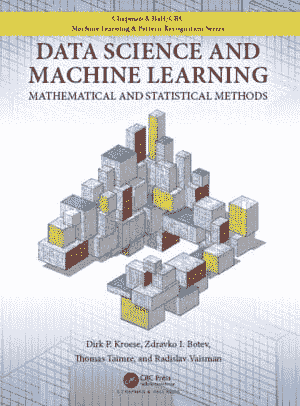

# 数据科学与机器学习：免费电子书

> 原文：[`www.kdnuggets.com/2020/12/data-science-machine-learning-free-ebook.html`](https://www.kdnuggets.com/2020/12/data-science-machine-learning-free-ebook.html)

评论

我们已经有一段时间没有与读者分享免费电子书了，但本周我们发现了另一部值得关注的作品，并希望在假期学习季节（这绝对是一个存在的事情）来临之前与大家分享。

今天我们分享**[数据科学与机器学习：数学与统计方法](https://acems.org.au/data-science-machine-learning-book-available-download)**，由 D.P. Kroese、Z.I. Botev、T. Taimre 和 R. Vaisman 合著。该书去年出版，除了可以免费下载 PDF 外，还可以购买印刷版（和 Kindle 版）。

* * *

## 我们的前三个课程推荐

 1\. [谷歌网络安全证书](https://www.kdnuggets.com/google-cybersecurity) - 快速进入网络安全职业生涯。

 2\. [谷歌数据分析专业证书](https://www.kdnuggets.com/google-data-analytics) - 提升你的数据分析技能

 3\. [谷歌 IT 支持专业证书](https://www.kdnuggets.com/google-itsupport) - 支持你的组织的 IT

* * *

数据科学与机器学习：数学与统计方法是一本以实践为导向的教材，重点介绍使用 Python 进行数据科学和实施机器学习模型。它很好地解释了相关理论，并根据需要介绍了必要的数学，结果使得这本实用书的节奏非常适中。

根据其网站，这本书的*raison d'être* 实际上与我的看法有些不符：

> 本书的目的是提供一本易于理解但内容全面的教科书，旨在帮助学生更好地理解数据科学中丰富的思想和机器学习算法背后的数学和统计学。

我相信这是同一枚硬币的另一面：当我看到这本书的优势在于教授实用技巧并用必要的理论和基础数学加以强化时，可以明确地说，它实际上专注于理论和基础数学，并通过实际应用来强化这些内容。

我会说可能平分秋色。

无论你支持哪种方法，这本书的[目录](https://people.smp.uq.edu.au/DirkKroese/DSML/toc.pdf)如下：

1.  导入、总结和可视化数据

1.  统计学习

1.  蒙特卡洛方法

1.  无监督学习

1.  回归分析

1.  正则化和核方法

1.  分类

1.  决策树和集成方法

1.  深度学习

这里涵盖了许多相关主题，并且逻辑顺序合理。我特别喜欢从蒙特卡罗方法过渡到无监督学习的过程，以及这种过渡发生在引入监督学习概念之前。尽管分类在长远来看可能更有用（至少目前似乎如此），但我第一次接触机器学习时，分类的影响远远不如聚类，因此在我看来，其先行引入可能对其他新学习者同样具有吸引力。

为确保本书对即使是最新的数据科学和机器学习学生也足够自给自足，本书包括了足够且有用的附录：

1.  线性代数与泛函分析

1.  多变量微分与优化

1.  概率与统计

1.  Python 基础

通过阅读这本书，你不会成为一个完整的数据科学专家，但这并不是它的目标。通过学习《数据科学与机器学习：数学与统计方法》，你将获得该领域基础知识的坚实基础，在此基础上可以添加更多前沿的方法和算法。

我最喜欢的机器学习书籍之一，是我首次接触该主题时使用的书籍，名为[《数据挖掘：实用机器学习工具与技术》](https://www.elsevier.com/books/data-mining-practical-machine-learning-tools-and-techniques/witten/978-0-12-374856-0)，也称为 Weka 书。我作为初学者非常喜欢它如何将实践和理论结合起来，根据需要介绍和解释数学，以学习当时呈现的实际实施。我发现这本书有类似的格式，具有使用 Python 代替 Weka 工具包的优势，至少在今天，Python 的实现路径要更为相关。

我推荐这本书给任何学习数据科学和机器学习基础知识的人，并且希望按照所描述的展示格式进行学习。

**相关**：

+   理解机器学习：免费的电子书

+   统计学习导论：免费的电子书

+   数据挖掘与机器学习：基本概念与算法：免费的电子书

### 更多相关主题

+   [机器学习数学：免费的电子书](https://www.kdnuggets.com/2020/04/mathematics-machine-learning-book.html)

+   [通过这本免费的电子书学习数据清理和预处理](https://www.kdnuggets.com/2023/08/learn-data-cleaning-preprocessing-data-science-free-ebook.html)

+   [超级学习指南：免费算法与数据结构电子书](https://www.kdnuggets.com/2022/06/super-study-guide-free-algorithms-data-structures-ebook.html)

+   [命令行下的数据科学：免费的电子书](https://www.kdnuggets.com/2022/03/data-science-command-line-free-ebook.html)

+   [掌握生成式人工智能和提示工程：免费电子书](https://www.kdnuggets.com/2023/04/free-ebook-mastering-generative-ai-prompt-engineering.html)

+   [数据科学家的认知偏见指南：免费电子书](https://www.kdnuggets.com/2023/05/data-scientist-guide-cognitive-biases-free-ebook.html)
