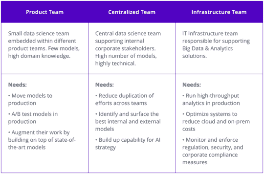
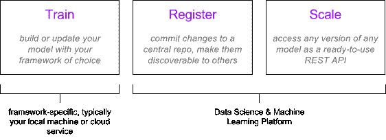

# 企业的数据科学与机器学习平台

> 原文：[`www.kdnuggets.com/2017/05/data-science-machine-learning-platforms-enterprise.html`](https://www.kdnuggets.com/2017/05/data-science-machine-learning-platforms-enterprise.html)

评论

**作者：Ahmad AlNaimi，Algorithmia。**

**TL;DR** 一个具有弹性的 数据科学平台 对于大型公司中的集中式数据科学团队是必需的。它帮助他们在 PB 规模下集中、重用和生产化他们的模型。我们为此目的构建了[Algorithmia Enterprise](http://algorithmia.com/enterprise)。

* * *

你已经构建了那个 R/Python/Java 模型。它运行良好。接下来呢？

> “*一切始于你的 CEO 听说了机器学习和数据是新石油的说法。数据仓库团队有人刚刚提交了 1PB Teradata 系统的预算，而 CIO 听说 Facebook 使用便宜的 Hadoop 商品存储，超级便宜。一场完美的风暴爆发了，现在你被要求建立一个数据优先的创新团队。你雇佣了一组数据科学家，大家都很兴奋，开始找你寻求一些数字魔法来‘Googlify’他们的业务。你的数据科学家没有任何基础设施，花费所有时间为高管构建仪表板，但投资回报是负面的，大家都怪你没有在他们的盈亏表上倾注足够的独角兽血。*” – Vish Nandlall ([source](https://www.linkedin.com/in/vishnandlall/))

在 PB 规模上共享、重用和运行模型不是数据科学家的工作流程的一部分。这种低效在企业环境中被放大，因为数据科学家需要与 IT 协调每一步，持续部署是一团糟（如果不是不可能的话），重用性低，随着公司不同部门开始“Googlify”他们的业务，问题越来越严重。

数据科学与机器学习平台旨在满足这种需求。它作为一个基础层，供三个内部利益相关者协作：产品数据科学家、中央数据科学家和 IT 基础设施。

**图 1：一个数据科学平台服务于三个利益相关者：产品、中央和基础设施。它对于大型公司来说是必需的，这些公司对机器学习有复杂且不断增长的依赖。**

在这篇文章中，我们将涵盖：

+   谁需要 数据科学与机器学习 (DS & ML) 平台？

+   什么是数据科学与机器学习平台？

+   如何区分平台？

+   平台的例子

### **你需要一个数据科学平台吗？**

这并不适合每个人。拥有一个或两个用例的小团队最好是围绕共享和扩展自己开发解决方案（或使用[私有托管解决方案](https://algorithmia.com/developers/teams/)）。如果你是一个有许多内部客户的中央团队，你很可能正在遭受以下一种或多种症状：

### 症状 #1 你在拆分代码库

你的数据科学家创建了一个模型（假设是用 R 或 Python 编写的），并希望将其接入生产环境，以便作为 Web 或移动应用的一部分使用。你的后端工程师们，使用 Java 或 .NET 构建了他们的基础设施，最终会在他们选择的技术栈中重新编写这个模型。现在你有两个代码库需要调试和同步。随着时间的推移，当你构建更多模型时，这种低效率会加剧。

### 症状 #2 你在重新发明轮子

无论是像预处理函数这样的小功能，还是像完整训练模型这样的大功能。你的团队产出的越多，当前团队成员、过去团队成员，特别是项目之间系统性重复工作的可能性就越大。

### 症状 #3 你在努力招募最佳人才

你公司每个角落都有数据科学或机器学习的想法，以保持领先，但你只有少数几个天才专家，他们一次只能处理一个挑战。你会雇佣更多的人，但数据科学和机器学习人才稀缺，顶尖人才[像顶级 NFL 四分卫一样昂贵](https://www.bloomberg.com/news/articles/2014-01-27/the-race-to-buy-the-human-brains-behind-deep-learning-machines)。

### 症状 #4 你的云账单激增（P2 实例太多了！）

你已经将模型部署在一个网络服务器后面。在深度学习的世界里，你可能会需要一个支持 GPU 的机器，比如 AWS EC2 上的 P2 实例（或 Azure N-Series 虚拟机）。为每一个生产化的深度学习模型运行这些机器可能会迅速变得昂贵，特别是对于负载波动较大或难以预测的模式。

### **什么是数据科学与机器学习平台？**

这涉及到除训练之外的一切。数据科学与机器学习平台关注的是模型在训练阶段之后的生命周期。这包括：模型的注册，显示模型从一个版本到下一个版本的传承，将它们集中起来以便其他用户可以找到它们，并将它们作为自包含的工件提供，这些工件可以随时插入任何数据管道中。

### 库 vs. 注册表

像 scikit-learn 和 Spark MLlib 这样的工具包含了一系列独特的算法。这就是一个库。数据科学与机器学习平台则是一个注册表。它包含来自不同来源的多个算法实现，每个算法都有自己的版本（或传承），这些实现同样是可发现和可访问的。注册表的用户将能够轻松找到并比较不同算法实现的输出。

### 训练与推理

数据科学家会使用适合问题的工具。有时这些工具是 scikit-learn 和 Keras 的组合，是 Cafe 和 Tensorflow 模型的集成，或者是用 R 编写的 H2O 脚本。一个平台不会指定工具，但能够注册和操作这些模型，无论它们是如何训练或组合的。

### 手动与自动部署

将模型部署到生产环境中有多种方式，最终结果大多是一个 REST API。不同的方法引入了许多风险，包括不一致的 API 接口设计、不一致的认证和日志记录，以及消耗开发运维资源。一个平台应该能够通过最小的步骤自动化这些工作，通过一致的 API 和认证暴露模型，并减少对开发运维的操作负担。

### **如何区分数据科学与机器学习平台？**

从表面上看，所有的数据科学平台听起来都一样，但关键在于细节。以下是一些比较的数据点：

### 支持的语言

R 和 Python 是大多数数据科学和机器学习项目的必备语言。Java 也很重要，因为像[deeplearning4j](https://deeplearning4j.org/)和[H2O 的 POJO](https://s3.amazonaws.com/h2o-release/h2o/rel-markov/1/docs-website/userguide/scorePOJO.html)模型提取器等库。C++在科学计算或[HPC](https://en.wikipedia.org/wiki/Supercomputer)中尤其相关。其他运行时是可选的，取决于你的使用场景和非数据科学同事使用的主要技术栈，如 NodeJS/Ruby/.NET。

### CPU 与 GPU（深度学习）

随着深度学习在数据科学和机器学习领域的日益突出，随着该领域的成熟和模型库的增长，这种趋势只会增加。尽管 TensorFlow 很受欢迎，但它并不总是向后兼容，Caffe 可能需要特殊的编译标志，而 cuDNN 实际上是另一个需要管理的 GPU 集群复杂层。如果能够完全容器化和生产化异构模型（无论是代码、节点权重、框架还是底层驱动程序）并在 GPU 架构上运行，这将是平台的一个强大差异化因素，甚至是强制性要求。

### 单版本与多版本控制

版本控制是能够列出模型随时间变化的历史，并独立访问每个版本。当模型被版本化时，数据科学家可以衡量模型的漂移。单版本架构为该模型（当前*稳定*版本）暴露一个 REST API 端点，只有作者能够从其控制面板“切换”模型。多版本架构除了为*稳定*版本暴露一个 REST API 端点外，还暴露每个先前版本，使它们同时可用，这消除了向后兼容性挑战，并使后端工程师能够实施部分推出或实时 A/B 测试。

### 垂直与水平扩展

将模型作为 REST API 提供是不够的。垂直扩展是将模型部署到更大的机器上。水平扩展是将模型部署到多台机器上。无服务器扩展，如[Algorithmia 企业版](http://algorithmia.com/enterprise)实现的，是通过将模型封装在专用容器中，根据需求在计算集群中即时部署该容器，并在执行后立即销毁容器以释放资源。无服务器计算带来了扩展和[经济](http://www.computerworld.com/article/3132145/it-industry/gartner-s-predictions-a-look-at-the-top-10-tech-trends.html) [效益](http://www.computerworld.com/article/3132145/it-industry/gartner-s-predictions-a-look-at-the-top-10-tech-trends.html)。

### 单租户 vs. 多租户

处理敏感或机密模型时，共享硬件资源可能会成为挑战。单租户平台会在相同资源（机器实例、虚拟内存等）中运行所有生产模型。多租户平台则将模型作为虚拟隔离的系统（通过为每个模型使用容器或虚拟机）进行部署，并可能提供额外的安全措施，如防火墙规则和审计跟踪。

### 固定 vs. 可互换数据源

数据科学家可能需要在模型上运行来自 S3 的离线数据，而后端工程师则同时在同一模型上运行来自 HDFS 的生产数据。固定数据源平台要求模型作者实现两个数据连接器：HDFS 和 S3。可互换数据源平台则要求作者实现一个通用数据连接器，作为多个数据源的适配器，并为未来可能出现的数据源做好模型兼容性准备。在 Algorithmia 企业版中，这被称为 [Data API](http://docs.algorithmia.com/#data-api-specification)。

### **示例数据科学与机器学习平台**

这绝非详尽无遗的列表。如果你有建议，请随时给我们留言或发送通知。

+   [Algorithmia 企业版](http://algorithmia.com/enterprise)

+   [Domino Data Lab](http://dominodatalab.com/)

+   [yHat](https://www.yhat.com/)

+   [Dataiku](https://www.dataiku.com/)

+   [Cloudera Workbench](https://www.cloudera.com/products/data-science-and-engineering/data-science-workbench.html)

+   [Alteryx](http://www.alteryx.com/)

+   [RapidMiner](https://rapidminer.com/)

[原始文章](http://blog.algorithmia.com/data-science-machine-learning-platforms-enterprise/)。经许可转载。

**个人简介：[Ahmad AlNaimi](https://www.linkedin.com/in/ahmadalnaimi/)** 是一位具有行动偏向的跨学科问题解决者。喜欢将创意从概念阶段推进到原型阶段再到早期应用。软件工程师和早期业务开发专家。

**相关：**

+   DataScience.com 新更新旨在成为行业领先的数据科学平台

+   Gartner 数据科学平台 – 深入分析

+   Forrester 与 Gartner 对数据科学平台和机器学习解决方案的比较

* * *

## 我们的 3 个推荐课程

 1\. [Google 网络安全证书](https://www.kdnuggets.com/google-cybersecurity) - 快速进入网络安全职业的快车道

 2\. [Google 数据分析专业证书](https://www.kdnuggets.com/google-data-analytics) - 提升你的数据分析技能

 3\. [Google IT 支持专业证书](https://www.kdnuggets.com/google-itsupport) - 为你的组织提供 IT 支持

* * *

### 更多相关主题

+   [企业中的机器学习：用例与挑战](https://www.kdnuggets.com/2022/08/dss-machine-learning-enterprise-cases-challenges.html)

+   [成为数据驱动型企业的好处](https://www.kdnuggets.com/2022/07/benefits-becoming-datafirst-enterprise.html)

+   [前 5 名云端机器学习平台和工具](https://www.kdnuggets.com/the-top-5-cloud-machine-learning-platforms-tools)

+   [构建强大数据科学作品集的 7 个免费平台](https://www.kdnuggets.com/2022/10/7-free-platforms-building-strong-data-science-portfolio.html)

+   [练习关键数据科学技能的 9 个顶级平台](https://www.kdnuggets.com/2023/03/9-top-platforms-practice-key-data-science-skills.html)

+   [构建强大数据科学作品集的 5 个免费平台](https://www.kdnuggets.com/5-free-platforms-for-building-a-strong-data-science-portfolio)
