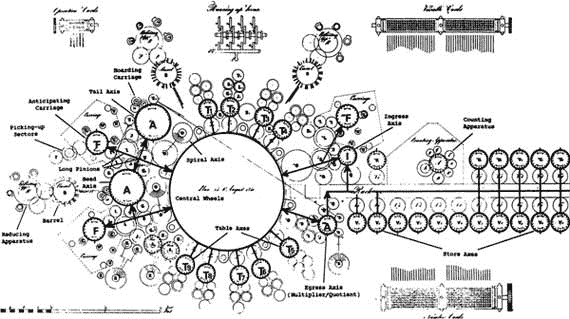

# 数据科学机器，或‘如何进行特征工程’

> 原文：[`www.kdnuggets.com/2015/10/data-science-machine.html`](https://www.kdnuggets.com/2015/10/data-science-machine.html)

 麻省理工学院硕士生[马克斯·坎特](http://www.jmaxkanter.com/)的最新研究实现了他所称之为“数据科学机器”的技术。坎特和他在[CSAIL](https://www.csail.mit.edu/)的论文导师[卡利扬·维拉马查内尼](http://www.kalyanv.org/)合作撰写了一篇关于数据科学机器（DSM）及其基础创新——深度特征合成算法的论文，该论文将于下周在 IEEE 国际数据科学与高级分析会议上发布。他们的论文《[深度特征合成：自动化数据科学工作](http://groups.csail.mit.edu/EVO-DesignOpt/groupWebSite/uploads/Site/DSAA_DSM_2015.pdf)》现已在线发布。坎特和维拉马查内尼简明地描述 DSM 为“一个从原始数据中生成预测模型的自动化系统”，它将作者们创新的[特征工程](https://www.kdnuggets.com/2018/12/feature-engineering-explained.html)方法与端到端数据科学管道相结合。迄今为止，DSM 在其参加的数据科学竞赛中击败了 68.9%的团队。也许最值得注意的是，取得这一成功率的提交通常在 12 小时内完成，而不是需要几个月的人工工作。DSM 的基础是观察到数据科学竞赛问题通常具有以下共同特性：它们是结构化和关系型的，它们建模人类与复杂系统的互动，并且尝试预测某些人类方面的内容。**深度特征合成** 与任何数据科学问题一样，特征必须首先从现有变量中识别出来，或从现有变量中创建出来。虽然特征工程在非关系数据（如文本和图像）领域取得了显著进展，但坎特和维拉马查内尼指出，这一任务仍然是数据科学管道中最依赖人工干预的任务，即使对于经验丰富的数据科学家来说也可能是困难且耗时的。如果要真正实现自动化，这一任务也必须最接近人类的效率。DSM 的特征工程算法深度特征选择（DFS）专门用于关系型数据集，用于自动化识别和生成洞察性特征。DFS 以关系表为输入，能够处理这种数据结构中包含的各种数据类型。成功的 DFS 算法旨在像数据科学家一样思考，将洞察性问题转化为输入特征。DFS 算法遍历关系，并在此过程中应用特征选择函数，逐步创建最终特征。DFS 在执行这一遍历时，将数学函数的计算叠加到特定深度，这也是 DFS 名称的由来。根据输入数据类型，DSM 在两个不同层次上应用多个数学函数：*实体*和*关系*。实体层特征关注于转换和翻译函数，例如更改数据表示、四舍五入数字，以及将现有的广义属性提取为更多且更简洁的属性。关系层特征关注于表中实体之间的关系（比如你的主键和外键）。这些特征函数能够从其他表中提取相关数据以与给定特征关联（例如，找到与订单相关的最大项目价格或项目数量），这些数据可能作为有用特征输入到模型中。**机器学习路径** 为启动 DSM 的机器学习路径，首先选择一个输入特征作为目标值，用于形成预测问题。通过元数据选择适当的特征，称为*预测变量*，以帮助预测过程。DSM 然后创建一个数据预处理、特征选择、降维、建模和评估的路径，所有这些都被参数化并在必要时可供重用。参数优化通过[Copula 过程](https://en.wikipedia.org/wiki/Copula_(probability_theory))完成，并通过观察相关性来减少特征数量。减少后的特征集在样本数据上进行测试，通过不同的组合来优化预测准确性。通过使用自动调节功能（作者认为这是其性能绝对关键的因素），DSM 在所有三个竞赛中提高了其得分。**讨论** 所有这些似乎基本上表明：DSM 利用智能关系型数据库的关系遍历来帮助构建和建立候选特征，通过寻找相关值来缩小特征集，并在等同于蛮力特征工程的组合中，应用迭代特征子集到样本数据中，同时重新组合以优化，直到找到最佳解决方案。为了测量 DSM 的性能，它被投入到 2014 年 KDD Cup、IJCAI 和 2015 年 KDD Cup 等竞赛中，如前所述，它击败了超过 2/3 的人类竞争者。坎特和维拉马查内尼声称，即使在表现最差的时候（IJCAI），DSM 仍能以类似于人类竞争者的方式构建预测问题，证据是它在任务中沿用类似的数据建模途径。在同一竞赛中，它与获胜者的 AUC 差距约为 0.04，表明 DSM 捕捉到了竞赛数据集中的主要方面。坎特和维拉马查内尼认为，虽然它目前不能与最高表现的人类科学家竞争，但 DSM 仍然有其与他们并肩的作用。尽管在每场比赛中有许多人战胜了 DSM，但它能够以相当少的努力（在某些情况下少于 12 小时，而不是几个月）击败大多数人。他们建议，考虑到这一点，它可以用来设定基准以及激发创造力。通过前置特征工程和生成潜在顶级特征集，能够让人类在数小时内重新思考问题，有效地从 DSM 解决方案出发，继续前进。需要注意的是，虽然 DSM 令人印象深刻，但它并不是第一个旨在自动化机器学习的系统。其他例子包括许多自动构建广告竞标模型的系统，或[KXEN Model Factory](http://www.realwire.com/releases/KXEN-Unveils-Analytical-Data-Management-and-Modeling-Factory-Supercharging-Agility-and-Productivity-in-Predictive-Analytics)（现在是 SAP 的一部分），它在 2010 年就已经提供了自动化模型构建。此外，DSM 显然*并不*适用于所有类型的数据，它是一个专注于关系型数据集的系统。尚未证明它在不符合先前识别的数据科学竞赛问题模式的关系型数据集上有效。DSM 已经衍生出一个名为[FeatureLab](http://www.featurelab.co/)的初创公司，称其为“界面上的洞察”，坎特担任首席执行官。该网站声明“利用你的数据，无需更多数据科学家”，并声称它是“寻求增加数据科学资源的公司的最佳解决方案”。这些都是大胆的声明，尤其是考虑到 DSM 的个别部分并不能真正算作突破。FeatureLab 很可能会在“商业智能”服务平台的云雾中迷失。但大数据依然存在，特征工程在过去 12 个月里一直是机器学习的热门话题。DSM 可能正是其特定技术组合在恰当的时间点上，导致了对数据科学的新思考方式。哈佛计算机科学教授玛戈·塞尔茨（Margo Seltzer）在谈到 DSM 时表示：“我认为他们做的事情将迅速成为标准——非常迅速。”如果情况确实如此，FeatureLabs 可能会处于良好的位置。你可以在[这里](http://news.mit.edu/2015/automating-big-data-analysis-1016)阅读更多关于坎特和维拉马查内尼的数据科学机器的信息。**简介：[马修·梅奥](https://twitter.com/mattmayo13)** 是一名计算机科学研究生，目前正在从事机器学习算法的并行化研究。他还是数据挖掘学生、数据爱好者和有志于成为机器学习科学家的人员。**相关链接：**

+   数据科学中书本上没有的 3 件事

+   数据维度减少的七种技术

+   2015 年 8 月的分析、大数据、数据挖掘、数据科学收购和初创公司汇总

### 更多相关话题

+   [2022 年特征存储峰会：关于特征工程的免费会议](https://www.kdnuggets.com/2022/10/hopsworks-feature-store-summit-2022-free-conference-feature-engineering.html)

+   [机器学习中的特征工程实用方法](https://www.kdnuggets.com/2023/07/practical-approach-feature-engineering-machine-learning.html)

+   [为多变量时间序列构建可处理的特征工程管道](https://www.kdnuggets.com/2022/03/building-tractable-feature-engineering-pipeline-multivariate-time-series.html)

+   [使用 RAPIDS cuDF 在特征工程中利用 GPU](https://www.kdnuggets.com/2023/06/rapids-cudf-leverage-gpu-feature-engineering.html)

+   [特征工程初学者指南](https://www.kdnuggets.com/feature-engineering-for-beginners)

+   [通过声明式机器学习从工程师转型为 ML 工程师](https://www.kdnuggets.com/2023/05/predibase-go-engineer-ml-engineer-declarative-ml.html)
