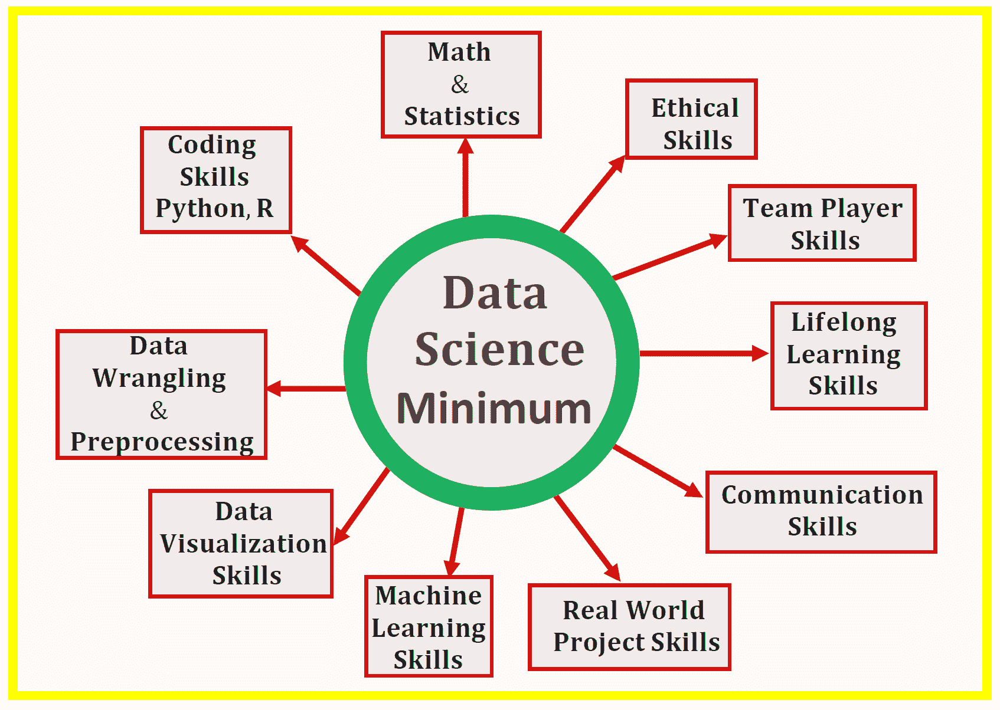

# 数据科学最低要求：开始从事数据科学所需掌握的 10 项核心技能

> 原文：[`www.kdnuggets.com/2020/10/data-science-minimum-10-essential-skills.html`](https://www.kdnuggets.com/2020/10/data-science-minimum-10-essential-skills.html)

数据科学是一个广泛的领域，包括数据准备与探索、数据表示与转换、数据可视化与展示、预测分析和机器学习等多个子领域。对于初学者来说，提出以下问题是很自然的：**我需要掌握哪些技能才能成为数据科学家？**

本文将讨论 10 项数据科学家实践所需的核心技能。这些技能可以分为两类，即**技术技能**（数学与统计、编码技能、数据整理与预处理技能、数据可视化技能、机器学习技能以及实际项目技能）和**软技能**（沟通技能、终身学习技能、团队合作技能和伦理技能）。

数据科学是一个不断发展的领域，但掌握数据科学的基础将为你提供必要的背景，以便你追求深度学习、人工智能等高级概念。本文将讨论 10 项数据科学家必备的核心技能。

# 1. 数学和统计技能

## (i) 统计学和概率

统计和概率用于特征可视化、数据预处理、特征转换、数据填补、降维、特征工程、模型评估等。以下是你需要熟悉的主题：

a) 平均值

b) 中位数

c) 模式

d) 标准差/方差

e) 相关系数和协方差矩阵

f) 概率分布（二项分布、泊松分布、正态分布）

g) p 值

h) 均方误差（MSE）

i) R2 分数

j) 贝叶斯定理（精确度、召回率、正预测值、负预测值、混淆矩阵、ROC 曲线）

k) A/B 测试

l) 蒙特卡洛模拟

## (ii) 多变量微积分

大多数机器学习模型是基于具有多个特征或预测变量的数据集构建的。因此，熟悉多变量微积分对于构建机器学习模型至关重要。以下是你需要熟悉的主题：

a) 多变量函数

b) 导数和梯度

c) 步骤函数、Sigmoid 函数、Logit 函数、ReLU（修正线性单元）函数

d) 成本函数

e) 函数绘图

f) 函数的最小值和最大值

## (iii) 线性代数

线性代数是机器学习中最重要的数学技能。数据集被表示为矩阵。线性代数用于数据预处理、数据转换和模型评估。以下是你需要熟悉的主题：

a) 向量

b) 矩阵

c) 矩阵的转置

d) 矩阵的逆

e) 矩阵的行列式

f) 点积

g) 特征值

h) 特征值

## (iv) 优化方法

大多数机器学习算法通过最小化目标函数来执行预测建模，从而学习必须应用于测试数据的权重，以获得预测标签。你需要熟悉的主题包括：

a) 成本函数/目标函数

b) 似然函数

c) 误差函数

d) 梯度下降算法及其变体（例如随机梯度下降算法）

了解更多关于梯度下降算法的信息，请访问：[机器学习：梯度下降算法如何工作](https://medium.com/towards-artificial-intelligence/machine-learning-how-the-gradient-descent-algorithm-works-61682d8570b6)。

# 2\. 必要的编程技能

编程技能在数据科学中至关重要。由于 Python 和 R 被认为是数据科学中最受欢迎的两种编程语言，对这两种语言的基本知识至关重要。有些组织可能只要求具备 R 或 Python 中的一种技能，而不是两者。

## (i) Python 技能

熟悉 Python 中的基本编程技能。以下是你应该掌握的最重要的包：

a) Numpy

b) Pandas

c) Matplotlib

d) Seaborn

e) Scikit-learn

f) PyTorch

## (ii) R 语言技能

a) Tidyverse

b) Dplyr

c) Ggplot2

d) Caret

e) Stringr

## (iii) 其他编程语言的技能

一些组织或行业可能需要以下编程语言的技能：

a) Excel

b) Tableau

c) Hadoop

d) SQL

e) Spark

# 3\. 数据处理和预处理技能

数据对于任何数据科学分析至关重要，无论是推断分析、预测分析还是处方分析。模型的预测能力取决于构建模型时使用的数据质量。数据有不同的形式，如文本、表格、图像、语音或视频。通常，用于分析的数据需要被挖掘、处理和转换，以适合进一步分析。

i) **数据处理**：数据处理过程是任何数据科学家至关重要的一步。在数据科学项目中，数据很少能够轻易获取用于分析。数据更可能存在于文件、数据库中，或从网页、推文或 PDF 等文档中提取。了解如何处理和清理数据将使你能够从数据中提取出其他隐藏的关键见解。

ii) **数据预处理**：了解数据预处理非常重要，涉及的主题包括：

a) 处理缺失数据

b) 数据填充

c) 处理分类数据

d) 编码分类标签用于分类问题

e) 特征变换和降维技术，如主成分分析（PCA）和线性判别分析（LDA）。

# 4\. 数据可视化技能

理解良好数据可视化的基本组成部分。

a) **数据组件**：决定如何可视化数据的一个重要第一步是了解数据的类型，例如，类别数据、离散数据、连续数据、时间序列数据等。

b) **几何组件**：在这里你决定什么样的可视化适合你的数据，例如，散点图、折线图、条形图、直方图、QQ 图、平滑密度图、箱线图、对角图、热图等。

c) **映射组件**：在这里你需要决定使用什么变量作为 x 变量，什么作为 y 变量。这一点很重要，尤其是当你的数据集是多维的，具有多个特征时。

d) **比例组件**：在这里你决定使用什么样的比例尺，例如，线性尺度、对数尺度等。

e) **标签组件**：这包括轴标签、标题、图例、字体大小等。

f) **伦理组件**：在这里，你需要确保你的可视化讲述了真实的故事。你需要在清理、总结、操控和生成数据可视化时意识到自己的行为，并确保你没有利用可视化来误导或操控观众。

# 5. 基本机器学习技能

机器学习是数据科学的一个非常重要的分支。理解机器学习框架非常重要：问题框定、数据分析、模型构建、测试与评估、模型应用。了解更多关于机器学习框架的信息，请参见：[机器学习过程](https://medium.com/towards-artificial-intelligence/the-machine-learning-process-3ac14c9a557c)。

以下是需要熟悉的重要机器学习算法。

## i) 监督学习（连续变量预测）

a) 基本回归

b) 多重回归分析

c) 正则化回归

## ii) 监督学习（离散变量预测）

a) 逻辑回归分类器

b) 支持向量机分类器

c) K-最近邻（KNN）分类器

d) 决策树分类器

e) 随机森林分类器

## iii) 无监督学习

a) KMeans 聚类算法

# 6. 来自现实世界数据科学项目的技能

仅仅从课程作业中获得的技能不足以让你成为数据科学家。一个合格的数据科学家必须能够展示成功完成现实世界数据科学项目的证据，该项目应包括数据科学和机器学习过程中的每个阶段，如问题框定、数据获取与分析、模型构建、模型测试、模型评估和模型部署。现实世界的数据科学项目可以在以下内容中找到：

a) Kaggle 项目

b) 实习

c) 来自面试

# 7. 沟通技巧

数据科学家需要能够与团队的其他成员或组织中的业务管理人员沟通自己的想法。良好的沟通技巧在这里起着关键作用，它能帮助将非常技术化的信息传达给对数据科学技术概念几乎没有了解的人。良好的沟通技能将有助于与数据分析师、数据工程师、现场工程师等其他团队成员培养团结和合作的氛围。

# 8\. 成为终身学习者

数据科学是一个不断发展的领域，因此要做好拥抱和学习新技术的准备。与其他数据科学家建立网络是保持对该领域发展动态了解的一种方式。一些促进网络联系的平台包括 LinkedIn、GitHub 和 Medium（[Towards Data Science](https://towardsdatascience.com/)和[Towards AI](https://towardsai.net/)出版物）。这些平台对于获取关于该领域最新发展的信息非常有用。

# 9\. 团队合作技能

作为一名数据科学家，你将与数据分析师、工程师、管理人员等团队成员一起工作，因此你需要良好的沟通技能。你还需要成为一个好的倾听者，特别是在项目初期阶段，你需要依赖工程师或其他人员来设计和规划一个好的数据科学项目。作为一个优秀的团队成员将帮助你在商业环境中取得成功，并与团队其他成员以及组织的管理员或主管保持良好关系。

# 10\. 数据科学中的伦理技能

理解项目的含义。对自己保持真实。避免操纵数据或使用会故意产生偏见的方式。确保在数据收集、分析、模型构建、分析、测试和应用的所有阶段都遵循伦理原则。避免伪造结果以误导或操控受众。解释数据科学项目结果时要保持伦理。

总结一下，我们讨论了从事数据科学工作所需的 10 项基本技能。尽管数据科学是一个不断发展的领域，但掌握数据科学的基础将为你提供必要的背景，使你能够进一步探索深度学习、人工智能等高级概念。

**[本杰明·O·泰奥](https://www.linkedin.com/in/benjamin-o-tayo-ph-d-a2717511/)** 是一位物理学家、数据科学教育者和作家，同时也是 DataScienceHub 的所有者。此前，本杰明曾在中央俄克拉荷马大学、大峡谷大学和匹兹堡州立大学教授工程学和物理学。

[原文](https://towardsdatascience.com/data-science-minimum-10-essential-skills-you-need-to-know-to-start-doing-data-science-e5a5a9be5991)。经许可转载。

### 更多相关话题

+   [提升你的数据科学技能：你需要的关键 SQL 认证](https://www.kdnuggets.com/boost-your-data-science-skills-the-essential-sql-certifications-you-need)

+   [2023 年数据科学家需要掌握的 19 项技能](https://www.kdnuggets.com/2023/04/top-19-skills-need-know-2023-data-scientist.html)

+   [想利用你的数据技能解决全球问题？这里有一些建议…](https://www.kdnuggets.com/2022/04/jhu-want-data-skills-solve-global-problems.html)

+   [KDnuggets 新闻，4 月 13 日：数据科学家应该关注的 Python 库…](https://www.kdnuggets.com/2022/n15.html)

+   [成为数据工程师必读的书籍](https://www.kdnuggets.com/2022/10/essential-books-need-become-data-engineer.html)

+   [Kaggle 竞赛中的 4 大技巧及为何你应该立即开始](https://www.kdnuggets.com/2022/05/packt-top-4-tricks-competing-kaggle-start.html)
