# 我在 Coursera 上的数据科学在线学习之旅

> 原文：[`www.kdnuggets.com/2020/11/data-science-online-learning-journey-coursera.html`](https://www.kdnuggets.com/2020/11/data-science-online-learning-journey-coursera.html)

评论

**由 [Ruben Winastwan](https://www.linkedin.com/in/marcellusrubenwinastwan/)，数据科学爱好者**

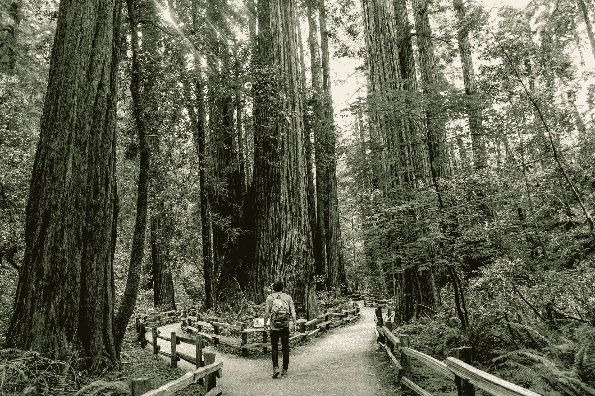

图片由 [Caleb Jones](https://unsplash.com/@gcalebjones?utm_source=unsplash&utm_medium=referral&utm_content=creditCopyText) 提供，来源于 [Unsplash](https://unsplash.com/s/photos/path?utm_source=unsplash&utm_medium=referral&utm_content=creditCopyText)

* * *

## 我们的三大课程推荐

 1\. [谷歌网络安全证书](https://www.kdnuggets.com/google-cybersecurity) - 快速进入网络安全职业生涯

 2\. [谷歌数据分析专业证书](https://www.kdnuggets.com/google-data-analytics) - 提升你的数据分析能力

 3\. [谷歌 IT 支持专业证书](https://www.kdnuggets.com/google-itsupport) - 支持你所在组织的 IT 需求

* * *

### 介绍：我的背景

是在 2016 年，我在完成机械工程学士学位后，直接开始攻读计算力学硕士学位。那时，我对编程了解有限，更别说了解数据科学和机器学习了。

启程的契机发生在我硕士学习期间，当时我需要构建一个对象检测和对象跟踪算法的经典计算机视觉项目，使用 Python、C++和 OpenCV。那个项目确实迫使我艰难地学习 Python 和 C++，以及如何正确编写干净的代码。

长话短说，我发现自己对计算机视觉领域非常着迷，这引发了我的执念：我想成为一名计算机视觉工程师。

但当我阅读计算机视觉工程师职位的招聘要求时，高期望变成了泡影：他们期望候选人了解机器学习和深度学习，特别是卷积神经网络（CNN）。

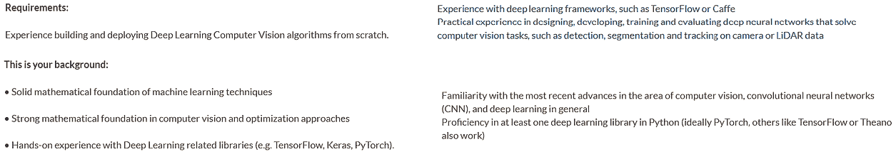

计算机视觉工程师的常见职位描述

那时，我甚至不知道什么是机器学习，更别提 CNN 了。尽管我的学习计划涉及了编程、数学和统计，但我们从未讨论过机器学习。

经过一些研究，我发现如果你想了解 CNN，你需要首先了解一般的深度神经网络（DNN）。如果你想了解 DNN，你需要首先了解经典的神经网络。如果你想了解神经网络，你需要首先了解机器学习。如果你想了解机器学习，你需要首先了解数据科学的基础。

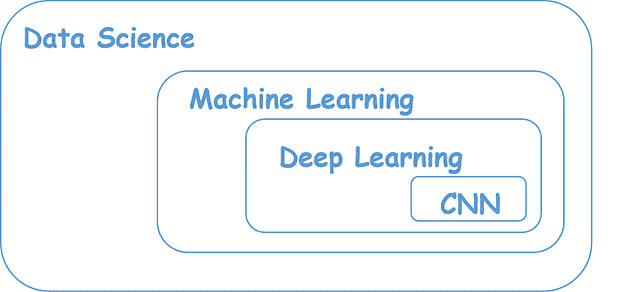

这就像一个视频游戏，我需要逐步升级，直到达到我想要的主题。此外，我是自下而上的方法的忠实粉丝，因此我决定首先学习数据科学的基础。

当时的问题是：当我的学习计划没有提供相关课程时，我怎么能学习所有这些内容呢？

我需要自己学习所有这些内容。

那时我第一次知道 Coursera 的存在。

### 那为什么是 Coursera 呢？

首先，我并不打算在这篇文章中推荐 Coursera。我只是发现它们是对我来说最好的在线学习平台，因为有许多来自知名机构的数据科学和机器学习课程。此外，你还可以选择免费旁听课程，并仍然获得学习材料的访问权限。

更重要的是，如果你真的想追求这个专业的证书，总体费用比 Udacity Nanodegree 便宜得多，尤其是如果你还在读书的话。

好了，说了这么多，我们来看看我的学习路径吧。

### 我的数据科学学习路径

我们都同意，一切的最难部分总是在开始时。就像我想涉足数据科学时一样。我不断问自己一个问题：我从哪里开始？

经过一些研究，我终于制定了我的在线学习课程，这里是我在 Coursera 上按时间顺序进行的课程或专业列表。

### [IBM 数据科学](https://www.coursera.org/professional-certificates/ibm-data-science)

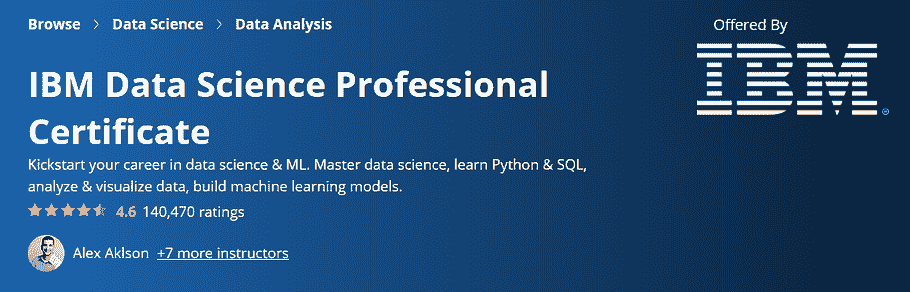

我决定从基础层面开始学习数据科学，因为我不想错过一些重要概念。这就是我选择将 IBM 数据科学作为我第一门专业课程的原因。

在参加这门课程之前，你不需要对数据科学、统计学、机器学习或编程有任何先前的知识。这门专业的第一门课程被称为*‘什么是数据科学？’*。我的意思是，你不会找到比这更基础的了，对吧？

这个专业有 9 门课程。它从数据科学的概念和方法开始，然后深入讲解 Python 和 SQL 编程。接着，它将带你进入数据科学的核心——统计学、数据分析、数据可视化和机器学习。

完成这个专门化课程后，你不会成为数据科学方面的专家，因为这个专门化课程不会详细讲解每一个主题。然而，它给了我数据科学的一个很好的概述，并帮助我决定接下来应该学习什么。

感谢这个专门化课程，我能够为我的数据科学和机器学习在线学习之旅制定了如下路线图：

+   SQL

+   统计学

+   数据可视化

+   机器学习

+   深度学习

这使我进入了我所学习的下一个专门化课程。

### [现代大数据分析与 SQL](https://www.coursera.org/specializations/cloudera-big-data-analysis-sql?)

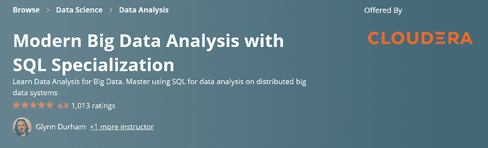

这是由 Cloudera 提供的一个专门化课程，重点是利用 SQL 进行大数据分析。这个专门化课程总共有 3 门课程。

如我们所知，如今的数据量过于庞大，无法存储在传统的数据库管理系统中，因此处理分布式集群中的数据的知识和实践经验非常重要。这门课程将教你正是这些内容。

我特别喜欢这个专门化课程的实践性。通过 Cloudera 提供的虚拟机，我们有机会应用 SQL 查询来检索或存储数据，使用 Apache Hive、Apache Impala、MySQL 或 PostgreSQL。即使你完成了专门化课程，你仍然可以重新访问虚拟机，这样你总能复习你的 SQL 技能并玩弄数据。

如果你对 SQL 一无所知，不用担心，因为这个专门化课程将从基础开始教你。

### [从数据到洞察：Google Cloud Platform](https://www.coursera.org/specializations/from-data-to-insights-google-cloud-platform?)

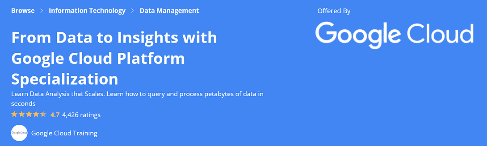

我修这门课程是为了补充我从 Cloudera 的之前专门化课程中学到的材料。虽然 Cloudera 的专门化课程更多地集中于在分布式集群中应用 SQL，这个专门化课程让我能够在云端应用 SQL。

这个专门化课程将教你如何在 Google Cloud Platform (GCP) 的 BigQuery 中检索或存储数据。你将有机会使用 Google 公共数据集，如 Google Analytics，并自己实施 SQL 查询。

除此之外，我喜欢这个专门化课程的另一个原因是，你将学到的不仅仅是 SQL 和 BigQuery。你还会学习如何使用 Google Data Studio 创建互动数据可视化仪表板，以及如何在 BigQuery 中直接创建一个简单的回归或分类机器学习模型。

在完成这个专门化课程后，我继续学习了数据科学和机器学习背后最重要的概念之一，即统计学。

### [使用 R 统计](https://www.coursera.org/specializations/statistics)

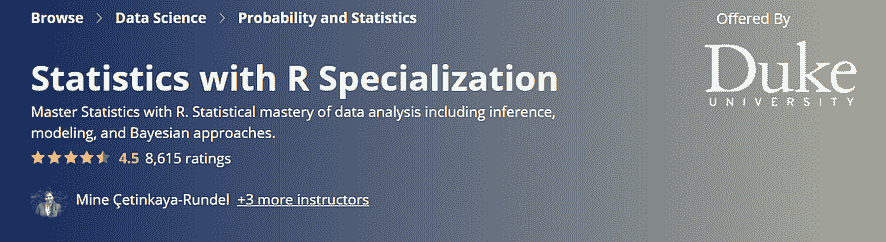

我们可以达成共识，统计学是数据科学的核心。由于我之前已经了解统计学，我选择了这个专门化，希望能够刷新统计学的基础理论。但最终，我获得的比预期要多。

这个专门化确实教会了你关于统计学的所有必要知识，从概率基础理论、推断统计学，到频率主义和贝叶斯观点的回归理论。

我喜欢这个专门化的两点：

1.  所有最终项目都具有投资组合价值，这意味着你需要做真实的统计数据分析工作，并且不要指望在 1 或 2 小时内完成它们。完成专门化后，你将拥有 3 或 4 个投资组合价值的项目，可以放在你的简历中。

1.  你需要使用 R 来完成每门课程的项目。这对我来说很好，因为我之前从未使用过 R。我认为学习一种新的编程语言从长远来看是有益的，而 R 绝对是一个很好的数据科学和统计工具箱，可以加入到你的技能库中。

完成专门化后，我觉得我想深入研究一下贝叶斯统计学，特别是关于马尔可夫链蒙特卡罗的方法。这就是为什么我在这个专门化之后又选修了一门关于统计学的课程，那就是……

### [贝叶斯统计：技术与模型](https://www.coursera.org/learn/mcmc-bayesian-statistics)

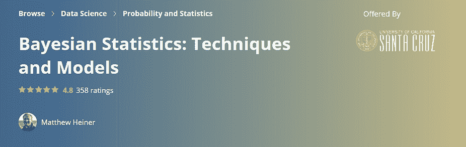

如果你想全面了解贝叶斯统计学的概念，我认为这将是适合你的课程。在这门课程中，你将学习关于马尔可夫链蒙特卡罗的概念，以及如何使用贝叶斯概念解决回归问题。

我特别喜欢这门课程的地方在于理论与实践的平衡。

每个材料都会首先讲解理论，然后进行演示，讲师会向你展示如何在代码中实现你刚刚学到的理论。在这门课程中，你将学习如何在 R 和 JAGS 中实现贝叶斯统计学。

本课程的最终项目也具有投资组合价值，并且与上述的 R 统计学专门化非常相似。你将被要求使用贝叶斯概念在 R 中进行统计分析工作。

完成课程后，我决定继续学习下一个主题，即数据可视化。

### [Tableau 数据可视化](https://www.coursera.org/specializations/data-visualization?)

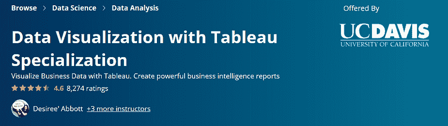

通常情况下，当涉及到数据可视化时，我会使用 Python，借助 Matplotlib、Seaborn 或 Plotly。然而，我想学习一些新东西——我想学会如何使用商业智能工具进行数据可视化，无论是 PowerBI 还是 Tableau。然后我发现了这个专门化。

如果你对 Tableau 不熟悉并想学习如何用它来可视化数据，我会推荐这门专业。

这个专业包含 5 门课程和一个 Capstone 项目。前三门课程将为你提供数据可视化最佳实践的理论理解，以及如何用数据讲故事。第四门课程基本上就是让你动手使用 Tableau，你将学习如何创建交互式数据可视化仪表板和故事。

我非常喜欢这门专业的地方是，当你注册这门专业时，你会获得 6 个月免费使用 Tableau Desktop 的权限。

这意味着你可以在本地机器上探索 Tableau 的许多功能，并用它创建很多有趣的可视化。如果许可证在 6 个月后过期，你将有机会再延续 6 个月。

### [机器学习](https://www.coursera.org/learn/machine-learning?) 

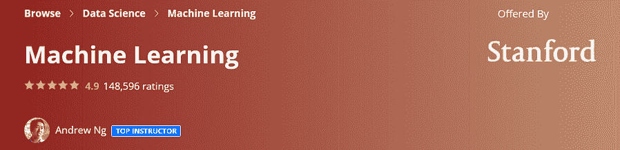

到目前为止，我已经学习了数据科学概述、使用 SQL 进行大数据分析、统计学和数据可视化最佳实践。接下来，终于到了学习机器学习的时机。

作为机器学习的完全初学者，我决定参加安德鲁·吴的机器学习课程，因为我知道这是 Coursera 上最著名的机器学习课程。

这完全是合理的。我相信对于初学者来说，我找不到比这更好的机器学习课程了。

这门课程将教你经典的监督学习和无监督学习算法的概念，如线性回归、逻辑回归、支持向量机（SVM）、K 均值聚类以及人工神经网络。不仅如此，安德鲁还给了我们在实践中应用机器学习系统的技巧和窍门。

基本上，我喜欢这门课程的一切。

我喜欢安德鲁·吴在教学中对各种机器学习算法的热情。我喜欢他如何轻松地向我们解释和简化复杂的机器学习概念。我也喜欢编程作业，以及我们有机会从零开始实现神经网络算法。

如果你是机器学习的新手，对我来说这是你应该开始学习的最佳课程。

### [深度学习](https://www.coursera.org/specializations/deep-learning?) 

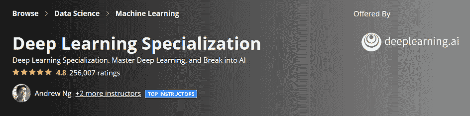

最终，我越来越接近实现我的初衷——了解卷积神经网络的概念。

我仍然记得当我发现安德鲁·吴是这门深度学习专业的老师时的兴奋感。在完成机器学习课程后，毫不犹豫地选择这门专业对我来说并不是一个困难的决定。

这个专业化课程结构非常合理。第一个课程将教你有关深度神经网络的概念，而你已经在之前的机器学习课程中学习了经典的神经网络。接下来，它会介绍卷积神经网络和序列模型的重要概念。

Andrew Ng 一如既往地在教授有关深度学习算法的难点概念方面表现出色。编程作业很有趣，让你可以实现各种深度学习算法，TensorFlow 也是目前行业中最常用的深度学习框架之一。

然而，这个专业化课程中的大多数编程作业仍然是在 TensorFlow 1 中实现的，现在已经相当过时了。

### [DeepLearning.AI TensorFlow 开发者专业证书](https://www.coursera.org/professional-certificates/tensorflow-in-practice?) 

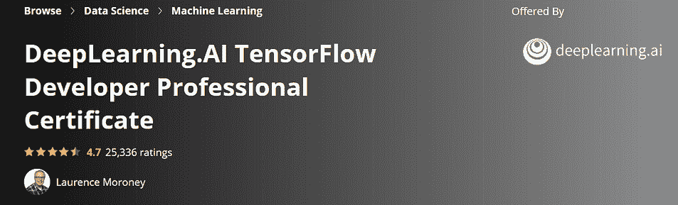

我相信在 DeepLearning.AI 将名称改为 *TensorFlow 开发者专业证书* 之前，这个专业化课程曾被称为 *TensorFlow 实践*。

不管怎样，我之所以在完成深度学习专业化课程后立即选择这个专业化课程，是因为我想学习如何实现 TensorFlow 2 以应用于各种深度学习算法。这个专业化课程完全达到了这一目标。

这个专业化课程完全是实践操作。你不会在其中找到有关深度学习的理论，因为它的重点是借助 TensorFlow 实现深度学习算法。因此，建议在参加这个专业化课程之前，你已经了解深度学习的概念。

它让你获得了构建用于图像分类、情感分析、诗歌生成和时间序列预测的深度学习模型的实践经验。

作为额外的福利，如果你未来想获得 TensorFlow 开发者证书，这个专业化课程也是你备考的最佳资源。我最近完成了认证，我可以说这个专业化课程是最好的备考资源。如果你对我获得认证的经历感兴趣，可以在下面的链接中阅读。

[**我的 TensorFlow 开发者认证考试经历**](https://towardsdatascience.com/my-story-of-taking-the-tensorflow-developer-certification-exam-85d4fb777cbb)

我对参加考试的总体体验、我的备考方式以及如果重新参加考试我会做的不同之处…

### 结语

我认为你应该知道，单独上数据科学和机器学习课程是不够的，无论你的目标是获得数据科学职位还是掌握某些数据科学概念。和我一样，尽管学习了与 CNN 相关的课程，并不意味着我已经掌握了它。

这些课程是你获得感兴趣主题基础知识的绝佳资源。参加课程只是起点，接下来发生的事情完全取决于你。

将你从课程中获得的知识付诸实践，才能真正巩固你的新技能。在参加这些课程期间或之后，做一些个人项目，将代码上传到 GitHub，并通过博客分享你学到的项目或学习材料。

祝你在数据科学学习之旅中一切顺利！

**个人简介：[Ruben Winastwan](https://www.linkedin.com/in/marcellusrubenwinastwan/)** 是一名数据科学爱好者，专注于机器学习和计算机视觉。

[原文](https://towardsdatascience.com/my-data-science-online-learning-journey-on-coursera-d5f733c68368)。经许可转载。

**相关内容：**

+   MIT 免费课程：计算思维与数据科学入门

+   提升数据科学技能必修的在线课程

+   2020 年最佳机器学习课程前 10 名

### 更多相关内容

+   [在数据科学旅程中取得飞跃](https://www.kdnuggets.com/2023/02/make-quantum-leaps-data-science-journey.html)

+   [利用 Uplimit 的 Metaflow 加速你的机器学习之旅…](https://www.kdnuggets.com/2023/10/uplimit-accelerate-your-machine-learning-journey-metaflow-mastery-course)

+   [ML 模型可解释性如何加速 AI 采纳旅程…](https://www.kdnuggets.com/2022/07/ml-model-explainability-accelerates-ai-adoption-journey-financial-services.html)

+   [规划通往 SAS 认证的旅程](https://www.kdnuggets.com/2022/11/sas-map-journey-towards-sas-certification.html)

+   [WavJourney：探索音频故事生成的世界](https://www.kdnuggets.com/wavjourney-a-journey-into-the-world-of-audio-storyline-generation)

+   [通过这 5 个免费课程启动你的 NLP 之旅](https://www.kdnuggets.com/kickstart-your-nlp-journey-with-these-5-free-courses)
