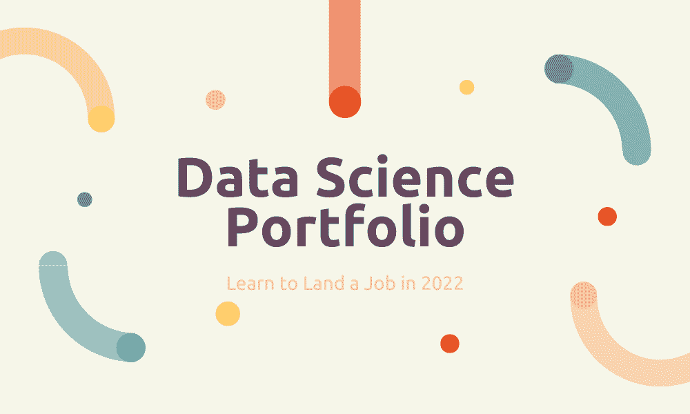

# 一个能让你在 2022 年获得工作的数据科学作品集

> 原文：[`www.kdnuggets.com/2022/10/data-science-portfolio-land-job-2022.html`](https://www.kdnuggets.com/2022/10/data-science-portfolio-land-job-2022.html)

图片来源：编辑

如果你正在阅读这篇文章，很可能以下一项或多项陈述适用于你：

1.  你没有数据科学硕士学位，也没有相关领域的经验。

1.  每个你遇到的数据科学职位招聘信息都要求至少 2-3 年的相关经验。但如果没有经验，没人愿意雇佣你，你怎么获得经验呢？

1.  你已经参加了无数的数据科学在线课程，它们都教给你类似的内容。你最终陷入了一个陷阱，你并没有真正学到新的东西，只是觉得自己在学习。

1.  你甚至创建了数据科学项目，并将其包含在你的作品集中，希望它们能为你在该领域找到工作，但这些项目没有成功。

* * *

## 我们的前三名课程推荐

 1\. [谷歌网络安全证书](https://www.kdnuggets.com/google-cybersecurity) - 快速进入网络安全职业轨道。

 2\. [谷歌数据分析专业证书](https://www.kdnuggets.com/google-data-analytics) - 提升你的数据分析能力

 3\. [谷歌 IT 支持专业证书](https://www.kdnuggets.com/google-itsupport) - 支持你所在组织的 IT

* * *

如果以上任何陈述与你有关，那么你可能在以下四点上做错了：

# 1\. 你参加了太多的在线课程

每次你参加一个新的针对初学者的在线课程并将其添加到简历上时，你是在告诉雇主你在这个领域还是新手。这使得你看起来缺乏经验，可能会对你的作品集造成比好处更多的伤害。

我见过很多数据科学候选人在简历上列出超过十个类似的在线课程，却没有任何项目或现实应用来展示他们学到的技能。

## 这里是你应该做的事情

参加一到两个数据科学在线课程，并基于所学技能创建项目。如果你在构建这些项目时发现自己在特定领域缺乏专业知识，那么参加一个填补你知识空白的课程。

这样，你不仅能更快地学习，还能在简历上展示广泛的技能，而不是列出十个教授相同内容的课程。

# 2\. 你没有从人群中脱颖而出

大多数申请者的另一个错误是，他们在简历上列出相同类型的项目。

像鸢尾花分类和泰坦尼克号生存预测这样的项目非常受欢迎。

由于其简单性，这些是大多数人在学习数据科学时创建的第一个项目。如果你将这些项目添加到简历中，你是在告诉雇主你缺乏经验和创造力。

其他数百名申请者已经创建了相同的项目并在他们的作品集中提到这些项目。既然你的简历与 80%的其他数据科学 aspirants 没有区别，为什么你会获得工作邀请？

## 相反，你应该这样做

创建展示各种技能的数据科学项目，例如数据分析、机器学习和数据预处理。如果你需要灵感来创建独特的项目，可以查看[我最好的 5 个数据科学作品集项目](https://towardsdatascience.com/5-of-my-best-data-science-portfolio-projects-8cd7f81f1b1)。

现实世界的数据通常是脏的，需要从外部来源收集，而不像 Kaggle 数据集那样已经结构化和预处理。

创建一个端到端的数据科学项目是个好主意，涉及通过 API 或网络抓取技术收集数据。

这向雇主展示了你的编程技能足够强大，可以处理现实世界的数据科学用例。

# 3\. 你做的研究不够

许多求职者倾向于向每个开放的数据科学职位投递简历，认为这会增加他们找到工作的机会。

然而，这样做实际上会降低你的就业机会。你可能会收到一封通用的拒绝邮件，或者根本没有来自你申请公司的回复。

这是因为你在申请时没有考虑公司实际在寻找什么。每个空缺职位都是独特的，不同公司雇佣数据科学家的原因各不相同。

例如，一家电子商务公司可能会在其市场部门雇佣数据科学家，建立一个推荐系统，鼓励客户在网站上进行更多购买。

另一方面，一家科技公司可能会雇佣数据科学家来帮助他们的产品团队引入新功能并衡量产品成功。

尽管这两个职位的职位名称都是“数据科学家”，但它们的工作范围却不同。如果你用相同的简历申请每个职位而没有考虑公司的用例，这一点会表现出来。

## 相反，你应该这样做

选择几个你想申请的公司。阅读关于它们的信息，并对它们所在的行业进行一些研究。

然后，尝试创建与该行业相关的项目。这告诉招聘经理你会为他们增值，因为你已经做过类似他们用例的项目。

你甚至可以更进一步，联系那些已经在你想加入的公司工作的数据科学家。通过 LinkedIn 或电子邮件与他们联系，尝试了解他们参与的项目类型。

然后，你可以创建一些相关的项目，以使你的简历在其他申请者中脱颖而出。

# 4\. 你没有发挥你的优势

几个月前，一位有志成为数据科学家的求职者联系了我。她希望能在数据科学领域找到一份工作，但未能成功。

我审阅了她的简历，并立即意识到问题所在。

这位申请者来自市场营销背景，只参加过一次数据科学 Bootcamp。

她在简历中突出的技能包括编程、机器学习和统计。

任何阅读到那份简历的雇主都能看出她在上述科目上的知识有限，因为从三个月的 Bootcamp 中能学到的知识是有限的。

## 她应该这样做

这位申请者的优势在于她的市场营销领域知识。

由于有市场营销背景，她应该创建一些与市场营销分析相关的项目。

大多数市场营销专家无法处理大量数据。他们缺乏技术和分析技能。

由于她已经拥有市场营销领域的专业知识，她只需掌握一些 Python、Excel 和 SQL 技能。然后，她应该使用这些工具创建一些市场营销数据分析项目，并将它们包含在她的作品集中。

这本来可以很容易地为她在分析领域找到一份工作。

然后，在该领域有一两年的经验后，她可以从数据分析转型为数据科学。

数据科学是一个需要应用统计知识以及强大的分析和编程能力的领域。对大多数人来说，没有正式的资格认证，很难立即获得数据科学的职位。

因此，首先进入门槛较低的领域，如数据工程或分析，然后逐渐过渡到数据科学，是有意义的。

# 我的数据科学作品集如何让我在该领域找到工作

我在没有硕士学位的情况下成功获得了多个数据科学领域的职位。

在我的第一次数据科学实习之后，我成为了同一公司的高级顾问，现在在一家跨国公司担任预测分析师。

我获得这些工作不是因为我是最符合条件的申请者，而是因为我展示了对这个领域的真正兴趣。雇主寻找的是对工作充满热情的申请者，因为技能可以随着时间的推移得到提升。

我创建了自己感兴趣的主题的数据科学项目，并撰写了相关的博客文章。我将我的作品发布在我的[数据科学博客](https://www.natasshaselvaraj.com/)和[作品集网站](https://natassha.github.io/natasshaselvaraj/)上。

然后，我在简历上包含了我的网站和博客链接。我在简历的“项目”部分突出了一些我最好的项目，并写了几行说明。

在获得我的第一个实际数据科学职位后，我积累了一些该领域的经验，这帮助我创建了更大、更有趣的项目。随着我继续在线发布我的工作，雇主们开始联系我进行 自由项目。

我被聘请来为公司收集大量数据，建立机器学习模型，进行市场研究，并参与自由写作项目。所有这些任务都在我的数据科学家日常工作之上。

建立强大的在线存在感是获得工作机会的关键。许多有才华的人因为雇主不知道在哪里找到他们而未被发现。

**[Natassha Selvaraj](https://www.natasshaselvaraj.com/)** 是一位自学成才的数据科学家，对写作充满热情。你可以在 [LinkedIn](https://www.linkedin.com/in/natassha-selvaraj-33430717a/) 上与她联系。

### 更多相关话题

+   [能让你在 2022 年获得工作的数据科学项目](https://www.kdnuggets.com/2022/05/data-science-projects-land-job-2022.html)

+   [KDnuggets 新闻，6 月 1 日: 数据科学的完整收藏…](https://www.kdnuggets.com/2022/n22.html)

+   [KDnuggets™ 新闻 22:n05, 2 月 2 日: 掌握机器学习的 7 个步骤…](https://www.kdnuggets.com/2022/n05.html)

+   [3 个保证能让你获得工作的数据科学项目](https://www.kdnuggets.com/3-data-science-projects-guaranteed-to-land-you-that-job)

+   [7 个你在找数据科学职位时挣扎的原因](https://www.kdnuggets.com/7-reasons-why-youre-struggling-to-land-a-data-science-job)

+   [无法获得数据科学职位？这就是原因](https://www.kdnuggets.com/2022/01/unable-land-data-science-job.html)
