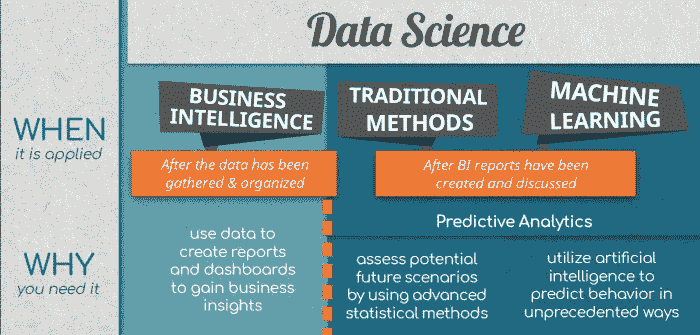
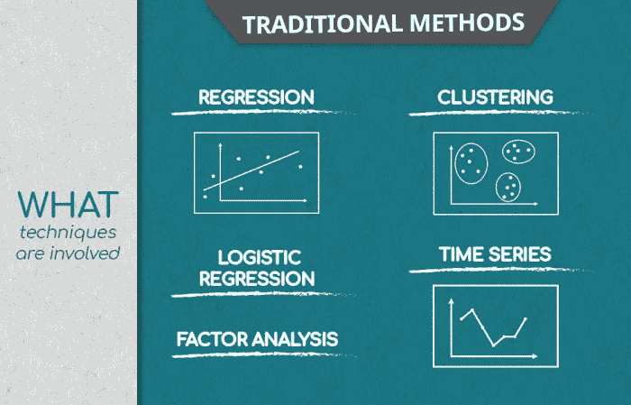
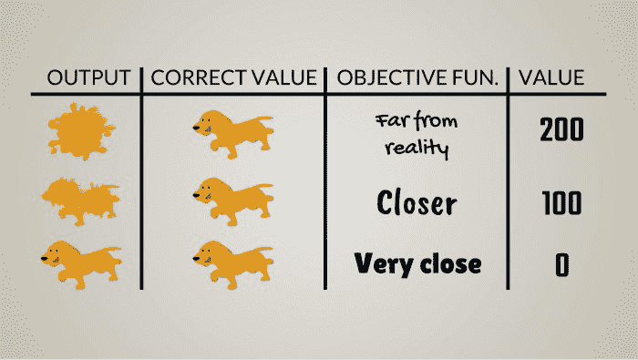
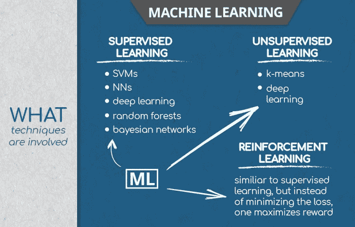
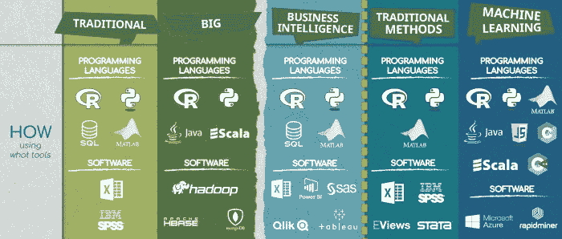

# 数据科学预测未来

> 原文：[`www.kdnuggets.com/2018/06/data-science-predicting-future.html`](https://www.kdnuggets.com/2018/06/data-science-predicting-future.html)

 评论

数据科学中的预测分析依赖于解释性数据分析，这正是我们在前一篇文章中讨论的内容 - [数据科学的数据的什么、哪里和如何](https://www.kdnuggets.com/2018/06/what-where-how-data-science.html)。我们讨论了数据科学中的数据，以及商业智能（BI）分析师如何利用它来解释过去。

事实上，一切都是相互关联的。一旦 BI 报告和仪表板准备好，并且从中提取出洞察，这些信息就成为预测未来值的基础。而这些预测的准确性取决于所使用的方法。

* * *

## 我们的前 3 个课程推荐

 1\. [Google 网络安全证书](https://www.kdnuggets.com/google-cybersecurity) - 快速进入网络安全职业生涯。

 2\. [Google 数据分析专业证书](https://www.kdnuggets.com/google-data-analytics) - 提升你的数据分析技能

 3\. [Google IT 支持专业证书](https://www.kdnuggets.com/google-itsupport) - 支持你组织的 IT

* * *

**回顾传统数据与大数据在数据科学中的区别，或参考我们关于数据科学的第一篇文章。**

我们可以对预测分析及其方法做出类似的区分：传统数据科学方法与机器学习。一者主要处理传统数据，另一者则处理大数据。

### 数据科学中的传统预测方法：它们是什么？

传统的预测方法包括线性回归分析、逻辑回归分析、聚类分析、因子分析和时间序列等经典统计方法。这些方法的输出将输入到更复杂的机器学习分析中，但让我们先逐一回顾它们。

一个快速的旁注。数据科学行业中的一些人也将这些方法称为机器学习，但在本文中，机器学习指的是更新、更智能、更好的方法，如深度学习。

**线性回归**

在数据科学中，线性回归模型用于量化分析中不同变量之间的因果关系。比如房价与房屋大小、邻里环境和建造年份之间的关系。该模型计算系数，通过这些系数你可以预测一栋新房的价格，只要你有相关的信息。

**逻辑回归**

由于不可能将所有变量之间的关系表达为线性关系，数据科学利用如逻辑回归等方法来创建非线性模型。逻辑回归处理的是 0 和 1。例如，公司在筛选过程中应用逻辑回归算法来过滤求职者。如果算法估计一个潜在候选人在公司一年内表现良好的概率超过 50%，它会预测 1，即成功申请。否则，它会预测 0。

**聚类分析**

当数据中的观察值根据某些标准形成组时，就会应用这种探索性数据科学技术。聚类分析考虑到一些观察值具有相似性，并促进了发现新的重要预测因素，这些因素可能并不在数据的最初概念化中。

**因子分析**

如果聚类是关于将观察值分组，那么因子分析则是关于将特征分组。数据科学利用因子分析来降低问题的维度。例如，如果在一个 100 项的问卷中，每 10 个问题属于一个通用态度，因子分析将识别这 10 个因子，这些因子可以用于回归，从而提供更可解释的预测。数据科学中的许多技术都是这样集成的。

**时间序列分析**

时间序列是一种流行的方法，用于跟踪特定值随时间的发展。经济学和金融领域的专家使用它，因为他们的主题是股票价格和销售量——这些变量通常是相对于时间进行绘制的。

### 数据科学如何在传统预测方法中找到应用？

相应技术的应用范围极广；数据科学正在逐步进入越来越多的行业。尽管如此，有两个突出的领域值得讨论。

**用户体验（UX）与数据科学**

当公司推出新产品时，他们通常会设计测量客户对该产品态度的调查问卷。在 BI 团队生成仪表板后分析结果包括将观察值分组到不同的区域（例如地区），然后单独分析每个区域，以提取有意义的预测系数。这些操作的结果通常证实了结论，即产品在每个区域需要进行轻微但显著不同的调整，以最大化客户满意度。

**预测销售量**

这是时间序列分析发挥作用的类型。销售数据已被收集到某个日期，数据科学家希望了解下一销售周期或一年后可能发生的情况。他们应用数学和统计模型并进行多次模拟；这些模拟为分析师提供了未来的情景。这是数据科学的核心，因为基于这些情景，公司可以做出更好的预测并实施适当的策略。

### 谁使用传统的预测方法？

数据科学家。但请记住，这个头衔也适用于使用机器学习技术进行分析的人。许多工作在不同的方法论之间流动。

数据分析师则是准备高级分析类型的人，这些分析解释了已经出现的数据模式，并忽略了预测分析的基础部分。

**机器学习和数据科学**

机器学习是数据科学的最先进方法。这是完全正确的。

机器学习相对于任何传统数据科学技术的主要优势在于其核心存在算法。这些是计算机用来寻找尽可能适合数据的模型的方向。机器学习和传统数据科学方法之间的区别在于我们不给计算机指示如何找到模型；它采用算法并利用其方向自主学习如何找到所述模型。与传统数据科学不同，机器学习需要较少的人为干预。事实上，机器学习，尤其是深度学习算法非常复杂，以至于人类无法真正理解“内部”发生了什么。

明确来说，我们必须注意到，机器学习方法超越了传统方法。例如，监督学习有两个子类型——回归和分类（例如多项逻辑回归）。自然，许多传统方法也属于‘机器学习’这个总称。这是合乎逻辑的，因为线性回归是许多其他方法的基础，包括深度神经网络。

聚类和主成分分析（PCA），另一方面，是无监督学习算法（对于 PCA 的争论甚至比回归更激烈）。

无论如何，传统方法和机器学习的区别或多或少是主观的。有些人画了界限，有些人则没有。在我们的框架中，传统方法的简单性（某种程度上的优雅）是区分的主要原因。有关这一问题的有趣观点可以在这里探讨：[`www.kdnuggets.com/2017/06/regression-analysis-really-machine-learning.html`](https://www.kdnuggets.com/2017/06/regression-analysis-really-machine-learning.html)

最后，深度学习相比传统方法计算开销非常大。为了给你一些背景，我见过一些线性回归是在纸上手动计算的工作。

对我来说，界限在于：你能否创建一个 CNN 并在合理的时间内在纸上解决它？实际上不能，所以这就是我所称之为机器学习的东西。

### 在数据科学中，机器学习是什么？

机器学习算法类似于一个试错过程，但特别之处在于每次试验至少和之前一次一样好。但请记住，为了学得好，机器必须经历数十万次试错，每次错误的频率逐渐减少。

一旦训练完成，机器将能够将其所学到的复杂计算模型应用于新数据，仍然可以进行高度可靠的预测。

机器学习主要有三种类型：有监督学习、无监督学习和强化学习。

**有监督学习**

有监督学习依赖于使用标记数据。机器获得与正确答案相关的数据；如果机器的表现没有得到正确答案，优化算法会调整计算过程，计算机会进行另一次试验。请记住，通常机器一次处理 1000 个数据点。 

支持向量机、神经网络、深度学习、随机森林模型和贝叶斯网络都是有监督学习的实例。

**无监督学习**

当数据过大，或者数据科学家在标记数据的资源上面临过多压力，或者他们完全不知道标签是什么时，数据科学便会诉诸于无监督学习。这包括将未标记的数据提供给机器并要求其从中提取见解。这通常会导致数据根据其属性被划分为特定的方式。换句话说，它被聚类了。

无监督学习在发现数据中的模式方面非常有效，特别是那些传统分析技术下人类可能会遗漏的东西。

数据科学通常结合使用有监督学习和无监督学习，其中无监督学习对数据进行标记，而有监督学习找到最佳模型以适应数据。其中一个例子是半监督学习。

**强化学习**

这是一种机器学习类型，其重点在于性能（如走路、看、阅读），而不是准确性。每当机器的表现优于之前时，它都会获得奖励；但如果表现不佳，优化算法不会调整计算。想象一下小狗学习命令。如果它执行命令，它会得到奖励；如果不执行命令，就得不到奖励。因为奖励很美味，所以狗会逐渐改进执行命令的能力。也就是说，与其最小化错误，强化学习更注重最大化奖励。

### 机器学习在数据科学和商业领域的应用在哪里？

**欺诈检测**

通过机器学习，特别是监督学习，银行可以利用历史数据，将交易标记为合法或欺诈，并训练模型以检测欺诈活动。当这些模型检测到任何微小的盗窃概率时，它们会标记交易，并实时阻止欺诈行为。

**客户留存**

借助机器学习算法，企业组织可以预测哪些客户可能会购买他们的商品。这意味着商店可以高效地提供折扣和‘个性化服务’，从而减少营销成本并最大化利润。几个突出的名字浮现在脑海：谷歌和亚马逊。

### 谁在数据科学中使用机器学习？

如上所述，数据科学家深度参与机器算法的设计，但舞台上还有另一位明星。

机器学习工程师。这是一个专门寻找将最先进的计算模型应用于解决复杂问题（如商业任务、数据科学任务、计算机视觉、自动驾驶汽车、机器人等）的专家。

### 数据科学中的编程语言和软件

处理数据和数据科学时需要两大类工具：编程语言和软件。

**数据科学中的编程语言**

掌握编程语言使数据科学家能够设计可以执行特定操作的程序。编程语言最大的优势在于我们可以重用创建的程序，以多次执行相同的操作。

R、Python 和 MATLAB，结合 SQL，覆盖了处理传统数据、商业智能和传统数据科学时使用的大部分工具。

R 和 Python 是所有数据科学子学科中最受欢迎的工具。它们最大的优势在于能够处理数据，并且与多种数据和数据科学软件平台集成。它们不仅适用于数学和统计计算；它们还具有很强的适应性。

SQL 是王者，尤其在处理关系型数据库管理系统时，因为它是为此目的专门创建的。SQL 在处理传统历史数据时最具优势，例如在准备 BI 分析时。

MATLAB 是数据科学中第四个不可或缺的工具。它非常适合处理数学函数或矩阵操作。

数据科学中的大数据当然借助 R 和 Python 来处理，但从事这一领域的人通常也精通其他语言，如 Java 或 Scala。这两种语言在合并来自多个来源的数据时非常有用。

除了上述提到的语言外，JavaScript、C 和 C++ 通常在涉及机器学习的数据科学分支中被使用。它们比 R 和 Python 更快，并提供更大的自由度。

**数据科学中的软件**

在数据科学中，软件或软件解决方案是为特定业务需求调整的工具。

Excel 是一个适用于多个类别的工具——传统数据、BI 和数据科学。类似地，SPSS 是一个非常著名的工具，用于处理传统数据和应用统计分析。

另一方面，Apache Hadoop、Apache Hbase 和 Mongo DB 是用于处理大数据的软件。

Power BI、SaS、Qlik 和尤其是 Tableau 是用于商业智能可视化的顶级软件示例。

在预测分析方面，EViews 主要用于处理计量经济学时间序列模型，而 Stata 用于学术统计和计量经济学研究，其中回归、聚类和因子分析等技术被不断应用。

### 这就是数据科学

数据科学是一个含糊的术语，涵盖了从处理数据——传统数据或大数据——到解释模式和预测行为的所有内容。数据科学通过传统方法如回归和聚类分析或通过非传统的机器学习技术来进行。

这是一个广阔的领域，我们希望你更接近理解它是多么包罗万象并与人类生活紧密交织。

**简历：[Iliya Valchanov](https://www.linkedin.com/in/iliya-valchanov-607293a6/)** 是 365 Data Science 的联合创始人。

**相关内容：**

+   [使用机器学习进行销售预测](https://www.kdnuggets.com/2017/05/springml-sales-forecasting-using-machine-learning.html)

+   [向前选择特征：Python 实践示例](https://www.kdnuggets.com/2018/06/step-forward-feature-selection-python.html)

+   [如何组织一个较大的数据科学团队？](https://www.kdnuggets.com/2018/06/organize-larger-data-science-team.html)

### 更多相关内容

+   [使用回归模型预测加密货币价格](https://www.kdnuggets.com/2022/05/predicting-cryptocurrency-prices-regression-models.html)

+   [为数据游戏做好未来准备：2023 年每位数据科学家需要的顶级技能](https://www.kdnuggets.com/futureproof-your-data-game-top-skills-every-data-scientist-needs-in-2023)

+   [AI 与数据分析师的对决：影响分析未来的 6 大限制](https://www.kdnuggets.com/ai-vs-data-analysts-top-6-limitations-impacting-the-future-of-analytics)

+   [聊天机器人变革：从失败到未来](https://www.kdnuggets.com/2021/12/chatbot-transformation-failure-future.html)

+   [用智能分析未来成功的概率……](https://www.kdnuggets.com/2022/02/analyzing-probability-future-success-intelligence-node-attributes-evolution-model.html)

+   [边界框深度学习：视频标注的未来](https://www.kdnuggets.com/2022/07/bounding-box-deep-learning-future-video-annotation.html)
