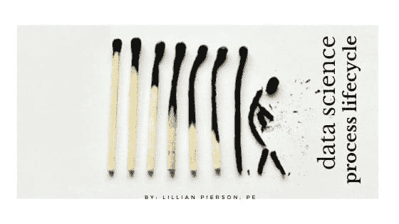

# 数据科学过程生命周期

> 原文：[`www.kdnuggets.com/2021/09/data-science-process-lifecycle.html`](https://www.kdnuggets.com/2021/09/data-science-process-lifecycle.html)

评论

**由[莉莉安·皮尔森（Lillian Pierson, P.E.）](https://www.linkedin.com/in/lillianpierson/)，世界级数据领导者和企业家的导师，Data-Mania 首席执行官**

* * *

## 我们的前三大课程推荐

 1\. [Google 网络安全证书](https://www.kdnuggets.com/google-cybersecurity) - 快速入门网络安全职业生涯。

 2\. [Google 数据分析专业证书](https://www.kdnuggets.com/google-data-analytics) - 提升你的数据分析水平

 3\. [Google IT 支持专业证书](https://www.kdnuggets.com/google-itsupport) - 支持你组织的 IT 需求

* * *

如果你在执行数据项目，确保你的项目顺利进行并为公司带来利润可能会感受到很大的压力。

目前行业的数据项目失败率高达 80% [(根据 Gartner 的数据)](https://blogs.gartner.com/andrew_white/2019/01/03/our-top-data-and-analytics-predicts-for-2019/)，难怪数据专业人员感到压力山大。

这就是我认为数据行业如此错误的地方。

## 问题

数据和人工智能行业正在蓬勃发展。公司在数据项目上投资数百万 - 然而从上面的统计数据可以看出，通常无法从投入中获得真正的回报。

*为什么会这样？*

好吧，我们可以整天制定战略 - 但我观察到的一个主要问题，我相信这可能显著导致低回报，是数据工作者缺乏战略和业务知识。

你看，作为一名数据实施工作者，你可能对“如何做”非常着迷。你喜欢沉浸在细节中。你花时间构建复杂的模型，解决代码问题，开发技术解决方案 - *而且你热爱这份工作。*

但我有一个重要的问题要问你。

你是否总是知道你为什么要这样做？

我曾经也是一名数据科学家。虽然现在我花时间在泰国苏梅岛发展我的数据创业公司 Data-Mania，但你曾经可以在我的办公隔间里找到我忙于构建模型。

*我知道陷入细节中的难处。*

当你过于专注于技术和编码时，很容易忽视实际的商业目标和愿景。你可能会开始原地踏步，跑题，并且整体上导致业务效率低下 - 通常却没有注意到。

更不用说，在没有清晰了解自己在公司愿景中的位置和没有前进策略的情况下执行项目，可能会令人感到沮丧和低效。没有人喜欢在看不到成果的情况下连续工作数小时。

数据专业人士感到迷茫并不意外。在我与一小组领导和企业主进行的[2020 年数据调查](https://www.data-mania.com/blog/data-strategy-survey-2020/)中，87%的企业主报告说他们没有明确的、可重复的盈利数据项目的流程。

*数据专业人士如何在没有强有力的领导和指导框架的情况下出色地完成工作？*

我们需要确保作为数据实施人员，我们保持对最终目标的关注。作为领导者，我们需要确保数据实施人员从一开始就被纳入整体战略中。

如果你准备好确保你参与的数据项目始终保持在正轨上并且盈利，那么让我们深入探讨数据科学过程生命周期框架。

## 数据科学过程生命周期 - 它是什么

本质上，数据科学过程生命周期是一个可以用来管理数据实施的结构。

这使数据实施人员能够看到他们的角色首次进入项目整体图景的地方，并确保有一个连贯的管理结构。

为了开始，我首先想与大家分享微软的 Azure 数据科学过程生命周期，然后分享我认为我们如何改进它。

微软将他们的过程生命周期分为四个类别：

+   商业理解

+   数据获取和理解

+   建模

+   部署

这个框架在解决上述问题上迈出了巨大的一步：巨大的低效、离题项目、范围蔓延，等等。

这个过程中的一个完整节点——商业理解——确保技术和数据实施人员在实际尝试解决问题之前理解商业问题。

不过，我认为这个生命周期可以得到改进。

我认为这个过程没有充分强调技术人员试图解决的商业问题。通过这个框架，四个节点中的只有一个教育数据实施人员商业敏锐度。

在深入项目之前进行快速检查是一个好的起点，但还不够。

## 为什么需要更深入

数据实施人员需要对项目背后的大背景有透彻的理解。

*这样考虑一下。*

如果你正在执行数据项目，你就是那个密切关注现场的人。你能获得经理和高层可能无法得到的技术和数据解决方案的内部视角。

当你完全了解业务愿景并获得了更高层次的洞察时，你将能够发现之前可能忽视的东西。无论是业务问题解决效率低下，还是可能更早实现目标的策略，你都会开始从新的视角审视你的工作。

## 如何改进数据过程生命周期

我建议在这个框架上增加一个第五个职能单元，称之为***数据策略单元***。

如果你在心里想着，“等一下，我对数据策略一无所知。”

*不要害怕。*

我绝对不是建议数据实施人员要负责从零开始创建数据策略。相反，这将是一种自上而下的方法。

这个单元将确保所有技术和数据实施团队对业务问题、目标和愿景有深入的理解——以确保他们每天进行的工作是推动这一愿景的。

这个单元也将作为一个 sanity check。

作为一名有多年经验的注册工程师，我深知在项目中陷入细节是多么容易。你需要有一个框架来回归，以便知道如何做出决策。

通过实施这个过程，数据实施人员将不再在项目中感到迷茫，避免走岔路或将过多时间花费在对整体目标没有贡献的努力上。

让我们全面审视一下我‘全新升级’的框架，加入数据策略单元：

1.  商业理解

1.  数据策略

1.  数据获取与理解

1.  建模

1.  部署

将这一部分添加到框架中，确实会成为一种双赢的局面。

数据实施人员将会从他们的项目中获得更大的成就感和满足感，因为他们保持正轨，并为业务创造更大的成功。

商业领导者实际上将从他们投入大量精力的数据项目和员工中获得真实的投资回报。

*而整个数据行业将会繁荣发展！*

**简介：[莉莲·皮尔森（Lillian Pierson, P.E.）](https://www.linkedin.com/in/lillianpierson/)** 是一位首席执行官及数据领导者，致力于支持数据专业人士发展成为世界级的领导者和企业家。迄今为止，她已经帮助教育了超过 130 万名数据专业人士，涵盖人工智能和数据科学。莉莲与 Wiley & Sons 出版社合作出版了 6 本数据书籍，并与 LinkedIn Learning 合作开设了 5 门数据课程。她为全球各类组织提供支持，从联合国和国家地理到爱立信和沙特阿美，涵盖了所有领域。她是一位注册工程师，保持良好信誉。自 2007 年以来，她一直担任技术顾问，自 2018 年起成为数据业务导师。她偶尔在全球峰会和数据隐私与伦理论坛中志愿提供专业知识。

**相关：**

+   如何几乎在一夜之间从数据自由职业者转型为数据企业家

+   数据职业不是一刀切的！揭示你在数据领域理想角色的技巧

+   数据分析师与数据科学家的 7 大区别

### 更多相关话题

+   [机器学习生命周期](https://www.kdnuggets.com/2022/06/making-sense-crispmlq-machine-learning-lifecycle-process.html)

+   [优化和管理机器学习生命周期的十大 MLOps 工具](https://www.kdnuggets.com/2022/10/top-10-mlops-tools-optimize-manage-machine-learning-lifecycle.html)

+   [如何在几秒钟内处理包含数百万行的 DataFrame](https://www.kdnuggets.com/2022/01/process-dataframe-millions-rows-seconds.html)

+   [机器学习过程的框架](https://www.kdnuggets.com/2018/05/general-approaches-machine-learning-process.html)

+   [在 Python 中处理 CSV 文件的 3 种方法](https://www.kdnuggets.com/2022/10/3-ways-process-csv-files-python.html)

+   [KDnuggets™ 新闻 22:n06，2 月 9 日：数据科学编程…](https://www.kdnuggets.com/2022/n06.html)
