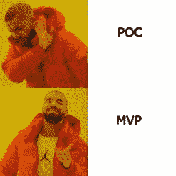

# 数据科学即产品 – 为什么如此困难？

> 原文：[`www.kdnuggets.com/2020/12/data-science-product-hard.html`](https://www.kdnuggets.com/2020/12/data-science-product-hard.html)

评论

**由 [Tad Slaff](https://www.linkedin.com/in/tslaff/)，Picnic Technologies 数据科学产品负责人**。

* * *

## 我们的前三名课程推荐

 1\. [Google 网络安全证书](https://www.kdnuggets.com/google-cybersecurity) - 快速进入网络安全职业道路。

 2\. [Google 数据分析专业证书](https://www.kdnuggets.com/google-data-analytics) - 提升你的数据分析技能

 3\. [Google IT 支持专业证书](https://www.kdnuggets.com/google-itsupport) - 支持你的组织的 IT

* * *

在 Picnic，我们将自己视为科技对食品杂货的回应。从仅限应用程序的商店、20 分钟的配送窗口到及时供应链，技术和底层数据对 Picnic 的成长至关重要。

作为 Picnic 内的数据科学团队，我们的任务是将数据驱动的决策提升到一个新水平。我们负责构建具有智能、上下文和授权的自动化系统，以实现每年数千万欧元的业务影响决策。

然而，构建这些系统是困难的。而将它们投入生产并被业务使用则更为困难。让我们来看看在 Picnic 将我们的数据科学项目产品化需要什么，我们亲切地称之为‘**数据科学即产品**’。

### 为什么这如此困难？

2019 年 7 月的一项研究发现，[87% 的数据科学项目未能投入生产](https://venturebeat.com/2019/07/19/why-do-87-of-data-science-projects-never-make-it-into-production/)。有许多原因被提及，包括缺乏领导支持、数据源孤岛和缺乏协作。除了这些问题，还有一些固有的方面使得数据科学和机器学习项目与其他软件开发有所不同。

首先，数据科学，尤其是机器学习，存在于概率和不确定性的世界中。一个基于机器学习的支付欺诈模型的典型输出可能是，‘*该订单欺诈的概率为 73% +/- 5%，置信区间为 95%*’。我们在业务方面的对口人员生活在确定的世界中，‘*我们希望阻止所有欺诈订单*’。在这两个世界之间进行转换并不是一项容易的任务。

此外，数据科学项目中存在的非线性（通常）不会出现在“传统”软件开发中。我们在开始构建模型之前不知道它的表现如何。可能需要一周、三个月，或者可能无法达到令人满意的性能水平。这使得制定一个包含时间表和业务希望看到的交付物的漂亮项目计划变得非常困难。

最后，将模型投入生产时，模型信任的重要性难以夸大。当与业务部门合作将模型生产化时，我们进入了他们是专家的领域。在许多情况下，我们希望自动化一个手动过程或替代一组精心设计的业务规则。虽然这些规则并不完美，但它们是由深刻理解业务的人所制定的。交付一个黑箱机器学习算法并告知业务它将取代他们当前的工作方式是一个具有挑战性的任务。最终，业务部门拥有模型试图自动化的任何过程的盈亏，我们作为数据科学家需要说服他们将生计交给我们的模型。

根据我们的经验，成功生产化模型涉及多个领域，可以通过以下因素实现：

1.  用例选择

1.  商业对齐

1.  敏捷（数据科学）开发

### 用例选择

> *“我想如果你只有一把锤子，确实很容易把所有问题都当成钉子来处理。” — 亚伯拉罕·马斯洛*

机器学习可以解决的问题宇宙是巨大的。你在客户成功、供应链、分销、金融等方面有无数的用例。考虑到 Picnic 美丽维护的数据仓库中高质量数据的获取如此简单，确定从哪里开始是很困难的。选择正确的用例对数据科学项目的成功至关重要。

那你打算如何决定选择哪个用例？

+   具有最大商业价值的那个？

+   “低垂的果实”来实现快速胜利？

+   与公司战略目标一致的那个？

在 Picnic，我们考虑了这些因素，但关键的决定因素归结为一件事：

**我们对机器学习是否是解决这个问题的最佳方法有多大的信心？**

(还记得我说过我们数据科学家习惯于概率思维吗？)

我们希望确保数据科学家的时间得到最有效的利用。假设有一个有吸引力的问题可以产生巨大的价值，但通过几个精心设计的业务规则可以获得 80%的价值。让数据科学团队花几个月时间来获得额外的 10%是否是资源的最佳利用？可能不是。

使用我们的[数据科学禅](https://blog.picnic.nl/the-art-and-science-of-data-science-80e215f92a99)原则作为指导，我们可以将用例选择标准分解为几个组成部分：

1.  我们是否有足够的干净、高质量的数据来建模这个问题？

1.  是否有一个明确的客观标准（或损失函数）供我们优化？

1.  商业部门是否准备好让这个过程自动化？

1.  它如何融入生产系统？该产品团队是否有足够的带宽来实施它？

1.  是否有关于成功实施机器学习以解决此类问题的案例研究、研究论文或其他资源？

1.  是否有任何偏见或伦理问题需要解决？

如果对这些问题有任何疑虑，我们将重新考虑是否这是我们团队应接手的最佳项目。

无论你有多少资源可以投入到问题上，如果没有正确的使用案例，成功的机会也很低。

### 业务对齐

> *如果首先记录下所有未知因素，完美的项目计划是可能实现的。——比尔·兰利*

确保项目目标的一致性看起来既简单又明显。商业部门希望更准确的预测。你相信你可以超越现有系统。问题出在哪里？

问题在于，这不仅仅是关于模型的性能。

假设你构建了一个出色的模型，并设置了一个每日执行的任务。结果可能是商业部门需要能够在一天内更新他们的预测。突然之间，你需要一个实时服务。你的模型在大多数文章/段落/地区上表现良好，但这个季度有一个新产品推出。现在你的模型在没有历史数据的情况下做出预测（*冷启动问题*（[cold start problem](https://en.wikipedia.org/wiki/Cold_start_(recommender_systems))）说你好）。

机器学习项目需要商业部门对系统的运作有一定的理解。他们需要了解机器学习模型的固有优势和劣势，如何处理边界情况，以及使用了哪些特征。

除此之外，你需要知道模型将如何使用。预期的输出是什么？预测将如何被消耗？如果模型无法运行，会有备用机制吗？在开始开发之前知道这些问题的答案可以避免许多头疼的问题、紧张的讨论和熬夜的重做工作。

模型信任的问题再次出现。如果商业部门不信任你的模型输出怎么办？

你可以展示所有的 ROC 曲线、F1 分数和测试集性能，但如果模型做出的前几次预测恰好是错误的，它会有机会恢复吗？之前存在的基本业务规则并不完美，但商业部门知道哪些情况它工作良好，哪些情况不工作，然后可以相应地进行干预。你的模型（希望）具有操作影响，如果商业部门不信任它们，那么它们将不会被使用。就是这么简单。

关于模型信任的讨论虽然不舒服，但却至关重要。你需要事先了解业务需要什么条件才能在生产中使用你的模型。至少，双方需要决定并签署一个包含性能指标的评估期。

数据科学家与业务部门之间期望的差异导致了许多数据科学项目的终结。对话需要在**花费几个月的工作**之前进行。你的模型的生命周期可能取决于此。

### 敏捷数据科学开发或……

MVP 优于 POC。

> *“当你在筹集资金时，它是 AI。当你在招聘时，它是 ML。当你在实施时，它是线性回归。当你在调试时，它是 printf()。” — 巴伦·施瓦茨*

* *

*德雷克同意，MVP 优于 POC。*

敏捷开发已成为软件开发的实际标准，但尚未进入数据科学领域。如今的数据科学项目往往采取“建好了他们就会来”的心态。数据科学家与业务部门讨论问题，决定优化的指标，并询问如何获取数据。然后他们离开，花费几个月时间构建一个美观且稳健的模型，并展示最终产品。然后……

…它不会被使用。敏捷开发有效的核心原因同样适用于数据科学：它需要以客户为中心。

有效的方法是跳过概念验证（POC），因为它往往停留在数据科学家的笔记本电脑上，转而专注于创建最小可行产品（MVP）。

对于最小可行产品（MVP），目标是尽可能快地构建一个端到端的解决方案。你构建数据管道，从一个基本的基准模型（也称为线性回归或逻辑回归）开始，并向最终用户展示预测。一个实际的例子可以参见[我们如何利用机器学习找到最佳投放时间](https://blog.picnic.nl/the-trade-off-between-efficiency-and-being-on-time-optimizing-drop-times-using-machine-learning-d3f6fb1b0f31)。

这成为软件开发实际标准的原因同样适用于机器学习。我们正在尽力遵循[敏捷宣言](https://agilemanifesto.org/)的核心原则：

**专注于可工作的软件**

+   不要花时间对可能永远不会被使用的模型进行微调。将时间用于构建一个*可行的*

**客户协作**

+   大幅缩短市场时间，使你的‘客户’看到的输出与更复杂的系统相似。你可以从那里进行迭代和改进。

**响应变化**

+   在第二周而不是第二季度发现什么有效更为合适。也许你计划整合的内部系统没有办法暴露你需要的数据。对需求保持灵活，尽早并频繁地交付可工作的代码。

数据科学项目的难点不在于建模。难点在于其他所有事情。通过专注于 MVP，你可以更快地将工作系统投入生产，输出预测。你会更早发现问题，并在几周内为客户提供一个崭新的模型，而不是几个月。

最终，我们的目标不是为了构建模型而构建模型。我们在构建一个包含模型的产品。我们可以借鉴数十年的产品开发经验来实现这一目标。

### 结论

基于机器学习的产品开发并不容易。你需要处理所有的软件开发组件，同时核心还需应对机器学习的复杂性。这是一个新领域，没有现成的蓝图来指导如何做好它。通过确保你选择了正确的用例，与业务对齐，并遵循经过验证的敏捷软件开发实践，你可以为成功做好准备。

在 Picnic，技术、数据和机器学习是我们的核心。我们拥有一支极具才华的数据科学家团队，一个[可扩展的自助数据科学平台](https://blog.picnic.nl/building-and-scaling-picnics-data-science-environment-aae21e01f619)，以及业务部门的全力支持，以将我们的模型投入生产。

[原文](https://blog.picnic.nl/data-science-as-a-product-f383dead5aa4)。经许可转载。

**相关内容：**

+   [我关于敏捷数据科学研究的最佳建议](https://www.kdnuggets.com/2019/03/best-tips-agile-data-science-research.html)

+   [机器学习与敏捷开发的注定失败的结合](https://www.kdnuggets.com/2019/11/doomed-marriage-machine-learning-agile.html)

+   [MLOps 正在改变机器学习模型的开发方式](https://www.kdnuggets.com/2020/12/mlops-changing-machine-learning-developed.html)

### 更多相关内容

+   [停止在数据科学项目中硬编码 - 改用配置文件](https://www.kdnuggets.com/2023/06/stop-hard-coding-data-science-project-config-files-instead.html)

+   [数据科学中的 3 个难度 Python 编程面试问题](https://www.kdnuggets.com/2023/03/3-hard-python-coding-interview-questions-data-science.html)

+   [想成为数据科学家？第一部分：你需要的 10 种硬技能](https://www.kdnuggets.com/want-to-become-a-data-scientist-part-1-10-hard-skills-you-need)

+   [进入 FAANG 公司有多难](https://www.kdnuggets.com/2023/05/hard-get-faang-companies.html)

+   [扩展你的网页数据驱动产品时需要知道的事项](https://www.kdnuggets.com/2023/08/things-know-scaling-web-datadriven-product.html)

+   [介绍 Objectiv：开源产品分析基础设施](https://www.kdnuggets.com/2022/06/objectiv-introducing-objectiv-opensource-product-analytics-infrastructure.html)
