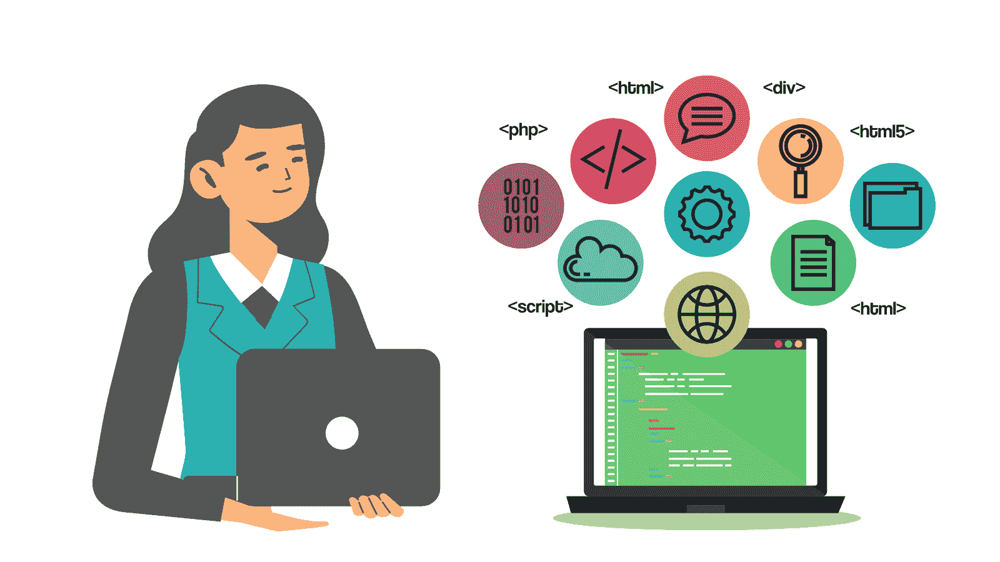
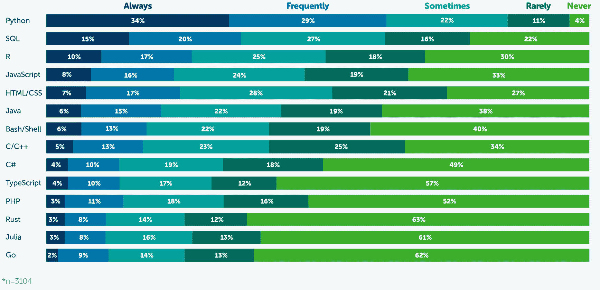
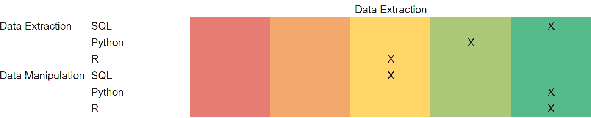
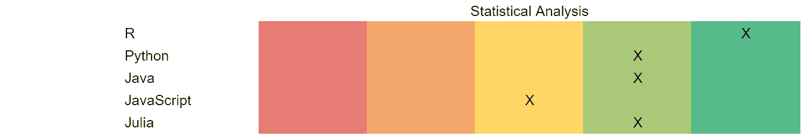
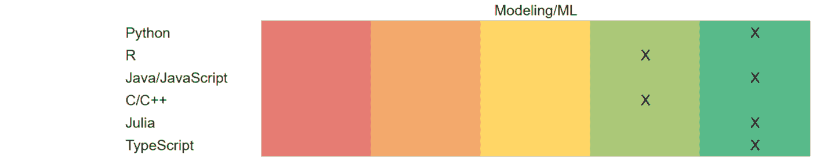
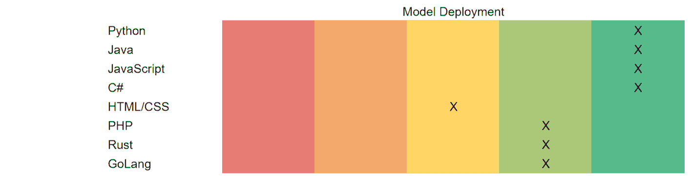
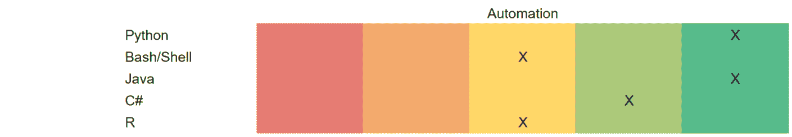
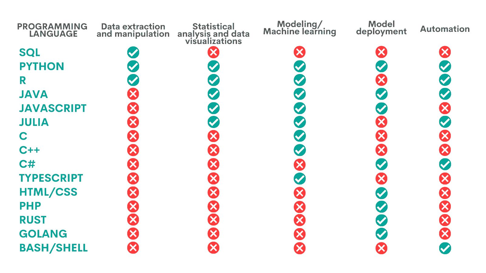

# 数据科学编程语言及其使用时机

> 原文：[`www.kdnuggets.com/2022/02/data-science-programming-languages.html`](https://www.kdnuggets.com/2022/02/data-science-programming-languages.html)

使用编程语言是数据科学不可或缺的。数据科学的广泛性和可用编程语言的数量使得决定使用哪种语言以及何时使用变得相当困难。

* * *

## 我们的前三大课程推荐

 1\. [Google 网络安全证书](https://www.kdnuggets.com/google-cybersecurity) - 快速进入网络安全职业生涯

 2\. [Google 数据分析专业证书](https://www.kdnuggets.com/google-data-analytics) - 提升你的数据分析技能

 3\. [Google IT 支持专业证书](https://www.kdnuggets.com/google-itsupport) - 支持你的组织在 IT 方面

* * *

我的办法是向你展示编程在数据科学中最常见的使用案例。从那里开始，我将介绍最适合特定使用案例的编程语言。当然，我不能分析所有的编程语言，我需要缩小范围。

我之所以这样做，多亏了一项特定的调查。

### 编程语言在数据科学中的使用时机

当谈到编程语言的受欢迎程度时，我们将使用 Anaconda（Python 的发行版）2021 年的调查。

来源：[`www.anaconda.com/state-of-data-science-2021`](https://www.anaconda.com/state-of-data-science-2021)

调查显示了最受欢迎的数据科学编程语言的使用频率。样本量为 3,104，比较安全地得出结论，这些编程语言反映了数据科学中的受欢迎程度。一些其他的列表包含了其他语言，但我们将坚持这个列表来分析每一种语言。

问题是，这些编程语言在数据科学中什么时候使用？如果你不知道什么时候使用它，告诉你‘使用这种语言’是没有意义的。

数据科学家的工作通常包括以下阶段：

+   数据提取和处理

+   统计分析

+   数据可视化

+   建模/机器学习（ML）

+   模型部署

+   自动化

### 数据提取和处理

数据提取意味着从数据库或其他来源获取数据。

一旦获取数据，你需要对其进行清理，以确保你拥有正确和合适的数据。通过清理，你可以去除错误、不一致、重复的数据，替换不完整的数据，并相应地格式化数据。

数据清理之后是数据处理。这意味着你要修改数据，使其更易读和有条理。

希望你不会认为应该手动完成这些任务。有一些编程语言非常适合执行这些任务。它们是：

+   SQL

+   Python

+   R

这是它们擅长的概述：

### SQL

**优点：** SQL 的主要目的是处理数据和数据库。因此，它在数据提取和操作（在一定程度上）方面非常理想，特别是在处理关系型数据库时。数据检索速度快，相对简单。语法也经过标准化。

**缺点：** 数据操作相对有限

### Python

**优点：** 由于内置的分析工具，非常适合处理数据。它是一个开源语言，因此其受欢迎程度和活跃的社区为你提供了大量的分析库。易于使用，复杂的数据操作可以用更少的代码完成。

**缺点：** 不适合数据提取，但其库在一定程度上弥补了这一不足。

### R

**优点：** 由数学家和数据科学家为数学家和数据科学家设计。再一次，开源语言为数据操作提供了大量的 R 包。它是为处理大量数据而设计的。

**缺点：** 尽管可以在 R 中提取数据，但由于其复杂性和相对较慢，适用性不强。

### 统计分析

数据科学周期的下一阶段是统计分析。一旦你收集了数据并根据需要进行了操作，你需要对其进行分析。这样做的目的是在数据中发现模式，然后转化为洞察、预测和报告。

最适合的编程语言是：

+   R

+   Python

+   Java

+   JavaScript

+   Julia

这是它们在统计分析方面表现的概述：

### R

**优点：** 统计分析是 R 的主要目的，因此它在这方面表现出色。它提供了大量的数据分析工具，用于进行复杂的统计计算。可以处理大量的数据。

**缺点：** 作为一种相对较老的语言，有时可能会很慢，并需要更多的代码行。

### Python

**优点：** 其数据分析库使其在大多数统计分析中表现出色。库设计用于处理高数据量。比 R 更快。

**缺点：** 在统计分析方面的库数量不如 R 多。

### Java

**优点:** Swift 编程语言；比 R 和 Python 都要快。它可以在没有任何特殊软件的情况下运行，只需 Java 虚拟机（JVM）。这还提供了与许多分析框架一起工作的机会，例如 Kafka、Hadoop、Hive 或 Apache Spark，它们都在 JVM 上运行。以下是一些[有关 Java 统计的建议以及使用哪些库](https://stats.stackexchange.com/questions/37466/open-source-java-library-for-statistics-at-the-level-offered-by-a-graduate-stati)。

**缺点:** 不像 R 那样适合高强度的统计分析。

### JavaScript

**优点:** 它提供了一些统计分析的可能性。结合其可以在任何计算机（有 JVM）上运行的能力，它可能适合一些较轻的统计分析。你可以在[Stack Overflow 上找到一些 JavaScript 库的推荐](https://stackoverflow.com/questions/5656897/is-there-any-statistical-library-for-javascript)。

**缺点:** 尽管有一些用于统计分析的库，但它们的可能性范围相对有限，尤其是与 R 相比。

### Julia

**优点:** 其语法简单，数学操作的书写方式非常接近现实世界。它也比 Python 快。它可以调用其他编程语言的库，例如 Python 的。对于描述性统计，以下是[Julia 的标准统计库和其他库](https://docs.julialang.org/en/v1/stdlib/Statistics/)，这里是[一些附加库和有用示例](https://www.geeksforgeeks.org/descriptive-statistics-in-julia/)。如果你需要概率统计，Julia 也有[大量相关包](https://juliapackages.com/c/probability-statistics)，这显示统计确实是这个编程语言的核心。甚至有[一本关于 Julia 统计的书](https://statisticswithjulia.org)。

**缺点:** 相对不那么流行，导致社区和库的范围较小。也不像 R 那样适合高强度的统计分析。

### 数据可视化

一旦你分析了数据，你需要展示你的见解。你通常需要向非技术人员展示，因此不能指望他们查看无限的数据、表格和计算。你希望他们理解你，而最简单的方法就是创建一些吸引人的数据可视化，以便一目了然地解释一切（几乎）。

你会希望使用擅长此类工作的编程语言：

+   R

+   Python

+   JavaScript

+   Julia

它们在数据可视化中的表现如下：

### R

**优点:** 数据可视化是统计分析的延伸，这个统计编程语言在这方面也表现出色。提供了大量的可视化包。它们允许在小空间内展示非常有信息量的可视化。允许使用地理地图。

**缺点:** -

### Python

**优点：** 对数据可视化也很有帮助，因为它提供了大量用于此目的的库。

**缺点：** 它提供的库仍然比 R 的要弱一些。

### JavaScript

**优点：** 提供了大量的数据可视化库，这使得它非常适合此目的。再者，它可以在任何机器上运行，因此你不需要额外的软件来创建或展示你的见解。

**缺点：** -

### Julia

**优点：** 对数据可视化相对较好，因为它提供了一些用于此目的的包。

**缺点：** 仍然是相对较新的语言，因此库的数量不像 Python 那样庞大。

### 建模/机器学习（ML）

现在你已经准备好了数据并进行分析，一切都准备好构建模型了。这包括选择建模技术，然后编写算法。编写算法是机器学习中的一个关键部分；模型训练的效果取决于它。是的，你编写算法的能力决定了模型在发现模式和提供业务预测方面的表现。

那么哪些数据科学编程语言在这个任务中能为你提供最多的帮助呢？它们是：

+   Python

+   R

+   Java/JavaScript

+   C/C++

+   Julia

+   TypeScript

我尝试根据优缺点评估它们的适用性：

### Python

**优点：** Python 的简洁性使得编写复杂的机器学习代码变得容易。由于其库的灵活性也很高。说到库，有很多（而且很强大的！）库可以帮助你获得非常高质量的机器学习。

**缺点：** 无。

### R

**优点：** 特别适合那些编程能力稍逊的专家。其强大的计算能力非常适合复杂的机器学习。还提供了大量优秀的机器学习专用包。

**缺点：** 可能会很慢。不太适合真正硬核的神经网络。同时不太适合部署到生产环境中。

### Java/JavaScript

**优点：** 非常快速（比 Python 快）且在重负载数据处理方面可靠。有高质量的框架支持不同的机器学习技术和算法。

**缺点：** 不像 Python 那样灵活。

### C/C++

**优点：** 代码易于机器读取。提供了内存管理和其他性能参数的可能性。由于其速度以及许多机器学习库都是用 C/C++编写的（甚至 Python 库也是），使其非常适合复杂的机器学习用例。非常适合程序员。这里有一些相当好的[Java、JavaScript 和 C++的机器学习库推荐](https://www.geeksforgeeks.org/top-5-programming-languages-and-their-libraries-for-machine-learning-in-2020/)。

**缺点：** 它的优点也是它的陷阱。它是一种代码密集型编程语言，对于那些编码经验较少的人来说，可能比较难以学习。此外，调试复杂算法通常也非常困难。不够灵活，因此如果仍在实验参数，效果不佳。

### Julia

**优点：** 为机器学习计算和统计任务开发。对于没有重编程背景的用户来说，它非常快速且易于学习。可能拥有最好的机器学习、线性代数、微分方程、数学优化、并行和分布式计算以及自动微分库。非常多才多艺，这意味着其代码可以在 C、Python 和 R 中执行。

**缺点：** 仍然相对较小的社区在贡献其库。

### TypeScript

**优点：** 它是 JavaScript 的超集。对于那些已经熟悉 JavaScript 并希望摆脱一些缺陷的用户来说非常理想。拥有强大的[机器学习库](https://analyticsindiamag.com/5-popular-machine-learning-libraries-built-on-typescript-for-2019/)，例如 Kalimdor、TensorFlow Deep Playground、R.js、Machinelearn.js、Machine-learning 或 ML Classifier UI。它运行在浏览器或 JS 引擎上，因此非常适合基于浏览器的机器学习。其静态类型选项允许在模型部署之前发现代码中的错误。

**缺点：** 相较于 JavaScript，需要更多的代码行。因此，其性能可能较慢。

### 模型部署

任何数据科学家的重要任务之一是部署他们创建的模型。这是模型和你之前工作的真正影响所在。它不再是玩笑，因为部署模型意味着它进入了现有业务环境的生产。这意味着真实的人将使用它，它在提供洞察方面的表现将极大地影响业务决策和现实世界。

要让模型供人们使用，你必须创建一些应用程序（无论是移动端还是基于 Web 的）、桌面软件或 API。一些最佳的数据科学编程语言包括：

+   Python

+   Java

+   JavaScript

+   C#

+   HTML/CSS

+   PHP

+   Rust

+   GoLang

他们执行任务的方式如下：

### Python

**优点：** 作为一种通用编程语言，毫无疑问，它非常适合部署模型。它尤其适合软件开发和构建基于 Web 的应用程序。其普遍的优势是有大量优质的库。这也使它在这里表现出色，Django、Pyramid、TurboGears 和 Flask 是一些推荐的库。它非常富有表现力、灵活且易于使用，使得创建应用程序更快。由于代码逐行执行，代码调试变得更加容易，错误发生时不会继续执行代码。Python 的主要优势之一是其可移植性，这意味着它可以在多个平台上完美运行。

**缺点：** 可能比其他编程语言运行速度较慢。它几乎完全不适合移动应用开发。它使用了大量的内存，因此在同时执行多个内存消耗较大的任务时应当小心。由 Python 构建的应用程序需要详细的测试，因为它是一种动态类型语言，意味着变量可以改变其数据类型。

### Java

**优点：** 仍然是开发圈中广泛使用的编程语言。它适用于任何类型的软件，无论是移动应用还是基于网页的应用。其中一个原因肯定是它的跨平台性，这意味着除了 JVM 外不需要额外的软件。在实践中，你只需编写一次代码，然后可以在任何环境中运行。它的语法相当简单，这使得部署模型更为方便。此外，它是面向对象的程序；代码可以很容易地升级、适应和重用。Java 的主要优势之一是其相对较高的安全性，因为它没有指针并且有一个安全管理器。这使得在安全性是主要关注点之一时，Java 被高度推荐。

**缺点：** 速度可能是它的主要缺点。Java 也比较消耗内存，且在运行垃圾回收器时，可能会降低性能。此外，它也不太适合轻松地构建美观且用户友好的图形界面。

### JavaScript

**优点：** 其主要优点之一是速度。作为一种解释型语言，不需要编译，因此运行速度较快。此外，它是一种客户端脚本，这意味着它在浏览器上运行，无需连接到服务器，这有助于提升速度。它与其他编程语言配合良好，使得在更大的系统中部署模型变得合适。语言相当简单，使得部署模型和代码调试更加容易。具有很好的界面，使得创建吸引人且实用的图形用户界面变得容易。

**缺点：** 由于用户可以看到代码，因此存在安全性问题。

### C#

**优点：** 作为一种通用编程语言，与 Python 类似，它在构建各种类型的应用程序时非常灵活，适用于不同平台。作为一种基于面向对象原则的语言（例如 Java），这自然使得构建应用程序变得更容易，测试和升级也需要更少的代码行数。这也得益于 C# 的类型安全性，意味着变量在代码中不能更改其数据类型。它具有强大的内存备份，因此应该不会有内存泄漏问题。

**缺点：** 速度 - 当用 C# 编写时，应用程序有时可能运行较慢。它需要 .NET 平台以实现跨平台灵活性。

### HTML/CSS

**优点：** HTML 适用于专门用于显示网页的基于网页的应用程序。每个浏览器都支持它，并且由于它在浏览器中运行，因此不需要安装额外的软件。它是一种非常简单的语言，这使得它非常快速。它还允许使用模板，使数据科学家可以轻松地将其模型部署到网页应用中。

**缺点：** 单独使用时，通常只适用于基本的网页应用。这可以通过与 CSS 结合使用来改进。HTML 的安全性也相当有限，如果安全性是你的主要关注点之一，则不推荐使用。通常需要与其他编程语言结合使用以创建动态网页。

### PHP

**优点：** 这是一种服务器端脚本语言，这意味着应用程序不是在网页浏览器上运行，而是在网页服务器上运行。这一关键特性使其非常适合创建互动和动态的网站及应用程序。它也很容易嵌入 HTML 代码。因此，PHP 不依赖于应用程序运行的平台。由于使用自己的内存，它的运行速度较快。不需要大量的代码，因此制作复杂的网页应用变得比较容易，尤其是在调试时。PHP 是一种非常稳定的编程语言，确保你的模型功能得到充分转化为用户体验。它还拥有广泛的库，增强了数据展示，并能轻松连接到数据库，使其非常适合展示模型的工作。值得一提的是，PHP 的语法与 C 语法相同，因此如果你有 C 语言的知识，将会很容易使用它。

**缺点：** 如果你担心安全性，PHP 可能会有所不足。然而，它的社区多年来通过提供各种工具和框架来解决这个问题。这种编程语言可能不适合大型应用或轻松使用多个功能，可能导致性能不佳。由于 PHP 不够模块化，也可能会很难维护和升级。由于缺乏调试工具，调试也相当困难。

### Rust

**优点：** Rust 设计时考虑了应用的安全性和性能。难怪这两个领域是这种数据科学编程语言的亮点。它适合开发桌面程序或移动应用，但主要是为了制作基于网页的应用。支持 C 和 C++，所以如果你有这些编程语言的经验，你也可以利用 Rust 相比之下的优势，并与其他语言轻松集成。它在创建应用程序的简易性（动态类型的优点）和代码可维护性（静态类型的优点）之间取得了平衡。Rust 也被认为是最安全的编程语言之一。它提供了对已部署应用的低级控制，因此你可以真正优化其性能。

**缺点：** 这是一个相对较新的语言，因此其库可能不如其他一些语言的库那么好。底层控制使得它更适合用于后端而非前端。

### GoLang

**优点：** 其主要优势是稳定性。它基于 C 语言，因此如果你有 C 语言经验，你可以轻松学习它并受益于其优势。该语言非常快，因为它是编译语言。它配备了大量旨在简化编码的工具，这使得它非常适合快速构建应用程序。它是一种非常可扩展的语言，非常适合在较长时间内部署模型并进一步开发。GoLang 的标准库提供了测试支持。如果你想构建一个稍微复杂一点的应用程序，GoLang 可以成为一个不错的选择。它非常擅长处理多任务。作为一种新语言，它被设计为与云计算紧密配合。

**缺点：** 作为编译语言及其所带来的速度意味着你可能需要写相对较多的代码行来完成即使是比较简单的任务。这是其简单性的权衡，因此该语言偶尔不适合 hardcore 程序员。

### 自动化

另一个任务，涉及并影响所有其他任务，在数据科学中越来越重要的是自动化。这是一个包罗万象的任务，旨在自动化数据科学家的手动工作。这是因为许多数据科学家的工作包括手动、重复和繁琐的工作，他们可以更有目的地使用这些时间。

然而，并不是所有的数据科学家工作都可以被自动化。目前，只有机器学习可以完全自动化。提取和处理数据、数据分析及其可视化只能部分自动化。模型部署也是如此。

这并不意味着你不能尝试至少自动化你工作的部分。我将看看一些最好的数据科学编程语言：

+   Python

+   Bash/Shell

+   Java

+   C#

+   Julia

+   R

看看它们的排名：

### Python

**优点：** 它是一种通用语言，因此也适用于自动化。使 Python 在数据科学中表现良好的特点，同样使其适用于自动化。它的简单性、表现力以及为机器学习和自动化提供的大量极其可靠的库是其主要优势。它们带来了灵活性，而 Python 的平台独立性只会增加这一点。它适合于自动化数据科学工作的所有部分。这里是 [一些关于如何使用 Python 进行自动化的建议](https://towardsdatascience.com/automating-data-science-tasks-on-python-to-save-hours-2a1ad7a0311f)。

**缺点：** 不太适合移动平台。

### Bash/Shell

**优点：** 为自动化 Linux 上的重复任务而创建（它也可以在 Windows 10 上运行），毫无疑问，它非常适合自动化。它的主要用途是数据提取和数据科学中的数据处理，这使它非常适合构建数据管道。如果你在 Medium 上，Towards Data Science 博客有[一篇关于使用 Bash 自动化枯燥工作的文章](https://towardsdatascience.com/how-to-use-bash-to-automate-the-boring-stuff-for-data-science-d447cd23fffe)。

**缺点：** 不适合自动化数据科学家工作的其他部分。作为一种通用自动化语言，它的使用也不那么普遍。

### Java

**优点：** 在 Python 缺乏的地方，Java 表现出色：它非常适合移动应用程序。这一点并不令人惊讶。Java 作为一种脚本语言，专门设计用于自动化任务执行。它的代码也非常容易更改和更新，非常适合工作流参数经常变化的动态环境。支持帮助自动化的框架。此外，它可以在任何安装了 JVM 的机器上运行，并且非常快速。这里有一些[你可以玩耍并与 Java 代码集成的 ETL 工具](https://rigorousthemes.com/blog/best-open-source-etl-tools/)。

**缺点：** 缺乏灵活性。

### C#

**优点：** 一般来说，它是最好的自动化语言之一，特别是如果你想自动化构建模型。为什么？因为有一个[模型构建器](https://docs.microsoft.com/en-us/dotnet/machine-learning/automate-training-with-model-builder)，正如微软文档所说，它“使用自动化机器学习来探索不同的机器学习算法和设置”。为此，它使用 C#代码。

**缺点：** 它依赖于平台。

### R

**优点：** 作为统计分析和可视化的王者之一，这是一个完美的工具来自动化数据科学过程中的这部分。特别是当过程涉及到大量统计分析时，其质量比速度更为重要。如果你对自动化探索性数据分析感兴趣，[这里有一些可能对你有帮助的 R 包](https://towardsdatascience.com/four-r-packages-for-automated-exploratory-data-analysis-you-might-have-missed-c38b03d4ee16)。

**缺点：** 如果速度至关重要，那么 R 可能不如其他数据科学编程语言好。作为一种整体自动化语言，它的使用也不那么普遍。

### 如何选择学习哪些数据科学编程语言？

简单，学习最适合的那个。哪个是最适合的？就是那个符合你要求的。

你必须问自己最重要的问题是：我需要编程做什么？如果你不问自己（并回答）这个问题，你可能会试图教一头大象爬树。

你在工作中主要做什么？你希望在当前或未来的工作中做些什么？作为学生，你对哪些方面感兴趣，你希望你的职业发展方向是什么？

当然，你可以随意选择一种数据科学编程语言，只因为你有时间并且想学习。然而，大多数时候，选择取决于你的工作要求或将来的需求。因此，[了解每个数据科学职位的内容](https://www.stratascratch.com/blog/14-different-data-science-job-titles/?utm_source=blog&utm_medium=click&utm_campaign=kdnuggets)是至关重要的。

例如，如果你是业务分析师、数据建模师、数据库管理员或数据分析师，你可能只需要**SQL**就足够了。这是因为你主要从事数据提取和处理工作。

如果你是数据分析师，**SQL**已经很好了。不过，你可能还需要了解**Python**，以进行一些较复杂的统计工作和自动化，也许还需要其他适合自动化的语言。

除了**SQL**和**Python**，市场营销科学家、**BI**开发人员、统计学家或量化分析师也可能需要了解**R**。如果你的工作更多是分析和可视化数据而不是提取数据，添加**Python**和/或**R**到**SQL**中会变得更加重要。

另一方面，数据架构师可能希望学习**Python**、**Java**或任何其他适合构建应用程序的数据科学编程语言。

作为数据科学家，你在数据科学周期的各个步骤中都会涉及到一定程度。你可能会希望增加**Java**/**JavaScript**、**C**语言或其他适合机器学习、模型部署和自动化的语言。

数据工程师主要关注数据的提取、转换和加载。除了**SQL**和其他用于这些操作的语言，他们可能还会使用用于自动化的语言。

如果你是机器学习工程师，这意味着你专注于构建和部署机器学习模型。所以你可能需要在建模/机器学习、模型部署和自动化部分增加一些额外的学习编程语言。

软件工程师专注于软件开发，因此他们可能不需要对其他用途的编程语言有广泛的知识。

### 数据科学家是否有理想的编程语言组合？

我通常不会声称某事物的流行本质上意味着它也很好。然而，在这种情况下，编程语言的流行反映了它们在数据科学中的适用性。

是的，前三种最受欢迎的编程语言几乎构成了数据科学中的理想组合。查看文章开头的图表中的前三种语言，你会发现它们。没错，数据科学的神圣三位一体是**Python**、**SQL**和**R**。

再次提醒，[你在数据科学中的工作](https://www.stratascratch.com/blog/what-does-a-data-scientist-do/?utm_source=blog&utm_medium=click&utm_campaign=kdnuggets)是决定性的最重要因素。基于此，你可能还会偏好其他语言，或者你可能不需要这三种数据科学编程语言中的某一种。

尽管如此，这些语言的普及意味着市场对熟练掌握它们的数据科学家的需求很高。

这种高需求是有原因的。原因是：Python、SQL 和 R 都非常擅长它们所做的工作。使用它们，你能够在任何阶段的[数据科学项目](https://www.stratascratch.com/blog/19-data-science-project-ideas-for-beginners/?utm_source=blog&utm_medium=click&utm_campaign=kdnuggets)中进行高质量的工作。这三者在数据提取和处理方面都表现出色。对于统计分析和可视化，你可以使用 Python 或 R。机器学习也是如此。而在部署模型或自动化某些过程时，你可以再次使用 Python，对你完成的工作感到满意。

如果你还想了解 MATLAB 和 SAAS，请查看这篇“[前五大数据科学编程语言](https://www.stratascratch.com/blog/top-5-data-science-programming-languages/?utm_source=blog&utm_medium=click&utm_campaign=kdnuggets)”的帖子。

### 总结

在这里没有显著的结论。除非没有一种最佳的数据科学编程语言。相反，请使用下面的概述来轻松找到最适合你的编程语言。

**[内特·罗西迪](https://www.stratascratch.com)** 是一名数据科学家和产品战略专家。他还是一名讲授分析学的兼职教授，并且是 [StrataScratch](https://www.stratascratch.com/) 的创始人，该平台帮助数据科学家通过来自顶级公司的真实面试问题为面试做准备。可以通过 [Twitter: StrataScratch](https://twitter.com/StrataScratch) 或 [LinkedIn](https://www.linkedin.com/in/nathanrosidi/) 与他联系。

### 更多相关话题

+   [KDnuggets™ 新闻 22:n06，2 月 9 日：数据科学编程…](https://www.kdnuggets.com/2022/n06.html)

+   [KDnuggets™ 新闻 22:n04，1 月 26 日：高薪副业…](https://www.kdnuggets.com/2022/n04.html)

+   [2023 年数据科学学习的 8 种编程语言](https://www.kdnuggets.com/2023/07/8-programming-languages-data-science-learn-2023.html)

+   [顶级编程语言及其用途](https://www.kdnuggets.com/2021/05/top-programming-languages.html)

+   [特定数据角色的编程语言](https://www.kdnuggets.com/2023/06/programming-languages-specific-data-roles.html)

+   [数据分析：分析数据的四种方法及其应用](https://www.kdnuggets.com/2023/04/data-analytics-four-approaches-analyzing-data-effectively.html)
