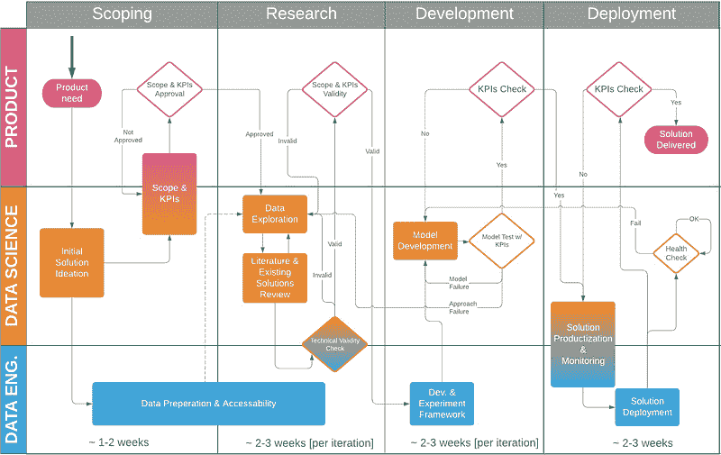
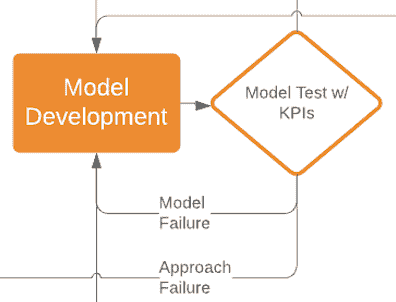

# 数据科学项目流程（初创公司）

> 原文：[`www.kdnuggets.com/2019/01/data-science-project-flow-startups.html`](https://www.kdnuggets.com/2019/01/data-science-project-flow-startups.html)

 评论

**作者：[Shay Palachy](http://www.shaypalachy.com/)，数据科学家与顾问**

最近，一个我正在咨询的初创公司（[BigPanda](https://www.bigpanda.io/)）要求我对数据科学项目的结构和流程发表意见，这让我思考了它们的独特之处。初创公司的经理和不同团队可能会发现数据科学项目与软件开发项目之间的差异不直观且令人困惑。如果这些基本差异没有明确指出并加以说明，可能会导致数据科学家与同事之间的误解和冲突。

* * *

## 我们的三大课程推荐

 1\. [谷歌网络安全证书](https://www.kdnuggets.com/google-cybersecurity) - 快速进入网络安全职业生涯。

 2\. [谷歌数据分析专业证书](https://www.kdnuggets.com/google-data-analytics) - 提升你的数据分析技能

 3\. [谷歌 IT 支持专业证书](https://www.kdnuggets.com/google-itsupport) - 支持你的组织的 IT

* * *

相应地，来自学术界（或高度研究导向的行业研究小组）的研究人员在进入初创公司或较小公司时可能会面临自己的挑战。他们可能会发现将产品和业务需求、更紧张的基础设施和计算约束以及客户反馈纳入其研究和开发过程中是具有挑战性的。

因此，本帖的目的是展示我在近年来的工作过程中识别出的特征项目流程。希望这能帮助数据科学家及与他们合作的人，以一种反映其独特性的方式来结构数据科学项目。

这个流程是针对小型初创公司设计的，在这些公司中，一个小团队的数据科学家（通常是一个到四个）会由一个人领导，进行短期和中期项目。更大的团队或那些以机器学习为主、深科技初创公司可能仍会发现这个结构有用，但这些公司的流程通常较长，并且在许多情况下结构不同。

图 1：数据科学项目流程（初创公司）

我将这个过程分为三个并行的方面：产品、数据科学和数据工程。在很多情况下（包括我曾经工作过的大多数地方），可能没有数据工程师来执行这些职责。在这种情况下，数据科学家通常负责与开发人员合作，帮助处理这些方面。或者，数据科学家可能会进行这些准备工作，如果他们恰好是所有神奇生物中最稀有的：*全栈数据科学家！*✨????✨。因此，你可以根据你的环境将*数据工程师*替换为*数据科学家*。

在时间轴上，我将过程分为四个不同的阶段：

1.  定义

1.  研究

1.  （模型）开发

1.  部署

我将按顺序逐一讲解这些内容。

### 1. 定义阶段

定义数据科学项目的范围比其他类型的项目更为关键。

**1.1. 产品需求**

一个项目应始终从产品需求开始（即使最初的想法是技术性或理论性的），该需求应由产品/业务/客户成功人员在某种程度上进行验证。产品人员应该有一个关于这个特性（大致上）应该如何呈现的想法，并且现有或新客户将愿意为此付费（或者它将防止流失/推动订阅/推动其他产品的销售/等）。

产品需求不是完整的项目定义，而应当被描述为一个问题或挑战；例如，*“我们的客户需要一种了解他们预算支出方式的方法”*，或者*“我们无法让我们的老用户继续服药，这增加了流失率”*，或者*“客户愿意为一个能够预测他们运营的机场高峰时段的产品支付更多费用”*。

**1.2. 初步解决方案构思**

在这个阶段，数据科学家与负责的产品人员、数据工程师及其他相关方一起，为可能的解决方案提出不同的粗略方案。这包括一般方法（例如，*无监督聚类* vs *增强树分类* vs *概率推断*）**和**要使用的数据（例如，我们数据库中的这个特定表，或我们尚未监控或保存的一些特定用户行为，或一个外部数据源）。

这通常也涉及到一定程度的数据探索。你不能在这里深入探讨，但任何有前景的“触手可及的成果”都可以帮助引导创意生成。

数据科学家应该主导这个过程，并通常负责提供大部分解决方案的想法，但我建议你利用所有参与这个过程的人来进行解决方案的构思；我曾幸运地得到过由后端开发人员、首席技术官或负责的产品人员提供的最佳解决方案想法。不要假设不同的、较少理论导向的背景会使人们不适合参与这一阶段；额外的思维和观点总是有价值的。

**1.3. 数据准备和可访问性**

团队现在应当对希望用于探索可能解决方案的数据有一个清晰的了解（或至少是第一个这样的数据集或来源）。因此，提供数据访问并为探索和使用准备数据的过程应该与下一阶段同时开始。

这有时可能需要将生产数据库中的大型数据集导出到其备用/探索对应的数据库中，或者如果在研究阶段时间的可用性不是关键的话，导出到较冷的存储（例如对象存储）。相反，这也可能意味着将来自非常冷的存储的大型数据导出回表格或文档形式，以便进行快速查询和复杂计算。无论是哪种情况，这一阶段是启动研究阶段所必需的，通常会花费比预期更多的时间，因此这是启动这一阶段的最佳时机。

**1.4. 范围与关键绩效指标（KPIs）**

这一阶段涉及共同决定项目的范围和关键绩效指标（KPIs）。

KPIs 应首先以产品术语定义，但比之前详细得多；例如，针对前面提到的三个产品需求，它们可能变成*“客户现在可以使用一个具有 CTR 统计和按类别预测的仪表板”*，或*“65 岁以上用户错过的用药天数将在接下来的两个季度内减少至少 10%”*，或*“客户将收到机场高峰时段的每周预测，粒度至少为一小时，且准确率至少为±50%”*。

这些 KPIs 应当被转化为可测量的模型指标。幸运的话，这些将是非常严格的指标，例如*“预测广告的预期 CTR，准确率至少为 X%且在至少 Y%的案例中适用，适用于任何运行时间至少为一周的广告，及任何具有超过两个月历史数据的客户”*。然而，在某些情况下，可能需要使用更宽泛的指标，例如*“使用生成的扩展查询进行主题探索所需的时间将缩短，和/或结果质量将提高，相比于原始查询”*。当模型旨在辅助某些复杂的人工功能时，这一点尤其如此。

从技术上讲，即便这些指标也可以被严格定义（在学术研究中，通常如此），但根据资源和时间限制，我们可能会通过人类反馈来近似这些指标。在这种情况下，每次反馈迭代可能会花费更长时间，因此我们通常会尝试找到额外的硬性指标来指导我们完成大部分即将进行的研究迭代，昂贵的反馈则可能每隔几次迭代或者在重大变更时才会进行一次。

最后，范围在这里尤其重要，因为研究项目往往会拖延，并且随着研究过程中新可能性的出现或当被审视的方法只能部分满足需求时，自然扩展其规模和范围。

**范围限制 1:** 我发现明确限制范围更具生产力；例如，如果你决定基于多臂赌博机模型是最有前景的方法，你可以将项目范围定义为单次两/三周的模型开发迭代，无论模型准确度如何（例如，只要超过 60%）。然后，如果提高准确度是有价值的（在某些情况下可能发现其价值较低），开发第二个模型可能会被视为一个独立的项目。

**范围限制 2:** 另一种范围限制的变体是使用逐渐增加的复杂度；例如，第一个项目可能旨在部署一个只需要提供一个相当大的广告文案和颜色变化候选集供客户成功人员使用的模型；第二个项目可能尝试构建一个提供较小建议集的模型，客户可以自己查看；最后一个项目可能尝试构建一个突出单一选项的模型，排名其下几个选项，并为每个变体添加 CTR 预测和人口统计覆盖。

> 这已经是对软件工程的巨大改动，通常软件工程中组件的迭代是为了增加规模而不是复杂性。

尽管度量与产品价值的函数可能是阶跃函数，这意味着在某些 X 值以下的任何模型对客户都没有用；在这些情况下，我们将倾向于迭代，直到达到该阈值。然而，虽然这个 X 在某些情况下可能非常高，我相信产品/业务人员和数据科学家往往会高估这个阶跃的高度；很容易就会说任何低于 95% 准确率的模型（例如）没有价值，无法销售。然而，在许多情况下，仔细审查和挑战产品假设可以导致非常有价值的产品，这些产品在技术上可能不那么苛刻（至少在产品的第一次迭代中）。

**1.5\. 范围与 KPI 批准**

最后，负责的产品人员需要批准定义的范围和 KPI。数据科学家的工作是确保每个人理解范围的含义——包括了什么和优先级——以及产品 KPI 与指导模型开发的更难度量之间的关系，包括这些度量与前者的近似程度。明确说明这一点可以防止模型开发的消费者——产品和业务人员——在模型开发期间或之后才意识到优化了错误的度量。

**范围定义的总体备注**

在许多地方，这个阶段被跳过，数据科学家急于开始挖掘数据并探索可能解决方案的有趣论文；根据我的经验，这几乎总是最糟糕的选择。跳过这个阶段可能导致在开发有趣的模型上花费数周或数月的时间，这些模型最终无法解决实际需求，或在某些可以事先明确的 KPI 上失败。

### 2. 研究阶段

**2.1. 数据探索**

这就是乐趣开始的地方！在定义范围之后开始这个阶段的主要优势在于，我们的探索可以由我们已决定的实际硬性 KPI 和模型指标来引导。

像往常一样，这里需要在探索和利用之间取得平衡；即使在明确的关键绩效指标（KPI）下，也有必要在一定程度上探索一些看似无关的途径。

到目前为止，数据工程师应该已经提供了最初所需的数据集。然而，在这个阶段，通常会发现一些数据的不足，可能需要将额外的数据源添加到工作集中。数据工程师应该对此做好准备。

最后，尽管这里将其与文献和解决方案审查阶段分开讨论，实际上它们通常是并行进行的或交替进行的。

**2.2. 文献与解决方案审查**

在这一阶段，既要审查学术文献，也要审查现有的代码和工具。平衡再次变得重要；既要在探索和利用之间取得平衡，又要在深入研究材料的细节和快速提取要点及可能用途之间取得平衡。

对于学术文献，深入探讨形式证明和前期文献的选择很大程度上取决于时间限制和项目背景：我们是在为公司核心能力构建坚实基础，还是在为一次性问题制定解决方案？我们是否计划将我们的工作以学术论文的形式发表？你是否计划成为该领域的团队专家？

> 例如，假设一位数据科学家开始一个项目，旨在帮助销售部门更好地预测潜在客户的产生或流失，她觉得自己对许多常见解决方案所基于的随机过程理论只有浅薄的理解。对此感受的适当回应可能会大相径庭；如果她在一家算法交易公司工作，她肯定应该深入研究这些理论，甚至可能需要参加在线课程，因为这对她的工作非常相关；另一方面，如果她在一家专注于自动肝脏 X 光扫描肿瘤检测的医学影像公司工作，我会说她应该尽快找到适用的解决方案并继续前进。

对于代码和实现，应该追求的理解深度取决于技术方面，其中一些可能在过程后期才会发现，但许多也可以事先预测。

> 例如，如果生产环境仅支持部署用于后台的 Java 和 Scala 代码，而解决方案预计以 JVM 语言提供，则数据科学家需要在此研究阶段深入探讨她找到的基于 Python 的实现，因为在模型开发阶段继续使用它们会涉及将它们转换为 JVM 语言。

最后，在回顾文献时，要记住，不仅仅是选择的研究方向（或几个方向）需要向团队其他成员展示。相反，还应简要回顾该领域和所有考察过的解决方案，解释每个方向的优缺点及选择的理由。

**2.3\. 技术有效性检查**

提出可能的解决方案时，数据工程师和任何参与的开发人员需要在数据科学家的帮助下，估计该解决方案在生产中的形式和复杂性。产品需求和建议解决方案的结构和特性应有助于确定合适的数据存储、处理方式（流处理还是批处理）、可扩展性（水平和垂直）以及成本的大致估算。

在此阶段进行此重要检查是因为某些数据和软件工程可以与模型开发并行进行。此外，建议的解决方案可能会在工程方面不够适用或过于昂贵，此时应尽快识别并处理。当技术问题在模型开发开始之前得到考虑时，研究阶段获得的知识可以用来提出可能更符合技术限制的替代解决方案。这也是为什么研究阶段必须提供解决方案概览的另一个原因，而不仅仅是单一的解决方案方向。

**2.4\. 范围与关键绩效指标验证**

再次，产品经理需要批准建议的解决方案，现在用更技术化的术语表述，是否符合定义的范围和关键绩效指标。可能的技术标准通常具有易于检测的产品影响，包括响应时间（及其与计算时间的关系）、数据的新鲜度以及有时的缓存中计算（与查询和批处理频率相关）、领域适应的难度和成本（包括数据成本），以及解决方案的可组合性（例如，数据和模型结构是否允许将国家级模型轻松拆分为地区级模型，或将几个这样的模型组合成一个大陆级模型），虽然还有许多其他标准。

### 3\. 开发阶段

**3.1\. 模型开发与实验框架设置**

开始模型开发所需的设置数量和复杂性在很大程度上取决于基础设施和数据科学家可获得的技术支持。在较小的公司或尚未习惯于支持数据科学研究项目的地方，设置可能仅仅是数据科学家打开一个新的代码库和启动一个本地的 Jupyter Notebook 服务器，或者请求一个更强大的云计算机来运行计算。

在其他情况下，这可能涉及编写自定义代码以实现更复杂的功能，如数据和模型版本控制或实验跟踪和管理。当这些功能由某些外部产品或服务提供时（现在越来越多这样的产品出现），可能需要进行一些设置，比如链接数据源、分配资源和设置自定义包。

**3.2\. 模型开发**

一旦基础设施到位，实际的模型开发可以正式开始。这里对模型开发的定义范围因公司而异，取决于数据科学家所交付的模型与生产中部署的服务或特性之间的关系和差距。考虑这种差距的各种方法可能会在一定程度上通过考虑一个光谱来捕捉。

在一个极端情况下，一切都被认为是*模型*：从数据聚合和预处理，到模型训练（可能是周期性的），模型部署，服务（可能包括扩展）以及持续监控。另一方面，另一个极端是仅将模型类型和超参数的选择，通常还包括高级数据预处理和特征生成，视为*模型*。

公司的位置在光谱上的位置取决于许多因素：数据科学家偏好的研究语言；相关的库和开源软件的可用性；公司支持的生产语言；是否有专门从事数据科学相关代码的数据工程师和开发人员；以及数据科学家的技术能力和工作方法。

如果有一个非常全栈的数据科学家，并且有足够的支持来自专门的数据工程师和开发人员——*或者，替代地，如果有足够的现有基础设施专门用于数据湖的操作和自动化、模型服务、扩展和监控（可能还包括版本控制）*——那么可以采用更广泛的模型定义，并且在模型开发的大部分迭代中使用端到端的解决方案。

这通常意味着首先构建完整的数据处理管道，从数据源到可扩展的服务模型，中间包括数据预处理、特征生成和模型本身的简单占位符。然后在数据科学部分进行迭代，同时保持限制范围在现有基础设施上可用和可部署的内容。

这种端到端的方法可能需要更多时间来设置，每次对模型类型和参数的迭代测试也可能需要更长时间，但它节省了后续产品化阶段的时间。

我个人非常喜欢这种方法，但它的实施和维护复杂，并且并不总是适用。在这种情况下，管道的开始和结束部分会留到产品化阶段。

**3.3. 模型测试**

在开发模型时，模型的不同版本（以及随之而来的数据处理管道）应该持续地根据预设的硬指标进行测试。这可以大致估计进展情况，也使数据科学家能够决定模型是否足够好，以值得进行整体 KPI 检查。请注意，这可能具有误导性，因为从 50%提升到 70%准确度在许多情况下比从 70%提升到 90%准确度要容易得多。

图 2：模型失败意味着需要迭代，但方法失败可能会让你回到研究阶段。

当测试显示模型偏离目标时，我们通常会调查模型及其输出，以指导改进。然而，有时性能差距非常大，不同的研究方向变体都未能达到预期——这就是*方法失败*。这可能需要改变研究方向，将项目送回研究阶段。这是数据科学项目中最难接受的方面：实际存在回退的可能性。

另一种*方法失败*的可能结果是目标的改变。幸运的话，这种改变可以是产品方面的小变动，但在技术上以更简单的方式重新陈述目标。

> 例如，与其尝试生成一篇文章的一句总结，不如选择文章中最能总结内容的一句话。

最终可能的结果当然是项目取消；如果数据科学家确信所有研究途径都已探索完毕，而产品经理确信无法围绕现有性能构建有效的产品，那么可能是时候转到另一个项目了。不要低估识别无法挽救的项目和做出终止决定的能力；这是*快速失败*方法论的重要部分。

**3.4. KPI 检查**

如果预设的硬指标是唯一的 KPI，并且完全捕捉了所有产品需求，那么这一阶段可能只是形式上的，当最终模型展示出来且开发阶段宣告结束时。**但这通常不是情况。**

在更常见的情况下，硬指标是实际产品需求的良好近似，但不是完美的。因此，这一阶段是确保无法自动检查的软指标也得到满足的机会。这是与产品和客户成功团队共同完成的。如果你还能直接检查客户的实际价值——例如，在与设计合作伙伴合作时——那么这是你为迭代找到的最佳指南。

> 例如，假设我们正在处理一个复杂的任务，例如从大量语料库中提取相关文档。团队可能已经决定尝试提高结果集的质量，专注于返回文档的内容和主题的方差，因为客户感觉系统倾向于将非常相似的文档聚集在前几名结果中。
> 
> 模型开发可能已经通过一些可测量的内容方差指标取得进展——每个模型根据它返回的前 20 个文档的多样性进行评分，给定一组测试查询；也许你会测量文档主题在某些主题向量空间中的总体距离，或者仅仅是唯一主题的数量或显著词分布的平坦度。
> 
> 即使数据科学家选择了一个能显著改善这一指标的模型，产品和客户成功团队也应该查看测试查询的大量实际结果；他们可能会发现难以量化但可以解决的问题，例如模型通过提升一些重复出现的无关话题来增加结果的方差，或者通过包括来自不同来源（例如新闻文章与推文，它们使用了非常不同的语言）的相似主题的结果。

当产品人员确信模型达到了项目的声明目标（到令人满意的程度）时，团队可以继续推进产品化。

### 4\. 部署阶段

**4.1\. 解决方案产品化与监控设置**

如前所述，这一阶段依赖于公司对数据科学研究和模型服务的处理方法，以及几个关键技术因素。

**产品化：**在可以在生产中使用研究语言的情况下，这一阶段可能涉及将模型代码调整为可扩展的方式；这一过程的复杂程度取决于模型语言的分布式计算支持、特定的库和自定义代码。

当研究语言和生产语言不同，这可能还涉及将模型代码包装在生产语言的包装器中，将其编译为低级别的二进制文件或在生产语言中实现相同的逻辑（或找到这样的实现）。

可扩展的数据摄取和处理也需要进行设置，特别是在这种情况没有被纳入模型的情况下。这可能意味着，例如，将在单个核心上运行的 Python 函数转变为一个数据流通过的管道，或变成定期运行的批处理任务。如果数据被大量重复使用，有时会设置一个缓存层。

**监控：** 最后，需要设置一种持续监控模型性能的方法；在少数情况下，当生产数据源是恒定的时，这可能可以安全跳过，但我认为在大多数情况下，你无法确保数据源分布的稳定性。因此，设置这样的性能检查不仅可以帮助我们发现开发和产品化过程中可能遗漏的模型问题，更重要的是，可以发现数据源分布中的变化——通常称为*协变量偏移*——这可能会随着时间的推移降低一个完全良好的模型的性能。

> 例如，假设我们的产品是一个检测皮肤标记并评估是否建议用户去看皮肤科医生的应用程序。当市场上出现一款流行的新手机，其配备的相机与我们数据中的相机显著不同时，我们的数据可能会发生协变量偏移。

**4.2\. 解决方案部署**

如果一切设置正确，那么这个阶段可以总结为，希望按下一个按钮，将新模型——以及为其提供服务的任何代码——部署到公司的生产环境中。

**部分部署：** 然而，为了测试模型的有效性（例如，减少客户流失或增加每用户的平均月支出），模型可能会以只对部分用户/客户群体暴露的方式进行部署。这使得可以直接比较用户基础中的两个（或更多）组之间对任何可测量的 KPI 的影响。

另一个你可能不希望将模型部署给所有人的原因是，如果模型是为特定客户或客户群体的需求开发的，或者如果它是一个高级功能或特定计划的一部分。或者，模型可能具有某种用户或客户的个性化元素；这有时可以通过实际拥有一个考虑客户特征的单一模型来实现，但有时需要为每个客户训练和部署不同的模型。

无论情况如何，这些情景都增加了部署模型的复杂性，并且根据公司现有的基础设施（例如，如果你已经将一些产品功能部署到客户的子集），可能需要你的后端团队进行大量额外的开发。

当模型需要部署到最终产品上时，比如用户手机或可穿戴设备，这个阶段会更加复杂，此时模型的部署可能只会作为下一次应用程序或固件更新的一部分进行。

**生成偏差：** 最后，所有部分部署的情况实际上对数据科学团队来说是一个紧迫的问题，因为这自然会对模型将开始积累的未来数据引入偏差——模型将开始在具有可能独特特征的用户子集的数据上运行。根据产品和具体的偏差特征，这可能对模型在实际应用中的表现产生重大影响，也可能对在此期间积累的数据上训练的未来模型产生影响。

> 例如，在设备更新的情况下，较早更新应用程序/固件的用户往往属于某些特定的人群（较年轻、更懂技术、收入较高等）。

**4.3. KPI 检查**

我在这里增加了另一个 KPI 检查，因为我认为在验证了部署后实际使用的性能和对产品及客户需求的成功响应之前，不能将解决方案标记为交付完成。

这可能意味着在部署后几周内筛选和分析结果数据。然而，当涉及实际客户时，这也必须包括产品或客户成功人员与客户坐在一起，试图理解模型对他们使用产品的实际影响。

**4.4. 解决方案交付**

用户和客户都很满意。产品团队成功地围绕模型构建或调整了他们想要的产品。我们完成了。祝酒词已祝，欢呼声已响，一切顺利。

解决方案已交付，我会在此时称项目完成。然而，它确实以一种特定的方式继续存在——维护。

**维护**

设置了健康检查和持续性能监控后，这些可能会触发短时间的项目工作。

当某些情况看起来可疑时，我们通常从查看数据（例如协变量偏移）开始，也许还会模拟模型对我们怀疑导致问题的各种情况的响应。这些检查的结果可能会使我们介于几个小时的小代码修改和模型重新训练，以及完整的模型开发迭代之间（如本帖开头的图所示），在严重的情况下，有时甚至需要回到研究阶段尝试完全不同的方向。

### 最后总结

这是数据科学项目流程的建议。它也非常具体，范围有限——为了简洁性和可视性——显然不能覆盖实际中存在的各种变体。它也代表了我的经验。

出于这些原因，我很希望听到你对运行、领导或管理数据科学项目的反馈、见解和经验，无论这些项目的规模如何，或者你所在的数据科学团队的规模如何。

对于这个话题的另一个精彩视角，我推荐阅读[我的朋友 Ori 关于数据科学敏捷开发的文章](https://towardsdatascience.com/data-science-agile-cycles-my-method-for-managing-data-science-projects-in-the-hi-tech-industry-b289e8a72818)。我还要感谢[Inbar Naor](https://medium.com/@inbarnaor)、Shir Meir Lador ([@DataLady](https://twitter.com/DataLady))和[@seffi](https://twitter.com/seffi).cohen 的反馈。

**简历：[Shay Palachy](http://www.shaypalachy.com/)** 是一名数据科学家和数据科学顾问。他也喜欢参与社区和开源项目。

[原文](https://towardsdatascience.com/data-science-project-flow-for-startups-282a93d4508d)。经允许转载。

**相关内容：**

+   机器学习项目的端到端指南

+   机器学习项目清单

+   用 MLflow 管理你的机器学习生命周期——第一部分

### 更多相关内容

+   [Python 控制流备忘单](https://www.kdnuggets.com/2022/11/python-control-flow-cheatsheet.html)

+   [2022 年值得关注的 6 家数据科学初创公司](https://www.kdnuggets.com/2022/02/6-data-science-startups-work-2022.html)

+   [Python 为何是初创公司的理想编程语言](https://www.kdnuggets.com/2021/12/makes-python-ideal-programming-language-startups.html)

+   [印度十大值得关注的 AI 初创公司](https://www.kdnuggets.com/top-10-ai-startups-to-work-for-in-india)

+   [6 家通过 OpenUSD 和生成 AI 重塑 3D 工作流程的初创公司](https://www.kdnuggets.com/6-startups-redefining-3d-workflows-with-openusd-and-generative-ai)

+   [从数据收集到模型部署：数据科学项目的 6 个阶段](https://www.kdnuggets.com/2023/01/data-collection-model-deployment-6-stages-data-science-project.html)
