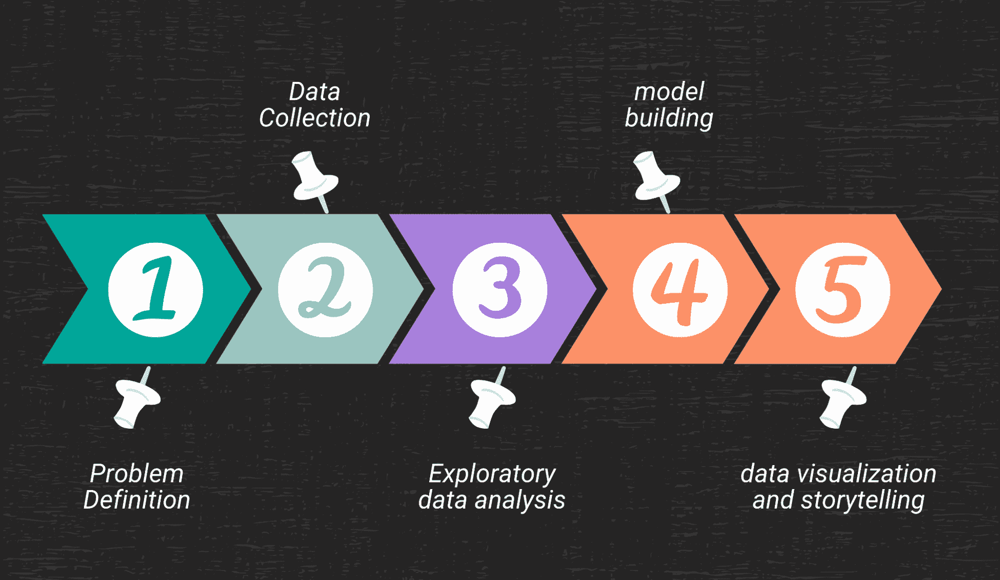
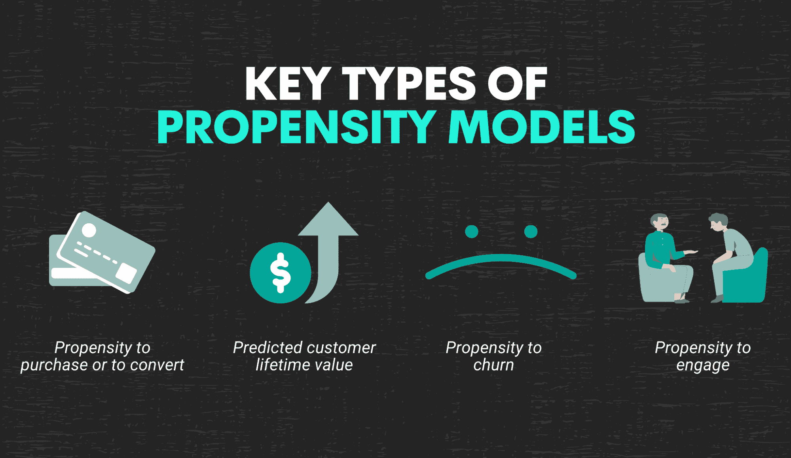
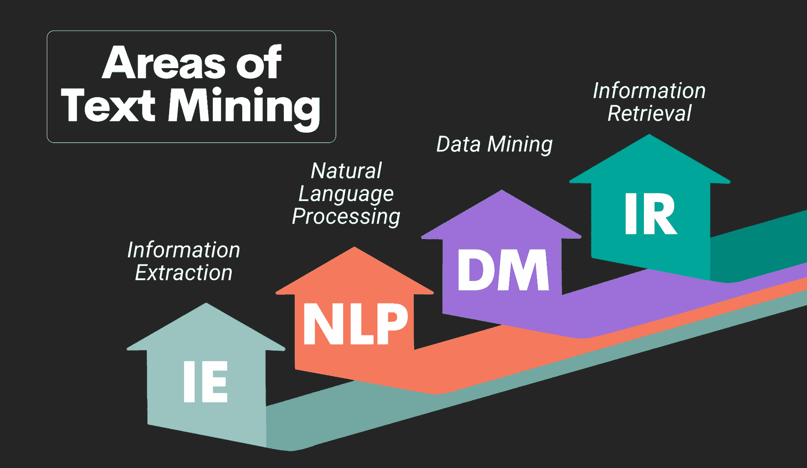
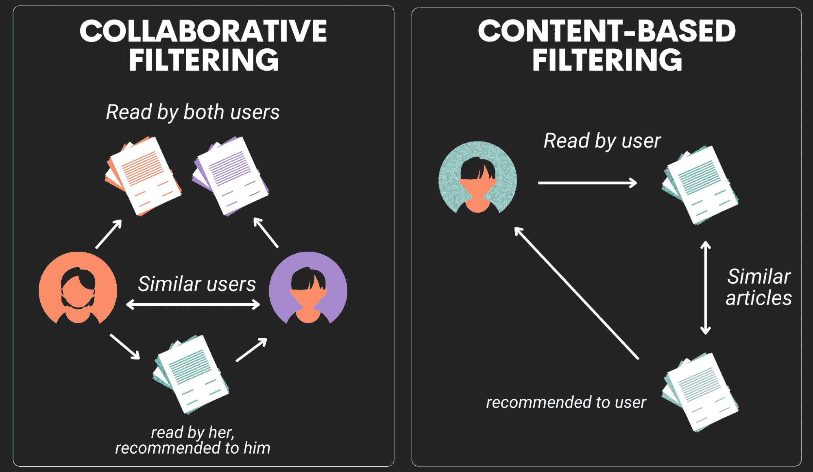

# 数据科学项目可以帮助你解决现实世界问题

> 原文：[`www.kdnuggets.com/2022/11/data-science-projects-help-solve-real-world-problems.html`](https://www.kdnuggets.com/2022/11/data-science-projects-help-solve-real-world-problems.html)

作者提供的图片

实践项目是学习数据科学和机器学习的最佳方式。数据科学作业将使你接触到这一领域的各个方面，并帮助你通过实际的 SQL、R 或 Python 经验磨练技能。它不仅会帮助你提升数据科学技能并获得自信，还能让你制作出引人注目的简历。本文将讨论各种适合初学者的[数据科学项目创意](https://www.stratascratch.com/blog/19-data-science-project-ideas-for-beginners/)，帮助你建立强大的数据科学组合。

* * *

## 我们的前三个课程推荐

 1\. [Google 网络安全证书](https://www.kdnuggets.com/google-cybersecurity) - 快速进入网络安全职业生涯。

 2\. [Google 数据分析专业证书](https://www.kdnuggets.com/google-data-analytics) - 提升你的数据分析技能

 3\. [Google IT 支持专业证书](https://www.kdnuggets.com/google-itsupport) - 支持你的组织在 IT 方面

* * *

随着今天数据的指数增长，数据科学已成为最受追捧的领域。现今的公司如果有效利用数据科学，将获得竞争优势。这导致了所有公司对数据分析师和数据科学家的职位空缺增加。为了在这个领域找到工作，通过建立[数据分析项目](https://www.stratascratch.com/blog/data-analytics-project-ideas-that-will-get-you-the-job/)来展示你的技能是个不错的主意。在我们开始讨论这些项目之前，让我们看看为什么数据科学项目能帮助你找到工作，以及为什么你应该拥有一个令人印象深刻的数据科学项目组合。

# 为什么你应该建立一个数据科学项目组合？

如果你对数据科学领域真正感兴趣，你应该对数据科学解决了什么样的问题及如何解决这些问题有一个基本的了解。如果你想进入这个领域，你需要了解解决特定数据科学问题所需的技能。在线课程和书籍只能带你到一定的水平，但如果你真的想进入这个领域，你应该了解数据是如何用于解决实际问题的。要理解这一点，参与项目是获取进入数据科学所需的所有技能的唯一途径。

数据科学项目将帮助你理解解决问题所需的各种步骤：

1.  定义问题并将其拆分为更小的步骤

1.  数据收集

1.  探索性数据分析

1.  模型构建

1.  数据可视化和讲故事

图片来自作者

## 问题定义

这是任何数据科学项目的第一步。任何数据科学项目都从这一步开始，你需要清晰地理解和定义问题。这是数据科学项目生命周期中最重要的方面之一。例如，如果你想投资特斯拉股票，但你想了解零售投资者如何看待这家公司，以及总体情绪如何？那么你需要清晰地定义这个问题。在这个例子中，你的问题陈述是：*“了解特斯拉在零售投资者中的感知如何？”*

一旦你确定了问题，你需要了解解决该问题需要什么类型的数据。

## 数据收集

一旦你确定了问题，下一步是数据收集。你需要识别可以解决你在第一步中定义的问题的数据来源。你可能需要使用 API 从一个或多个来源获取数据。

以第一点讨论的示例为例，假设你打算投资特斯拉股票，但想了解零售投资者对这家公司的总体情绪。为了解决这个问题，你需要收集零售投资者对这家公司评论的信息。你决定去推特上查看人们对这些公司不同公告的反应。你可以浏览单独的推文并理解情绪，因为会有数百万条推文可供查看。

在这种情况下，你需要获取谈论特斯拉的推文数据。为了获取这些数据，你将创建一个推特开发者账户，并使用 Python 通过 Twitter API 提取推文。这些将是解决任何项目所需的数据收集步骤。在大多数公司中，有专门的数据工程师负责数据收集，但有时数据科学家也需要具备这些使用 API 收集信息的技能。

## 探索性数据分析

这是数据科学项目生命周期中的另一个重要步骤。探索性数据分析旨在理解数据，识别所需的列，删除冗余列，处理缺失值，检测异常值，并识别数据中的模式。

在上述讨论的 Twitter 示例中，你需要清理推文，删除冗余信息，仅保留分析所需的相关推文，了解推文随时间的变化以寻找季节性等。这个步骤用于理解和探索数据，并在数据不符合需求时进行修改。

## 模型构建

一旦你定义了问题、收集了数据并使用 EDA 技术进行了初步分析，你将开始进入模型构建阶段。当你定义一个问题时，你会意识到这个问题是否可以通过监督学习或无监督学习算法来解决。根据问题的需求，你需要了解使用什么模型。

这一阶段需要一些时间来理解哪个模型对你的问题最为相关。市场上有许多模型可以用来解决同样的问题，因此，你需要根据模型的准确性来评估这些模型。评估是一个耗时的过程，因为这个步骤涉及大量的试验和错误。一旦你的模型构建完成并且表现足够好，你就可以开始进行数据可视化和讲故事。

在上述讨论的 Twitter 示例中，你可以使用标记的数据集（每条推文的信息标记为正面/负面/中性）来训练机器学习模型。模型训练完成后，你需要输入一条新推文来测试该模型的性能。一旦你测试了多个样本，你可以检查假阳性和假阴性的数量来了解模型的表现。你需要尝试其他模型，以比较不同分类算法的准确性。

## 数据可视化与讲故事

如果你认真进行分析但无法有效地传达故事，那么它是没有用的。将从数据中发现的见解传达给非技术观众是**数据科学家**所需的最重要的[技能之一](https://www.stratascratch.com/blog/what-skills-do-you-need-as-a-data-scientist/)。有许多工具和技术可用于讲故事。你可以使用 Tableau 或 Power BI 来帮助你构建更好的可视化效果。

现在我们已经讨论了数据科学项目中需要采取的步骤，让我们关注一些你可以参与的实际数据科学项目。

# 数据科学项目创意

互联网上有许多资源可以帮助你入门数据分析和数据科学项目。在本节中，我们将讨论一些你可以用于解决实际问题的项目创意。第一步将是识别数据来源，我们也会讨论这一点。

图片由作者提供

## 倾向建模

一种称为“倾向建模”的方法旨在预测网站用户、潜在客户或客户采取特定行动的可能性。这是一种统计方法，通过考虑所有可能影响客户行为的独立因素和混杂因素，来识别客户进行某项行动的概率。

图片由作者提供

例如，营销团队可以使用倾向模型来了解和确定潜在客户转化为付费客户的概率或可能性。它也可以用来了解现有客户从平台上流失的可能性。因此，倾向建模可以帮助公司明智地分配资源，从而获得更好的结果，降低成本。例如，公司可以通过倾向建模识别哪些客户更可能对电子邮件做出回应，从而只向这些特定客户发送电子邮件，这将节省时间和资源。在 kaggle 上有一个很好的数据集用于[倾向建模](https://www.kaggle.com/code/benpowis/customer-propensity-to-purchase/notebook)，以了解客户购买特定产品的倾向。

### 实际案例

许多公司使用倾向建模。倾向建模可以应用于许多场景，如确定购买倾向、流失倾向、参与倾向或预测客户终身价值。

这种方法主要被 Facebook/Meta、Google、Amazon 等公司的营销团队使用。营销团队严重依赖客户倾向分数来决定是否投资于特定的客户群体。因此，拥有一个倾向建模项目在你的作品集中是必须的。在 kaggle 上有一个很好的倾向建模示例，以了解哪些客户可以通过他们的[营销活动](https://www.kaggle.com/datasets/rodsaldanha/arketing-campaign?select=marketing_campaign.csv)来进行目标。

## 文本分析

随着技术进步和数字化，信息量巨大的现象出现。在所有这些信息中，互联网中有大量的文本数据。公司利用这些文本数据了解客户对其公司的看法，以及他们对产品的评价，从而调整策略。在 kaggle 上有一个很好的项目，可以对[电影评论数据集进行情感分析](https://www.kaggle.com/c/sentiment-analysis-on-movie-reviews)。

作者提供的图片

在文本分析中有许多领域，其中之一是自然语言处理（NLP）。NLP 用于将文本数据分解成机器可读的格式，标记化文本数据，从数据中提取含义，并识别洞察。自然语言处理有许多应用；例如，理解客户的情感，构建对话代理或聊天机器人，开发类似 Alexa 或 Siri 的服务，构建语言翻译引擎等等。因此，在你的作品集中有与自然语言处理相关的项目是一个好主意。

### 现实世界的例子

在今天的世界中，几乎所有公司都使用文本分析或自然语言处理来了解他们的客户并开发创新产品。例如，[Facebook/Meta 大量使用文本分析](https://dev.to/nate_at_stratascratch/how-faang-companies-are-leveraging-data-science-and-ai-kfc)。与主要以视频和照片形式存在数据的 Instagram 不同，Facebook 的数据大多是文本数据。他们使用这些文本数据自动将帖子分类到不同类别，并自动删除有攻击性的帖子。实际上，Facebook 开发了一种名为 Deep Text 的内部工具，用于分析和提取帖子含义，从而自动识别攻击性帖子并将其从平台上删除。

除了 Facebook，还有许多公司使用文本分析和机器学习为客户构建创新解决方案。例如，[亚马逊开发了 Alexa](https://dev.to/nate_at_stratascratch/how-faang-companies-are-leveraging-data-science-and-ai-kfc)，这是一个智能虚拟助手。Alexa 能够准确地回应客户查询，因为它在后台使用复杂的机器学习算法，首先将语音转换为文本，然后使用 NLP 识别文本的含义，再利用机器学习模型预测最佳的回应，然后将回应转换为音频输出。

因此，文本分析或自然语言处理被大多数创新公司在当今世界中使用，拥有一个 NLP 项目在你的作品集中，将有助于你在下次面试中脱颖而出。

## 推荐引擎

推荐系统是一类扩展的网络应用，旨在根据用户的历史数据识别用户的响应，并推荐用户最有可能采取的新产品或新行动。推荐引擎可以分为两个主要组别：基于内容的系统和协同过滤系统。

作者图像

基于内容的系统：在这些引擎中，推荐是基于物品的内容。例如，如果你在 Netflix 上观看了很多科幻电影，那么 Netflix 会推荐你一些来自惊悚类别的新电影，这些电影可能具有类似的类别。

协同过滤系统：在这些引擎中，推荐是基于两个用户之间的相似性。如果两个用户相似，他们可能会收到相似的推荐。例如，根据历史数据，如果用户 1 和用户 2 观看了相似的电影，那么推荐系统会向用户 1 推荐一部用户 2 可能看过的新电影。因此，推荐给用户的物品是类似用户所偏好的。

学习任何概念的最佳方式是通过做项目，[在 Python 中构建一个时尚推荐引擎](https://thecleverprogrammer.com/2020/08/16/fashion-recommendation-system/)是一个非常好的选择。

### 现实世界的例子

最常见的推荐系统之一是 Netflix，它根据客户的历史使用情况推荐新电影、节目和纪录片。亚马逊也使用推荐系统，根据客户的购买或浏览历史推荐类似的产品。

利用其收集的大量数据，[Netflix 创建了一个推荐引擎](https://dev.to/nate_at_stratascratch/how-faang-companies-are-leveraging-data-science-and-ai-kfc)，几乎能实时运作。Netflix 收集每个用户的信息，然后根据他们观看、搜索、添加到观看列表等内容对用户进行排名。这类数据被包含在大数据中，所有数据都存储在数据库中，机器学习算法可以利用这些数据创建模式，揭示观众的偏好。由于每个用户可能有不同的口味，这些模式可能与另一个用户匹配，也可能不匹配。推荐系统根据这些评分向每位客户呈现用户可能观看的电视剧或电影。

## 聊天机器人

被称为聊天机器人（chatbots）、谈话机器人（chatter-bots）或对话代理（conversational agents）的软件程序，通常用来代替人工代理来协助客户。你是否曾访问过一个客户服务网站，与一名代表聊天，然后发现你实际上是在与一个“机器人”交谈？所以你知道聊天机器人是什么了！

图片由作者提供

聊天机器人通常通过独立应用程序或基于网页的应用程序供用户访问。如今，客户服务是聊天机器人在现实世界中最常用的领域。聊天机器人通常接管以前由实际人类执行的工作，如客户服务代表或支持人员。

聊天机器人是复杂的计算机程序，分析客户文本聊天以确定合适的回答。所有这些机器人都利用自然语言处理（NLP），这通常包括两个步骤：自然语言理解，将客户提供的文本转化和解构；和机器学习模型，帮助机器人理解和提取句子的含义。客户文本的回应在第二步中形成，称为自然语言生成，使用第一步创建的含义。创建聊天机器人的基础通常是 NLP。

### 真实世界的例子

近年来，人工智能（AI）引发了一波变革。它已成为每个行业的标准技术。顾客愿意与聊天机器人互动，如果它们实现得当，如一些大型企业使用的成功聊天机器人示例和案例研究所展示的那样。因此，实施适当的机器人策略并根据使用案例定制聊天机器人对整个客户体验至关重要。

许多公司已经实现了成功的聊天机器人用于处理基本查询：

+   [Dominos 已通过 Facebook Messenger 实现一个聊天机器人](https://www.revechat.com/blog/chatbot-examples/)以确保顺畅的订单相关问题回答系统。

+   [HDFC 银行已实现一个聊天机器人](https://www.revechat.com/blog/chatbot-examples/)来回答客户关于金融的基本问题。

还有许多其他公司建立了聊天机器人，因此，将此项目纳入您的作品集是一个好主意。

# 总结

进入数据分析和数据科学领域，非常重要的是建立一个项目作品集，这将帮助您理解问题解决过程，并在下次面试中建立一个强有力的案例。本文讨论了构建项目对获得数据科学家所需相关技能的关键性。我们讨论了解决数据科学问题的步骤：问题定义、数据收集、探索性数据分析、模型构建和数据可视化与讲故事。

你可以通过实际项目经验来获得所有这些技能。我们还讨论了一些现实世界的项目想法以及公司如何在今天的世界中利用它们。在 [StrataScratch](https://www.stratascratch.com)，你可以参与由许多公司提供的小项目，这些项目被称为 [家庭作业](https://platform.stratascratch.com/data-projects)。因此，抓住机会，开始实践，为你的下一个面试准备好你的作品集。

**[内特·罗西迪](https://www.stratascratch.com)** 是一名数据科学家，专注于产品战略。他还是一名副教授，教授分析学，并且是 [StrataScratch](https://www.stratascratch.com/)、一个帮助数据科学家准备面试的在线平台的创始人。通过 [Twitter: StrataScratch](https://twitter.com/StrataScratch) 或 [LinkedIn](https://www.linkedin.com/in/nathanrosidi/) 与他联系。

### 更多相关话题

+   [想用你的数据技能解决全球问题吗？看看这里…](https://www.kdnuggets.com/2022/04/jhu-want-data-skills-solve-global-problems.html)

+   [Kaggle 竞赛对现实世界问题有用吗？](https://www.kdnuggets.com/are-kaggle-competitions-useful-for-real-world-problems)

+   [5 种罕见的数据科学技能能帮助你找到工作](https://www.kdnuggets.com/5-rare-data-science-skills-that-can-help-you-get-employed)

+   [生成式 AI 如何帮助你改进数据可视化图表](https://www.kdnuggets.com/how-generative-ai-can-help-you-improve-your-data-visualization-charts)

+   [免费 Python 资源，助你成为高手](https://www.kdnuggets.com/free-python-resources-that-can-help-you-become-a-pro)

+   [数据访问在大多数公司中严重不足，71%的人认为…](https://www.kdnuggets.com/2023/07/mostly-data-access-severely-lacking-synthetic-data-help.html)
